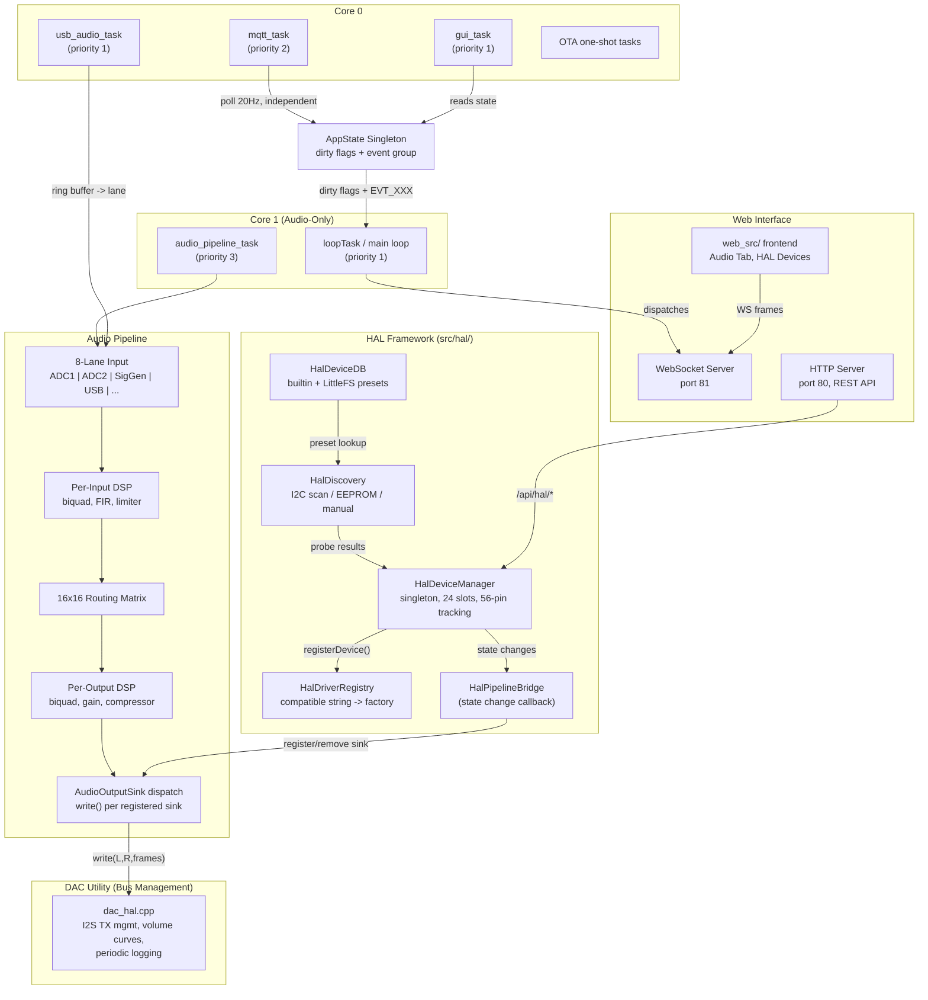
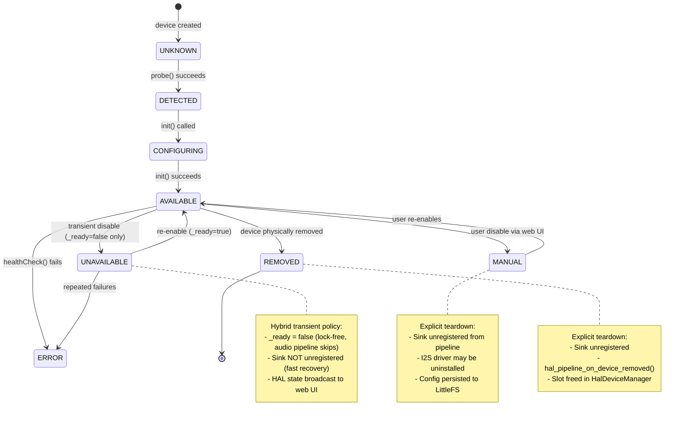
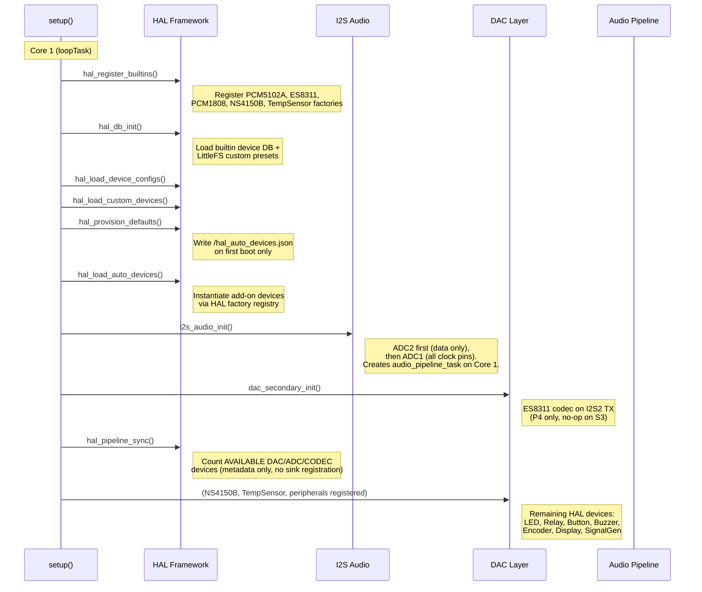
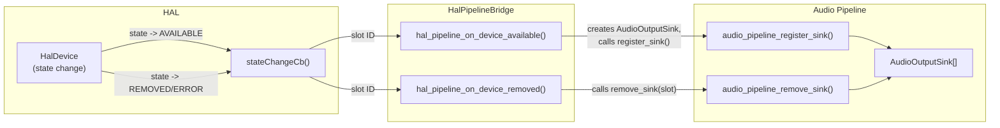

# ALX Nova Controller 2 -- System Interconnection

Architecture reference for the ESP32-P4 amplifier controller. Diagrams render in GitHub markdown via Mermaid.

---

## 1. System Architecture

All functional data paths shown. HAL Bridge is sole sink lifecycle owner.



**All paths are functional** (post DEBT-6 completion).

---

## 2. HAL Device Lifecycle State Machine



**State transition rules:**

| Transition | Who triggers | Sink action |
|---|---|---|
| AVAILABLE -> UNAVAILABLE | `_ready = false` (e.g., I2C error) | None (sink stays registered, `isReady()` returns false) |
| AVAILABLE -> MANUAL | `hal_apply_config()` DISABLE path | `audio_pipeline_clear_sinks()` via `dac_output_deinit()` |
| AVAILABLE -> REMOVED | `DELETE /api/hal/devices` | `hal_pipeline_on_device_removed(slot)` |
| AVAILABLE -> ERROR | `healthCheck()` returns false | `hal_pipeline_on_device_removed(slot)` |

---

## 3. Boot Sequence



**Critical ordering constraints:**
- `hal_register_builtins()` before `hal_load_auto_devices()` -- factories must exist before instantiation
- `i2s_audio_init()` before `dac_secondary_init()` -- ADC1 I2S clocks must be running for shared bus
- `output_dsp_init()` before `audio_pipeline_init()` -- DSP config loaded before pipeline starts processing
- `hal_pipeline_sync()` after all device registration -- ensures accurate count

---

## 4. HAL Pipeline Bridge Detail (Current Architecture)

The data flow after DEBT-6 completion. Bridge is sole sink lifecycle owner.



**Implementation completed in DEBT-6:**
- Bridge owns all sink lifecycle via state change callbacks
- `dac_hal.cpp` reduced to I2S TX management and volume curves
- DacRegistry and HalDacAdapter deleted
- Per-sink removal via `audio_pipeline_remove_sink(slot)` replaces `clear_sinks()`

---

## 5. Event-Driven Architecture

```mermaid
sequenceDiagram
    participant Producer as Producer<br/>(any task/ISR)
    participant AS as AppState<br/>(dirty flags)
    participant EG as FreeRTOS<br/>Event Group
    participant Loop as Main Loop<br/>(Core 1)
    participant WS as WebSocket<br/>Server

    Note over EG: 24 usable bits (0-23)<br/>Bits 24-31 reserved by FreeRTOS

    Producer->>AS: appState.markXxxDirty()
    AS->>AS: _xxxDirty = true
    AS->>EG: app_events_signal(EVT_XXX)
    Note right of EG: xEventGroupSetBits()

    Loop->>EG: app_events_wait(5ms)
    Note right of Loop: Wakes in <1us on any bit,<br/>or 5ms timeout if idle

    EG-->>Loop: returns set bits (pdTRUE clears)

    Loop->>AS: isXxxDirty()?
    AS-->>Loop: true

    Loop->>WS: sendXxxState()
    Loop->>AS: clearXxxDirty()
```

**Active event bits (16 assigned, 8 spare):**

| Bit | Define | Dirty flag | WebSocket dispatch |
|---|---|---|---|
| 0 | `EVT_OTA` | `_otaDirty` | `sendOTAStatus()` |
| 1 | `EVT_DISPLAY` | `_displayDirty` | `sendDisplaySettings()` |
| 2 | `EVT_BUZZER` | `_buzzerDirty` | `sendBuzzerSettings()` |
| 3 | `EVT_SIGGEN` | `_siggenDirty` | `sendSignalGenState()` |
| 4 | `EVT_DSP_CONFIG` | `_dspConfigDirty` | `sendDspConfig()` |
| 5 | `EVT_DAC` | `_dacDirty` | `sendDacState()` |
| 6 | `EVT_EEPROM` | `_eepromDirty` | `sendDacState()` |
| 7 | `EVT_USB_AUDIO` | `_usbAudioDirty` | `sendUsbAudioState()` |
| 8 | `EVT_USB_VU` | `_usbVuDirty` | `sendUsbAudioLevels()` |
| 9 | `EVT_SETTINGS` | `_settingsDirty` | `sendSettings()` |
| 10 | `EVT_ADC_ENABLED` | `_adcEnabledDirty` | `sendAdcEnabled()` |
| 11 | `EVT_ETHERNET` | `_ethernetDirty` | `sendWiFiStatus()` |
| 12 | `EVT_DAC_SETTINGS` | `_dacSettingsDirty` | `sendDacSettings()` |
| 13 | `EVT_HAL_DEVICE` | `_halDeviceDirty` | `sendHalDeviceState()` + `sendAudioChannelMap()` |
| 14 | `EVT_AUDIO_UPDATE` | `_audioUpdateDirty` | `sendAudioUpdate()` |
| 15 | `EVT_CHANNEL_MAP` | `_channelMapDirty` | `sendAudioChannelMap()` |

**MQTT runs independently:** The `mqtt_task` on Core 0 polls at 20 Hz (50ms `vTaskDelay`). It does NOT consume from the event group -- it reads dirty flags directly and publishes independently of the main loop's WebSocket dispatch.
