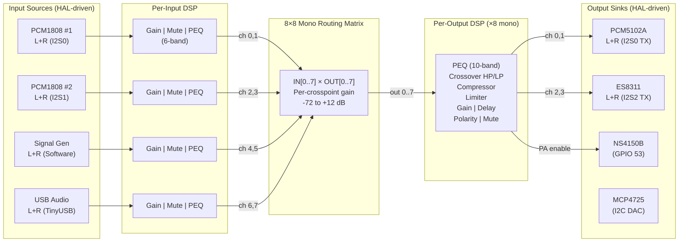

# Plan: Audio Tab WebGUI Rebuild — HAL-Aware Dynamic Audio Interface

## Context

The Audio Tab WebGUI is broken and needs a complete rebuild to support the HAL device framework. Currently 9+ separate audio/DSP tabs exist with overlapping functionality, hardcoded device references, and no dynamic awareness of which HAL devices are available. The goal is a single unified "Audio" tab (inspired by MiniDSP Flex HTx) that auto-populates input/output channel strips from HAL device state, with integrated DSP controls (PEQ, crossover, compressor, limiter) per channel.

### User Decisions (from interview)
- **Layout**: Single Audio Tab with sub-views: Inputs | Matrix | Outputs | SigGen
- **Channel mapping**: Device-centric (grouped by HAL device, auto-populated)
- **Output DSP**: Full MiniDSP set (PEQ 10-band, crossover, compressor, limiter, gain, delay, polarity, mute)
- **Input DSP**: Per-input PEQ + Gain + Mute
- **Channel linking**: Stereo L/R linked by default per device
- **PEQ editor**: Full-screen overlay with frequency response graph
- **Old tabs**: Remove all redundant audio/DSP tabs
- **DSP Tab**: Merged into Audio Tab (no separate DSP tab)

## Signal Flow Architecture

### Mermaid Diagram



### Data Flow (firmware)
```
DMA RX → int32 buffers → float32 conversion → _inBuf[4][2][FRAMES]
  → dsp_pipeline (per-input, stereo) → _dspOut[4][2][FRAMES]
  → 8×8 matrix mix → _outCh[8][FRAMES] (mono)
  → output_dsp (per-output mono) → _outCh[8][FRAMES]
  → AudioOutputSink dispatch → int32 conversion → DMA TX
```

## UI Architecture

### Sub-View Layout

```
+================================================================+
| Audio                                                    [?]   |
+================================================================+
| [▼ Inputs]  [ Matrix ]  [ Outputs ]  [ Signal Gen ]           |
+----------------------------------------------------------------+
```

### INPUTS Sub-View

```
+================================================================+
| INPUTS                                    [Link L/R: ON]       |
+----------------------------------------------------------------+
| PCM1808 ADC #1 (I2S0)          | PCM1808 ADC #2 (I2S1)        |
| ┌─────────┬─────────┐          | ┌─────────┬─────────┐        |
| │  CH 1 L │  CH 1 R │          | │  CH 2 L │  CH 2 R │        |
| │ ▮▮▮▮░░  │ ▮▮▮░░░  │  -12dB  | │ ▮▮░░░░  │ ▮▮░░░░  │ -18dB |
| │ ▮▮▮▮░░  │ ▮▮▮░░░  │         | │ ▮▮░░░░  │ ▮▮░░░░  │       |
| └─────────┴─────────┘          | └─────────┴─────────┘        |
| Gain: [====●=====] -3.0 dB     | Gain: [=======●==] 0.0 dB   |
| [Mute] [Phase] [Solo]          | [Mute] [Phase] [Solo]        |
| [PEQ ▶] 6 bands                | [PEQ ▶] 6 bands              |
| Status: OK ●                   | Status: NO_DATA ○            |
+---------------------------------+------------------------------+
| Signal Generator (Software)    | USB Audio (TinyUSB)          |
| ┌─────────┬─────────┐          | ┌─────────┬─────────┐        |
| │  SG L   │  SG R   │          | │  USB L  │  USB R  │        |
| │ ▮▮▮▮▮░  │ ▮▮▮▮▮░  │  -6dB   | │ ░░░░░░  │ ░░░░░░  │ --    |
| └─────────┴─────────┘          | └─────────┴─────────┘        |
| Gain: [====●=====] -6.0 dB     | Gain: [=======●==] 0.0 dB   |
| [Mute] [Phase]                 | [Mute] [Phase]               |
| [PEQ ▶]                        | [PEQ ▶]                      |
| Enabled: ON                    | Status: Not connected        |
+---------------------------------+------------------------------+
```

### MATRIX Sub-View

```
+================================================================+
| ROUTING MATRIX                    [Reset] [Load] [Save]        |
+----------------------------------------------------------------+
|            │ OUT 1 │ OUT 2 │ OUT 3 │ OUT 4 │ OUT 5 │ ...      |
|            │PCM5102│PCM5102│ES8311 │ES8311 │  --   │          |
|            │   L   │   R   │   L   │   R   │       │          |
| ───────────┼───────┼───────┼───────┼───────┼───────┤          |
| IN 1 ADC1L │ 0 dB  │  --   │  --   │  --   │  --   │          |
| IN 2 ADC1R │  --   │ 0 dB  │  --   │  --   │  --   │          |
| IN 3 ADC2L │  --   │  --   │ 0 dB  │  --   │  --   │          |
| IN 4 ADC2R │  --   │  --   │  --   │ 0 dB  │  --   │          |
| IN 5 SigL  │  --   │  --   │  --   │  --   │  --   │          |
| IN 6 SigR  │  --   │  --   │  --   │  --   │  --   │          |
| IN 7 USB L │  --   │  --   │  --   │  --   │  --   │          |
| IN 8 USB R │  --   │  --   │  --   │  --   │  --   │          |
+----------------------------------------------------------------+
| Click cell to set gain (-72 to +12 dB). "--" = muted.          |
| Active routes highlighted in accent color.                      |
+================================================================+
```

### OUTPUTS Sub-View

```
+================================================================+
| OUTPUTS                                   [Link L/R: ON]       |
+----------------------------------------------------------------+
| PCM5102A DAC (I2S0 TX)         | ES8311 Codec (I2S2 TX)       |
| ┌─────────┬─────────┐          | ┌─────────┬─────────┐        |
| │  OUT 1  │  OUT 2  │          | │  OUT 3  │  OUT 4  │        |
| │ ▮▮▮▮░░  │ ▮▮▮░░░  │  -8dB   | │ ▮▮░░░░  │ ▮▮░░░░  │ -15dB |
| └─────────┴─────────┘          | └─────────┴─────────┘        |
| Gain: [====●=====] -3.0 dB     | HW Vol: [===●====] 75%      |
| [Mute] [Phase] [Solo]          | [Mute] [Phase] [Solo]        |
| ┌──────────────────────────┐   | ┌──────────────────────────┐ |
| │ [PEQ ▶] 10-band          │   | │ [PEQ ▶] 10-band          │ |
| │ [Crossover ▶] HP/LP      │   | │ [Crossover ▶] HP/LP      │ |
| │ [Compressor ▶]           │   | │ [Compressor ▶]           │ |
| │ [Limiter ▶]              │   | │ [Limiter ▶]              │ |
| │ Delay: [0.00] ms         │   | │ Delay: [0.00] ms         │ |
| └──────────────────────────┘   | └──────────────────────────┘ |
| Import: [REW] [miniDSP]        | Import: [REW] [miniDSP]      |
+---------------------------------+------------------------------+
```

### PEQ OVERLAY (opens on click)

```
+================================================================+
| PEQ — OUT 1 (PCM5102A L)                          [✕ Close]   |
+================================================================+
|                                                                 |
|  +12 ─┬─────────────────────────────────────────────────┐      |
|       │           ╱╲                                     │      |
|   +6 ─┤         ╱    ╲         ___                      │      |
|       │       ╱        ╲     ╱     ╲                    │      |
|    0 ─┤─────╱────────────╲─╱─────────╲──────────────── │      |
|       │   ╱                              ╲              │      |
|   -6 ─┤ ╱                                  ╲            │      |
|       │╱                                      ╲         │      |
|  -12 ─┴───┬──────┬──────┬──────┬──────┬──────┬──┘      |
|         20Hz  100Hz  1kHz  5kHz  10kHz  20kHz           |
|                                                                 |
|  ─── Combined ─── Band 1 ─── Band 2 ─── Band 3                |
|  [Show RTA overlay] [Show chain response]                       |
|                                                                 |
| # │ Type     │ Freq    │ Gain  │ Q/BW │ On │                   |
| 1 │ [Peak ▼] │ [1000]  │ [-3.0]│ [1.4]│ [✓]│                  |
| 2 │ [LoShf▼] │ [80  ]  │ [+2.0]│ [0.7]│ [✓]│                  |
| 3 │ [HiShf▼] │ [12000] │ [-1.5]│ [0.7]│ [✓]│                  |
| 4 │ [LP   ▼] │ [18000] │ [0.0] │ [0.7]│ [✓]│                  |
| ...                                                             |
| [Add Band] [Import REW] [Copy from ▼] [Reset All]              |
| [A/B Compare] [Export]              [Apply] [Cancel]            |
+================================================================+
```

## Implementation Phases

### Phase 1: New Audio Tab Shell + HAL Channel Discovery API
**Goal**: Audio tab with sub-view navigation, firmware endpoint to query available audio channels

**Firmware changes:**
- `src/websocket_handler.cpp` — New `sendAudioChannelMap()` function that queries HAL device manager for all audio devices (DAC/ADC/CODEC type), builds JSON with device name, type, channel count, capabilities, ready state, lane mapping
- `src/app_events.h` — Add `EVT_CHANNEL_MAP` bit (for when HAL devices change)
- `src/websocket_handler.cpp` — Add `INIT_CHANNEL_MAP` to InitStateBit enum
- WS message type: `"audioChannelMap"` with `{inputs: [{device, type, lanes, channels, caps, ready}], outputs: [...]}`

**Frontend changes:**
- `web_src/js/05-audio-tab.js` — NEW: Audio tab controller with sub-view state machine (`inputs` | `matrix` | `outputs` | `siggen`), HAL channel map consumer
- `web_src/js/02-ws-router.js` — Add `audioChannelMap` route
- `web_src/index.html` — Replace old audio/DSP panel content with new Audio tab structure (sub-nav bar + 4 panel divs)

**Files to modify**: `websocket_handler.cpp`, `app_events.h`, `02-ws-router.js`, `index.html`
**Files to create**: `web_src/js/05-audio-tab.js`

### Phase 2: Input Channel Strips (dynamic from HAL)
**Goal**: Inputs sub-view renders device-grouped channel strips with VU meters

**Frontend changes:**
- `web_src/js/05-audio-tab.js` — `renderInputStrips()` builds DOM from `audioChannelMap.inputs`, creates VU meter elements per channel, attaches gain/mute/phase controls
- Reuse existing VU rendering from `04-shared-audio.js` (`drawPPM`, `updateLevelMeters`)
- Reuse binary waveform/spectrum handler from `02-ws-router.js`
- Reuse input name editing from `10-input-audio.js`
- Stereo link toggle per device group

**Firmware changes:**
- Extend `sendAudioData()` to include per-input-lane VU in the JSON levels payload (already partially done — `audioLevels` message has per-ADC vu1/vu2/peak1/peak2)
- Ensure SigGen and USB lanes also report VU levels

**Reuse**: `04-shared-audio.js` (VU/waveform state), `09-audio-viz.js` (canvas helpers), `10-input-audio.js` (ADC enable/status)
**Files to modify**: `05-audio-tab.js`, `websocket_handler.cpp`

### Phase 3: Output Channel Strips (dynamic from HAL)
**Goal**: Outputs sub-view renders device-grouped output strips with per-output DSP controls

**Frontend changes:**
- `web_src/js/05-audio-tab.js` — `renderOutputStrips()` builds DOM from `audioChannelMap.outputs`
- Per-output controls: gain fader, mute, polarity, delay input
- DSP section buttons: PEQ, Crossover, Compressor, Limiter (each opens overlay)
- HW volume control shown for devices with `HAL_CAP_HW_VOLUME` (ES8311)
- HW mute shown for devices with `HAL_CAP_MUTE`
- Output VU meters (requires extending `sendAudioData` for post-matrix levels)

**Firmware changes:**
- `src/audio_pipeline.cpp` — Add per-output VU metering (post output_dsp, pre-sink)
- `src/websocket_handler.cpp` — Include output VU in `audioLevels` message
- Reuse output DSP WS commands: `addOutputDspStage`, `updateOutputDspStage`, `removeOutputDspStage` (already exist in websocket_handler.cpp)

**Reuse**: `12-output-dac.js` (DAC/ES8311 control logic), `19-output-dsp.js` (per-output DSP CRUD)
**Files to modify**: `05-audio-tab.js`, `audio_pipeline.cpp`, `websocket_handler.cpp`

### Phase 4: Routing Matrix UI
**Goal**: Interactive 8×8 matrix grid with per-crosspoint gain control

**Frontend changes:**
- `web_src/js/05-audio-tab.js` — `renderMatrix()` builds table from channel map dimensions
- Click cell → popup gain slider (-72 to +12 dB, or "Off")
- Active routes highlighted with accent color
- Row/column headers auto-populated from HAL device names + channel labels
- Preset save/load (uses existing `audio_pipeline_save_matrix()`)
- Quick-assign presets: "1:1 Passthrough", "Stereo → All", "Clear All"

**Firmware changes:**
- None — matrix API already exists (`audio_pipeline_set_matrix_gain_db`, WS `setMatrixGain`)
- Reuse existing `18-dsp-routing.js` matrix rendering logic

**Reuse**: `18-dsp-routing.js` (existing matrix grid builder and WS integration)
**Files to modify**: `05-audio-tab.js`

### Phase 5: PEQ Overlay Editor
**Goal**: Full-screen PEQ overlay with frequency response graph, 10-band table, REW import

**Frontend changes:**
- `web_src/js/06-peq-overlay.js` — NEW: Overlay component for input PEQ (6-band) and output PEQ (10-band)
- Frequency response canvas with per-band curves + combined response
- RTA overlay toggle (spectrum data from existing binary frames)
- Filter types: Peak, Low Shelf, High Shelf, LP, HP, Bandpass, Notch, All-pass
- REW import (reuse `dsp_rew_parser` logic from `17-dsp-chain.js`)
- Copy-from-channel dropdown
- A/B compare toggle

**Reuse**: `16-dsp-peq.js` (PEQ band rendering, graph drawing, dspBiquadMagDb), `17-dsp-chain.js` (REW import)
**Files to create**: `web_src/js/06-peq-overlay.js`

### Phase 6: Crossover, Compressor, Limiter Overlays
**Goal**: Output-specific DSP overlays for crossover, dynamics

**Frontend changes:**
- `web_src/js/06-peq-overlay.js` — Extend with crossover editor (HP/LP type selectors: LR2/LR4/LR8, Butterworth 6-48dB, Bessel 12dB, frequency input, graph)
- Compressor overlay: threshold, ratio, attack, release, knee, makeup gain, GR meter
- Limiter overlay: threshold, attack, release, GR meter

**Firmware changes:**
- None — output DSP crossover/compressor/limiter stages already supported
- Reuse existing `output_dsp_setup_crossover()` API

**Reuse**: `19-output-dsp.js` (output DSP stage CRUD), crossover preset logic from `dsp_crossover.h`
**Files to modify**: `06-peq-overlay.js`

### Phase 7: Signal Generator Sub-View
**Goal**: Migrate signal gen controls to Audio tab sub-view

**Frontend changes:**
- Move signal gen controls from `13-signal-gen.js` into Audio tab SigGen sub-view
- Add target output selector (route to specific output via matrix)
- Reuse all existing WS integration (`setSignalGen` message)

**Reuse**: `13-signal-gen.js` (all SigGen logic — minimal changes needed)
**Files to modify**: `05-audio-tab.js`, `13-signal-gen.js`

### Phase 8: Dead Code Removal + Tab Cleanup
**Goal**: Remove redundant tabs and dead code

**Remove these JS files entirely:**
- `web_src/js/10-input-audio.js` — Replaced by Audio tab Inputs
- `web_src/js/11-input-overview.js` — Replaced by Audio tab Inputs
- `web_src/js/12-output-dac.js` — Replaced by Audio tab Outputs
- `web_src/js/14-io-registry.js` — Replaced by HAL-driven channels
- `web_src/js/16-dsp-peq.js` — Replaced by PEQ overlay
- `web_src/js/17-dsp-chain.js` — REW import extracted to overlay, rest removed
- `web_src/js/18-dsp-routing.js` — Replaced by Audio tab Matrix
- `web_src/js/19-output-dsp.js` — Replaced by Audio tab Outputs
- `web_src/js/19-dsp-compare.js` — Replaced by PEQ overlay A/B

**Remove from `index.html`:**
- Input Audio panel, Input Overview panel, Output DAC panel
- DSP tab (entire section), I/O Registry tab
- Associated sidebar items and tab buttons

**Firmware cleanup:**
- `src/io_registry.h/.cpp`, `src/io_registry_api.h/.cpp` — Remove (HAL replaces)
- Remove `sendIoRegistryState()` from websocket_handler
- Remove `INIT_IO_REGISTRY` from InitStateBit

**Run**: `node tools/find_dups.js` + `node tools/build_web_assets.js` + `pio test -e native`

### Phase 9: CSS Polish + Responsive
**Goal**: Clean styling, mobile responsive, dark/light theme

**CSS changes:**
- Channel strip component styles (`.channel-strip`, `.vu-meter`, `.gain-slider`)
- Matrix grid styles (`.matrix-cell`, `.matrix-active`, `.matrix-header`)
- PEQ overlay styles (`.peq-overlay`, `.peq-graph`, `.peq-band-row`)
- Responsive: stack channel strips vertically below 768px
- Sub-nav bar styles (`.audio-subnav`, `.audio-subnav-item.active`)

## Key Files Reference

### Existing files to REUSE (extract logic from):
| File | What to reuse |
|------|---------------|
| `web_src/js/04-shared-audio.js` | VU/waveform/spectrum state, canvas rendering, LERP animation |
| `web_src/js/09-audio-viz.js` | `drawPPM()`, `drawRoundedBar()`, `linearToDbPercent()`, `formatDbFS()` |
| `web_src/js/16-dsp-peq.js` | `dspBiquadMagDb()`, PEQ graph rendering, band type constants |
| `web_src/js/18-dsp-routing.js` | Matrix grid builder, `setMatrixGain` WS integration |
| `web_src/js/19-output-dsp.js` | Output DSP stage CRUD WS commands |
| `src/audio_pipeline.h` | Matrix API (`set_matrix_gain_db`, `save/load_matrix`) |
| `src/output_dsp.h` | Per-output DSP API (12 stages, biquad/limiter/compressor/gain/mute/polarity) |
| `src/hal/hal_api.cpp` | `GET /api/hal/devices` returns full device enumeration |

### Existing files to MODIFY:
| File | Changes |
|------|---------|
| `web_src/index.html` | Replace audio/DSP panels with new Audio tab structure |
| `web_src/js/02-ws-router.js` | Add `audioChannelMap` route, update removed handlers |
| `web_src/js/07-ui-core.js` | Update `switchTab()` for merged Audio tab |
| `web_src/js/28-init.js` | Update init sequence for new Audio tab |
| `src/websocket_handler.h/.cpp` | Add `sendAudioChannelMap()`, extend `sendAudioData()` for output VU |
| `src/app_events.h` | Add `EVT_CHANNEL_MAP` |
| `src/audio_pipeline.cpp` | Add post-matrix per-output VU metering |

### Files to CREATE:
| File | Purpose |
|------|---------|
| `web_src/js/05-audio-tab.js` | Main Audio tab controller (sub-views, channel rendering, matrix) |
| `web_src/js/06-peq-overlay.js` | PEQ/crossover/compressor/limiter overlay editor |

### Files to DELETE (Phase 8):
`10-input-audio.js`, `11-input-overview.js`, `12-output-dac.js`, `14-io-registry.js`, `16-dsp-peq.js`, `17-dsp-chain.js`, `18-dsp-routing.js`, `19-output-dsp.js`, `19-dsp-compare.js`, `src/io_registry.h/.cpp`, `src/io_registry_api.h/.cpp`

## Success Criteria

1. **Dynamic channel mapping**: Input/output channel strips auto-populate from HAL device state. Adding/removing a HAL device updates the UI without refresh
2. **End-to-end audio**: Signal generator and input channels produce audible output through speakers via the routing matrix
3. **Per-channel DSP**: Each output has working PEQ (10-band), crossover (LR2/4/8, Butterworth, Bessel), compressor, limiter, gain, delay, polarity, mute
4. **Per-input DSP**: Each input has working PEQ (6-band), gain, mute
5. **Matrix routing**: Any input can route to any output with per-crosspoint gain (-72 to +12 dB). Matrix persisted to LittleFS
6. **VU metering**: Real-time VU/peak meters on all input AND output channels
7. **Stereo linking**: L/R channel pairs linked by default; settings mirror when linked
8. **PEQ overlay**: Frequency response graph with per-band curves, combined response, optional RTA overlay, REW import/export, A/B compare
9. **Dead code removed**: All 9 redundant JS files deleted, I/O Registry removed, no duplicate declarations (`find_dups.js` clean)
10. **All tests pass**: `pio test -e native` succeeds (1168+ tests)
11. **Firmware compiles**: `pio run` succeeds
12. **Web assets build**: `node tools/build_web_assets.js` succeeds
13. **Responsive layout**: Usable on mobile (480px+), tablet (768px+), desktop (1024px+)
14. **HAL device capabilities respected**: HW volume slider shown only for `HAL_CAP_HW_VOLUME` devices, HW mute only for `HAL_CAP_MUTE`, etc.

## Verification

```bash
# 1. Build web assets
node tools/find_dups.js       # Zero duplicates
node tools/build_web_assets.js

# 2. Run all native tests
pio test -e native             # 1168+ tests pass

# 3. Build firmware
pio run                        # Compiles for ESP32-P4

# 4. Upload and test on hardware
pio run --target upload
# - Open web UI → Audio tab
# - Verify input strips show PCM1808 #1, #2, SigGen, USB
# - Verify output strips show PCM5102A, ES8311
# - Enable SigGen → route to PCM5102A via matrix → hear tone
# - Open PEQ on output → add peak filter → verify audible EQ change
# - Test crossover on output → verify HP/LP filtering
# - Test stereo linking → change L gain → verify R mirrors
# - Add/remove HAL device → verify UI updates dynamically
```
