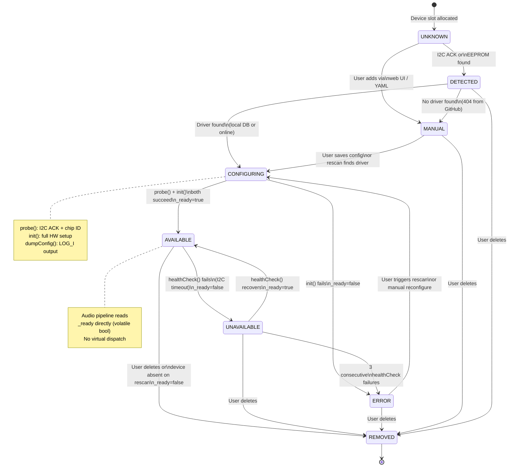
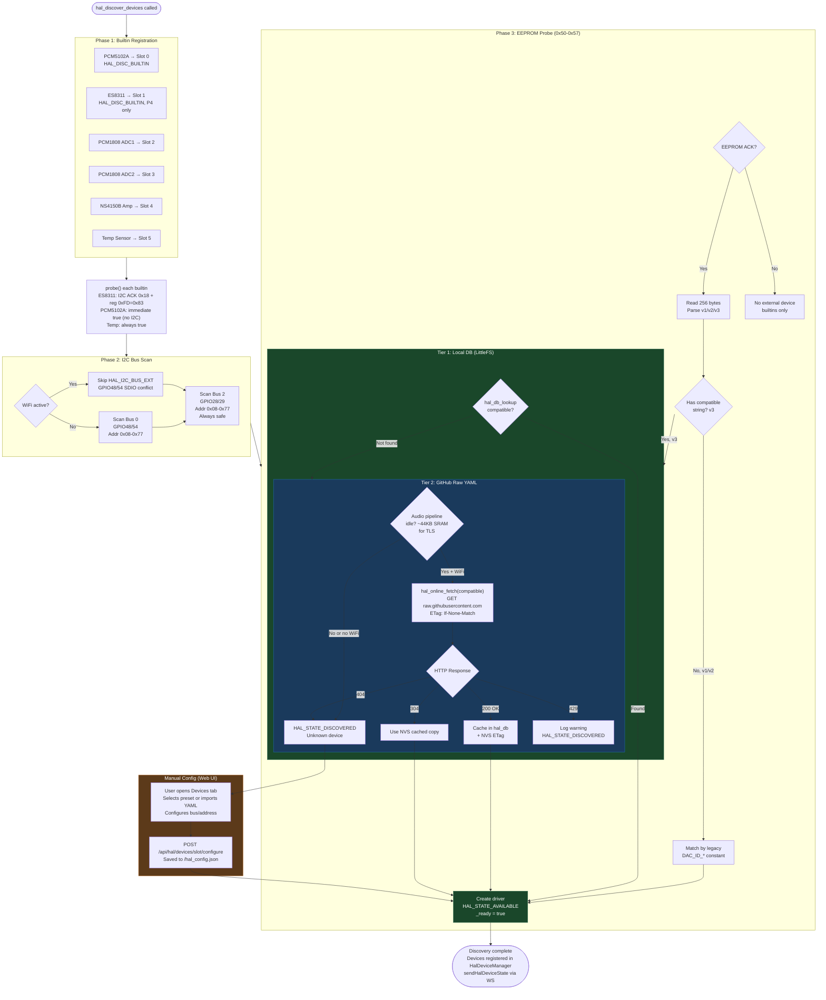
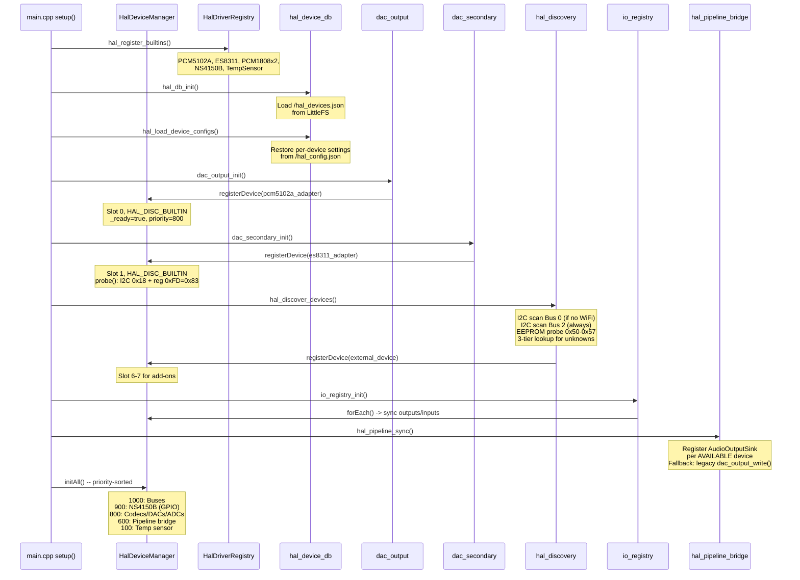
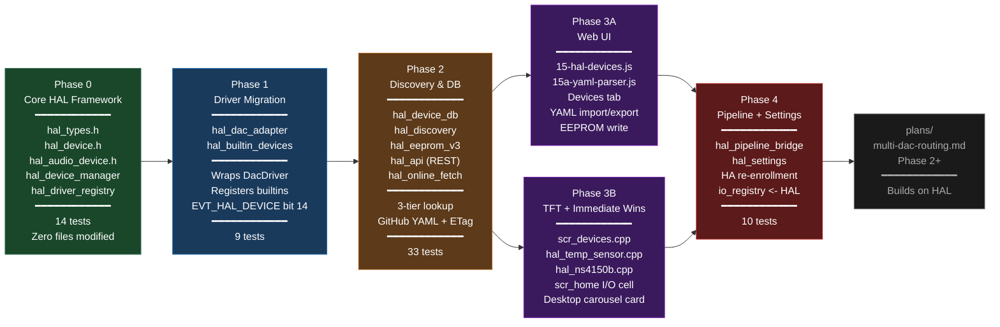

# HAL Architecture — Mermaid Diagrams
_Extracted from hal-implementation.md — open in VS Code with Mermaid Preview extension_

---

## 1. HAL System Architecture

```mermaid
graph TB
    subgraph ESP32-P4["ESP32-P4 Motherboard"]
        direction TB

        subgraph HAL["HAL Device Manager (Singleton)"]
            direction LR
            DM["HalDeviceManager<br/>registerDevice()<br/>initAll() priority-sorted<br/>healthCheckAll() 30s<br/>forEach() iterator"]
            DR["HalDriverRegistry<br/>compatible → factory<br/>legacy DAC_ID → factory<br/>max 16 entries"]
            PC["Pin Claim Tracker<br/>claimPin() / releasePin()<br/>HAL_MAX_PINS=56"]
        end

        subgraph BUSES["Bus Abstraction (HalBusRef)"]
            I2C0["I2C Bus 0 (EXT)<br/>GPIO48 SDA / GPIO54 SCL<br/>⚠ SDIO conflict"]
            I2C1["I2C Bus 1 (ONBOARD)<br/>GPIO7 SDA / GPIO8 SCL<br/>ES8311 dedicated"]
            I2C2["I2C Bus 2 (EXPANSION)<br/>GPIO28 SDA / GPIO29 SCL<br/>✓ Always safe"]
            I2S0["I2S0 Full-Duplex<br/>BCK=20 WS=21 MCLK=22<br/>RX=23 TX=24"]
            I2S2["I2S2 (ES8311)<br/>MCLK=13 BCLK=12<br/>WS=10 DIN=9 DOUT=11"]
            GPIO_BUS["GPIO Bus<br/>Direct pin control"]
            INT_BUS["Internal Bus<br/>On-chip peripherals"]
        end

        subgraph DEVICES["Registered HAL Devices (max 8)"]
            DEV_PCM5102["Slot 0: PCM5102A<br/>HAL_DEV_DAC<br/>ti,pcm5102a<br/>I2S0 TX, no I2C<br/>BUILTIN"]
            DEV_ES8311["Slot 1: ES8311<br/>HAL_DEV_CODEC<br/>evergrande,es8311<br/>I2C 0x18 + I2S2<br/>BUILTIN"]
            DEV_ADC1["Slot 2: PCM1808 #1<br/>HAL_DEV_ADC<br/>ti,pcm1808<br/>I2S0 RX<br/>BUILTIN"]
            DEV_ADC2["Slot 3: PCM1808 #2<br/>HAL_DEV_ADC<br/>ti,pcm1808<br/>I2S1 RX<br/>BUILTIN"]
            DEV_NS4150["Slot 4: NS4150B<br/>HAL_DEV_AMP<br/>ns,ns4150b-amp<br/>GPIO53<br/>BUILTIN"]
            DEV_TEMP["Slot 5: Temp Sensor<br/>HAL_DEV_SENSOR<br/>espressif,esp32p4-temp<br/>Internal<br/>BUILTIN"]
            DEV_EXT["Slot 6-7: External<br/>HAL_DEV_???<br/>EEPROM / ONLINE / MANUAL"]
        end

        subgraph CONSUMERS["State Consumers"]
            PIPE["Audio Pipeline<br/>Core 1, priority 3<br/>reads _ready directly<br/>NO virtual dispatch"]
            GUI["GUI Task<br/>Core 0<br/>reads _state at 1s poll<br/>scr_devices + scr_home"]
            WS["WebSocket Handler<br/>sendHalDeviceState()<br/>halDeviceState JSON<br/>INIT_HAL_DEVICE bit 14"]
            MQTT["MQTT Handler<br/>HA discovery per device<br/>re-publish on HA restart"]
            REST["REST API<br/>/api/hal/devices<br/>/api/hal/scan<br/>/api/hal/db"]
        end
    end

    subgraph EXTERNAL["External Systems"]
        EEPROM["AT24C02 EEPROM<br/>I2C 0x50-0x57<br/>v1/v2/v3 format"]
        GITHUB["GitHub Raw YAML<br/>raw.githubusercontent.com<br/>ETag caching in NVS<br/>TLS + setInsecure()"]
        WEBUI["Web Browser<br/>Devices tab<br/>YAML import/export<br/>Manual config modal"]
        HA["Home Assistant<br/>MQTT auto-discovery<br/>homeassistant/status"]
        TFT["ST7735S TFT<br/>Devices carousel card<br/>Status dots"]
    end

    HAL --> BUSES
    HAL --> DEVICES
    DEVICES --> CONSUMERS

    I2C0 --> EEPROM
    I2C1 --> DEV_ES8311
    I2C2 -.->|"Future add-ons"| DEV_EXT
    I2S0 --> DEV_PCM5102
    I2S0 --> DEV_ADC1
    I2S2 --> DEV_ES8311
    GPIO_BUS --> DEV_NS4150
    INT_BUS --> DEV_TEMP

    WS --> WEBUI
    MQTT --> HA
    GUI --> TFT
    REST --> WEBUI
    GITHUB -.->|"Tier 2 fetch"| HAL

    style HAL fill:#1a1a2e,stroke:#e94560,color:#fff
    style BUSES fill:#16213e,stroke:#0f3460,color:#fff
    style DEVICES fill:#0f3460,stroke:#533483,color:#fff
    style CONSUMERS fill:#1a1a2e,stroke:#e94560,color:#fff
    style EXTERNAL fill:#16213e,stroke:#0f3460,color:#fff
```

---

## 2. Device Lifecycle State Machine

---

## 3. Three-Tier Device Discovery Flow

---

## 4. Boot Sequence (Phase 4 — Final)

---

## 5. Phase Dependency Graph

