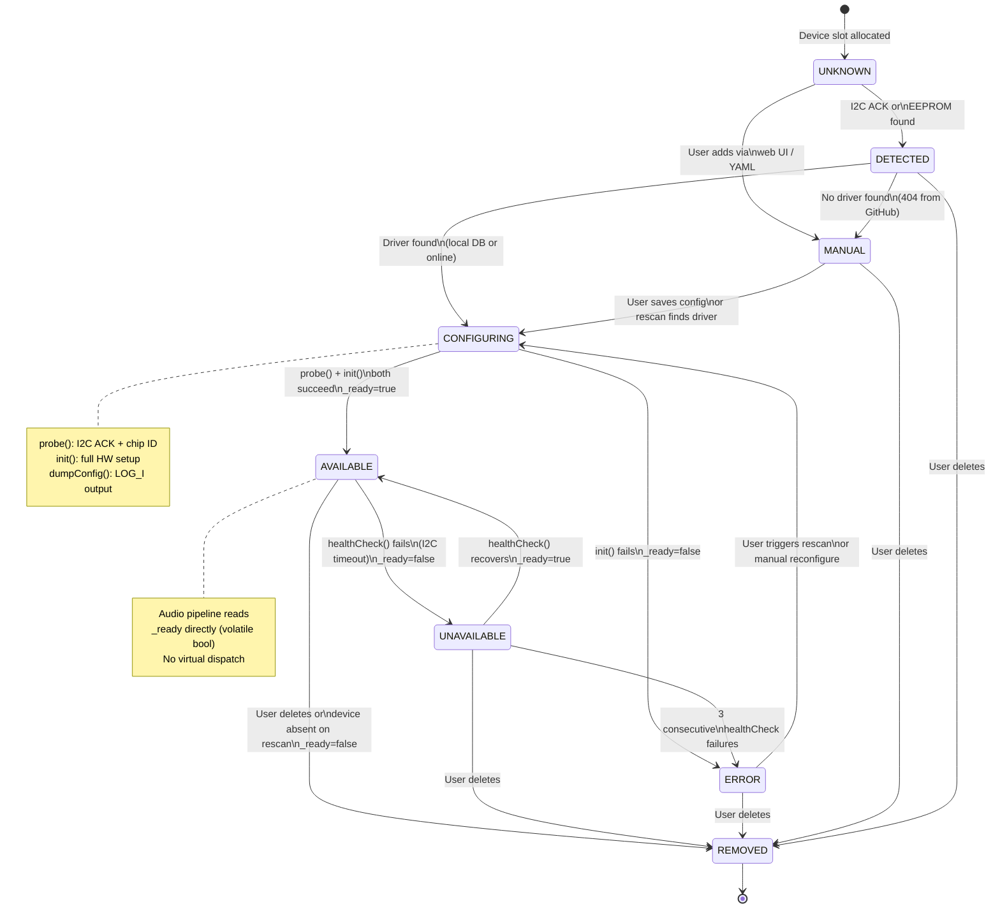
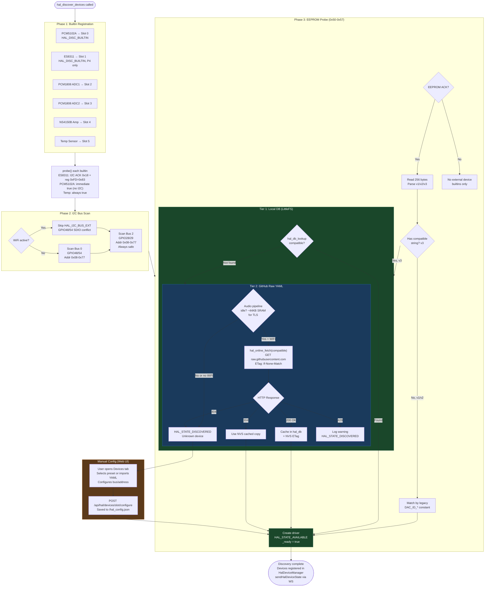
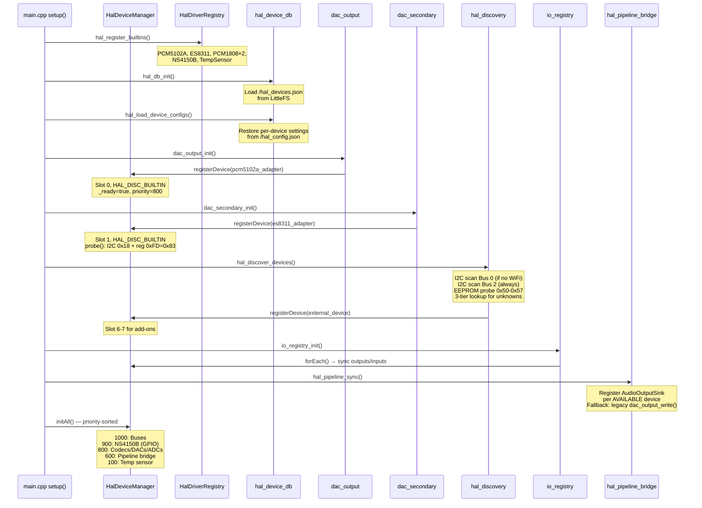
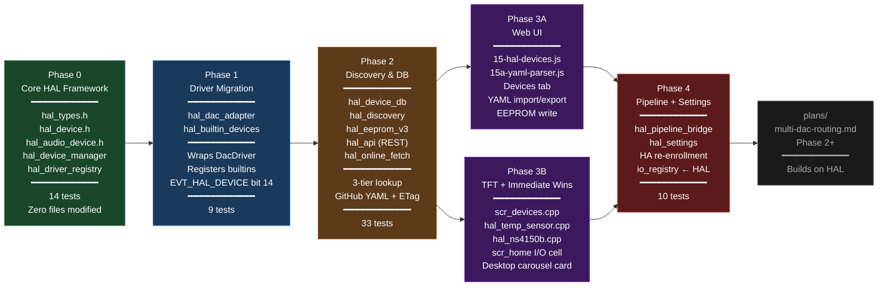

# HAL (Hardware Abstraction Layer) Implementation Plan
_Last updated: 2026-03-05 — incorporates GPIO analysis, LVGL display integration, web frontend exactness, embedded-systems and C++ expert review, Immediate Wins promoted to phases, GitHub raw YAML fetch with ETag caching, YAML device schema, test device inventory, Wire mock pattern_

---

## Context

The ALX Nova Controller is evolving from a fixed-hardware amplifier controller into a **flexible audio platform** where users connect add-on boards (DACs, ADCs, codecs, DSP chips) that are automatically discovered and configured. The project already has ~60% of a HAL (`DacDriver` abstract class, factory registry, EEPROM discovery) but it's DAC-specific and lacks a unified device model, lifecycle state machine, bus abstraction, and configuration database.

**Inspiration**: ESPHome's component model — self-describing devices that register with a central framework, declare bus dependencies, follow a strict lifecycle (`probe()` → `init()` → `dumpConfig()` → `healthCheck()`), and are configured via structured data (YAML→JSON on wire).

**Goal**: Introduce a proper HAL that generalises the existing DAC abstractions to support any audio I/O device, with an extensible architecture for future non-audio peripherals.

**First test device**: ES8311 onboard codec on the Waveshare ESP32-P4 dev kit.

---

## Mermaid Diagrams

### 1. HAL System Architecture

```mermaid
graph TB
    subgraph ESP32-P4["ESP32-P4 Motherboard"]
        direction TB

        subgraph HAL["HAL Device Manager (Singleton)"]
            direction LR
            DM["HalDeviceManager<br/>registerDevice()<br/>initAll() priority-sorted<br/>healthCheckAll() 30s<br/>forEach() iterator"]
            DR["HalDriverRegistry<br/>compatible → factory<br/>legacy DAC_ID → factory<br/>max 16 entries"]
            PC["Pin Claim Tracker<br/>claimPin() / releasePin()<br/>HAL_MAX_PINS=24"]
        end

        subgraph BUSES["Bus Abstraction (HalBusRef)"]
            I2C0["I2C Bus 0 (EXT)<br/>GPIO48 SDA / GPIO54 SCL<br/>⚠ SDIO conflict"]
            I2C1["I2C Bus 1 (ONBOARD)<br/>GPIO7 SDA / GPIO8 SCL<br/>ES8311 dedicated"]
            I2C2["I2C Bus 2 (EXPANSION)<br/>GPIO28 SDA / GPIO29 SCL<br/>✓ Always safe"]
            I2S0["I2S0 Full-Duplex<br/>BCK=20 WS=21 MCLK=22<br/>RX=23 TX=24"]
            I2S2["I2S2 (ES8311)<br/>MCLK=13 BCLK=12<br/>WS=10 DIN=9 DOUT=11"]
            GPIO_BUS["GPIO Bus<br/>Direct pin control"]
            INT_BUS["Internal Bus<br/>On-chip peripherals"]
        end

        subgraph DEVICES["Registered HAL Devices (max 8)"]
            DEV_PCM5102["Slot 0: PCM5102A<br/>HAL_DEV_DAC<br/>ti,pcm5102a<br/>I2S0 TX, no I2C<br/>BUILTIN"]
            DEV_ES8311["Slot 1: ES8311<br/>HAL_DEV_CODEC<br/>evergrande,es8311<br/>I2C 0x18 + I2S2<br/>BUILTIN"]
            DEV_ADC1["Slot 2: PCM1808 #1<br/>HAL_DEV_ADC<br/>ti,pcm1808<br/>I2S0 RX<br/>BUILTIN"]
            DEV_ADC2["Slot 3: PCM1808 #2<br/>HAL_DEV_ADC<br/>ti,pcm1808<br/>I2S1 RX<br/>BUILTIN"]
            DEV_NS4150["Slot 4: NS4150B<br/>HAL_DEV_AMP<br/>ns,ns4150b-amp<br/>GPIO53<br/>BUILTIN"]
            DEV_TEMP["Slot 5: Temp Sensor<br/>HAL_DEV_SENSOR<br/>espressif,esp32p4-temp<br/>Internal<br/>BUILTIN"]
            DEV_EXT["Slot 6-7: External<br/>HAL_DEV_???<br/>EEPROM / ONLINE / MANUAL"]
        end

        subgraph CONSUMERS["State Consumers"]
            PIPE["Audio Pipeline<br/>Core 1, priority 3<br/>reads _ready directly<br/>NO virtual dispatch"]
            GUI["GUI Task<br/>Core 0<br/>reads _state at 1s poll<br/>scr_devices + scr_home"]
            WS["WebSocket Handler<br/>sendHalDeviceState()<br/>halDeviceState JSON<br/>INIT_HAL_DEVICE bit 14"]
            MQTT["MQTT Handler<br/>HA discovery per device<br/>re-publish on HA restart"]
            REST["REST API<br/>/api/hal/devices<br/>/api/hal/scan<br/>/api/hal/db"]
        end
    end

    subgraph EXTERNAL["External Systems"]
        EEPROM["AT24C02 EEPROM<br/>I2C 0x50-0x57<br/>v1/v2/v3 format"]
        GITHUB["GitHub Raw YAML<br/>raw.githubusercontent.com<br/>ETag caching in NVS<br/>TLS + setInsecure()"]
        WEBUI["Web Browser<br/>Devices tab<br/>YAML import/export<br/>Manual config modal"]
        HA["Home Assistant<br/>MQTT auto-discovery<br/>homeassistant/status"]
        TFT["ST7735S TFT<br/>Devices carousel card<br/>Status dots"]
    end

    HAL --> BUSES
    HAL --> DEVICES
    DEVICES --> CONSUMERS

    I2C0 --> EEPROM
    I2C1 --> DEV_ES8311
    I2C2 -.->|"Future add-ons"| DEV_EXT
    I2S0 --> DEV_PCM5102
    I2S0 --> DEV_ADC1
    I2S2 --> DEV_ES8311
    GPIO_BUS --> DEV_NS4150
    INT_BUS --> DEV_TEMP

    WS --> WEBUI
    MQTT --> HA
    GUI --> TFT
    REST --> WEBUI
    GITHUB -.->|"Tier 2 fetch"| HAL

    style HAL fill:#1a1a2e,stroke:#e94560,color:#fff
    style BUSES fill:#16213e,stroke:#0f3460,color:#fff
    style DEVICES fill:#0f3460,stroke:#533483,color:#fff
    style CONSUMERS fill:#1a1a2e,stroke:#e94560,color:#fff
    style EXTERNAL fill:#16213e,stroke:#0f3460,color:#fff
```



### 2. Device Lifecycle State Machine



### 3. Three-Tier Device Discovery Flow



### 4. Boot Sequence (Phase 4 — Final)



### 5. Phase Dependency Graph



---

## Design Decisions (Confirmed)

| Decision | Choice | Rationale |
|----------|--------|-----------|
| Scope | Audio I/O (DAC, ADC, Codec, Amp, DSP) first | Extensible to sensors/GPIO later |
| Lifecycle | Cold-plug + manual rescan | Audio devices must not be hot-swapped while playing |
| Config format | JSON on ESP32, YAML accepted via web UI (parsed in browser) | ESPHome pattern: YAML for humans, JSON for machines |
| ADC in UI | Full management in Devices tab (gain, sample rate, enable) | Consolidates all I/O in one place |
| TFT home screen | Separate Devices carousel card only | Home screen unchanged; clean separation |
| Online DB | GitHub raw YAML → embedded in firmware → Hosted REST API (3-stage) | GitHub first (zero cost, community PRs), embed validated devices in firmware, hosted GUI later |
| Phase 0 doc fix | Fix CLAUDE.md GPIO19/20 error + document GPIO26/27/36 conflicts | Quick correction before HAL work starts |
| GPIO Resistor ID | Architecture placeholder `HAL_DISC_GPIO_ID` only | No current hardware for this |
| Relation to multi-DAC plan | HAL is foundation; multi-DAC routing builds on top | Phases 0–4 here, then `plans/multi-dac-routing.md` Phase 2+ |

---

## Available Test Devices for HAL Validation

Research confirmed these devices are in the codebase and on the P4 board — all usable as HAL test targets:

| Device | Compatible String | Interface | I2C Addr | Chip ID Probe | HAL Type | GitHub YAML File |
|--------|------------------|-----------|----------|---------------|----------|-----------------|
| **ES8311** | `"evergrande,es8311"` | I2C (GPIO7/8) + I2S2 | 0x18 (alt 0x19) | Reg 0xFD=0x83, 0xFE=0x11 | CODEC | `es8311.yaml` |
| **PCM5102A** | `"ti,pcm5102a"` | I2S0 TX only (no I2C) | None | N/A (I2S-only) | DAC | `pcm5102a.yaml` |
| **PCM1808** | `"ti,pcm1808"` | I2S0/I2S1 RX only (no I2C) | None | N/A (I2S-only) | ADC | `pcm1808.yaml` |
| **AT24C02** | `"atmel,at24c02"` | I2C (GPIO48/54) | 0x50–0x57 | ACK at address | EEPROM (HAL meta) | `at24c02.yaml` |
| **NS4150B** | `"ns,ns4150b-amp"` | GPIO (GPIO53) | None | GPIO toggle only | AMP (future) | `ns4150b.yaml` |

**Best test sequence for GitHub raw YAML fetch (Phase 2)**:
1. **ES8311 first** — two-step I2C probe (ACK at 0x18 → read register 0xFD → verify 0x83) gives highest confidence. Onboard, always available on P4.
2. **PCM5102A second** — tests the no-I2C path (probe returns `true` immediately, no chip ID). Validates that I2S-only devices register correctly.
3. **PCM1808 third** — tests `HAL_DEV_ADC` type with a different I2S bus (I2S0 RX vs I2S0 TX for PCM5102A).

**ES8311 chip ID register detail** (for `probe()` implementation in `hal_dac_adapter.cpp`):
```cpp
// Two-step probe for ES8311 — called before init()
bool HalDacAdapter::probe() {
    if (!descriptor.i2cAddr) return true;  // no I2C → always available (PCM5102A path)
    Wire.beginTransmission(descriptor.i2cAddr);
    if (Wire.endTransmission() != 0) return false;  // no ACK → device absent
    // ES8311-specific: verify chip ID register 0xFD == 0x83
    Wire.beginTransmission(descriptor.i2cAddr);
    Wire.write(0xFD);
    if (Wire.endTransmission(false) != 0) return false;
    Wire.requestFrom(descriptor.i2cAddr, (uint8_t)1);
    if (!Wire.available()) return false;
    uint8_t chipId = Wire.read();
    return (chipId == 0x83);  // ES8311 confirmed
}
```

---

## GitHub Raw YAML Device Database

### URL Format and Rate Limits

```
https://raw.githubusercontent.com/{owner}/{repo}/{branch}/devices/{compatible}.yaml
```

Examples:
```
https://raw.githubusercontent.com/alx-audio/hal-devices/main/devices/es8311.yaml
https://raw.githubusercontent.com/alx-audio/hal-devices/main/devices/pcm5102a.yaml
```

**Rate limits (as of May 2025)**: GitHub tightened unauthenticated raw CDN limits; 429 errors are possible. **Mitigation**: ETag caching (store ETag in NVS, send `If-None-Match` on repeat fetches — 304 on no change). Only fetch at user request or firmware update, never on every boot.

**Heap cost**: TLS handshake requires ~44KB internal SRAM peak. **Rule**: Only call `hal_online_fetch()` when `appState.audioPaused` or pipeline is idle.

### ALX Nova HAL YAML Schema (v1)

Flat key-value format designed for the simple `parseDeviceYaml()` browser parser:

```yaml
hal_version: 1
compatible: "evergrande,es8311"
name: "ES8311 Mono Audio Codec"
manufacturer: "Evergrande Microelectronics"
device_type: CODEC                     # DAC | ADC | CODEC | AMP
control_bus: i2c                       # i2c | spi | none
audio_bus: i2s                         # i2s | tdm | pdm | analog
i2c_default_address: 0x18             # 0x00 = no I2C
i2c_alt_addresses: "0x19"             # space-separated hex values
i2c_speed: 400000
i2s_port: 0                           # preferred I2S peripheral
channel_count: 1
sample_rates: "8000 16000 44100 48000 96000"
bit_depths: "16 24 32"
requires_mclk: true
cap_hw_volume: true
cap_hw_mute: true
cap_adc_path: true
cap_dac_path: true
probe_register: 0xFD                   # 0xFF = skip chip ID check
probe_expected: 0x83
datasheet_url: "https://www.evergrande-mic.com/es8311"
```

### New File: `src/hal/hal_online_fetch.h/.cpp` (Phase 2 addition)

| File | Lines | Purpose |
|------|-------|---------|
| `src/hal/hal_online_fetch.h` | 25 | `hal_online_fetch_result_t hal_online_fetch(const char* compatible)` — fetches YAML, returns parsed `HalDeviceDescriptor` or error code. `hal_online_fetch_cancel()`. |
| `src/hal/hal_online_fetch.cpp` | 160 | `WiFiClientSecure.setInsecure()` + `HTTPClient`, ETag in NVS key `hal_etag_{compatible}`, cached YAML in NVS key `hal_yaml_{compatible}` (max 2KB). Base URL: `https://raw.githubusercontent.com/YOUR_ORG/hal-devices/main/devices/` (**placeholder — fill in during Phase 2**). Returns `HAL_FETCH_OK`, `HAL_FETCH_NOT_MODIFIED`, `HAL_FETCH_NOT_FOUND`, `HAL_FETCH_RATE_LIMITED`, `HAL_FETCH_NO_WIFI`, `HAL_FETCH_ERROR`. Guarded by `#ifndef NATIVE_TEST`. Parse path calls inline YAML→descriptor converter. |

**Production note**: swap `setInsecure()` for `esp_crt_bundle` attach once the device DB goes to production (Stage 2+ of the 3-stage online DB roadmap).

---

## GPIO & Pin Audit (Waveshare ESP32-P4-WiFi6-DEV-KIT)

### Available GPIO Pins for HAL Expansion

| GPIO | Status | Notes |
|------|--------|-------|
| GPIO0 | **AVAILABLE** | LP accessible, TOUCH capable |
| GPIO1 | USED | LED_PIN |
| GPIO28 | **AVAILABLE** | Clean general IO — **recommended HAL I2C SDA** |
| GPIO29 | **AVAILABLE** | Clean general IO — **recommended HAL I2C SCL** |
| GPIO30 | **AVAILABLE** | General IO (non-POE variant) |
| GPIO31 | **AVAILABLE** | General IO (non-POE variant) |
| GPIO51 | **AVAILABLE** | ADC2_CH1, no board allocation (non-POE) |
| GPIO52 | **AVAILABLE** | ADC2_CH2/ANA_CMPR, no board allocation (non-POE) |

**Recommended HAL expansion I2C bus**: `HAL_EXP_I2C_SDA = GPIO28`, `HAL_EXP_I2C_SCL = GPIO29` — add to `src/config.h`. This is completely free of dev-board allocations and SDIO conflicts.

### Conflicts & Risks to Resolve

| Issue | GPIO | Severity | Action |
|-------|------|----------|--------|
| TFT_BL conflicts with USB OTG FS_PHY2 D− | GPIO26 | **MEDIUM** | Verify UAC2 uses HSPHY pads (49/50), not FS_PHY2. If HSPHY, no conflict. Document in config.h. |
| AMPLIFIER_PIN conflicts with USB OTG FS_PHY2 D+ | GPIO27 | **MEDIUM** | Same as GPIO26 — verify PHY selection |
| CLAUDE.md documents "USB Audio OTG: GPIO19, GPIO20" — wrong for P4 | GPIO19/20 | **HIGH doc error** | P4 USB OTG is GPIO24-27 or HS pads 49/50. GPIO19=ADC1_CH3, GPIO20=I2S_BCK. Fix CLAUDE.md. |
| ENCODER_SW uses a boot-mode strapping pin | GPIO36 | LOW | Requires pull-up to hold GPIO36 HIGH at reset (encoder SW is active-low = safe). Document. |
| JTAG disabled (I2S claims GPIO25) | GPIO25 | Acceptable | Flash via UART still works. Document explicitly. |

### Permanently Reserved (do not use)

- **GPIO14–18**: C6 SDIO WiFi coprocessor (4-bit SDIO)
- **GPIO34–38**: Boot strapping / UART0 (sampled at reset)
- **GPIO39–44**: TF card slot (SDMMC 4-wire)
- **GPIO49–50**: USB HS PHY dedicated analog pads (no GPIO matrix access)
- **GPIO54**: C6 Reset / External DAC I2C SCL — shared with SDIO WiFi reset; external I2C scan only at boot

---

## Architecture: ESPHome-Inspired Component Model

### Setup Priority System

```
HAL_PRIORITY_BUS      = 1000   // I2C, I2S, SPI bus controllers
HAL_PRIORITY_IO       = 900    // GPIO expanders, pin allocation
HAL_PRIORITY_HARDWARE = 800    // Audio codec/DAC/ADC hardware init
HAL_PRIORITY_DATA     = 600    // Data consumers (pipeline, metering)
HAL_PRIORITY_LATE     = 100    // Non-critical (diagnostics, logging)
```

`HalDeviceManager::initAll()` sorts registered devices by priority before calling `init()`, guaranteeing buses initialise before their dependent devices (mirrors ESPHome's `get_setup_priority()` pattern).

### Device Lifecycle State Machine

```
UNKNOWN → DETECTED → CONFIGURING → AVAILABLE ⇄ UNAVAILABLE
              ↓           ↓                         ↓
         (no driver) (init fail)            (I2C health fail)
              ↓           ↓                         ↓
           MANUAL     ERROR ←←←←←←←←←←←←←←←←←←←←←←

Any state → REMOVED  (user action or device gone from scan)
REMOVED / MANUAL → CONFIGURING  (rescan or user saves config)
```

### Component Lifecycle Methods (ESPHome pattern)

Each `HalDevice` implements (in C interface style matching existing codebase):
- **`probe()`** — I2C ACK + chip ID verify. Non-destructive. Called during discovery without full init.
- **`init()`** — Full hardware initialisation. Called once after probe succeeds.
- **`deinit()`** — Shutdown and resource release. Safe to call multiple times.
- **`dumpConfig()`** — `LOG_I("[HAL] ...")` of full descriptor at boot.
- **`healthCheck()`** — Periodic I2C ACK or register read. Called on 30s timer from main loop.
- **`isReady()`** — **Inline cached bool only** — NOT a virtual call. Audio hot path (Core 1) reads this directly. See Hot-Path Safety below.

### Hot-Path Safety (Embedded Expert Requirement)

`isReady()` and `write()` are called from `audio_pipeline_task` (Core 1, ~21Hz DMA interrupt). To avoid virtual dispatch overhead and cross-core cache misses:

- `HalDevice::_ready` is a `volatile bool` written by main loop on state transitions.
- Audio pipeline reads `device->_ready` directly (public member), **never calls a virtual method**.
- `HalDeviceState _state` is also `volatile` — written by main loop, read by GUI task (1s poll) and main loop.
- Pin claim tracking uses atomic operations where available, or is main-loop-only (no audio task access).

### Bus Abstraction (ESPHome I2CDevice pattern)

```cpp
struct HalBusRef {
    HalBusType type;    // HAL_BUS_I2C, HAL_BUS_I2S, HAL_BUS_SPI, HAL_BUS_GPIO
    uint8_t index;      // Bus instance (0=external I2C on GPIO48/54, 1=onboard I2C on GPIO7/8, 2=expansion GPIO28/29)
    int pinA;           // SDA/MOSI/DATA — primary data pin
    int pinB;           // SCL/SCLK — clock pin
    uint32_t freqHz;    // Bus frequency (400000 for I2C, sample rate for I2S)
};
```

I2C bus indices:
- `HAL_I2C_BUS_EXT = 0` → GPIO48 (SDA) / GPIO54 (SCL) — external DAC bus (SDIO conflict risk)
- `HAL_I2C_BUS_ONBOARD = 1` → GPIO7 (SDA) / GPIO8 (SCL) — ES8311 dedicated bus
- `HAL_I2C_BUS_EXP = 2` → GPIO28 (SDA) / GPIO29 (SCL) — **new HAL expansion bus**

---

## Phase 0: Core HAL Framework
_Purely additive — zero existing files modified_

**Goal**: New `src/hal/` directory with the generic device model, lifecycle, bus refs, device manager, and driver registry.

### New Files

| File | Lines | Purpose |
|------|-------|---------|
| `src/hal/hal_types.h` | 90 | All enums: `HalDeviceType` (NONE/DAC/ADC/CODEC/AMP/DSP), `HalDeviceState`, `HalDiscovery` (BUILTIN/EEPROM/GPIO_ID/MANUAL/ONLINE), `HalBusType`, `HalInitPriority`. Structs: `HalBusRef`, `HalPinAlloc`, `HalDeviceDescriptor`. Constants: `HAL_MAX_DEVICES=8`, `HAL_MAX_PINS=24`. |
| `src/hal/hal_device.h` | 70 | Abstract `HalDevice` with `probe()`, `init()`, `deinit()`, `dumpConfig()`, `healthCheck()`. **Public** `volatile bool _ready` and `volatile HalDeviceState _state` for lock-free hot-path reads. Accessors: `getDescriptor()`, `getType()`, `getSlot()`, `getInitPriority()`. |
| `src/hal/hal_audio_device.h` | 45 | `HalAudioDevice : HalDevice` — adds `configure(sampleRate, bitDepth)`, `setVolume(0-100)`, `setMute(bool)`, `setFilterMode(uint8_t)`, `getLegacyCapabilities()`. Audio-specific only, inheritable by codec/amp/DSP drivers. |
| `src/hal/hal_device_manager.h` | 55 | Singleton (Meyers singleton, thread-safe on C++11): `registerDevice(HalDevice*, HalDiscovery)` → returns slot index or -1. `getDevice(slot)`, `findByCompatible(str)`, `findByType(type, nth)`, `getCount()`, `initAll()` (priority-sorted), `healthCheckAll()`, `forEach(cb, ctx)`. Pin: `claimPin(gpio, bus, busIdx, slot)`, `releasePin(gpio)`, `isPinClaimed(gpio)`. |
| `src/hal/hal_device_manager.cpp` | 200 | Implementation. `initAll()` uses insertion sort by `getInitPriority()` (stable, small N). `claimPin()` checks `_pins[]` array — O(HAL_MAX_PINS) linear scan, called infrequently. All public methods are main-loop-only (no mutex needed — audio task only reads `_ready`/`_state` directly). |
| `src/hal/hal_driver_registry.h` | 35 | `HalDriverEntry { compatible[32], type, factory }`. C functions: `hal_registry_init()`, `hal_registry_register(entry)`, `hal_registry_find(compatible)`, `hal_registry_find_by_legacy_id(uint16_t)`. Max 16 entries (static array). |
| `src/hal/hal_driver_registry.cpp` | 110 | Wraps existing `dac_registry` entries with `compatible` string adapters. Runtime registration via `hal_registry_register()`. `find_by_legacy_id()` uses existing `DAC_ID_*` constants for backward compat. |

### Key: HalDeviceDescriptor

```cpp
// src/hal/hal_types.h
struct HalDeviceDescriptor {
    char    compatible[32];     // "alx,pcm5102a-dac" — primary match key
    char    name[33];           // "PCM5102A"
    char    manufacturer[33];   // "Texas Instruments"
    HalDeviceType type;         // HAL_DEV_DAC
    uint16_t legacyId;          // DAC_ID_PCM5102A for backward compat
    uint16_t hwVersion;         // Hardware revision
    HalBusRef bus;              // Bus type + index + pins
    uint8_t  i2cAddr;           // Primary I2C address (0 = none)
    uint8_t  channelCount;      // 1–8 audio channels
    uint32_t sampleRatesMask;   // Bit per rate: b0=8k, b1=16k, b2=44.1k, b3=48k, b4=96k
    uint8_t  capabilities;      // HAL_CAP_HW_VOLUME | HAL_CAP_FILTERS | HAL_CAP_MUTE
};
```

### Testing: `test/test_hal_core/`

14 tests covering: register/unregister/find, state transitions (all 7 states), pin claim/conflict/release/reclaim, driver registry by compatible + by legacy ID, priority-sorted init order (3 devices with different priorities), max devices limit, volatile state read isolation.

### Phase Gate
- All 14 new tests pass
- All existing **1017** tests pass (zero regressions)
- Firmware builds cleanly (`pio run`)
- **Zero existing files modified**

---

## Phase 1: Migrate Existing Drivers to HAL

**Goal**: Wrap existing `DacPcm5102` and `DacEs8311` as `HalAudioDevice` instances via adapter. Register with `HalDeviceManager`. All existing code paths unchanged.

### New Files

| File | Lines | Purpose |
|------|-------|---------|
| `src/hal/hal_dac_adapter.h` | 45 | `HalDacAdapter : HalAudioDevice` — wraps `DacDriver*`, bridges existing 7-virtual-method interface to HAL lifecycle. Public `_ready` + `_state` set on transitions. |
| `src/hal/hal_dac_adapter.cpp` | 130 | `probe()` = I2C ACK check (if `hasI2cControl`) or immediate true (PCM5102A). `init()` = `driver->init(pins)` + set `_ready=true` + `_state=HAL_STATE_AVAILABLE`. `dumpConfig()` = `LOG_I("[HAL] %s: ch=%u i2c=0x%02X i2s=%u rate=%ukHz", ...)`. `healthCheck()` = `driver->isReady()`. |
| `src/hal/hal_builtin_devices.h` | 15 | `void hal_register_builtins()` |
| `src/hal/hal_builtin_devices.cpp` | 90 | Registers: PCM5102A (compatible="alx,pcm5102a-dac", bus=I2S0, HAL_DISC_BUILTIN) + ES8311 (compatible="alx,es8311-codec", bus=onboard I2C+I2S2, P4-only, HAL_DISC_BUILTIN) + PCM1808 ADC1 + ADC2 as HAL_DEV_ADC devices. |

### Modified Files

| File | Change |
|------|--------|
| `src/dac_hal.cpp` | After `_driver->init()` succeeds: create `HalDacAdapter`, register with `HalDeviceManager`. On deinit: `_state=HAL_STATE_REMOVED`, `_ready=false`. ~20 lines added, zero removed. |
| `src/app_events.h` | Add `#define EVT_HAL_DEVICE (1UL << 14)`, update `EVT_ANY` to `0x7FFF` |
| `src/app_state.h` | Add `markHalDeviceDirty()` / `isHalDeviceDirty()` / `clearHalDeviceDirty()` |
| `src/main.cpp` | Call `hal_register_builtins()` just before `dac_output_init()` in `setup()` |

### Reused Code (not replaced)
- `DacDriver` interface (`src/dac_hal.h:50-64`) — wrapped by adapter, stays unchanged
- `DacCapabilities` struct — exposed via `getLegacyCapabilities()` on adapter
- `dac_registry` entries (`src/dac_registry.cpp:15-22`) — wrapped in HAL registry entries

### Testing: `test/test_hal_adapter/`

9 tests: adapter wraps driver, init/deinit delegates, `_ready`/`_state` set correctly, compatible string, `dumpConfig()` output format, healthCheck delegates, builtin registration produces 4 devices (PCM5102A + ES8311 + ADC1 + ADC2).

### Hardware Validation
- Boot P4: serial shows `[HAL] alx,pcm5102a-dac: ch=2 i2s=0 rate=48kHz (BUILTIN, AVAILABLE)`
- Audio path unchanged
- All existing APIs return identical data

---

## Phase 2: Device Discovery & Database

**Goal**: Three-tier lookup (local DB → online placeholder → manual), EEPROM v3 with `compatible` + CRC-16, I2C scanning via HAL, REST API.

### New Files

| File | Lines | Purpose |
|------|-------|---------|
| `src/hal/hal_device_db.h/.cpp` | 40+140 | Local JSON database (`/hal_devices.json`). Builtin entries: PCM5102A, ES8311, ES9038Q2M, ES9842, PCM1808. Functions: `hal_db_init()`, `hal_db_lookup(compatible)`, `hal_db_add(entry)`, `hal_db_remove(compatible)`, `hal_db_save()`. Max 16 entries. |
| `src/hal/hal_discovery.h/.cpp` | 45+210 | Orchestrator: `hal_discover_devices()` → I2C scan all buses → EEPROM probe → local DB match → driver create → register. `hal_rescan()` for web UI. Scans `HAL_I2C_BUS_EXT` (GPIO48/54) + `HAL_I2C_BUS_EXP` (GPIO28/29). Skips bus scan if WiFi active and bus shares SDIO pins. |
| `src/hal/hal_eeprom_v3.h/.cpp` | 35+90 | EEPROM v3 format: `compatible[32]` at offset 0x5E, CRC-16/CCITT at 0x7E. `hal_eeprom_parse_v3()`, `hal_eeprom_serialize_v3()`, `hal_crc16_ccitt(buf, len)`. Backward compat: v1/v2 parse unchanged, `compatible` left empty. |
| `src/hal/hal_api.h/.cpp` | 35+260 | REST endpoints (all guarded by `#ifdef DAC_ENABLED`): `GET /api/hal/devices`, `GET /api/hal/devices/{slot}`, `POST /api/hal/devices/{slot}/configure`, `DELETE /api/hal/devices/{slot}`, `POST /api/hal/scan`, `GET /api/hal/db`, `POST /api/hal/db`, `GET /api/hal/db/presets`, `POST /api/hal/eeprom/write`, `POST /api/hal/eeprom/erase`. |
| `src/hal/hal_online_fetch.h/.cpp` | 25+160 | GitHub raw YAML fetch: `hal_online_fetch(compatible)` → `HalDeviceDescriptor`. ETag cached in NVS. `WiFiClientSecure.setInsecure()` + HTTPClient. Returns typed result codes. Only runs when audio pipeline is idle. `#ifndef NATIVE_TEST` guard on all network calls. |

### Modified Files

| File | Change |
|------|--------|
| `src/dac_eeprom.cpp` | Add v3 parse path when `data.version == 3`: read `compatible` from offset 0x5E, validate CRC. Returns `compatible` in existing `DacEepromData` via new field. |
| `src/dac_eeprom.h` | Add `char compatible[32]` field to `DacEepromData` struct (zero-filled for v1/v2) |
| `src/main.cpp` | Init order: `hal_register_builtins()` → `hal_db_init()` → `dac_output_init()` → `dac_secondary_init()` → `hal_discover_devices()` → `io_registry_init()`. Register `registerHalApiEndpoints()`. |
| `src/app_state.h` | Add `struct HalDiscoveryState { bool scanning; int found, configured, unknown; uint32_t lastScanMs; } halDiscovery;` |
| `src/config.h` | Add `#define HAL_EXP_I2C_SDA 28`, `#define HAL_EXP_I2C_SCL 29`, `#define HAL_I2C_BUS_EXT 0`, `#define HAL_I2C_BUS_ONBOARD 1`, `#define HAL_I2C_BUS_EXP 2` |

### Three-Tier Lookup Flow

```
hal_discover_devices()
  ├── Scan HAL_I2C_BUS_EXT (GPIO48/54) — skip if WiFi active (SDIO conflict)
  ├── Scan HAL_I2C_BUS_EXP (GPIO28/29) — always safe
  │
  For each EEPROM found (0x50–0x57):
  ├── Read + parse (v1/v2/v3)
  ├── Extract compatible string
  │   ├── Tier 1: Found in hal_db (LittleFS)? → load descriptor → create driver → HAL_STATE_AVAILABLE
  │   ├── Tier 2: WiFi connected + audio idle? → hal_online_fetch(compatible)
  │   │            200 OK → cache in hal_db → create driver → HAL_STATE_AVAILABLE
  │   │            404   → HAL_STATE_DISCOVERED (unknown device, needs manual config)
  │   │            429   → log rate limit warning → HAL_STATE_DISCOVERED
  │   └── No compatible (v1/v2) → match by legacy DAC_ID → HAL_STATE_AVAILABLE
  │
  No EEPROM found:
  └── GPIO resistor ID (future placeholder) → HAL_STATE_UNKNOWN
```

**ES8311 onboard probe** (no EEPROM needed — always present on P4): Registered as `HAL_DISC_BUILTIN`. During `hal_discover_devices()`, the builtin ES8311 entry skips EEPROM scan and goes directly to `probe()` (I2C ACK at 0x18 + chip ID register 0xFD=0x83 verify). This is the primary test of the chip-ID probe path.

### Reused Code
- `dac_eeprom_scan()` (`src/dac_eeprom.cpp:281-343`) — I2C scan + mutex + bus recovery
- `dac_i2c_scan()` — address probing loop
- EEPROM v1/v2 parsing — untouched

### Testing: `test/test_hal_discovery/` + `test/test_hal_eeprom_v3/` + `test/test_hal_online_fetch/`

**~28 tests** (discovery + EEPROM): EEPROM v3 parse/serialize/roundtrip, CRC valid/invalid, v1/v2 backward compat, DB CRUD + persistence, discovery with known EEPROM, discovery with unknown EEPROM (→DISCOVERED state), discovery without EEPROM (→builtins only), HAL_EXP bus scan, WiFi-active bus skip logic.

**+5 tests** (`test_hal_online_fetch`): Tests only the pure YAML→descriptor parsing logic (fetch itself is `#ifndef NATIVE_TEST` guarded). Tests: valid YAML → descriptor populated correctly, missing required field → error, rate-limit result code, ETag present → NOT_MODIFIED path, malformed YAML → error.

**Wire mock pattern** (for I2C scan tests in `test_hal_discovery`):

```cpp
// Inline in test_hal_discovery.cpp — no shared mock file needed (matches codebase style)
struct MockWire {
    std::set<uint8_t> respondingAddresses;   // set before each test
    std::map<uint8_t, std::vector<uint8_t>> registerData;  // reg→bytes per address
    uint8_t lastAddr = 0;
    std::vector<uint8_t> rxBuf;
    size_t rxPos = 0;

    void beginTransmission(uint8_t addr) { lastAddr = addr; }
    uint8_t endTransmission(bool stop = true) {
        return respondingAddresses.count(lastAddr) ? 0 : 4;  // 0=ACK, 4=NACK
    }
    uint8_t requestFrom(uint8_t addr, uint8_t len) {
        rxBuf = registerData.count(addr) ? registerData[addr] : std::vector<uint8_t>(len, 0xFF);
        rxPos = 0;
        return rxBuf.size();
    }
    bool available() { return rxPos < rxBuf.size(); }
    uint8_t read() { return rxPos < rxBuf.size() ? rxBuf[rxPos++] : 0xFF; }
    void write(uint8_t b) {}
    void setClock(uint32_t) {}
} mockWireOnboard, mockWireExt;
```

This pattern matches `test_io_registry` (inline reimplementation) — no production code guards need lifting.

---

## Phase 3: Web UI + TFT Display Integration

**Goal**: "Devices" tab in web UI + "Devices" screen on TFT display, both showing HAL device states with lifecycle badges.

### 3A: Web UI

#### New Files

| File | Lines | Purpose |
|------|-------|---------|
| `web_src/js/15-hal-devices.js` | 360 | Top-level: `var halDevices = [];`. Functions: `handleHalDeviceState(d)`, `renderHalDevices()`, `showHalConfigModal(slot)`, `triggerHalRescan()`, `exportDeviceYaml(slot)`, `importDeviceYaml()`, `showHalEepromWriteModal(slot)`. Uses `.status-dot`, `.card`, `.badge`, `.toggle-row` CSS classes already in codebase. |
| `web_src/js/15a-yaml-parser.js` | 85 | Top-level: `parseDeviceYaml(text)` → JSON obj, `deviceToYaml(obj)` → YAML string. Handles flat key-value YAML only (no nesting). Covers all `HalDeviceDescriptor` fields. ~6KB minified. |

#### Modified Files

| File | Change | Location |
|------|--------|----------|
| `web_src/index.html` | Add sidebar button `data-tab="devices"` | After `dsp` item, before `wifi` (line ~34) |
| `web_src/index.html` | Add mobile tab button `data-tab="devices"` | After DSP mobile tab (line ~94) |
| `web_src/index.html` | Add `<section id="devices" class="panel">` with device card container, rescan button, config modal, EEPROM write modal | After audio panel |
| `web_src/js/02-ws-router.js` | Add `else if (data.type === 'halDeviceState') { handleHalDeviceState(data); }` | After `ioRegistryState` handler (line ~241) |
| `web_src/js/07-ui-core.js` | Add `if (tabId === 'devices') { loadHalDeviceList(); }` side-effect block in `switchTab()` | |
| `src/websocket_handler.h` | Add `void sendHalDeviceState();` inside `#ifdef DAC_ENABLED` | |
| `src/websocket_handler.cpp` | Add `sendHalDeviceState()` (JsonDocument, iterate HalDeviceManager, broadcastTXT). Add `INIT_HAL_DEVICE = (1u << 14)` to `InitStateBit` enum. Add to `drainPendingInitState()`. | |
| `src/main.cpp` | Call `registerHalApiEndpoints()` in API registration block. Add `isHalDeviceDirty()` → `sendHalDeviceState()` in main loop. | |

#### WS Message Format (sent by `sendHalDeviceState()`)
```json
{
  "type": "halDeviceState",
  "scanning": false,
  "devices": [
    {
      "slot": 0, "compatible": "alx,pcm5102a-dac",
      "name": "PCM5102A", "type": 1, "state": 3,
      "discovery": 0, "ready": true,
      "i2cAddr": 0, "i2sPort": 0, "channels": 2
    }
  ]
}
```

#### UI Features (from diagram)

1. **Device card grid** — name, type icon (MDI: `mdi-chip`, `mdi-speaker`, `mdi-microphone`), manufacturer, state badge (green/yellow/red/grey), discovery badge, I2C addr, I2S port, channel count
2. **Rescan button** — `POST /api/hal/scan`, spinner during scan, updates cards
3. **Manual config modal** — compatible string (with autocomplete from DB presets), name, manufacturer, bus type/index, I2C addr, channel count, sample rates. "Select from presets" dropdown → `GET /api/hal/db/presets`.
4. **YAML import** — file picker → `parseDeviceYaml()` → populate modal fields
5. **YAML export** — `deviceToYaml(descriptor)` → download `.yaml` file
6. **EEPROM write** — program descriptor to device EEPROM at specified I2C address
7. **Success/error toast** — after auto-configure, `showToast()` with HAL spec details

### 3B: TFT Display (LVGL)

#### New Files

| File | Lines | Purpose |
|------|-------|---------|
| `src/gui/screens/scr_devices.h` | 10 | `void scr_devices_create(lv_obj_t* parent)`, `void scr_devices_refresh()` |
| `src/gui/screens/scr_devices.cpp` | 200 | Scrollable device list using `scr_debug.cpp` pattern: `lv_flex_flow_column` container, `add_section()` per HAL device. Shows: name, state dot (green/yellow/red from `design_tokens.h`), discovery method, bus info, channel count. Iterates `HalDeviceManager::forEach()` + falls back to `appState.dacReady` / `appState.es8311Ready` for backward compat. |

#### Modified Files

| File | Change |
|------|--------|
| `src/gui/gui_navigation.h` | Add `SCR_DEVICES_MENU` before `SCR_COUNT` in `ScreenId` enum |
| `src/gui/gui_manager.cpp` | `register_screens()`: add `gui_nav_register(SCR_DEVICES_MENU, scr_devices_create)`. `gui_task` refresh block: add `case SCR_DEVICES_MENU: scr_devices_refresh(); break;` |
| `src/gui/screens/scr_desktop.cpp` | Add `{LV_SYMBOL_CIRCUIT, "Devices", SCR_DEVICES_MENU}` to `cards[]`, increment `CARD_COUNT`, add summary case to `get_card_summary()` showing `"N devices / M ready"` |
| `src/gui/screens/scr_home.cpp` | **[Immediate Win #3]** Replace "Mode" cell with compact "I/O" cell: `N devices / M ready` using `HalDeviceManager::getCount()` + count of `_ready==true`. Uses existing `add_status_cell()` helper. Zero changes to audio logic. |

#### Immediate Win: Internal Temperature Sensor (Phase 3B bonus — zero extra pins)

The ESP32-P4 has a built-in temperature sensor (`temperature_sensor_driver.h` in IDF5). Register it as `HAL_DEV_SENSOR` to demonstrate the HAL's extensibility to non-audio devices.

**New file addition**: `src/hal/hal_temp_sensor.h/.cpp` (~60 lines)
- `probe()` → `temperature_sensor_install()` — always returns true on P4
- `init()` → `temperature_sensor_enable()`
- `healthCheck()` → `temperature_sensor_get_celsius()` range check (–30°C to +125°C)
- No I2C, no I2S, no GPIO — purely internal peripheral
- Descriptor: `compatible="espressif,esp32p4-temp"`, `type=HAL_DEV_SENSOR`, `bus.type=HAL_BUS_INTERNAL`

**Modified**: `src/gui/screens/scr_devices.cpp` — shows chip temp alongside audio devices in the device list. `scr_home.cpp` "I/O" cell tooltip includes temp if available.

**Guarded by**: `#if CONFIG_IDF_TARGET_ESP32P4` (same as ES8311 driver).

#### Immediate Win: NS4150B GPIO Amplifier (Phase 3B — `HAL_DEV_AMP`)

The onboard NS4150B class-D amp is controlled entirely via GPIO53 (PA_PIN). Register it as `HAL_DEV_AMP` to demonstrate HAL extensibility to GPIO-only control devices.

**New file**: `src/hal/hal_ns4150b.h/.cpp` (~40 lines)
- `probe()` → `gpio_set_direction(GPIO53, GPIO_MODE_OUTPUT)` — always succeeds
- `init()` → PA enable high, `_ready=true`, `_state=HAL_STATE_AVAILABLE`
- `deinit()` → PA enable low, `_ready=false`
- `healthCheck()` → return true (GPIO-only, no read-back possible)
- Descriptor: `compatible="ns,ns4150b-amp"`, `type=HAL_DEV_AMP`, `bus.type=HAL_BUS_GPIO`

**Currently managed inside** `src/drivers/dac_es8311.cpp` (`init()`/`deinit()`/`setMute()`). In Phase 3B, the ES8311 adapter delegates PA control to the NS4150B HAL device instead of calling GPIO directly. Registered at `HAL_PRIORITY_IO=900` (before ES8311 codec at HARDWARE=800).

**Guarded by**: `#if CONFIG_IDF_TARGET_ESP32P4`.

#### Status Dot Pattern (from `design_tokens.h`)
```cpp
// In scr_devices_refresh():
lv_color_t dot_color;
switch (device->_state) {
    case HAL_STATE_AVAILABLE:   dot_color = lv_color_hex(DT_SUCCESS); break;  // green
    case HAL_STATE_DISCOVERED:  dot_color = lv_color_hex(DT_WARNING); break;  // amber
    case HAL_STATE_ERROR:       dot_color = lv_color_hex(DT_ERROR);   break;  // red
    default:                    dot_color = lv_color_hex(DT_TEXT_DISABLED); break; // grey
}
lv_obj_set_style_bg_color(dot, dot_color, LV_PART_MAIN);
```

### Testing (Phase 3)
- `node tools/find_dups.js` exits 0 (top-level name: `halDevices`, `handleHalDeviceState`, etc. — unique)
- `node tools/check_missing_fns.js` clean
- `node tools/build_web_assets.js` succeeds
- Manual UI: device cards show, rescan works, modal populates, YAML roundtrip, TFT shows device list

---

## Phase 4: Pipeline Integration & Settings Persistence

**Goal**: HAL as authoritative source for audio I/O config. Pipeline sinks/sources registered from HAL device state. Device configs persist across reboots.

### New Files

| File | Lines | Purpose |
|------|-------|---------|
| `src/hal/hal_pipeline_bridge.h/.cpp` | 40+130 | `hal_pipeline_on_device_available(slot)` → register `AudioOutputSink` or `AudioInputSource` with pipeline. `hal_pipeline_on_device_removed(slot)` → unregister. `hal_pipeline_sync()` → full initial sync on boot. |
| `src/hal/hal_settings.h/.cpp` | 30+110 | `hal_save_device_config(slot)` → `/hal_dev_{slot}.json`. `hal_load_device_configs()` on boot. `hal_export_all()` → single JSON blob. `hal_import_all(json)` → restore. |

### Modified Files

| File | Change |
|------|--------|
| `src/io_registry.cpp` | `io_registry_init()`: replace hardcoded builtin registration with `HalDeviceManager::forEach()` loop. `IoOutputEntry.ready` synced from `device->_ready`. |
| `src/audio_pipeline.cpp` | `pipeline_write_output()`: iterate registered output sinks from HAL bridge. Fallback to legacy `dac_output_write()` + `dac_secondary_write()` if HAL bridge returns no sinks (safety net). |
| `src/dac_hal.cpp` | `dac_output_init()` / `dac_secondary_init()`: become thin wrappers delegating lifecycle calls to `HalDeviceManager` |
| `src/app_state.h` | Add `HalDeviceRuntimeState halDevices[HAL_MAX_DEVICES]` array. Keep `dacEnabled`, `es8311Enabled`, etc. as `#define` aliases to `halDevices[0]` / `halDevices[1]` for backward compat. |
| `src/main.cpp` | Full boot sequence: `hal_register_builtins()` → `hal_db_init()` → `hal_load_device_configs()` → `dac_output_init()` → `dac_secondary_init()` → `hal_discover_devices()` → `io_registry_init()` → `hal_pipeline_sync()` |
| `src/mqtt_handler.cpp` | **[Immediate Win #2]** Subscribe to `homeassistant/status`. On `online` payload, re-publish HA discovery for all `HAL_STATE_AVAILABLE` devices. Prevents HA entity orphaning after HA restart. ~15 lines added to `mqttCallback()`. |

### Testing: `test/test_hal_integration/`

10 tests: HAL→io_registry sync, device AVAILABLE→sink registered, device REMOVED→sink unregistered, settings roundtrip, boot sequence order, legacy AppState compat (`dacEnabled` alias), multiple DACs get separate pipeline sinks, import/export roundtrip.

---

## Opportunities & Improvements

### Promoted to Plan (now in phases above)
1. **[Phase 3B] Internal temperature sensor** — `hal_temp_sensor.cpp`, `HAL_DEV_SENSOR`, shown in `scr_devices.cpp`. Demonstrates non-audio HAL device. ESP32-P4 only.
2. **[Phase 4] HA re-enrollment** — `mqtt_handler.cpp` subscribes to `homeassistant/status`; re-publishes HA discovery on `online` payload.
3. **[Phase 3B] HAL device status on `scr_home.cpp`** — "Mode" cell replaced with compact "N devices / M ready" I/O cell.
4. **[Phase 2] GitHub raw YAML device DB** — `hal_online_fetch.cpp` with ETag caching, rate-limit handling, `setInsecure()` (dev) / cert bundle (prod).

### Future Architecture (Phase 5+)
5. **Device hot-swap** — GPIO interrupt on GPIO30 (`HAL_EXP_INT`) triggers `hal_rescan()` from ISR via `app_events_signal(EVT_HAL_DEVICE)`. Keeps cold-plug as default.
6. **YAML schema validation** — Browser-side `validateDeviceYaml(obj)` checks required fields, enum values, pin ranges before submitting to ESP32. Add to `15a-yaml-parser.js`.
7. **`dumpConfig()` web API** — `POST /api/hal/devices/{slot}/dump` triggers `device->dumpConfig()`, returns log output to web UI for remote debugging.
8. **Community device repo** — Public GitHub repo `alx-audio/hal-devices` with one YAML per device. Community PRs add new boards. `hal_online_fetch` already targets this URL scheme.
9. **ESP32-P4 cert bundle** — Upgrade `setInsecure()` to full IDF cert bundle (`esp_crt_bundle`) when GitHub DB goes to Stage 2 (embedded in firmware builds).

---

## Risks & Mitigations

| Risk | Mitigation |
|------|-----------|
| GPIO54 SDIO/I2C conflict kills WiFi | `hal_discover_devices()` checks `appState.wifiConnected` before scanning `HAL_I2C_BUS_EXT`; always scans `HAL_I2C_BUS_EXP` (GPIO28/29) safely |
| GPIO26/27 USB OTG vs TFT/AMP conflict | Document in config.h; verify UAC2 uses HSPHY pads (49/50), not FS_PHY2 |
| `isReady()` virtual call overhead in audio hot path | `_ready` is a public `volatile bool`, audio task reads directly — no virtual dispatch |
| `_state` race between main loop (write) and GUI task (read) | `volatile HalDeviceState _state` — atomic on Xtensa; GUI sees worst-case stale-by-1-tick |
| LittleFS fragmentation from per-device JSON files | Use single `/hal_config.json` with array, not per-slot files. Debounced save (2s). |
| Web asset size growth | `15-hal-devices.js` + `15a-yaml-parser.js` add ~18KB uncompressed, ~5KB gzipped. Total page stays under 200KB. |
| `SCR_DEVICES_MENU` adding to GUI task stack | `scr_devices_refresh()` iterates max 8 devices; stack usage negligible vs existing debug screen |
| `EVT_HAL_DEVICE` bit 13 already used | Bit 13 = `EVT_IO_REGISTRY` (existing). Use **bit 14** for `EVT_HAL_DEVICE`. Update `EVT_ANY = 0x7FFF`. |
| GitHub 429 rate limit on raw CDN | ETag caching (NVS), only fetch on user request / firmware update. Never on every boot. |
| TLS handshake needs ~44KB SRAM | Only call `hal_online_fetch()` when `appState.audioPaused` or pipeline idle. |
| GitHub cert chain changed in 2024 | Use `setInsecure()` for Phase 2 dev; upgrade to IDF cert bundle (`esp_crt_bundle`) in Stage 2 of online DB rollout. |
| ES8311 chip ID probe false-positive | Verify both registers: 0xFD=0x83 AND 0xFE=0x11 before confirming ES8311. |

---

## Summary of Changes from Previous Version

1. **GPIO Pin Analysis added** — Full conflict table from Waveshare wiki. GPIO28/29 designated as HAL expansion I2C bus. Conflicts on GPIO26/27/36 documented. CLAUDE.md GPIO19/20 error flagged.
2. **Hot-path safety** — `_ready` and `_state` made `volatile` public members; audio task reads directly, no virtual dispatch.
3. **Three I2C bus indices** — `HAL_I2C_BUS_EXT` (GPIO48/54), `HAL_I2C_BUS_ONBOARD` (GPIO7/8), `HAL_I2C_BUS_EXP` (GPIO28/29) added to `HalBusRef` design and `src/config.h`.
4. **LVGL/TFT Phase 3B added** — New `scr_devices.cpp/h`, modifications to `gui_navigation.h`, `gui_manager.cpp`, `scr_desktop.cpp`. Status dot pattern from `design_tokens.h`.
5. **Web frontend exactness** — File `15-hal-devices.js` (slot 15, available). Exact index.html modification points (3 locations). `InitStateBit::INIT_HAL_DEVICE = (1u << 14)` in `websocket_handler.cpp`. `drainPendingInitState()` addition.
6. **`EVT_HAL_DEVICE` bit corrected** — Changed from bit 13 (conflicts with `EVT_IO_REGISTRY`) to bit 14. `EVT_ANY` updated to `0x7FFF`.
7. **Bus scan safety** — Discovery skips `HAL_I2C_BUS_EXT` when WiFi is active (SDIO conflict).
8. **Opportunities section added** — Internal temp sensor, HA re-enrollment, GitHub device DB, GPIO interrupt hot-plug, YAML validation, `dumpConfig()` API.
9. **LittleFS strategy** — Single `/hal_config.json` array instead of per-slot files.
10. **ADC1/ADC2 registered** — `hal_builtin_devices.cpp` also registers PCM1808 ADCs as `HAL_DEV_ADC` devices.
11. **Immediate Wins promoted to phases (all 3 + NS4150B)** — Internal temp sensor (Phase 3B), HA re-enrollment (Phase 4), I/O cell on scr_home.cpp (Phase 3B) are now in the plan, not just suggestions.
12. **GitHub raw YAML fetch** — `hal_online_fetch.h/.cpp` added to Phase 2. ETag caching in NVS. Rate limit mitigation. `setInsecure()` for dev. Only runs when audio pipeline idle (TLS SRAM cost).
13. **YAML schema v1** — Flat key-value format, 25 fields, compatible with `parseDeviceYaml()` browser parser. `hal_version` integer for schema evolution. `probe_register` + `probe_expected` for two-step chip ID verification.
14. **Test device inventory added** — ES8311 (primary, two-step I2C probe), PCM5102A (no-I2C path), PCM1808 (ADC type). Compatible strings established (`"evergrande,es8311"`, `"ti,pcm5102a"`, `"ti,pcm1808"`).
15. **Wire mock pattern documented** — Inline `MockWire` struct for `test_hal_discovery`. No shared mock file needed. Matches existing codebase pattern (inline reimplementation). NATIVE_TEST guards on all hardware paths.
16. **Test count corrected** — 1017 tests (not 975+) confirmed from agent research. `test_es8311` (60 tests) and `test_audio_pipeline` (46 tests) account for the difference.
17. **EVT_HAL_DEVICE bit fixed** — Was inconsistently listed as bit 13 in Phase 1 modified files table. Corrected to bit 14 (bit 13 = `EVT_IO_REGISTRY`). `EVT_ANY = 0x7FFF` throughout.

---

## Verification Plan

```bash
# Per-phase test runs
pio test -e native -f test_hal_core        # Phase 0
pio test -e native -f test_hal_adapter     # Phase 1
pio test -e native -f test_hal_discovery   # Phase 2
pio test -e native -f test_hal_eeprom_v3   # Phase 2
pio test -e native -f test_hal_integration # Phase 4

# Full regression at every phase gate
pio test -e native          # All 1017+ tests
pio run                     # ESP32-P4 firmware
node tools/find_dups.js     # No JS name collisions
node tools/check_missing_fns.js  # All called fns defined
node tools/build_web_assets.js   # Web assets build
```

### Hardware Checklist (P4 Board)
- [ ] Serial `[HAL]` messages appear for each device at boot
- [ ] `GET /api/hal/devices` returns all devices with correct states
- [ ] `POST /api/hal/scan` triggers rescan (GPIO28/29 + GPIO48/54)
- [ ] ES8311 audio plays through HAL bridge
- [ ] PCM5102A audio plays through HAL bridge
- [ ] TFT "Devices" carousel card shows device list with state dots
- [ ] Web UI "Devices" tab: device cards, rescan, YAML roundtrip
- [ ] Manual device config → save → reboot → restored
- [ ] EEPROM v3 write/read via web UI
- [ ] Legacy EEPROM v1 boards still auto-detected
- [ ] All existing tabs/APIs/MQTT unchanged
- [ ] CLAUDE.md GPIO19/20 error corrected
- [ ] ES8311 `probe()` returns true (I2C ACK at 0x18 + reg 0xFD=0x83)
- [ ] PCM5102A `probe()` returns true immediately (no I2C)
- [ ] `GET /api/hal/db` returns es8311, pcm5102a, pcm1808 entries
- [ ] Manual trigger of `hal_online_fetch("evergrande,es8311")` returns 200 + parses descriptor
- [ ] Second fetch returns 304 (ETag cached in NVS)
- [ ] Rate limit (429) logged gracefully — device enters DISCOVERED state, not ERROR
- [ ] TFT home screen "I/O" cell shows correct device count
- [ ] TFT scr_devices shows chip temperature from internal sensor (P4 only)
- [ ] HA `homeassistant/status` → `online` triggers re-publish of all device discovery

### Sources
- [ESPHome Component Architecture](https://developers.esphome.io/architecture/components/)
- [RPi HAT EEPROM Format](https://github.com/raspberrypi/hats/blob/master/eeprom-format.md)
- [Linux I2C Device Instantiation](https://docs.kernel.org/i2c/instantiating-devices.html)
- [Zephyr Device Driver Model](https://docs.zephyrproject.org/latest/kernel/drivers/index.html)
- [Tasmota I2C Devices](https://tasmota.github.io/docs/I2CDEVICES/)
- [Waveshare ESP32-P4-WIFI6-DEV-KIT Wiki](https://www.waveshare.com/wiki/ESP32-P4-WIFI6-DEV-KIT)
- [ESP32-P4 GPIO Reference](https://docs.espressif.com/projects/esp-idf/en/stable/esp32p4/api-reference/peripherals/gpio.html)
- [GitHub raw.githubusercontent.com rate limits (May 2025)](https://github.blog/changelog/2025-05-08-updated-rate-limits-for-unauthenticated-requests/)
- [ESP32 HTTPS with WiFiClientSecure](https://randomnerdtutorials.com/esp32-https-requests/)
- [ESP-IDF x509 Certificate Bundle](https://docs.espressif.com/projects/esp-idf/en/latest/esp32/api-reference/protocols/esp_crt_bundle.html)
- [ESPHome ES8311 Component](https://esphome.io/components/audio_dac/es8311/)
- [ESP32-P4 Temperature Sensor IDF](https://docs.espressif.com/projects/esp-idf/en/stable/esp32p4/api-reference/peripherals/temp_sensor.html)
