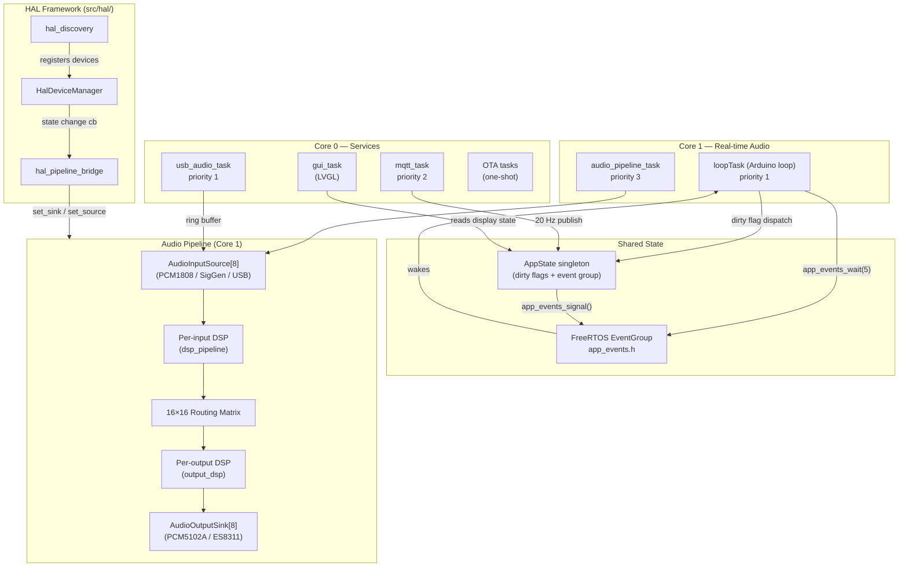
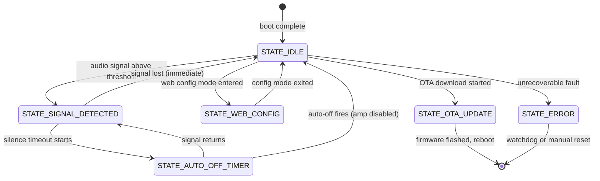
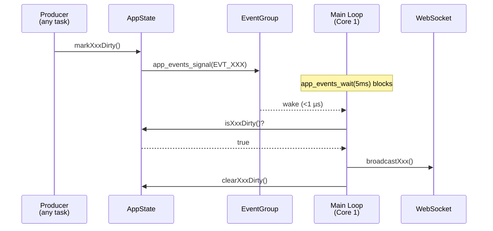
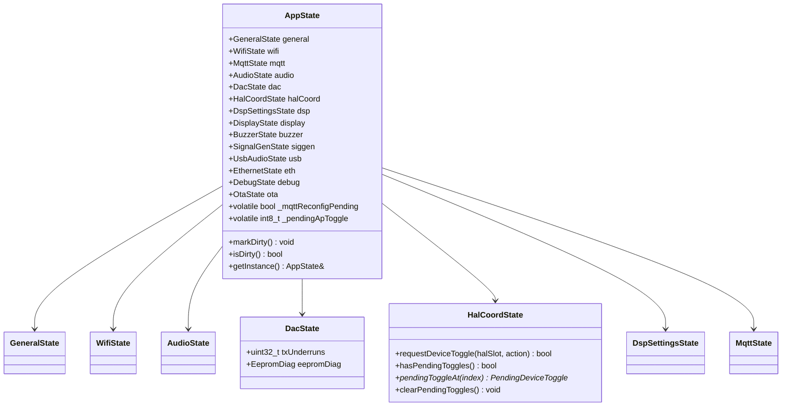
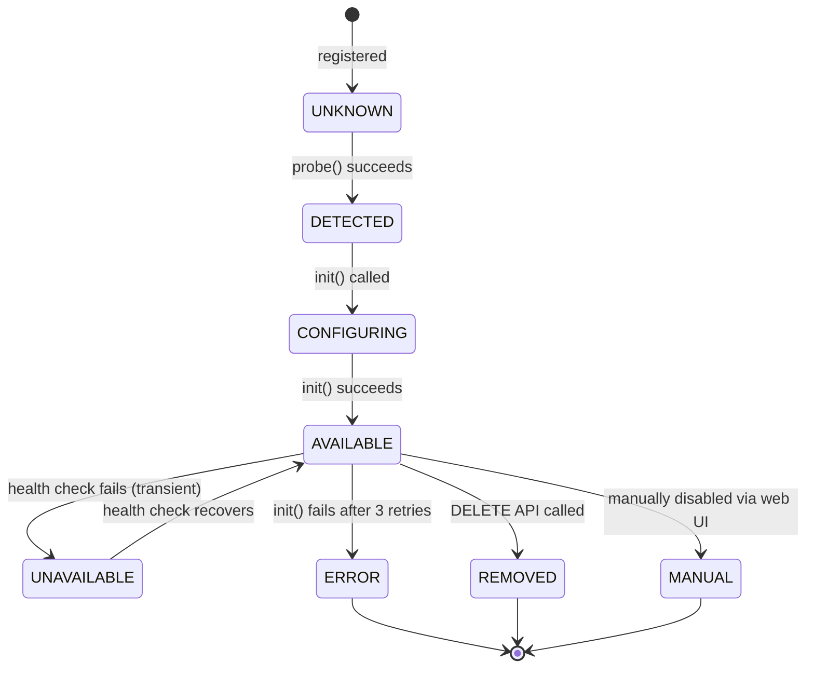
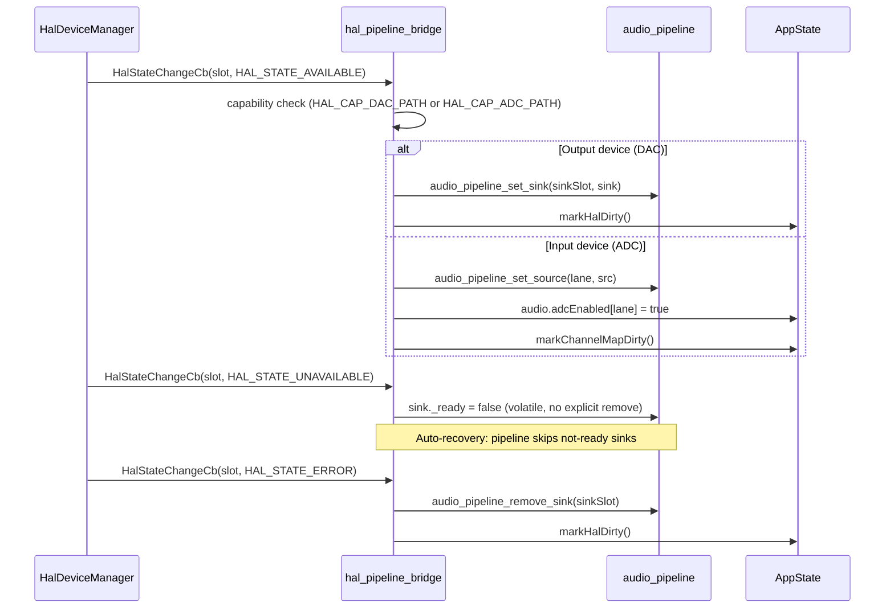
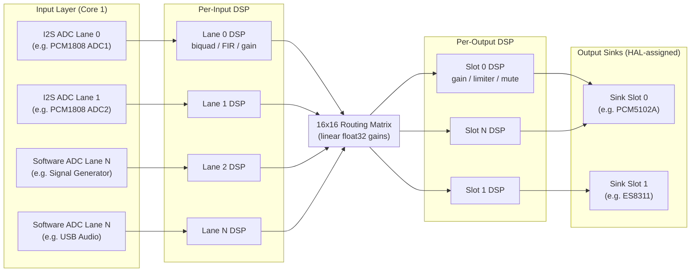

# Architecture

This page covers the structural design of the ALX Nova firmware: how tasks are laid out across the two CPU cores, how state flows between subsystems, how hardware devices connect to the audio pipeline, and which design rules are non-negotiable for real-time correctness.

---

## System Architecture Overview



---

## FreeRTOS Task Layout

| Task | Core | Priority | Stack | Responsibility |
|---|---|---|---|---|
| `loopTask` (Arduino `loop()`) | 1 | 1 | default | HTTP serving, WS broadcast, dirty-flag dispatch, smart sensing, OTA scheduling, button handling |
| `audio_pipeline_task` | 1 | 3 | 12,288 B | I2S DMA read, per-input DSP, 16×16 matrix mix, per-output DSP, sink write, VU metering |
| `gui_task` | 0 | default | varies | LVGL tick and screen rendering (guarded by `GUI_ENABLED`) |
| `mqtt_task` | 0 | 2 | 4,096 B | MQTT reconnect, `mqttClient.loop()`, periodic HA publish at 20 Hz |
| `usb_audio_task` | 0 | 1 | 4,096 B | TinyUSB UAC2 poll, 100 ms idle / 1 ms streaming (guarded by `USB_AUDIO_ENABLED`) |
| OTA check task | 0 | low | 8,192 B | One-shot: GitHub release fetch and SHA256 verify |
| OTA download task | 0 | low | 8,192 B | One-shot: firmware download and flash write |

:::warning Core 1 is exclusively reserved for audio
`audio_pipeline_task` (priority 3) preempts `loopTask` (priority 1) during each DMA cycle, then yields 2 ticks. **Never pin a new task to Core 1.** Adding any blocking work to Core 1 will cause I2S buffer underruns and audio glitches. All new tasks must target Core 0.
:::

---

## Application FSM

The main application state machine (`AppFSMState`, defined in `src/state/enums.h`) drives top-level behavior:



FSM transitions are performed by `smart_sensing.cpp` (signal detection), `ota_updater.cpp`, and `main.cpp`. The current state is stored in `appState.fsmState`.

---

## Event-Driven Design

### AppState Dirty Flags

Every state mutation follows the same pattern:

```cpp
// Inside any subsystem (e.g., MQTT callback, HTTP handler, GUI)
appState.markBuzzerDirty();   // sets _buzzerDirty = true
                               // calls app_events_signal(EVT_BUZZER)
```

The main loop wakes immediately:

```cpp
// src/main.cpp — loop()
app_events_wait(5);  // blocks up to 5 ms, wakes on any EVT_* bit

if (appState.isBuzzerDirty()) {
    sendBuzzerState();          // WebSocket broadcast
    appState.clearBuzzerDirty();
}
// ...repeat for each dirty flag
```

This replaces `delay(5)` polling with event-driven wakeup. The idle case still ticks every 5 ms, preserving all periodic timers.

### Event Bit Assignments

17 bits are assigned (0–16) in `src/app_events.h`. Bits 17–23 are spare. The FreeRTOS event group uses bits 0–23 (`EVT_ANY = 0x00FFFFFF`); bits 24–31 are reserved by FreeRTOS internally.

```cpp
// src/app_events.h (excerpt)
#define EVT_OTA           (1UL <<  0)
#define EVT_DISPLAY       (1UL <<  1)
#define EVT_BUZZER        (1UL <<  2)
#define EVT_SIGGEN        (1UL <<  3)
#define EVT_DSP_CONFIG    (1UL <<  4)
#define EVT_DAC           (1UL <<  5)
#define EVT_EEPROM        (1UL <<  6)
#define EVT_USB_AUDIO     (1UL <<  7)
#define EVT_USB_VU        (1UL <<  8)
#define EVT_SETTINGS      (1UL <<  9)
#define EVT_ADC_ENABLED   (1UL << 10)
#define EVT_ETHERNET      (1UL << 11)
#define EVT_DIAG          (1UL << 12)
#define EVT_DAC_SETTINGS  (1UL << 13)
#define EVT_HAL_DEVICE    (1UL << 14)
#define EVT_CHANNEL_MAP   (1UL << 15)
#define EVT_HEAP_PRESSURE (1UL << 16)
// bits 17-23: spare (7 available)
#define EVT_ANY           0x00FFFFFFu
```

:::info Why a single consumer?
`app_events_wait()` is called with `pdTRUE` (auto-clear) by the main loop only. The `mqtt_task` does **not** wait on the event group — it polls at 20 Hz with `vTaskDelay(50)`. This prevents the fan-out race condition where two tasks both clear event bits and each misses half the events.
:::

### Cross-Core Volatile Flags

For coordination that cannot go through the dirty-flag dispatch cycle, `AppState` exposes typed volatile fields:

```cpp
volatile bool _mqttReconfigPending;   // Web UI broker change → mqtt_task reconnects
volatile int8_t _pendingApToggle;     // MQTT command → main loop executes WiFi mode change
```

DAC and all HAL device enable/disable transitions use the `HalCoordState` deferred toggle queue. The `DacState` domain struct is now minimal, retaining only `txUnderruns` and `eepromDiag`. Per-device enabled/volume/mute state is authoritative in `HalDeviceConfig` via the HAL device manager.

```cpp
// Enqueue a deferred toggle for any HAL device (DAC, ADC, codec, etc.)
// Returns false on overflow or invalid args — all 6 callers check the return value.
bool ok = appState.halCoord.requestDeviceToggle(halSlot, 1);   // 1 = enable
bool ok = appState.halCoord.requestDeviceToggle(halSlot, -1);  // -1 = disable
// Queue capacity: 8 slots with same-slot dedup. Main loop drains via:
// hasPendingToggles() → pendingToggleAt(i) → clearPendingToggles()
```

**Overflow telemetry**: When the queue is full, `requestDeviceToggle()` increments `_overflowCount` (lifetime counter) and sets `_overflowFlag`. The main loop calls `consumeOverflowFlag()` (one-shot atomic clear) and emits `DIAG_HAL_TOGGLE_OVERFLOW` (0x100E) on the first overflow per drain cycle. REST endpoints that enqueue toggles return HTTP 503 on failure; WebSocket and internal callers log a `LOG_W`.

### Event-Driven Main Loop

The main loop wakes in under 1 µs when any dirty flag fires, falling back to a 5 ms tick when idle:



`mqtt_task` polls at 20 Hz with `vTaskDelay(50)` and does **not** wait on the event group, avoiding the fan-out race where two consumers each miss half the events.

---

## Heap and PSRAM Pressure

The firmware maintains graduated memory pressure states for both internal heap and PSRAM. These are evaluated every 30 seconds in the main loop and drive feature shedding to protect audio continuity.

### Internal Heap Pressure

Three states are defined using thresholds in `src/config.h`:

| State | Condition | Behaviour |
|---|---|---|
| Normal | `maxAllocBlock >= 50KB` | All features active |
| Warning (`heapWarning`) | `maxAllocBlock < 50KB` | WS binary frame rate halved; DSP `add_stage()` logs warning; `DIAG_SYS_HEAP_WARNING` (0x0107) fired |
| Critical (`heapCritical`) | `maxAllocBlock < 40KB` | DMA buffer allocation refused; WS binary data suppressed; DSP stages refused; OTA checks skipped |

Threshold constants: `HEAP_WARNING_THRESHOLD = 50000`, `HEAP_CRITICAL_THRESHOLD = 40000` (bytes). Each transition emits a diagnostic event and signals `EVT_HEAP_PRESSURE` (bit 16).

:::caution WiFi RX 40KB reserve
WiFi RX buffers are dynamically allocated from internal SRAM. If the free heap drops below approximately 40KB, incoming packets (ping, HTTP, WebSocket frames) are silently dropped while outgoing traffic (MQTT publish) still works. DMA buffers and DSP allocations must use PSRAM or be guarded by heap checks to maintain this reserve.
:::

### PSRAM Pressure

Three states are defined for PSRAM:

| State | Condition | Behaviour |
|---|---|---|
| Normal | `freePsram >= 1MB` | All features active |
| Warning (`psramWarning`) | `freePsram < 1MB` | `DIAG_SYS_PSRAM_WARNING` (0x0109) fired; WebSocket and web UI show warning banner |
| Critical (`psramCritical`) | `freePsram < 512KB` | DSP delay line and convolution allocations refused; `DIAG_SYS_PSRAM_WARNING` re-emitted at ERROR severity |

Threshold constants: `PSRAM_WARNING_THRESHOLD = 1048576`, `PSRAM_CRITICAL_THRESHOLD = 524288` (bytes).

### Unified PSRAM Allocator

All PSRAM-preferred allocations use the `psram_alloc()` wrapper (`src/psram_alloc.h/.cpp`):

```cpp
// Attempt PSRAM; fall back to SRAM on failure.
// Records automatically in heap_budget and emits DIAG_SYS_PSRAM_ALLOC_FAIL on fallback.
void* ptr = psram_alloc(count, size, "dsp-delay");

// Free and remove from budget tracking.
psram_free(ptr, "dsp-delay");

// Query lifetime fallback and failure counts.
PsramAllocStats stats = psram_get_stats();
// stats.fallbackCount   — allocations that landed on SRAM instead of PSRAM
// stats.failedCount     — allocations that failed on both PSRAM and SRAM
// stats.activePsramBytes, stats.activeSramBytes — current live totals
```

On PSRAM success the allocation is recorded as PSRAM in the heap budget. On PSRAM failure with SRAM success, `DIAG_SYS_PSRAM_ALLOC_FAIL` is emitted at WARN and the fallback count is incremented. On total failure, the same code fires at ERROR. The REST endpoint `GET /api/psram/status` and the WebSocket `hardwareStats` message expose these counts to the web UI.

:::note DMA buffers are excluded from psram_alloc
DMA buffers (`_rawBuf[]`, `_sinkBuf[]`) must stay in internal SRAM and are allocated directly with `heap_caps_calloc(MALLOC_CAP_INTERNAL | MALLOC_CAP_DMA)`. They are NOT managed by `psram_alloc()`.
:::

### Heap Budget Tracker

`heap_budget` (`src/heap_budget.h/.cpp`) tracks per-subsystem allocations without dynamic allocation of its own:

```cpp
// Record an allocation (label must have static lifetime).
heap_budget_record("dsp-delay", bytes, /*isPsram=*/true);

// Remove on free.
heap_budget_remove("dsp-delay");

// Query totals.
uint32_t psramTotal = heap_budget_total_psram();
uint32_t sramTotal  = heap_budget_total_sram();

// Iterate entries (for REST/WS serialisation).
uint8_t n = heap_budget_count();
const HeapBudgetEntry* e = heap_budget_entry(i);
// e->label, e->bytes, e->isPsram
```

The tracker holds up to 32 `HeapBudgetEntry` structs (label up to 24 characters, byte count, PSRAM flag). It is exposed via the WebSocket `hardwareStats` message (`heapBudget` array) and the REST endpoint `GET /api/diag/snapshot`.

---

## AppState Domain Decomposition

`AppState` is a thin singleton composing 15 domain state structs from `src/state/`:



Access follows the `appState.domain.field` pattern for new code:

```cpp
// Read WiFi SSID
const char* ssid = appState.wifi.ssid;

// Read per-lane ADC enabled state
bool lane0Active = appState.audio.adcEnabled[0];

// filterMode is now in HalDeviceConfig, not DacState — query via HAL manager:
// HalDeviceConfig* cfg = HalDeviceManager::getInstance().getConfig(halSlot);
// int filt = cfg ? cfg->filterMode : 0;

// Read dark mode setting
bool dark = appState.general.darkMode;
```

Legacy code uses `#define` macros (e.g., `#define wifiSSID appState.wifiSSID`) that alias flat names to domain fields. New code must use the domain path directly.

---

## HAL Framework and Device Lifecycle

**HAL is the sole system managing all hardware devices — there are no static device patterns.** This applies equally to DAC outputs (PCM5102A, ES8311), ADC inputs (PCM1808), amplifiers (NS4150B), and all other peripherals. The audio pipeline sees only abstract `AudioInputSource` and `AudioOutputSink` C structs with function pointers; it has no knowledge of specific device models.

### HAL Device Lifecycle



The hot-path audio pipeline reads `volatile _ready` and `volatile _state` directly without virtual dispatch, enabling lock-free Core 1 reads.

### HAL to Pipeline Bridge

The `hal_pipeline_bridge` translates device state transitions into audio pipeline registrations:



The **hybrid transient policy** distinguishes recoverable from permanent failures:
- `UNAVAILABLE` sets `_ready = false` only. The pipeline skips the sink/source on each dispatch cycle and auto-recovers when the device comes back.
- `ERROR`, `REMOVED`, and `MANUAL` trigger an explicit `remove_sink()` / `remove_source()` call, which deallocates the slot under `vTaskSuspendAll()`.

---

## Audio Pipeline Data Flow



**Note:** Input lanes and output slots are assigned dynamically by the `hal_pipeline_bridge` based on HAL device discovery and capability matching. Specific device models (PCM1808, PCM5102A, ES8311, etc.) are determined at runtime; the pipeline sees only abstract `AudioInputSource` and `AudioOutputSink` interfaces.

Key implementation details:
- All internal audio is **float32 in the range [-1.0, +1.0]**. int32 ↔ float conversion happens only at the DMA edge.
- DMA raw buffers (16 × 2KB = 32KB internal SRAM) are **eagerly pre-allocated** in `audio_pipeline_init()` via `heap_caps_calloc(MALLOC_CAP_INTERNAL | MALLOC_CAP_DMA)` before WiFi connects. `DIAG_AUDIO_DMA_ALLOC_FAIL` (0x200E) is emitted on failure.
- The matrix is **16×16** with early-exit optimisation: NULL output channels, NULL input channels, and zero gains are skipped without computation.
- DSP delay lines are allocated via `ps_calloc()` (PSRAM) when available, with a 40 KB heap pre-flight guard on fallback to SRAM.

:::danger Never call Serial.print from inside audio_pipeline_task
`Serial.print` blocks when the UART TX buffer fills, starving I2S DMA and causing audible dropouts. Use the dirty-flag pattern: set a flag inside the audio task, then emit the log from `audio_periodic_dump()` called by the main loop.
:::

---

## I2S Driver Safety (DAC Toggle Handshake)

The DAC driver may uninstall and reinstall the I2S peripheral at runtime (e.g., when the user toggles the DAC output from the web UI). This races with `audio_pipeline_task` calling `i2s_read()` on Core 1.

The handshake uses a binary semaphore for deterministic coordination:

```cpp
// DAC deinit side (main loop)
appState.audio.audioPaused = true;
xSemaphoreTake(appState.audio.audioTaskPausedAck, pdMS_TO_TICKS(50));
i2s_driver_uninstall(I2S_NUM_0);
// ... reinit ...
appState.audio.audioPaused = false;

// Audio task side (Core 1, audio_pipeline_task)
if (appState.audio.audioPaused) {
    xSemaphoreGive(appState.audio.audioTaskPausedAck);
    vTaskDelay(pdMS_TO_TICKS(10));
    continue;  // skip this DMA cycle
}
```

This replaces the previous `volatile` + `vTaskDelay(40)` guess, which had a race window.

---

## Handler/Module Pattern

Each subsystem follows a consistent module pattern:

```cpp
// module_name.h
void moduleNameInit();
void moduleNameLoop();      // called from main loop if needed
void moduleNameSomething(int param);

// module_name.cpp
static SomeType _privateState;  // file-local, no extern exposure

void moduleNameInit() {
    // ...
}
```

Change-detection shadow fields belong in the module file, not in `AppState`. For example, MQTT change detection lives in `mqtt_publish.cpp` as `static` fields:

```cpp
// src/mqtt_publish.cpp
static String prevMqttStatus;
static float  prevMqttVolumeDb;
// ...

void mqttPublishPendingState() {
    if (appState.mqtt.connectionStatus != prevMqttStatus) {
        // publish ...
        prevMqttStatus = appState.mqtt.connectionStatus;
    }
}
```

This keeps `AppState` from growing unbounded and makes each module's state self-contained.

### Multi-File Module Splits

Some modules have grown beyond a single `.cpp` file and are split by concern while sharing a common header:

**WebSocket subsystem** (`websocket_handler.h`) -- split into 4 files:

| File | Responsibility |
|------|---------------|
| `websocket_command.cpp` | WS event handler (`webSocketEvent()`), command dispatch, deferred init state |
| `websocket_broadcast.cpp` | 17 state broadcast functions + audio data streaming |
| `websocket_auth.cpp` | Client authentication tracking, session validation |
| `websocket_cpu_monitor.cpp` | FreeRTOS idle hook CPU usage measurement |

Cross-file shared state uses accessor functions in `websocket_internal.h`.

**MQTT subsystem** (`mqtt_handler.h`) -- split into 3 files: `mqtt_handler.cpp`, `mqtt_publish.cpp`, `mqtt_ha_discovery.cpp`.

### Extracted API Modules

REST API endpoint handlers that were previously registered inline in `main.cpp setup()` have been extracted into dedicated modules:

| Module | File | Endpoints |
|--------|------|-----------|
| Diagnostics | `src/diag_api.cpp` | `/api/diagnostics`, `/api/diagnostics/journal`, `/api/diag/snapshot` |
| Signal generator | `src/siggen_api.cpp` | `/api/signalgenerator` (GET + POST) |
| DSP | `src/dsp_api.cpp` | DSP config CRUD, persistence |
| Audio pipeline | `src/pipeline_api.cpp` | Matrix CRUD, per-output DSP config |
| DAC | `src/dac_api.cpp` | DAC state, volume, enable/disable |
| HAL | `src/hal/hal_api.cpp` | HAL device CRUD, discovery, database |
| PSRAM | `src/psram_api.cpp` | PSRAM health status |

Each module exposes a `registerXxxApiEndpoints()` function called from `setup()` in `main.cpp`.

---

## Logging Conventions

All modules use `debug_serial.h` macros with a consistent `[ModuleName]` prefix:

```cpp
#include "debug_serial.h"

LOG_I("[MyModule] Initialised successfully");
LOG_D("[MyModule] Sample rate: %d Hz", rate);
LOG_W("[MyModule] Retry %d/%d", attempt, MAX_RETRIES);
LOG_E("[MyModule] Fatal: I2S driver failed (%d)", err);
```

| Macro | Level | When to use |
|---|---|---|
| `LOG_D` | Debug | High-frequency details; parameter snapshots; disabled in production |
| `LOG_I` | Info | State transitions; significant events (connect, start, stop) |
| `LOG_W` | Warning | Recoverable errors; degraded operation |
| `LOG_E` | Error | Failures requiring attention |

:::warning Never log from ISR or audio task context
`LOG_*` macros call `Serial.print`, which acquires a mutex and can block. Calling them from an ISR will crash. Calling them from `audio_pipeline_task` will stall DMA. Use the dirty-flag pattern and emit logs from `audio_periodic_dump()` in the main loop.
:::

Save all `.log` output files to the `logs/` directory to keep the project root clean.
