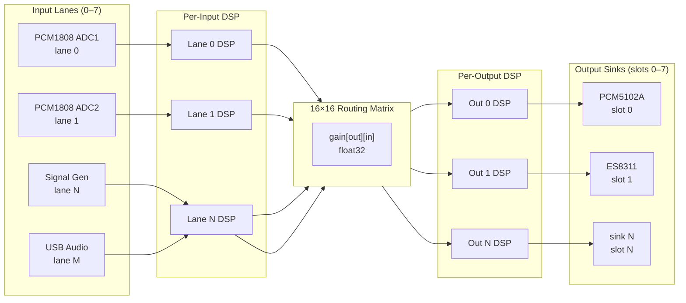

The audio pipeline is the real-time audio processing core of ALX Nova. It runs exclusively on FreeRTOS Core 1 and processes audio from up to 8 input lanes through a 16x16 routing matrix into up to 8 output sinks, all in float32 precision.

Source files: `src/audio_pipeline.h`, `src/audio_pipeline.cpp`, `src/audio_input_source.h`, `src/audio_output_sink.h`

## Architecture Overview



Audio flows left to right each DMA interrupt. The pipeline task on Core 1 never blocks; it reads from sources, applies DSP, applies the matrix, applies output DSP, and writes to sinks in a single pass every ~5.33 ms (256 frames at 48 kHz).

:::warning Core 1 exclusivity
Only `loopTask` (the Arduino main loop, priority 1) and `audio_pipeline_task` (priority 3) may run on Core 1. Never create a new task pinned to Core 1. The audio task preempts the main loop during DMA processing and yields 2 ticks when idle.
:::

## Data Format

All internal processing uses **float32 in the range [-1.0, +1.0]**. Conversion between hardware formats and float happens only at pipeline edges:

- **Input edge**: `int32_t` DMA samples (left-justified 24-bit in 32-bit words) are converted to float via `pipeline_to_float()`.
- **Output edge**: float output is converted back to `int32_t` via `pipeline_from_float()` before calling `sink->write()`.

This keeps all biquad, gain, FIR, and matrix math in float, which maps efficiently to the ESP32-P4's FPU.

## Input Sources

Input sources are described by the `AudioInputSource` struct in `src/audio_input_source.h`:

```cpp
typedef struct AudioInputSource {
    const char *name;        // "ADC1", "ADC2", "SigGen", "USB"
    uint8_t     lane;        // Pipeline lane index (0..AUDIO_PIPELINE_MAX_INPUTS-1)

    uint32_t (*read)(int32_t *dst, uint32_t requestedFrames);
    bool     (*isActive)(void);
    uint32_t (*getSampleRate)(void);

    float gainLinear;        // Pre-matrix trim (host volume / input trim)
    float vuL, vuR;          // dBFS VU metering output — updated by pipeline
    float _vuSmoothedL;      // Internal ballistics state — do not write directly
    float _vuSmoothedR;
    uint8_t halSlot;         // 0xFF = not bound to a HAL device
    bool isHardwareAdc;      // true for PCM1808 lanes; false for SigGen, USB
} AudioInputSource;
```

The `isHardwareAdc` flag is the correct way to determine whether noise gating applies to a lane. Never hardcode lane indices 0 and 1 for this purpose — the HAL bridge assigns lanes dynamically.

### Registering a Source

Sources are registered exclusively by the HAL pipeline bridge (`hal_pipeline_bridge`) when a HAL device transitions to `AVAILABLE`. **No driver or subsystem outside the bridge may call `audio_pipeline_set_source()` directly.** Lane assignment is performed by capability-based ordinal counting in the bridge; never hard-code lane indices.

```cpp
// Atomically place a source at a lane index (wraps vTaskSuspendAll)
// Called by hal_pipeline_bridge only.
audio_pipeline_set_source(int lane, const AudioInputSource *src);

// Atomically clear a lane
// Called by hal_pipeline_bridge only.
audio_pipeline_remove_source(int lane);

// Read-only accessor — returns NULL if lane has no source
// Safe to call from the main loop; used by sendAudioChannelMap().
const AudioInputSource* audio_pipeline_get_source(int lane);
```

:::warning vTaskSuspendAll atomicity
`audio_pipeline_set_source()` and `audio_pipeline_remove_source()` suspend all tasks on Core 1 for the duration of the pointer update. This is safe because both calls are short (pointer write only) and are never called from within the audio task itself. Calling them from the audio task will deadlock.
:::

### VU Metering

Per-lane VU levels are computed in the pipeline task after each `read()` call and stored in the `AudioInputSource` struct. Read them from the main loop:

```cpp
float leftDb  = audio_pipeline_get_lane_vu_l(lane);
float rightDb = audio_pipeline_get_lane_vu_r(lane);
// Returns -90.0f if the lane has no registered source
```

## Output Sinks

Output sinks use the `AudioOutputSink` struct from `src/audio_output_sink.h`:

```cpp
typedef struct AudioOutputSink {
    const char *name;          // "PCM5102A", "ES8311"
    uint8_t firstChannel;      // First matrix output channel (0, 2, 4, 6)
    uint8_t channelCount;      // 1 = mono, 2 = stereo

    void (*write)(const int32_t *buf, int stereoFrames);
    bool (*isReady)(void);

    float gainLinear;          // Post-matrix trim (1.0 = unity)
    bool muted;                // Skip dispatch when true
    float vuL, vuR;            // dBFS VU metering — updated by pipeline
    float _vuSmoothedL;        // Internal ballistics — do not write directly
    float _vuSmoothedR;
    uint8_t halSlot;           // 0xFF = unbound; used for O(1) HAL lookup
} AudioOutputSink;
```

### Slot-Indexed Sink API

Sinks occupy named slots (0 through `AUDIO_OUT_MAX_SINKS - 1`, currently 8). The slot index is stable across HAL device lifecycle transitions. **HAL is the sole system that binds DAC devices to pipeline slots.** The only correct way to attach or detach a DAC device is through the HAL pipeline bridge lifecycle, which internally calls `dac_activate_for_hal()` and `dac_deactivate_for_hal()` for DAC-path devices before registering the sink:

```cpp
// Called by hal_pipeline_bridge on AVAILABLE — after dac_activate_for_hal()
audio_pipeline_set_sink(int slot, const AudioOutputSink *sink);

// Called by hal_pipeline_bridge on MANUAL/ERROR/REMOVED — after dac_deactivate_for_hal()
audio_pipeline_remove_sink(int slot);

// Legacy — iterates up to _sinkCount, kept for backwards compatibility
audio_pipeline_register_sink(const AudioOutputSink *sink);
audio_pipeline_clear_sinks();   // Requires audioPaused=true before calling
```

:::danger Do not call audio_pipeline_clear_sinks() from a HAL driver
`audio_pipeline_clear_sinks()` removes all sinks globally and requires `appState.audioPaused = true` beforehand. HAL drivers must use `audio_pipeline_remove_sink(slot)` to remove only their own sink. Calling `clear_sinks()` from a device deinit path removes all other active sinks and causes audio dropouts on unrelated devices.
:::

The pipeline dispatch loop skips slots where:
- The sink pointer is NULL (slot empty)
- `sink->isReady()` returns false (hardware not ready)
- `sink->muted` is true

### Hybrid Transient Policy

The HAL pipeline bridge applies different sink removal policies depending on the reason a device becomes unavailable:

| HAL State | Bridge Action | Rationale |
|---|---|---|
| `UNAVAILABLE` | Sets `_ready = false` only | Transient; hardware recovers automatically |
| `MANUAL` / `ERROR` / `REMOVED` | Calls `audio_pipeline_remove_sink(slot)` | Permanent; user action or hardware fault |

This prevents unnecessary slot churn when, for example, a USB audio host disconnects momentarily.

## 16x16 Routing Matrix

The routing matrix maps input lanes to output channels with individual float32 gain values. The matrix is 16x16 but only the top-left `AUDIO_PIPELINE_MAX_INPUTS` x `AUDIO_PIPELINE_MAX_OUTPUTS` region is active in typical configurations.

```cpp
// Set gain in linear scale (0.0 = silence, 1.0 = unity, >1.0 = boost)
audio_pipeline_set_matrix_gain(int out_ch, int in_ch, float gain_linear);

// Convenience: set gain in dB (-90 to +12 typical)
audio_pipeline_set_matrix_gain_db(int out_ch, int in_ch, float gain_db);

// Read back the current gain
float gain = audio_pipeline_get_matrix_gain(int out_ch, int in_ch);

// Bypass the matrix entirely (identity passthrough for diagnostic use)
audio_pipeline_bypass_matrix(bool bypass);
```

### Matrix Persistence

The routing matrix is persisted to LittleFS as JSON:

```cpp
audio_pipeline_save_matrix();  // Called by settings_manager on config save
audio_pipeline_load_matrix();  // Called during audio_pipeline_init()
```

**Backward compatibility**: Loading an 8x8 matrix from a previous firmware version places it in the top-left corner of the 16x16 matrix, zero-filling the rest. This migration is handled transparently in `audio_pipeline_load_matrix()`.

:::tip Matrix performance
The pipeline task has three early-exit layers: NULL output channels skip the entire outer loop iteration, NULL input channels skip the inner loop, and zero gain skips the multiply-accumulate. In a typical two-input / two-output configuration only 4 cells are non-zero, so the matrix costs approximately 4 float multiplies per output frame.
:::

## Bypass Controls

Individual stages can be bypassed independently:

```cpp
audio_pipeline_bypass_input(int lane, bool bypass);   // Skip source read
audio_pipeline_bypass_dsp(int lane, bool bypass);     // Skip per-input DSP
audio_pipeline_bypass_matrix(bool bypass);            // Identity matrix
audio_pipeline_bypass_output(bool bypass);            // Skip all output DSP
```

## DMA Buffers and Memory Allocation

Raw DMA buffers and the float working buffers that hold the converted audio data use **lazy SRAM allocation**: they are allocated the first time `audio_pipeline_set_source()` or `audio_pipeline_set_sink()` is called, not at startup. This avoids wasting SRAM when a lane is unused.

The allocation path uses `ps_malloc()` (PSRAM) when available and falls back to `heap_caps_malloc(MALLOC_CAP_INTERNAL)`. If internal SRAM is below the 40 KB reserve, allocation is refused and the source/sink is not registered.

:::info PSRAM vs SRAM for audio buffers
Float working buffers (2 lanes × 2 KB = 4 KB per 5.33 ms) go through `pipeline_to_float()` as a `memcpy` from PSRAM-sourced DMA. At the ESP32-P4's PSRAM bandwidth of ~200 MB/s this is 0.4% utilisation — negligible. Delay lines for the DSP engine are the only allocations that meaningfully benefit from PSRAM placement.
:::

## Noise Gate

The noise gate stage in the per-input DSP chain is gated by `AudioInputSource.isHardwareAdc`. Only lanes where this flag is `true` receive noise gating; software sources (signal generator, USB audio) do not.

```cpp
// HAL PCM1808 driver sets isHardwareAdc = true when registering
AudioInputSource src = AUDIO_INPUT_SOURCE_INIT;
src.name = "ADC1";
src.isHardwareAdc = true;    // Physical ADC — noise gate applies
src.read = pcm1808_read;
// ...
audio_pipeline_set_source(lane, &src);
```

Setting `isHardwareAdc = false` for a signal generator source ensures that the generator's own output is never gated, even when the physical ADC lanes are quiet.

## DSP Swap Safety

When a DSP configuration swap is pending, `dsp_swap_config()` calls `audio_pipeline_notify_dsp_swap()` before setting the swap-requested flag. This arms a PSRAM hold buffer so that `pipeline_write_output()` uses the last good frame during the swap gap rather than outputting silence or a partial new configuration.

```cpp
// Called from dsp_swap_config() — not for direct use by other modules
void audio_pipeline_notify_dsp_swap();
// No-op in native test builds (single-threaded, no swap gap)
```

## Diagnostics

A non-real-time diagnostic dump is available for debugging. Call it only from the main loop context — never from the audio task:

```cpp
// Dumps raw DMA buffer state, source/sink registration, and lane VU to serial
audio_pipeline_dump_raw_diag();
```

:::danger Do not call diagnostics from the audio task
`audio_pipeline_dump_raw_diag()` calls `LOG_I()` which routes through `Serial.print()`. Serial blocks when the UART TX buffer fills. Calling it from the audio task will stall DMA and cause audible dropouts or a watchdog reset.
:::

## Initialization

The pipeline is initialised once at boot, after the HAL device manager has completed its first device scan:

```cpp
// Called from i2s_audio_init() — creates the audio_pipeline_task on Core 1
void audio_pipeline_init();
```

After `audio_pipeline_init()` returns, the task is running and waiting for sources and sinks to be registered via the HAL pipeline bridge. No audio flows until at least one source and one sink are in a ready state.

## Compile-Time Dimensions

Override these via build flags in `platformio.ini` if you need more lanes or sinks:

| Macro | Default | Description |
|---|---|---|
| `AUDIO_PIPELINE_MAX_INPUTS` | 8 | Number of input lanes |
| `AUDIO_PIPELINE_MAX_OUTPUTS` | 8 | Number of output channels |
| `AUDIO_PIPELINE_MATRIX_SIZE` | 16 | Matrix dimension (inputs and outputs share this) |
| `AUDIO_OUT_MAX_SINKS` | 8 | Maximum number of registered output sinks |

## I2S GPIO Pin Assignment

All I2S clock and data pin assignments are resolved from `HalDeviceConfig` at init time, with compile-time constants from `src/config.h` as fallback. Expansion modules can override the default pin mapping via HAL device configuration without recompiling firmware.

### Pin Resolution Rules

| Field | Default (`config.h`) | Override condition |
|---|---|---|
| `pinMclk` | `I2S_MCLK_PIN` (GPIO 22) | `cfg->pinMclk > 0` |
| `pinBck` | `I2S_BCK_PIN` (GPIO 20) | `cfg->pinBck > 0` |
| `pinLrc` | `I2S_LRC_PIN` (GPIO 21) | `cfg->pinLrc > 0` |
| `pinData` (RX) | `I2S_DOUT_PIN` (GPIO 23) | `cfg->pinData > 0` |

The guard condition is `> 0` (not `>= 0`) because GPIO 0 is a strapping pin on ESP32-P4 and is never a valid I2S pin.

### Config Cache

`i2s_audio.cpp` maintains a two-lane config cache (`_cachedAdcCfg[2]`) that is written when `i2s_audio_configure_adc()` is called during HAL device init and read on every subsequent call — including sample rate changes. This guarantees that pin overrides from `/hal_config.json` survive a sample rate reconfiguration without requiring the HAL to reinitialise the device.

```cpp
// Cache is populated automatically inside i2s_audio_configure_adc()
// when cfg != nullptr && cfg->valid == true.
// Sample rate changes read from cache:
i2s_audio_configure_adc(0, _cachedAdcCfgValid[0] ? &_cachedAdcCfg[0] : nullptr);
```

### ADC2 Clock Pins

ADC2 (`I2S_NUM_1`) uses `I2S_GPIO_UNUSED` for MCLK, BCK, and WS. It derives its clock from ADC1's output on the GPIO matrix — both ports run from the same 160 MHz `D2CLK` with identical divider chains, giving frequency-locked BCK. Do not assign clock pins to ADC2's `HalDeviceConfig`.

:::info MCLK drive strength
MCLK is driven at `GPIO_DRIVE_CAP_3` (~40 mA) to guarantee PCM1808 PLL lock at 12.288 MHz. This drive strength is applied to the resolved pin, not the compile-time constant.
:::
