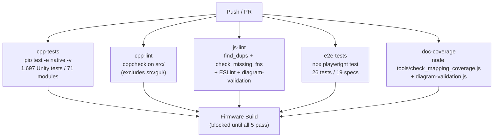

# Contributing

This page covers the full contribution workflow: commit conventions, pull request process, pre-commit hooks, CI quality gates, and the test coverage requirements that every change must satisfy before merging.

---

## Commit Conventions

All commits use a structured prefix to make history scannable and to drive changelog generation:

| Prefix | When to use |
|---|---|
| `feat:` | A new feature or user-visible capability |
| `fix:` | A bug fix |
| `docs:` | Documentation changes only |
| `refactor:` | Code restructuring with no behaviour change |
| `test:` | Adding or updating tests |
| `chore:` | Maintenance (dependencies, CI config, build scripts) |

### Examples

```
feat: Add per-lane MQTT health aggregation topics
fix: Correct uint32_t underflow in flap guard rolling window
docs: Update HAL device lifecycle diagram
refactor: Extract DacState into src/state/dac_state.h
test: Add 16 tests for hal_dsp_bridge lane guard expansion
chore: Bump ArduinoJson to 7.4.2
```

Keep the subject line under 72 characters. Use the body for context when the change is non-obvious — explain *why*, not just *what*.

:::warning No AI attribution in commits
Do not add `Co-Authored-By:` trailers or any other AI attribution lines to commit messages. Commits must not reference AI tooling.
:::

---

## Pre-commit Hooks

The `.githooks/pre-commit` script runs automatically before every commit and checks five things:

1. `node tools/find_dups.js` — detects duplicate `let`/`const` declarations across the concatenated JS scope in `web_src/js/`
2. `node tools/check_missing_fns.js` — detects undefined function references in `web_src/js/`
3. ESLint on `web_src/js/` using `web_src/.eslintrc.json`
4. `node tools/check_mapping_coverage.js` — verifies every `src/` file is mapped in `tools/doc-mapping.json`
5. `node tools/diagram-validation.js` — verifies `@validate-symbols` identifiers in architecture diagrams exist in their source files

If any check fails, the commit is blocked with an error message identifying the problem.

### Activating the Hooks

Activate once per clone:

```bash
git config core.hooksPath .githooks
```

To run the checks manually without committing:

```bash
node tools/find_dups.js
node tools/check_missing_fns.js
cd e2e && npx eslint ../web_src/js/ --config ../web_src/.eslintrc.json
```

---

## CI Quality Gates

GitHub Actions runs 5 parallel quality gates on every push and pull request to `main` and `develop`. All 5 must pass before the firmware build job runs.



| Gate | Tool | What it checks |
|---|---|---|
| `cpp-tests` | Unity via PlatformIO native | All C++ unit tests pass |
| `cpp-lint` | cppcheck | No new warnings or errors in `src/` |
| `js-lint` | find_dups + check_missing_fns + ESLint | No duplicate declarations, no undefined references, no ESLint violations |
| `e2e-tests` | Playwright + Chromium | All browser tests pass against the mock server |
| `doc-coverage` | check_mapping_coverage.js + diagram-validation.js | All src/ files mapped; diagram symbols present in source |

On E2E test failure, the Playwright HTML report is uploaded as a CI artifact with 14-day retention.

:::tip Check CI before starting a new task
After every push, verify CI status:
```bash
gh run list --limit 5
gh run view <run-id>
```
A `cpp-lint` failure from the previous push must be fixed before starting new work.
:::

---

## Testing Requirements

**Every code change must keep all tests green.** The requirement is not optional — it is a merge prerequisite.

### C++ Firmware Changes (`src/`)

```bash
# Run all tests locally before opening a PR
pio test -e native -v
```

Rules:
- Every new module needs a corresponding test file in `test/test_<module>/test_<module>.cpp`
- Changed function signatures must be reflected in all affected test files
- New public API functions must have at least one positive-path and one negative-path test
- Each test module must be in its own directory to avoid duplicate `main`/`setUp`/`tearDown` symbols

### Web UI Changes (`web_src/`)

```bash
cd e2e
npx playwright test
```

Rules:
- New toggle, button, or dropdown → add a test verifying it sends the correct WebSocket command
- New WebSocket broadcast type → add a fixture JSON in `e2e/fixtures/ws-messages/` and a test verifying the DOM updates
- New tab or section → add navigation and element presence tests
- Changed element IDs → update `e2e/helpers/selectors.js` and all affected specs
- Removed features → remove the corresponding tests and fixtures
- New top-level `let`/`const` JS declarations → add to the `globals` list in `web_src/.eslintrc.json`

### WebSocket Protocol Changes (`src/websocket_handler.cpp`)

- Update or add a fixture in `e2e/fixtures/ws-messages/`
- Update `buildInitialState()` and `handleCommand()` in `e2e/helpers/ws-helpers.js`
- Update `e2e/mock-server/ws-state.js` if new state fields are added
- Add a Playwright test verifying the frontend handles the new message type correctly

### REST API Changes (`src/main.cpp`, `src/hal/hal_api.cpp`)

- Update the matching Express route in `e2e/mock-server/routes/`
- Update or add a fixture in `e2e/fixtures/api-responses/`
- Add a Playwright test if the UI depends on the new endpoint

---

## Pull Request Workflow

### Branch Naming

Use descriptive branch names that reflect the type of change:

```
feat/per-lane-mqtt-topics
fix/dsp-swap-double-count
refactor/appstate-domain-decomp
test/hal-dsp-bridge-lane-guards
```

### Before Opening a PR

1. Ensure all local tests pass:
   ```bash
   pio test -e native -v
   cd e2e && npx playwright test
   ```

2. Ensure static analysis passes:
   ```bash
   node tools/find_dups.js
   node tools/check_missing_fns.js
   ```

3. If you edited `web_src/`, rebuild assets:
   ```bash
   node tools/build_web_assets.js
   ```

4. Push your branch and open a PR against `main` (or `develop` for larger features).

5. Monitor the CI run — all 5 gates must go green.

### PR Description

A useful PR description includes:

- What changed and why
- Which subsystems are affected
- How the change was tested (unit tests added/updated, manual verification steps)
- Any known limitations or follow-up work

---

## Code Style

### C++ Style

- Use `#pragma once` guards, not `#ifndef` include guards
- Prefer `const` and `constexpr` over `#define` for constants
- Private members use `_camelCase` prefix (e.g., `_privateField`)
- File-local statics are preferred over global variables for module state
- Keep functions focused — extract helpers rather than letting functions grow past ~60 lines

### Logging

All log calls must include a `[ModuleName]` prefix:

```cpp
LOG_I("[MyModule] Connection established to %s", host);
LOG_W("[MyModule] Retry %d/%d — backing off %d ms", attempt, maxRetries, backoff);
LOG_E("[MyModule] Init failed: %d", result);
```

Never call `LOG_*` from ISR context or from `audio_pipeline_task`. See the Architecture page for the dirty-flag logging pattern.

### AppState Access

New code uses the domain path pattern:

```cpp
// Correct — domain path
appState.wifi.ssid
appState.audio.adcEnabled[lane]
appState.halCoord.requestDeviceToggle(halSlot, 1)  // HalCoordState toggle queue

// Avoid — legacy flat macro aliases
wifiSSID  // resolves to appState.wifiSSID via #define
```

### Web UI (JavaScript)

All JS files share a single concatenated scope. Rules:

- No duplicate `let`/`const` declarations across files
- All icons must use inline SVG from [Material Design Icons](https://pictogrammers.com/library/mdi/) — no external CDN
- New global declarations must be added to `web_src/.eslintrc.json` globals
- Use `fill="currentColor"` on all SVG icons so they inherit CSS `color`

### Web UI (CSS)

- Design tokens (colours, spacing, radius values) belong in `web_src/css/01-variables.css` as CSS custom properties
- Component styles go in `web_src/css/03-components.css`
- Never use inline `style=""` for values that belong in CSS

---

## Adding a New Module

### Firmware Module

1. Create `src/my_module.h` and `src/my_module.cpp`
2. Follow the module pattern: `void myModuleInit()`, file-local `static` state, `LOG_*` with `[MyModule]` prefix
3. Register any required `appState` dirty flags in `src/app_events.h` (if the module needs to wake the main loop)
4. Create `test/test_my_module/test_my_module.cpp` with at minimum a positive-path and negative-path test
5. Add the module to the relevant section of `src/main.cpp` (`setup()` for init, `loop()` for periodic work)

### HAL Driver

The HAL driver scaffold creates the boilerplate automatically. For a manual implementation:

1. Subclass `HalDevice` in `src/hal/hal_my_device.h/.cpp`
2. Implement `probe()`, `init()`, `deinit()`, `dumpConfig()`, `healthCheck()`
3. If the device produces audio, override `getInputSource()` (ADC) or provide a `getOutputSink()` equivalent for DAC devices
4. Register the compatible string → factory function mapping in `hal_builtin_devices.cpp`
5. Add a builtin entry to `hal_device_db.cpp`
6. Create `test/test_hal_my_device/test_hal_my_device.cpp`

### Web UI Feature

1. Add HTML elements to `web_src/index.html`
2. Add CSS to the appropriate `web_src/css/` file
3. Add JS to a new or existing `web_src/js/` file (use the correct numeric prefix for load order)
4. Run `node tools/find_dups.js` to confirm no duplicate declarations
5. Add new global declarations to `web_src/.eslintrc.json`
6. Run `node tools/build_web_assets.js` to regenerate `src/web_pages.cpp`
7. Add Playwright tests for the new feature in `e2e/tests/`
8. If the feature sends WS commands, update `e2e/helpers/ws-helpers.js`
9. If the feature consumes WS broadcasts, add a fixture in `e2e/fixtures/ws-messages/`
