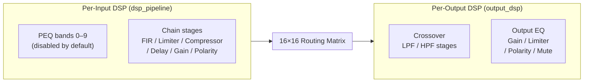
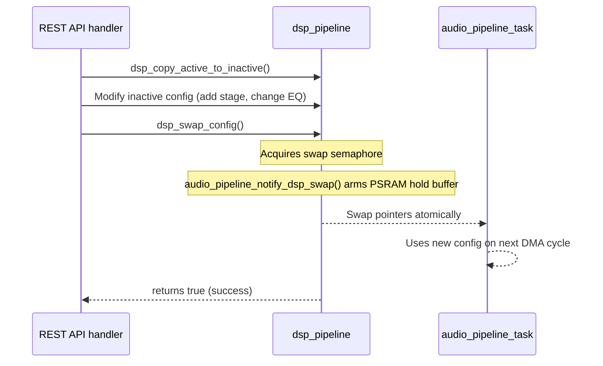

ALX Nova runs a two-stage DSP architecture: a **per-input stereo DSP engine** (`dsp_pipeline`) that processes each input lane before the routing matrix, and a **per-output mono DSP engine** (`output_dsp`) that processes each matrix output before the hardware sink. Both engines use double-buffered configurations for glitch-free parameter updates at runtime.

Source files: `src/dsp_pipeline.h`, `src/dsp_pipeline.cpp`, `src/output_dsp.h`, `src/output_dsp.cpp`, `src/dsp_biquad_gen.h`, `src/dsp_crossover.h`, `src/dsp_convolution.h`, `src/dsp_rew_parser.h`

:::info Build guard
All DSP code is gated by the `-D DSP_ENABLED` build flag. When building a stripped firmware without DSP, these modules compile to no-ops.
:::

## Two-Stage Architecture



**Per-input DSP** (`dsp_pipeline`) operates on stereo float32 pairs before the matrix. It has a reserved PEQ region (indices 0–9, ten parametric EQ bands) and a chain region (indices 10+) for ordered processing stages.

**Per-output DSP** (`output_dsp`) operates on mono float32 after the matrix. It is designed for crossover filters, per-driver gain trim, and per-output limiting. It has no PEQ region convention.

## DSP Stage Types

`DspStageType` in `dsp_pipeline.h` enumerates every processing stage the engine supports:

| Category | Types |
|---|---|
| Biquad filters | `DSP_BIQUAD_LPF`, `HPF`, `BPF`, `NOTCH`, `PEQ`, `LOW_SHELF`, `HIGH_SHELF`, `ALLPASS`, `ALLPASS_360`, `ALLPASS_180`, `BPF_0DB`, `CUSTOM` |
| First-order filters | `DSP_BIQUAD_LPF_1ST`, `DSP_BIQUAD_HPF_1ST` |
| Special biquad | `DSP_BIQUAD_LINKWITZ` — Linkwitz Transform for sealed enclosure correction |
| Dynamics | `DSP_LIMITER`, `DSP_COMPRESSOR`, `DSP_NOISE_GATE`, `DSP_MULTIBAND_COMP` |
| Correction | `DSP_FIR`, `DSP_CONVOLUTION`, `DSP_DECIMATOR` |
| Utility | `DSP_GAIN`, `DSP_DELAY`, `DSP_POLARITY`, `DSP_MUTE` |
| Perceptual | `DSP_TONE_CTRL`, `DSP_LOUDNESS`, `DSP_BASS_ENHANCE`, `DSP_STEREO_WIDTH` |
| Protection | `DSP_SPEAKER_PROT` |

Use `dsp_is_biquad_type(type)` to test whether a stage is processed through the standard biquad difference equation.

## Biquad Filters — RBJ Audio EQ Cookbook

All biquad coefficient generation follows the **Robert Bristow-Johnson Audio EQ Cookbook**. The generators live in `src/dsp_biquad_gen.h` and write five coefficients in the form `[b0, b1, b2, a1, a2]`.

All frequencies are **normalised**: `freq = f_Hz / f_sample`. This must be strictly `0 < freq < 0.5`.

```cpp
// Low-pass filter at 1 kHz, Q = 0.707 (Butterworth), 48 kHz sample rate
float coeffs[5];
float freq = 1000.0f / 48000.0f;
dsp_gen_lpf_f32(coeffs, freq, 0.707f);
// coeffs = {b0, b1, b2, a1, a2}

// Parametric EQ: +6 dB at 500 Hz, Q = 2.0
dsp_gen_peaking_eq_f32(coeffs, 500.0f / 48000.0f, 6.0f, 2.0f);

// Low shelf: +4 dB below 200 Hz
dsp_gen_low_shelf_f32(coeffs, 200.0f / 48000.0f, 4.0f, 0.707f);

// Linkwitz Transform: extend sealed box from Fs=80 Hz, Qts=1.0 to Fp=40 Hz, Qp=0.707
dsp_gen_linkwitz_f32(coeffs,
    80.0f  / 48000.0f, 1.0f,    // Original f0, Q0
    40.0f  / 48000.0f, 0.707f   // Target fp, Qp
);
```

All generators return `0` on success and a non-zero error code if parameters are invalid (e.g., `freq >= 0.5`). Check the return value when computing coefficients at runtime.

### Coefficient Morphing

`DspBiquadParams` contains a `targetCoeffs[5]` array and a `morphRemaining` counter. When PEQ parameters are updated, the engine smoothly interpolates from current to target coefficients over `morphRemaining` samples rather than hard-switching. This eliminates zipper noise on real-time parameter changes from the web UI.

## Double-Buffered Configuration

Both DSP engines use an **active / inactive buffer pair**. The audio task reads from the active config; REST API handlers write to the inactive config; `dsp_swap_config()` atomically swaps the pointers.



```cpp
// Standard update pattern — always copy first, never modify active config directly
dsp_copy_active_to_inactive();

DspState *cfg = dsp_get_inactive_config();
cfg->channels[0].stages[0].biquad.frequency = 200.0f;
cfg->channels[0].stages[0].biquad.gain = -3.0f;
// Re-generate coefficients for the modified stage...

if (!dsp_swap_config()) {
    // Swap busy — audio task is mid-process. Retry next request.
    dsp_log_swap_failure("MyModule");
    return HTTP_503;
}
```

:::warning dsp_swap_config() can fail
`dsp_swap_config()` returns `false` if the audio task holds the swap semaphore. This is normal under high load. Use `dsp_log_swap_failure()` to log the event (it writes one `LOG_W` line without double-counting the failure counter). Return HTTP 503 to the client so it can retry. Never spin-wait on `dsp_swap_config()` — this will block the main loop.

The semaphore acquisition uses a fixed timeout. If the timeout expires, `dsp_swap_config()` returns `false` immediately — it does **not** proceed with the swap. Previously, a timeout caused the swap to proceed unsafely with the audio task potentially mid-read. Any code that previously relied on the "proceed anyway" behaviour must now handle the `false` return and retry the operation.
:::

## Stage CRUD

Stages are added, removed, and reordered on the **inactive config**. Always follow the copy → modify → swap pattern.

```cpp
// Add a parametric EQ stage to channel 0 at position 2 in the chain
int idx = dsp_add_chain_stage(0, DSP_BIQUAD_PEQ, 2);
if (idx < 0) {
    // Pool exhausted — dsp_add_stage() rolls back on pool exhaustion
}

// Enable/disable a stage without removing it
dsp_set_stage_enabled(0, idx, false);

// Remove a chain stage by its chain-relative index
dsp_remove_chain_stage(0, chainIndex);

// Reorder stages (pass new index order array)
int order[] = {2, 0, 1};
dsp_reorder_stages(0, order, 3);
```

### PEQ Region Convention

The per-input DSP engine reserves stage indices 0 through `DSP_PEQ_BANDS - 1` (10 bands) as parametric EQ bands. Chain stages (ordered processing) occupy indices 10 and above.

```cpp
dsp_is_peq_index(stageIndex);           // true for indices 0–9
dsp_chain_stage_count(channel);         // count of stages at index >= 10
dsp_has_peq_bands(channel);             // true if PEQ region is initialised
dsp_add_chain_stage(ch, type, pos);     // Add at chain-relative position
dsp_remove_chain_stage(ch, chainIdx);   // Remove by chain-relative index
```

The output DSP engine (`output_dsp`) has no PEQ region — all stages are equivalent.

## Memory Pools

### FIR Taps Pool

FIR filter taps and delay lines are stored outside the `DspStage` union to avoid bloating every stage with `DSP_MAX_FIR_TAPS` floats. Allocate a slot before using a FIR stage:

```cpp
int slot = dsp_fir_alloc_slot();
if (slot < 0) { /* Pool full */ }

float *taps  = dsp_fir_get_taps(stateIndex, slot);
float *delay = dsp_fir_get_delay(stateIndex, slot);
// Load taps from REW parser or coefficient table
stage.fir.firSlot = slot;
stage.fir.numTaps = N;

// On stage removal:
dsp_fir_free_slot(slot);
```

### Delay Lines Pool

Sample delay stages use PSRAM when available. Delay lines can hold up to `DSP_MAX_DELAY_SAMPLES` samples per slot.

```cpp
int slot = dsp_delay_alloc_slot();
float *line = dsp_delay_get_line(stateIndex, slot);
stage.delay.delaySlot = slot;
stage.delay.delaySamples = 96;  // 2 ms at 48 kHz
```

:::tip PSRAM vs SRAM for delay lines
Delay lines are allocated via `psram_alloc()` (PSRAM preferred, SRAM fallback). A heap pre-flight check blocks SRAM fallback if `ESP.getMaxAllocHeap() < 40 KB`. If you add many high-tap-count FIR filters, monitor free heap via `GET /api/psram/status` — the `heapCritical` and `psramCritical` flags activate at their respective thresholds.
:::

### PSRAM Pressure and DSP Allocation Shedding

DSP delay line and convolution allocations are refused when `psramCritical` is set (free PSRAM < 512KB). This prevents the DSP engine from consuming the remaining PSRAM when the system is already under pressure, at the cost of those specific processing stages being unavailable until PSRAM recovers.

`dsp_add_stage()` emits a `LOG_W` when `heapWarning` is set (internal SRAM < 50KB), indicating that the stage was added but internal memory headroom is low. At `heapCritical` (< 40KB), `dsp_add_stage()` refuses the allocation entirely and rolls back.

## Convolution Engine

Partitioned convolution for room correction impulse responses lives in `src/dsp_convolution.h`. It supports up to `CONV_MAX_IR_SLOTS` (2) simultaneous impulse responses with partitions of `CONV_PARTITION_SIZE` (256) samples:

```cpp
// Load a WAV IR file into a convolution slot
float ir[CONV_MAX_IR_SAMPLES];
int taps = dsp_parse_wav_ir(wavData, wavLen, ir, CONV_MAX_IR_SAMPLES, 48000);

int slot = /* assigned by DSP stage creation */;
if (dsp_conv_init_slot(slot, ir, taps) < 0) {
    // Memory allocation failed — IR too long or PSRAM unavailable
}

// Process in audio task (called automatically by pipeline for DSP_CONVOLUTION stages)
dsp_conv_process(slot, buf, CONV_PARTITION_SIZE);

// Cleanup on stage removal
dsp_conv_free_slot(slot);
```

Maximum IR length: `CONV_MAX_PARTITIONS * CONV_PARTITION_SIZE = 24,576 samples = 0.51 s at 48 kHz`.

## Output DSP — Per-Output Mono Engine

`output_dsp` is a separate, lighter-weight engine that processes each matrix output channel as a **mono float** stream. It supports biquad, gain, limiter, compressor, polarity, and mute stages — but not FIR or delay pools.

```cpp
// Add an LPF crossover stage to output channel 0 (subwoofer)
output_dsp_add_stage(0, DSP_BIQUAD_LPF);

// Convenience: set up LR4 crossover — LPF on subCh, HPF on mainCh
output_dsp_setup_crossover(/*subCh=*/0, /*mainCh=*/1, /*freqHz=*/80.0f, /*order=*/4);

// Process in the audio pipeline (called automatically, one call per output channel per DMA cycle)
output_dsp_process(int ch, float *buf, int frames);

// Double-buffered swap (same pattern as dsp_pipeline)
output_dsp_copy_active_to_inactive();
OutputDspState *cfg = output_dsp_get_inactive_config();
// ... modify cfg ...
if (!output_dsp_swap_config()) {
    dsp_log_swap_failure("OutputDSP");
}
```

All output channels default to `bypass = true` at initialisation. Stages have no effect until bypass is cleared by explicit configuration.

## Crossover Presets

`src/dsp_crossover.h` provides convenience functions that insert correctly-calculated biquad chains for standard crossover topologies. All functions operate on the **chain region** (indices >= `DSP_PEQ_BANDS`) of the specified channel in the **inactive** config.

```cpp
// Linkwitz-Riley 4th-order LPF at 80 Hz on channel 0 (subwoofer)
dsp_insert_crossover_lr(0, 80.0f, 4, /*role=*/0 /* LPF */);

// Linkwitz-Riley 4th-order HPF at 80 Hz on channel 1 (mains)
dsp_insert_crossover_lr(1, 80.0f, 4, /*role=*/1 /* HPF */);

// Butterworth 3rd-order (includes first-order section + biquad with correct Q)
dsp_insert_crossover_butterworth(channel, freq, 3, role);

// Bessel 4th-order (maximally-flat group delay)
dsp_insert_crossover_bessel(channel, freq, 4, role);

// Bass management: LPF on sub + HPF on all mains in one call
int mains[] = {1, 2};
dsp_setup_bass_management(0, mains, 2, 80.0f);

// Remove existing crossover stages before inserting a new one
dsp_clear_crossover_stages(channel);
```

| Function | Orders | Notes |
|---|---|---|
| `dsp_insert_crossover_lr` | 2, 4, 6, 8, 12, 16, 24 | LR(2M) = BW(M) squared |
| `dsp_insert_crossover_butterworth` | 1–8 | Odd orders include a first-order section |
| `dsp_insert_crossover_bessel` | 2, 4, 6, 8 | Pre-computed Q values for flat group delay |

## REW / miniDSP Import and Export

`src/dsp_rew_parser.h` provides import and export for common room-correction formats:

```cpp
// Import Equalizer APO filter text (from REW or manual creation)
// Example input: "Filter 1: ON PK Fc 1000 Hz Gain +3.0 dB BW Oct 0.5"
int stagesAdded = dsp_parse_apo_filters(apoText, channel, 48000);

// Import miniDSP biquad coefficient blocks
int stagesAdded = dsp_parse_minidsp_biquads(minidspText, channel);

// Import FIR from text (one coefficient per line)
float taps[DSP_MAX_FIR_TAPS];
int numTaps = dsp_parse_fir_text(firText, taps, DSP_MAX_FIR_TAPS);

// Import WAV impulse response (for convolution engine)
int numTaps = dsp_parse_wav_ir(wavBytes, wavLen, taps, DSP_MAX_FIR_TAPS, 48000);

// Export to Equalizer APO format
char buf[4096];
dsp_export_apo(channel, 48000, buf, sizeof(buf));

// Export to miniDSP biquad format
dsp_export_minidsp(channel, buf, sizeof(buf));
```

## ESP-DSP Backend

The firmware uses the **pre-built `libespressif__esp-dsp.a`** on ESP32 targets. This library contains optimised biquad IIR (`dsps_biquad_f32`), FIR convolution, Radix-4 FFT, and vector math routines. (On ESP32-P4 (RISC-V), the library provides optimised routines. On Xtensa-based targets such as ESP32-S3, the same library uses S3 assembly optimisations; on RISC-V targets like P4 it uses equivalent RISC-V optimised paths.)

Native unit tests use `lib/esp_dsp_lite/` — a portable ANSI C fallback that implements the same API without assembly optimisation. This library is `lib_ignore`d on ESP32 environments to avoid duplicate symbol conflicts.

:::info Symbol naming
The biquad generator functions are named `dsp_gen_*` (not `dsps_biquad_gen_*`). This intentional rename prevents symbol conflicts with the pre-built library, which exports its own `dsps_biquad_gen_*` variants with different calling conventions.
:::

## Stereo Link

Channels can be stereo-linked so that modifying one channel's configuration automatically mirrors it to the partner:

```cpp
// Mirror channel 0's stage config to channel 1
dsp_mirror_channel_config(0, 1);

// Get the linked partner for channel (returns -1 if unlinked)
int partner = dsp_get_linked_partner(0);
```

When `DspChannelConfig.stereoLink = true`, channels 0+1 and 2+3 are treated as linked pairs. REST API handlers that update one channel will automatically call `dsp_mirror_channel_config()` before swapping.

## DSP Metrics

Runtime performance is tracked in `DspMetrics`:

```cpp
DspMetrics m = dsp_get_metrics();
// m.processTimeUs      — last buffer processing time (µs)
// m.maxProcessTimeUs   — peak processing time since reset
// m.cpuLoadPercent     — estimated DSP CPU usage
// m.limiterGrDb[]      — per-channel limiter gain reduction (dB)

dsp_reset_max_metrics();   // Reset peak counter
dsp_clear_cpu_load();      // Reset CPU load estimate
```

Metrics are broadcast via WebSocket as part of the `dsp_metrics` message type, displayed in the DSP Metrics card in the web UI.

## Implementation Notes

### JsonDocument Usage

DSP API handlers and the DSP persistence layer use **stack-local `JsonDocument` instances** rather than reusing a global document. This avoids heap fragmentation from a long-lived large allocation and eliminates the risk of one request clobbering state used by a concurrent handler. Stack allocation is safe for documents up to ~2KB; larger payloads (e.g., full preset export) must use heap allocation with explicit lifetime management.

```cpp
// Correct: stack-local, scoped lifetime
void handleDspGetRequest(ESP8266WebServer& server) {
    JsonDocument doc;
    dsp_serialize_config(doc, dsp_get_active_config());
    String out;
    serializeJson(doc, out);
    server_send(server, 200, "application/json", out);
}   // doc destroyed here — no heap residue
```

### Null I2C Mutex Guard

I2C mutex handles may be null during early boot (before `hal_i2c_init()` completes) or in native test builds. All I2C wrapper functions now return `false` immediately when the mutex is null rather than proceeding without the lock. Previously the null check was inverted, causing unguarded I2C transactions. If you are calling HAL I2C helpers from a non-standard context, ensure `hal_i2c_init()` has run first.

## Persistence

DSP configuration is persisted to LittleFS per channel:

```cpp
// Save/load a single channel
dsp_load_config_from_json(jsonText, channel);
dsp_export_config_to_json(channel, buf, bufSize);

// Save/load all channels as a combined JSON document
dsp_export_full_config_json(buf, bufSize);
dsp_import_full_config_json(jsonText);

// Output DSP persistence
output_dsp_save_channel(ch);
output_dsp_load_channel(ch);
output_dsp_save_all();
output_dsp_load_all();
```

Configuration is saved to `/dsp_ch0.json` through `/dsp_ch3.json` and `/output_dsp_ch0.json` through `/output_dsp_ch7.json`. Loading calls `audio_pipeline_bypass_dsp()` to apply the loaded bypass state before the first audio frame processes.

## CPU Load Monitoring

The DSP pipeline monitors CPU load and applies graduated thresholds:

| State | Threshold | Behaviour |
|-------|-----------|-----------|
| Normal | < 80% | All DSP stages active |
| Warning | >= 80% | `DIAG_DSP_CPU_WARN` (0x3006) emitted, web UI indicator amber |
| Critical | >= 95% | `DIAG_DSP_CPU_CRIT` (0x3007) emitted, FIR/convolution stages auto-bypassed, web UI indicator red |

The web UI Hardware Stats section shows per-input DSP CPU %, pipeline total CPU %, and FIR bypass count when > 0.

Pipeline timing metrics (`PipelineTimingMetrics`) measure total frame time, matrix mixing, and per-output DSP independently. Exposed via WebSocket `dspMetrics` broadcast.

## FIR Convolution Limits

The FIR convolution engine (`dsp_convolution.h/.cpp`) has these operational limits:

- **Max IR length**: 24,576 samples (0.51s at 48kHz) across `CONV_MAX_PARTITIONS` partitions of `CONV_PARTITION_SIZE` samples each
- **Concurrent slots**: `CONV_MAX_IR_SLOTS` (2)
- **Memory**: PSRAM preferred, internal SRAM fallback
- **Auto-bypass**: FIR and convolution stages are automatically skipped when CPU load exceeds 95% (`DSP_CPU_CRIT_PERCENT`), preventing audio dropouts

## Coefficient Safety

Biquad coefficient generators include multiple safety guards:

1. **Generator return values**: All `dsp_gen_*_f32()` return values are checked — generator failure resets coefficients to passthrough (b0=1, rest=0)
2. **Division guard**: `normalize()` rejects near-zero a0 values (`fabsf(a0) < 1e-10f`) to prevent Inf from 1/a0
3. **NaN/Inf check**: Post-computation guard on all 5 coefficients
4. **Stability check**: `|a2| >= 1.0` detects poles on or outside the unit circle
5. **Diagnostic emission**: `DIAG_DSP_COEFF_INVALID` (0x3003) fired on any coefficient failure

Both per-input DSP (`dsp_coefficients.cpp`) and per-output DSP (`output_dsp.cpp`) apply these guards.
