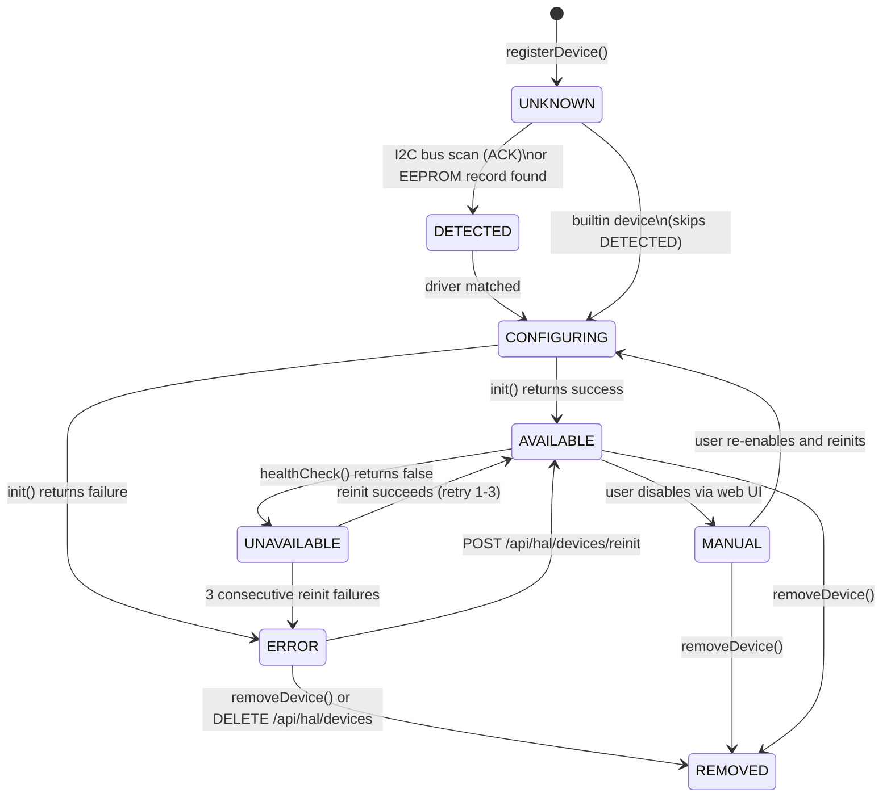
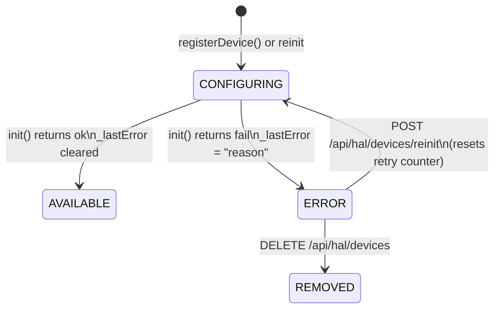

Every device managed by the HAL passes through a defined set of states from the moment its slot is allocated until it is permanently removed. Understanding these transitions is essential for writing drivers, diagnosing faults, and reasoning about when the audio pipeline will or will not use a device.

## The Eight States



| State | Value | `_ready` | Meaning |
|---|---|---|---|
| `UNKNOWN` | 0 | `false` | Slot allocated; not yet probed or initialised |
| `DETECTED` | 1 | `false` | I2C ACK or EEPROM record found; driver not yet matched |
| `CONFIGURING` | 2 | `false` | Driver matched; `init()` is running |
| `AVAILABLE` | 3 | `true` | `probe()` and `init()` succeeded; device is in service |
| `UNAVAILABLE` | 4 | `false` | `healthCheck()` failed; self-healing retry is scheduled |
| `ERROR` | 5 | `false` | `init()` failed, or retry budget exhausted |
| `MANUAL` | 6 | `false` | User-disabled via web UI |
| `REMOVED` | 7 | `false` | Device permanently gone or explicitly removed |

:::note DETECTED state
`HAL_STATE_DETECTED` is set by the discovery layer when a bus address responds but a driver has not yet been matched or created. It is informational — the device manager does not call `init()` on a device in DETECTED state. In practice most builtin devices skip this state and go directly from UNKNOWN to CONFIGURING.
:::

## Driver Contract

Every driver must implement five virtual methods. The contracts below are enforced by the manager and must not be violated.

### `probe()`

```cpp
virtual bool probe() = 0;
```

Non-destructive hardware check. For I2C devices this means sending an address byte and checking for ACK. For I2S-only devices (PCM5102A, PCM1808) there is nothing to probe on the bus, so `probe()` returns `true` unconditionally.

**Rules:**
- Must not modify device state or start I2S DMA.
- Must not call `LOG_I` in a hot path — probing many addresses at boot is already logged by the discovery layer.
- Must return `false` only if the device is definitively absent; a slow bus is not a `probe()` failure.

### `init()`

```cpp
virtual HalInitResult init() = 0;
```

Full hardware initialisation. Allocates I2S channels, writes codec registers, claims GPIO pins, and configures any peripherals the device needs. Must return a `HalInitResult` with a `DiagErrorCode` and human-readable reason on failure.

```cpp
// Successful init
return hal_init_ok();

// Failed init — use the most specific DiagErrorCode available
return hal_init_fail(DIAG_HAL_INIT_FAILED, "I2S channel create failed");
```

**Rules:**
- Read `HalDeviceManager::instance().getConfig(_slot)` first — it may contain user overrides for pins, I2C address, sample rate, etc.
- Claim every GPIO used via `HalDeviceManager::instance().claimPin(...)`. Fail fast if the claim is denied.
- `init()` may be called more than once (after `deinit()`) during the self-healing retry cycle. The driver must be idempotent.
- Do not set `_state` or `_ready` directly — the manager owns those fields.

### `deinit()`

```cpp
virtual void deinit() = 0;
```

Tear down all hardware resources acquired during `init()`. Release GPIO claims, uninstall I2S drivers, power down the chip. Must be safe to call even if `init()` never succeeded or if called multiple times.

### `dumpConfig()`

```cpp
virtual void dumpConfig() = 0;
```

Log the device's full configuration at `LOG_I` level using the `[HAL]` prefix. Called once at the end of `init()`. Include bus indices, pin numbers, sample rate, capabilities, and any driver-specific registers worth recording.

### `healthCheck()`

```cpp
virtual bool healthCheck() = 0;
```

Periodic liveness check invoked every 30 seconds by `HalDeviceManager::healthCheckAll()`. For I2C devices this is typically a single register read — if the ACK is missing the device has likely lost power or come loose. For I2S-only devices a simple `return true` is acceptable; the pipeline's own VU/noise-gate logic provides a higher-level health signal.

**Rules:**
- Must be fast — it runs on the main loop, not a dedicated task.
- Must not block waiting for DMA.
- Return `false` only on hard failure, not on momentary signal absence.

## Priority-Sorted Initialisation

`initAll()` is called once from `setup()` after all devices are registered. Devices are sorted descending by `_initPriority` before `init()` is called on any of them:

```
1000 (BUS)      → I2C/I2S bus controllers are ready first
 900 (IO)       → GPIO expanders, pin allocators
 800 (HARDWARE) → Codec, DAC, ADC chips
 600 (DATA)     → Pipeline, metering consumers
 100 (LATE)     → Diagnostics, status LED
```

If `init()` fails, the device moves to `ERROR` and its failure is emitted to the diagnostic journal. Other devices in the sorted list continue to initialise normally.

## State Change Callback Chain

The manager fires `HalStateChangeCb` immediately after every `_state` assignment, before returning from the function that caused the transition:

```
HalDeviceManager::_setState(slot, newState)
  └── _stateChangeCb(slot, oldState, newState)
        └── hal_pipeline_state_change()          [registered at boot]
              ├── AVAILABLE   → hal_pipeline_on_device_available(slot)
              ├── UNAVAILABLE → hal_pipeline_on_device_unavailable(slot)
              └── ERROR / REMOVED / MANUAL → hal_pipeline_on_device_removed(slot)
```

Only one callback is registered at a time. It is set once during `hal_pipeline_sync()` and never changed. The callback runs synchronously on whichever thread triggered the state change — always the main loop for `initAll()` and `healthCheckAll()`, and the main loop for API-triggered reinits.

### hal_pipeline_on_device_available

Assigns a pipeline sink slot (for devices with `HAL_CAP_DAC_PATH`) or an ADC lane (for devices with `HAL_CAP_ADC_PATH`) using first-fit ordinal counting across all currently mapped devices. The mapping is recorded in two flat arrays inside `hal_pipeline_bridge.cpp`:

```
_halSlotToSinkSlot[halSlot] = sinkSlot   // -1 = not a DAC device
_halSlotToAdcLane[halSlot]  = adcLane    // -1 = not an ADC device
```

For DAC/CODEC devices, `dac_activate_for_hal()` is called to connect the I2S TX pipeline. For ADC devices, `audio_pipeline_set_source()` registers the device's `AudioInputSource` descriptor. `appState.markChannelMapDirty()` triggers a WebSocket broadcast of the updated `audioChannelMap` message.

### hal_pipeline_on_device_unavailable (Hybrid Transient Policy)

:::info Transient vs Permanent
This is the most important design decision in the bridge. Getting it wrong causes audio glitches or dead channels.
:::

`UNAVAILABLE` is a **transient** state. The bridge does **not** remove the sink or ADC lane. Instead, the pipeline sees `dev->_ready == false` on its hot path and skips the device automatically. When the device recovers (see Retry section below), `_ready` flips back to `true` and audio resumes on the next DMA callback without any pipeline reconfiguration.

This matters for hardware ADCs because their I2S DMA keeps running regardless of whether the health check passes. Removing and re-registering the source would require stopping and restarting DMA — an operation that drops audio frames and briefly starves other pipeline lanes.

### hal_pipeline_on_device_removed

`ERROR`, `REMOVED`, and `MANUAL` are **permanent** states. The bridge calls `audio_pipeline_remove_sink(sinkSlot)` or `audio_pipeline_remove_source(lane)` to free the slot, clears the mapping table entry, and updates `appState.audio.activeOutputCount` / `activeInputCount`. Any amplifier devices gated by DAC availability are also re-evaluated.

```
UNAVAILABLE (transient):
  _ready = false                    ← pipeline skips, DMA keeps running
  sink slot and ADC lane preserved  ← mapping tables unchanged

ERROR / REMOVED / MANUAL (permanent):
  audio_pipeline_remove_sink(slot)  ← slot freed for next device
  audio_pipeline_remove_source(lane)
  mapping table entry cleared
  appState counts updated
  WebSocket broadcast triggered
```

## Self-Healing Retry Mechanism

When a device fails its health check it enters `UNAVAILABLE` and a `HalRetryState` is initialised:

```cpp
struct HalRetryState {
    uint8_t  count;         // 0–3 retry attempts so far
    uint32_t nextRetryMs;   // millis() timestamp when next attempt is allowed
    uint16_t lastErrorCode; // DiagErrorCode from the last failed init
};
```

`healthCheckAll()` is called on a 30-second timer from the main loop. On each call it checks every device in `UNAVAILABLE` or `ERROR` state:

1. If `retry.count >= 3` — skip; device is in permanent `ERROR`.
2. If `millis() < retry.nextRetryMs` — skip; not time yet.
3. Otherwise: call `deinit()` then `init()`.
   - **Success**: transition to `AVAILABLE`, reset retry state, emit `DIAG_HAL_REINIT_OK`.
   - **Failure**: increment `retry.count`, set `nextRetryMs` with exponential backoff (1 s, 2 s, 4 s). If count reaches 3, transition to `ERROR`, increment `_faultCount[slot]`, emit `DIAG_HAL_REINIT_EXHAUSTED`.

```
Retry timeline:
  t=0s    healthCheck() fails → UNAVAILABLE, count=0, nextRetry=t+1000
  t=1s    reinit attempt 1 fails → count=1, nextRetry=t+2000
  t=3s    reinit attempt 2 fails → count=2, nextRetry=t+4000
  t=7s    reinit attempt 3 fails → count=3, permanent ERROR
```

A device stuck in permanent `ERROR` can be manually recovered via `POST /api/hal/devices/reinit` from the web UI, which resets the retry counter and runs `init()` again.

## Volatile Cross-Core Safety

The audio pipeline task runs on Core 1 at priority 3. It reads `dev->_ready` on every DMA callback — potentially hundreds of times per second. The device manager and all lifecycle methods run on Core 1's main loop task at priority 1 (or Core 0 for MQTT/GUI tasks).

`_ready` and `_state` are declared `volatile` on `HalDevice`:

```cpp
volatile bool           _ready;
volatile HalDeviceState _state;
```

`volatile` prevents the compiler from caching these values in a register across loop iterations. On the Xtensa LX7 (ESP32-P4), single-byte writes are naturally atomic, so the audio task will never read a partially-written value.

:::warning No lock-free multi-field atomic
`volatile` only guarantees that each individual field is not cached. There is a brief window between `_ready = false` and `_state = HAL_STATE_UNAVAILABLE` where the values are inconsistent. The pipeline only reads `_ready`, not `_state`, so this window is harmless for audio. Do not add new pipeline hot-path reads of `_state` without considering this.
:::

## I2S Driver Safety During Reinit

If a DAC device's `deinit()` uninstalls the I2S driver (e.g. `i2s_driver_uninstall()`), the audio task must not be calling `i2s_read()` concurrently. The DAC module handles this via a binary semaphore handshake using `appState.audioPaused` and `appState.audioTaskPausedAck`:

```
DAC deinit path:
  appState.audioPaused = true
  xSemaphoreTake(appState.audioTaskPausedAck, pdMS_TO_TICKS(50))
  i2s_driver_uninstall(...)

Audio task (Core 1):
  if (appState.audioPaused) {
      xSemaphoreGive(appState.audioTaskPausedAck)
      vTaskDelay(1)
      continue  // skip this DMA cycle
  }
```

The 50 ms timeout in `xSemaphoreTake` ensures the main loop is not stuck waiting forever if the audio task has already exited due to a prior crash.

## Deferred Device Toggle Queue

`HalCoordState` (in `src/state/hal_coord_state.h`) provides a thread-safe fixed-size queue for deferring device enable/disable requests to the main loop:

```cpp
// Enqueue an enable or disable for any HAL device type (DAC, ADC, codec, etc.).
// halSlot: the device slot index (0xFF = invalid).
// action:  1 = enable, -1 = disable.
// Returns false on overflow or invalid arguments — all 6 callers check this value.
bool ok = appState.halCoord.requestDeviceToggle(halSlot, 1);

// Main loop drains the queue after each app_events_wait() cycle:
if (appState.halCoord.hasPendingToggles()) {
    for (uint8_t i = 0; i < appState.halCoord.pendingToggleCount(); i++) {
        auto t = appState.halCoord.pendingToggleAt(i);
        // dispatch dac_activate_for_hal() or dac_deactivate_for_hal()
    }
    appState.halCoord.clearPendingToggles();
}
```

**Same-slot deduplication**: if a request for the same `halSlot` is already in the queue, the new `action` overwrites it rather than adding a second entry. The queue capacity is 8, which is sufficient given this dedup behaviour.

**Overflow telemetry**: when the queue is full, `requestDeviceToggle()` increments `_overflowCount` (a lifetime counter) and sets `_overflowFlag` (one-shot). The main loop calls `consumeOverflowFlag()` to atomically read-and-clear the flag and emits `DIAG_HAL_TOGGLE_OVERFLOW` (0x100E) on first overflow per drain cycle. REST API endpoints that enqueue toggles return HTTP 503 on `requestDeviceToggle()` failure; WebSocket and internal callers emit `LOG_W`.

## Multi-Source Device Registration

Some HAL devices expose more than one stereo audio input pair (e.g., ES9843PRO, which is a 4-channel TDM device). The pipeline bridge handles these via two virtual methods on `HalAudioDevice`:

```cpp
// Return number of AudioInputSource descriptors this device provides.
// Returns 1 for all 2ch I2S devices; 2 for 4ch TDM devices (two stereo pairs).
virtual uint8_t getInputSourceCount() const;

// Return the AudioInputSource descriptor for the given index (0-based).
virtual const AudioInputSource* getInputSourceAt(uint8_t idx) const;
```

The bridge tracks how many consecutive input lanes each HAL slot occupies using `_halSlotAdcLaneCount[]`. For a 4-channel TDM device like ES9843PRO, `getInputSourceCount()` returns 2, so the bridge allocates two consecutive lanes and populates both. `hal_pipeline_get_input_lane_count(halSlot)` returns this count; `hal_pipeline_get_input_lane(halSlot)` returns the base lane.

## Probe Failure and Recovery

When a device fails to initialise, the manager stores the failure reason in the device's `_lastError` field so that the API, WebSocket, and web UI can surface it without requiring the user to dig into serial logs.

### How errors are stored

`HalDevice` holds a 48-byte character array for the most recent failure reason:

```cpp
char _lastError[48];  // set by init() via setLastError(); cleared on successful init
```

Drivers set the error via `hal_init_fail()`:

```cpp
return hal_init_fail(DIAG_HAL_INIT_FAILED, "I2C write to reg 0x00 NAKed");
```

`hal_init_fail()` both constructs the `HalInitResult` and copies the reason string into `_lastError` via `hal_safe_strcpy()`. On a successful `init()` call the manager clears `_lastError` before returning.

### Error propagation path

```
init() returns hal_init_fail(code, "reason")
  └── _lastError = "reason"          [stored on HalDevice]
  └── diag_emit(code, ...)           [diagnostic journal entry]
        └── GET /api/diagnostics/journal  [REST — all journal entries]
  └── state → ERROR
        └── POST /api/hal/devices/reinit → "error" field in response [REST]
        └── sendHalDeviceState() → "errorReason" field in WS broadcast [WebSocket]
              └── Device card inline error banner [Web UI]
              └── Debug Console — HAL and DIAG module chips
```

### State diagram: init failure and recovery



### Diagnostic codes for init failures

| Code | Constant | Trigger |
|------|----------|---------|
| 0x1001 | `DIAG_HAL_INIT_FAILED` | `init()` returned a non-ok result |
| 0x1002 | `DIAG_HAL_PROBE_FAILED` | `probe()` returned false during discovery |
| 0x1009 | `DIAG_HAL_REINIT_EXHAUSTED` | 3 consecutive self-healing failures |

All three codes appear in the web UI Health Dashboard and are accessible via `GET /api/diagnostics/journal`. The journal entry carries the same human-readable reason string stored in `_lastError`.

:::tip Reading the error banner
When a device card in the HAL Devices panel shows an orange error banner, hover over or tap the **Details** link to see the exact reason text. Typical reasons are I2C NAK (wrong address or device absent), I2S channel create failure (pin already claimed), or GPIO claim conflict.
:::

---

## Diagnostic Journal Integration

Every significant lifecycle transition emits an event to the diagnostic journal via `diag_emit()`:

| Event | Code | Severity | Trigger |
|---|---|---|---|
| `DIAG_HAL_DEVICE_DETECTED` | 0x100D | INFO | `registerDevice()` |
| `DIAG_HAL_INIT_FAILED` | 0x1001 | ERROR | `init()` returns failure — reason stored in `_lastError` |
| `DIAG_HAL_PROBE_FAILED` | 0x1002 | ERROR | `probe()` returns false during discovery |
| `DIAG_HAL_HEALTH_FAIL` | 0x1005 | WARN | `healthCheck()` returns false |
| `DIAG_HAL_REINIT_OK` | 0x1008 | INFO | Self-healing reinit succeeds |
| `DIAG_HAL_REINIT_EXHAUSTED` | 0x1009 | CRIT | 3 consecutive reinit failures |
| `DIAG_HAL_DEVICE_REMOVED` | 0x1007 | WARN | `removeDevice()` |
| `DIAG_HAL_TOGGLE_OVERFLOW` | 0x100E | WARN | Toggle queue full (capacity 8) |
| `DIAG_HAL_REGISTRY_FULL` | 0x100F | WARN | Driver registry at capacity |
| `DIAG_HAL_DB_FULL` | 0x1010 | WARN | Device DB at capacity |
| `DIAG_HAL_I2C_BUS_CONFLICT` | 0x1101 | WARN | Bus 0 scan skipped (WiFi SDIO active) |

These events appear in the Health Dashboard in the web UI and are accessible via `GET /api/diag/events`.

---

## HAL Config Persistence and Atomic Write Protection

Per-device runtime configuration (`HalDeviceConfig` — volume, mute, pin overrides, I2S port, etc.) is persisted to `/hal_config.json` on LittleFS. Since power can be lost during a write, the manager uses a tmp-then-rename atomic write pattern to prevent configuration corruption.

### Write sequence

```
1. Serialise full HalDeviceConfig array to JSON
2. Write payload to /hal_config.json.tmp   (HAL_CONFIG_TMP_PATH)
3. Rename /hal_config.json.tmp → /hal_config.json
```

The rename is atomic at the LittleFS layer. If power is lost between steps 2 and 3, the `.tmp` file exists but `/hal_config.json` is still the previous intact copy. If power is lost during step 2, the `.tmp` file is partially written but `/hal_config.json` is unchanged.

### Boot recovery

`hal_settings_load()` runs at boot before any device init. If `/hal_config.json` is absent but `/hal_config.json.tmp` exists, the manager promotes the `.tmp` file:

```
/hal_config.json.tmp found, /hal_config.json absent
  → rename /hal_config.json.tmp → /hal_config.json
  → load normally
```

This recovery path handles the rare case where a rename succeeded at the OS level but the device rebooted before the directory entry was flushed to flash.

:::info Constant reference
`HAL_CONFIG_TMP_PATH` is defined in `src/hal/hal_settings.h` as `"/hal_config.json.tmp"`. Use this constant when writing tests or tools that need to reference the temp path.
:::
