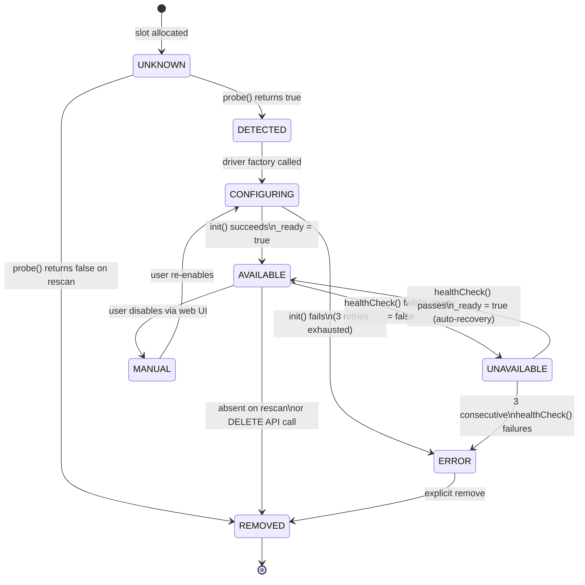
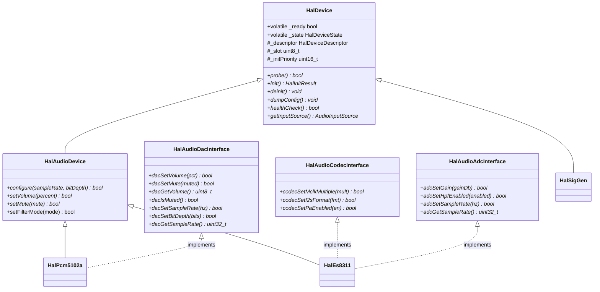

This guide walks through every step required to add a new hardware device to the ALX Nova HAL framework — from the C++ class all the way through driver registration, the device database, and the unit test module. The [PCM5102A DAC driver](https://github.com/your-org/ALX_Nova_Controller_2/blob/main/src/hal/hal_pcm5102a.cpp) is used throughout as a concrete reference because it is deliberately simple: no I2C, no complex init sequence, just clean structure that shows the pattern without noise.

## Device Lifecycle

Every HAL-managed device passes through a well-defined state machine. The `HalDeviceManager` drives all transitions; driver code only sets `_state` and `_ready` directly inside `init()`, `deinit()`, and `healthCheck()`.



:::info Volatile hot-path fields
`_ready` and `_state` are declared `volatile`. The audio pipeline on Core 1 reads `_ready` in the hot path without a mutex — `volatile` ensures the compiler does not cache the value in a register across DMA interrupt boundaries. Never add a mutex to this read path.
:::

### Hybrid transient policy

The distinction between UNAVAILABLE and the terminal states (ERROR, REMOVED, MANUAL) is intentional:

- **UNAVAILABLE** — Only sets `_ready = false`. The pipeline bridge keeps the sink/source slot assigned. The device can self-recover on the next health check without any pipeline reconfiguration.
- **ERROR / REMOVED / MANUAL** — The pipeline bridge calls `audio_pipeline_remove_sink(slot)` or `audio_pipeline_remove_source(lane)`, freeing the slot entirely. Re-enabling requires a full re-init and a new slot assignment.

## Class Hierarchy



Choose your base class:

| Base class | When to use |
|---|---|
| `HalDevice` | Non-audio devices: GPIO peripherals, sensors, encoders, display, software sources (SigGen, USB audio) |
| `HalAudioDevice` | Audio output or input hardware that needs `configure()`, `setVolume()`, `setMute()` |
| `HalAudioDevice` + `HalAudioDacInterface` | DAC-only output device (PCM5102A, MCP4725) |
| `HalAudioDevice` + `HalAudioCodecInterface` | Combined codec with both DAC and ADC paths (ES8311) |
| `HalEssSabreAdcBase` | ESS SABRE ADC expansion devices — provides shared I2C helpers, `_applyConfigOverrides()`, `_selectWire()`. Inherits `HalAudioDevice` + `HalAudioAdcInterface`. |

## Step-by-Step: Adding a New Driver

### Step 1 — Create the header

Place the header in `src/hal/`. Follow the naming convention `hal_<model>.h`. Wrap the entire file in `#ifdef DAC_ENABLED` unless the device is always present regardless of the DAC build flag.

```cpp
#pragma once
#ifdef DAC_ENABLED
// HalMyDac — MyDac I2S DAC driver (HAL_DEV_DAC)
// Compatible string: "myvendor,mydac"

#include "hal_audio_device.h"
#include "hal_audio_interfaces.h"
#include "hal_types.h"

class HalMyDac : public HalAudioDevice, public HalAudioDacInterface {
public:
    HalMyDac();
    virtual ~HalMyDac() {}

    // HalDevice lifecycle — all five methods are required
    bool          probe()       override;
    HalInitResult init()        override;
    void          deinit()      override;
    void          dumpConfig()  override;
    bool          healthCheck() override;

    // HalAudioDevice
    bool configure(uint32_t sampleRate, uint8_t bitDepth) override;
    bool setVolume(uint8_t percent) override;
    bool setMute(bool mute) override;

    // HalAudioDacInterface — delegate to the methods above
    bool     dacSetVolume(uint8_t pct) override  { return setVolume(pct); }
    bool     dacSetMute(bool m) override          { return setMute(m); }
    uint8_t  dacGetVolume() const override        { return _volume; }
    bool     dacIsMuted() const override          { return _muted; }
    bool     dacSetSampleRate(uint32_t hz) override;
    bool     dacSetBitDepth(uint8_t bits) override;
    uint32_t dacGetSampleRate() const override    { return _sampleRate; }

private:
    uint8_t  _volume     = 100;
    bool     _muted      = false;
    uint32_t _sampleRate = 48000;
    uint8_t  _bitDepth   = 32;
    int8_t   _paPin      = -1;   // Optional mute/PA GPIO
};
#endif // DAC_ENABLED
```

:::tip Compatible string format
Use the Linux Device Tree `"vendor,model"` convention. Vendor prefixes used in this codebase: `ti` (Texas Instruments), `everest-semi` (Everest Semi), `espressif`, `microchip`, `alx` (internal software devices), `generic` (no-brand peripherals).

The compatible string is the primary key for driver lookup — it must be unique across all registered drivers and match exactly (case-sensitive) in the device database and the registry entry.
:::

### Step 2 — Implement the source file

Place the implementation in `src/hal/hal_<model>.cpp`. Use `#ifndef NATIVE_TEST` guards around every Arduino or IDF hardware call. These guards let the file compile cleanly in the native test environment.

```cpp
#ifdef DAC_ENABLED
#include "hal_mydac.h"
#include "hal_device_manager.h"

// Hardware headers are excluded from native test builds
#ifndef NATIVE_TEST
#  include <Arduino.h>
#  include "../debug_serial.h"
#else
#  define LOG_I(fmt, ...) ((void)0)
#  define LOG_W(fmt, ...) ((void)0)
#  define LOG_E(fmt, ...) ((void)0)
#  ifndef OUTPUT
#    define OUTPUT 1
#    define LOW    0
#    define HIGH   1
static void pinMode(int, int) {}
static void digitalWrite(int, int) {}
#  endif
#endif

// Constructor — populate the descriptor, set priority
HalMyDac::HalMyDac() : HalAudioDevice() {
    memset(&_descriptor, 0, sizeof(_descriptor));
    strncpy(_descriptor.compatible,    "myvendor,mydac",   31);
    strncpy(_descriptor.name,          "MyDac",            32);
    strncpy(_descriptor.manufacturer,  "My Vendor Inc.",   32);
    _descriptor.type             = HAL_DEV_DAC;
    _descriptor.legacyId         = 0;      // No legacy DAC_ID — new device
    _descriptor.channelCount     = 2;
    _descriptor.bus.type         = HAL_BUS_I2S;
    _descriptor.bus.index        = 0;
    _descriptor.sampleRatesMask  = HAL_RATE_44K1 | HAL_RATE_48K | HAL_RATE_96K;
    _descriptor.capabilities     = HAL_CAP_DAC_PATH | HAL_CAP_MUTE;
    _initPriority                = HAL_PRIORITY_HARDWARE;
}

// probe() — non-destructive presence check
// I2S-only devices always return true. I2C devices send a single-byte read
// and check for ACK. Keep this fast: no register writes, no delays.
bool HalMyDac::probe() {
    // Passive I2S-only device — no way to verify presence; assume connected.
    return true;
}

// init() — full hardware initialisation, called once after probe() succeeds
HalInitResult HalMyDac::init() {
    // Read user configuration from the device manager (persisted in /hal_config.json)
    HalDeviceConfig* cfg = HalDeviceManager::instance().getConfig(_slot);
    if (cfg && cfg->valid) {
        if (cfg->paControlPin >= 0) _paPin      = cfg->paControlPin;
        if (cfg->sampleRate   > 0)  _sampleRate = cfg->sampleRate;
        if (cfg->bitDepth     > 0)  _bitDepth   = cfg->bitDepth;
        _volume = cfg->volume;
        _muted  = cfg->mute;
    }

    LOG_I("[HAL:MyDac] Initializing (sr=%luHz bits=%u paPin=%d)",
          (unsigned long)_sampleRate, _bitDepth, _paPin);

    // Configure optional mute pin
    if (_paPin >= 0) {
#ifndef NATIVE_TEST
        pinMode(_paPin, OUTPUT);
        digitalWrite(_paPin, _muted ? LOW : HIGH);
#endif
    }

    // Mark device as ready
    _state = HAL_STATE_AVAILABLE;
    _ready = true;
    LOG_I("[HAL:MyDac] Ready");
    return hal_init_ok();
}

// deinit() — release hardware resources, safe to call multiple times
void HalMyDac::deinit() {
    if (_paPin >= 0) {
#ifndef NATIVE_TEST
        digitalWrite(_paPin, LOW);   // Drive output mute on shutdown
#endif
    }
    _ready = false;
    _state = HAL_STATE_REMOVED;
    LOG_I("[HAL:MyDac] Deinitialized");
}

// dumpConfig() — LOG_I full descriptor at boot (called by device manager)
void HalMyDac::dumpConfig() {
    LOG_I("[HAL:MyDac] %s by %s (compat=%s) sr=%luHz bits=%u paPin=%d vol=%d%% mute=%d",
          _descriptor.name, _descriptor.manufacturer, _descriptor.compatible,
          (unsigned long)_sampleRate, _bitDepth, _paPin, _volume, _muted);
}

// healthCheck() — called every 30 s. Return false to trigger UNAVAILABLE.
// I2S-only devices have no bus to ping — base health on the ready flag.
// I2C devices should send a register read and return false on NACK.
bool HalMyDac::healthCheck() {
    return _ready;
}

bool HalMyDac::configure(uint32_t sampleRate, uint8_t bitDepth) {
    bool validRate = (sampleRate == 44100 || sampleRate == 48000 || sampleRate == 96000);
    if (!validRate) {
        LOG_W("[HAL:MyDac] Unsupported sample rate: %luHz", (unsigned long)sampleRate);
        return false;
    }
    if (bitDepth != 16 && bitDepth != 24 && bitDepth != 32) {
        LOG_W("[HAL:MyDac] Unsupported bit depth: %u", bitDepth);
        return false;
    }
    _sampleRate = sampleRate;
    _bitDepth   = bitDepth;
    LOG_I("[HAL:MyDac] Configured: %luHz %ubit", (unsigned long)sampleRate, bitDepth);
    return true;
}

bool HalMyDac::setVolume(uint8_t percent) {
    _volume = percent;
    // Return false if the device has no hardware volume register —
    // the pipeline will apply software gain instead.
    return false;
}

bool HalMyDac::setMute(bool mute) {
    _muted = mute;
    if (_paPin >= 0) {
#ifndef NATIVE_TEST
        digitalWrite(_paPin, mute ? LOW : HIGH);
#endif
        return true;
    }
    return false;  // Muting handled by zeroing I2S output in pipeline
}

bool HalMyDac::dacSetSampleRate(uint32_t hz)    { return configure(hz, _bitDepth); }
bool HalMyDac::dacSetBitDepth(uint8_t bits)     { return configure(_sampleRate, bits); }

#endif // DAC_ENABLED
```

#### Returning errors from init()

Use `hal_init_fail()` with a diagnostic error code when init cannot proceed:

```cpp
#include "../diag_error_codes.h"

HalInitResult HalMyDac::init() {
#ifndef NATIVE_TEST
    if (!Wire.begin()) {
        return hal_init_fail(DIAG_ERR_I2C_BUS, "I2C bus init failed");
    }
    // ... attempt chip ID read ...
    if (chipId != EXPECTED_CHIP_ID) {
        return hal_init_fail(DIAG_ERR_DEVICE_NOT_FOUND, "Unexpected chip ID");
    }
#endif
    _state = HAL_STATE_AVAILABLE;
    _ready = true;
    return hal_init_ok();
}
```

#### Using `hal_init_descriptor()` to reduce boilerplate

Instead of manually setting each `_descriptor` field with `memset`/`strncpy`, use the `hal_init_descriptor()` inline helper (defined in `hal_types.h`). This replaces 10+ lines of constructor boilerplate with a single call:

**Before** (manual):

```cpp
HalMyDac::HalMyDac() : HalAudioDevice() {
    memset(&_descriptor, 0, sizeof(_descriptor));
    strncpy(_descriptor.compatible,   "myvendor,mydac",   31);
    strncpy(_descriptor.name,         "MyDac",            32);
    strncpy(_descriptor.manufacturer, "My Vendor Inc.",   32);
    _descriptor.type             = HAL_DEV_DAC;
    _descriptor.channelCount     = 2;
    _descriptor.bus.type         = HAL_BUS_I2S;
    _descriptor.bus.index        = 0;
    _descriptor.sampleRatesMask  = HAL_RATE_44K1 | HAL_RATE_48K | HAL_RATE_96K;
    _descriptor.capabilities     = HAL_CAP_DAC_PATH | HAL_CAP_MUTE;
    _initPriority                = HAL_PRIORITY_HARDWARE;
}
```

**After** (using helper):

```cpp
HalMyDac::HalMyDac() : HalAudioDevice() {
    hal_init_descriptor(_descriptor,
        "myvendor,mydac", "MyDac", "My Vendor Inc.",
        HAL_DEV_DAC, 2, 0x00,
        HAL_BUS_I2S, 0,
        HAL_RATE_44K1 | HAL_RATE_48K | HAL_RATE_96K,
        HAL_CAP_DAC_PATH | HAL_CAP_MUTE);
    _initPriority = HAL_PRIORITY_HARDWARE;
}
```

All existing drivers in the codebase use this helper. The parameters are: `(descriptor, compatible, name, manufacturer, type, channels, i2cAddr, busType, busIndex, ratesMask, caps)`.

### Step 3 — Register the factory in hal_builtin_devices.cpp

Open `src/hal/hal_builtin_devices.cpp` and add your driver in two places:

**1. Include the header** at the top with the other driver includes:

```cpp
#include "hal_mydac.h"
```

**2. Add a factory function** near the top of the file:

```cpp
static HalDevice* factory_mydac() { return new HalMyDac(); }
```

**3. Register the entry** inside `hal_register_builtins()` using the `HAL_REGISTER()` macro:

```cpp
HAL_REGISTER("myvendor,mydac", HAL_DEV_DAC, 0, factory_mydac);
```

The macro wraps the boilerplate of creating a `HalDriverEntry`, filling its fields, and calling `hal_registry_register()` with error logging. The four arguments are: compatible string, device type, legacy ID (0 for new devices), and factory function pointer.

The `HalDriverEntry.compatible` field is the lookup key used during 3-tier discovery (I2C bus scan → EEPROM probe → manual config). It must match the string set in your constructor's `_descriptor.compatible` field exactly.

:::caution Registry capacity
`HAL_MAX_DRIVERS` is 32. All callers of `hal_registry_register()` check the return value and emit `LOG_W` on failure. If the registry is full, the registration is silently dropped and the device will not be discoverable. Check `HAL_MAX_DRIVERS` in `src/hal/hal_types.h` if you need to increase the limit.
:::

### Step 4 — Add an entry to the device database

The device database (`src/hal/hal_device_db.cpp`) provides the web UI with device metadata before a device is physically discovered. Add a builtin entry in `hal_provision_defaults()` or `hal_db_init()`:

```cpp
// In hal_provision_defaults() or the builtin array initializer:
{
    HalDeviceDescriptor d;
    memset(&d, 0, sizeof(d));
    strncpy(d.compatible,   "myvendor,mydac",   31);
    strncpy(d.name,         "MyDac",            32);
    strncpy(d.manufacturer, "My Vendor Inc.",   32);
    d.type            = HAL_DEV_DAC;
    d.channelCount    = 2;
    d.bus.type        = HAL_BUS_I2S;
    d.sampleRatesMask = HAL_RATE_44K1 | HAL_RATE_48K | HAL_RATE_96K;
    d.capabilities    = HAL_CAP_DAC_PATH | HAL_CAP_MUTE;
    hal_db_add(&d);
}
```

The DB entry provides metadata for the `GET /api/hal/db/presets` endpoint so the web UI can populate the "Add device" dialog without needing the hardware to be physically present.

### Step 5 — Write the unit test module

Create a new directory `test/test_hal_mydac/` and add `test_hal_mydac.cpp`. The test file must include `unity.h` and declare `setUp`, `tearDown`, and `main`.

```cpp
// test/test_hal_mydac/test_hal_mydac.cpp
#include "unity.h"

// Pull in the driver under test. The NATIVE_TEST guard in the .cpp file
// ensures all Arduino/IDF calls are replaced with no-op stubs.
#define DAC_ENABLED
#define NATIVE_TEST
#include "../../src/hal/hal_mydac.h"
#include "../../src/hal/hal_mydac.cpp"

static HalMyDac* dut = nullptr;

void setUp() {
    dut = new HalMyDac();
}

void tearDown() {
    delete dut;
    dut = nullptr;
}

// --- Descriptor tests ---

void test_descriptor_compatible() {
    TEST_ASSERT_EQUAL_STRING("myvendor,mydac",
                             dut->getDescriptor().compatible);
}

void test_descriptor_type_is_dac() {
    TEST_ASSERT_EQUAL_INT(HAL_DEV_DAC, dut->getDescriptor().type);
}

void test_capabilities_include_dac_path() {
    TEST_ASSERT_TRUE(dut->getDescriptor().capabilities & HAL_CAP_DAC_PATH);
}

// --- Lifecycle tests ---

void test_probe_returns_true() {
    TEST_ASSERT_TRUE(dut->probe());
}

void test_init_sets_ready() {
    HalInitResult r = dut->init();
    TEST_ASSERT_TRUE(r.success);
    TEST_ASSERT_TRUE(dut->_ready);
}

void test_init_state_is_available() {
    dut->init();
    TEST_ASSERT_EQUAL_INT(HAL_STATE_AVAILABLE, (int)dut->_state);
}

void test_deinit_clears_ready() {
    dut->init();
    dut->deinit();
    TEST_ASSERT_FALSE(dut->_ready);
}

void test_deinit_state_is_removed() {
    dut->init();
    dut->deinit();
    TEST_ASSERT_EQUAL_INT(HAL_STATE_REMOVED, (int)dut->_state);
}

// --- Audio configuration tests ---

void test_configure_valid_sample_rate() {
    TEST_ASSERT_TRUE(dut->configure(48000, 32));
}

void test_configure_rejects_invalid_rate() {
    TEST_ASSERT_FALSE(dut->configure(22050, 32));
}

void test_configure_rejects_invalid_bit_depth() {
    TEST_ASSERT_FALSE(dut->configure(48000, 8));
}

void test_set_volume_stores_value() {
    dut->setVolume(75);
    TEST_ASSERT_EQUAL_UINT8(75, dut->dacGetVolume());
}

void test_set_mute_stores_value() {
    dut->setMute(true);
    TEST_ASSERT_TRUE(dut->dacIsMuted());
    dut->setMute(false);
    TEST_ASSERT_FALSE(dut->dacIsMuted());
}

// --- Health check ---

void test_health_check_after_init() {
    dut->init();
    TEST_ASSERT_TRUE(dut->healthCheck());
}

void test_health_check_before_init() {
    // _ready starts false — should fail before init
    TEST_ASSERT_FALSE(dut->healthCheck());
}

int main(int argc, char** argv) {
    UNITY_BEGIN();

    RUN_TEST(test_descriptor_compatible);
    RUN_TEST(test_descriptor_type_is_dac);
    RUN_TEST(test_capabilities_include_dac_path);
    RUN_TEST(test_probe_returns_true);
    RUN_TEST(test_init_sets_ready);
    RUN_TEST(test_init_state_is_available);
    RUN_TEST(test_deinit_clears_ready);
    RUN_TEST(test_deinit_state_is_removed);
    RUN_TEST(test_configure_valid_sample_rate);
    RUN_TEST(test_configure_rejects_invalid_rate);
    RUN_TEST(test_configure_rejects_invalid_bit_depth);
    RUN_TEST(test_set_volume_stores_value);
    RUN_TEST(test_set_mute_stores_value);
    RUN_TEST(test_health_check_after_init);
    RUN_TEST(test_health_check_before_init);

    return UNITY_END();
}
```

Run the new module in isolation:

```bash
pio test -e native -f test_hal_mydac
```

Run the full suite to confirm nothing regressed:

```bash
pio test -e native
```

## Descriptor Fields Reference

All fields live in `HalDeviceDescriptor` (defined in `src/hal/hal_types.h`). Set them in the constructor and never modify them after init.

| Field | Type | Description |
|---|---|---|
| `compatible` | `char[32]` | Primary lookup key. Format: `"vendor,model"`. Must be unique. |
| `name` | `char[33]` | Human-readable name shown in the web UI device list. |
| `manufacturer` | `char[33]` | Company name for `dumpConfig()` output. |
| `type` | `HalDeviceType` | Device category. See table below. |
| `legacyId` | `uint16_t` | Backward-compat `DAC_ID_*` constant. Set to `0` for new devices. |
| `channelCount` | `uint8_t` | Number of audio channels (1 for mono, 2 for stereo). |
| `bus.type` | `HalBusType` | `HAL_BUS_I2C`, `HAL_BUS_I2S`, `HAL_BUS_GPIO`, `HAL_BUS_INTERNAL`. |
| `bus.index` | `uint8_t` | Bus instance index (I2C: 0=ext, 1=onboard, 2=expansion). |
| `i2cAddr` | `uint8_t` | 7-bit I2C address (0 = not applicable). |
| `sampleRatesMask` | `uint32_t` | Bitmask of supported rates. See `HAL_RATE_*` constants. |
| `capabilities` | `uint16_t` | Bitmask of `HAL_CAP_*` flags (see below). |
| `instanceId` | `uint8_t` | Auto-assigned by device manager. Do not set in constructor. |
| `maxInstances` | `uint8_t` | Maximum concurrent instances of this compatible string (0 = type default). |

### Device types

| Constant | Value | Use for |
|---|---|---|
| `HAL_DEV_DAC` | 1 | Audio output: I2S DAC, I2C voltage-output DAC |
| `HAL_DEV_ADC` | 2 | Audio input: I2S ADC, software source (SigGen, USB audio) |
| `HAL_DEV_CODEC` | 3 | Combined DAC+ADC (e.g. ES8311) |
| `HAL_DEV_AMP` | 4 | Amplifier with GPIO enable/disable |
| `HAL_DEV_DSP` | 5 | External or software DSP bridge |
| `HAL_DEV_SENSOR` | 6 | Temperature, current, or other measurement device |
| `HAL_DEV_DISPLAY` | 7 | TFT or OLED display |
| `HAL_DEV_INPUT` | 8 | Rotary encoder, button |
| `HAL_DEV_GPIO` | 9 | Generic GPIO peripheral: LED, buzzer, relay, signal gen PWM |

### Capability flags

| Flag | Bit | Meaning |
|---|---|---|
| `HAL_CAP_HW_VOLUME` | 0 | Device has hardware register volume control |
| `HAL_CAP_FILTERS` | 1 | Device supports onboard digital filters |
| `HAL_CAP_MUTE` | 2 | Device supports hardware mute (pin or register) |
| `HAL_CAP_ADC_PATH` | 3 | Device provides an audio input lane to the pipeline |
| `HAL_CAP_DAC_PATH` | 4 | Device provides an audio output sink to the pipeline |
| `HAL_CAP_PGA_CONTROL` | 5 | ADC has programmable gain |
| `HAL_CAP_HPF_CONTROL` | 6 | ADC has high-pass filter control |
| `HAL_CAP_CODEC` | 7 | Device has both ADC and DAC paths |
| `HAL_CAP_MQA` | 8 | MQA decoder support |
| `HAL_CAP_LINE_DRIVER` | 9 | Line driver outputs |
| `HAL_CAP_APLL` | 10 | Asynchronous PLL |
| `HAL_CAP_DSD` | 11 | DSD native playback |

:::note
The `capabilities` field is `uint16_t` (widened from the original `uint8_t` to accommodate bits 8-11). Defined in `src/hal/hal_types.h`.
:::

The pipeline bridge uses `HAL_CAP_DAC_PATH` and `HAL_CAP_ADC_PATH` to decide whether to register the device as an output sink or an input source when it transitions to AVAILABLE. Getting these flags wrong means the device will not appear in the audio routing matrix.

### Sample rate mask

Combine `HAL_RATE_*` constants with `|`:

| Constant | Rate |
|---|---|
| `HAL_RATE_8K` | 8 000 Hz |
| `HAL_RATE_16K` | 16 000 Hz |
| `HAL_RATE_44K1` | 44 100 Hz |
| `HAL_RATE_48K` | 48 000 Hz |
| `HAL_RATE_96K` | 96 000 Hz |
| `HAL_RATE_192K` | 192 000 Hz |
| `HAL_RATE_384K` | 384 000 Hz |
| `HAL_RATE_768K` | 768 000 Hz |

## Configuration Persistence

At runtime the device manager stores a `HalDeviceConfig` struct for each slot. Configs are loaded from `/hal_config.json` on boot and saved whenever the user edits settings in the web UI. Read them in `init()` using the slot index:

```cpp
HalDeviceConfig* cfg = HalDeviceManager::instance().getConfig(_slot);
if (cfg && cfg->valid) {
    // Apply user overrides before hardware init
    if (cfg->sampleRate > 0) _sampleRate = cfg->sampleRate;
    if (cfg->bitDepth   > 0) _bitDepth   = cfg->bitDepth;
    if (cfg->volume         ) _volume     = cfg->volume;
    _muted = cfg->mute;
}
```

Always guard the config read with `cfg && cfg->valid`. On first boot the config file does not exist and `cfg->valid` will be false — the driver must have sensible defaults in its member initializers.

Relevant `HalDeviceConfig` fields:

| Field | Type | Description |
|---|---|---|
| `valid` | `bool` | True only if the config has been saved at least once |
| `i2cAddr` | `uint8_t` | Override I2C address (0 = use descriptor default) |
| `i2cBusIndex` | `uint8_t` | I2C bus index override (0/1/2) |
| `i2cSpeedHz` | `uint32_t` | I2C clock rate (0 = use default 400 kHz) |
| `pinSda` | `int8_t` | SDA pin override (-1 = use descriptor/default) |
| `pinScl` | `int8_t` | SCL pin override (-1 = use descriptor/default) |
| `pinMclk` | `int8_t` | I2S MCLK pin override (-1 = board default) |
| `pinData` | `int8_t` | I2S data pin override (-1 = board default) |
| `pinBck` | `int8_t` | I2S bit clock pin override (-1 = board default) |
| `pinLrc` | `int8_t` | I2S word select / LRCLK pin override |
| `paControlPin` | `int8_t` | Power amplifier / mute GPIO (-1 = not wired) |
| `i2sPort` | `uint8_t` | I2S peripheral index (0, 1, or 2; 255 = default) |
| `sampleRate` | `uint32_t` | Preferred sample rate (0 = driver default) |
| `bitDepth` | `uint8_t` | Preferred bit depth (0 = driver default) |
| `volume` | `uint8_t` | Initial volume 0-100 |
| `mute` | `bool` | Initial mute state |
| `enabled` | `bool` | User enable/disable toggle |
| `userLabel` | `char[33]` | Custom display name shown in the web UI |
| `gpioA/B/C` | `int8_t` | Generic GPIO overrides for non-audio peripherals |
| `pgaGain` | `uint8_t` | PGA gain in dB for ADC devices |
| `hpfEnabled` | `bool` | High-pass filter enable for ADC devices |

## Init Priority

The device manager initialises all registered devices in descending priority order. Set `_initPriority` in the constructor:

| Constant | Value | Use when |
|---|---|---|
| `HAL_PRIORITY_BUS` | 1000 | I2C/I2S/SPI bus controller setup |
| `HAL_PRIORITY_IO` | 900 | GPIO expanders, pin allocation helpers |
| `HAL_PRIORITY_HARDWARE` | 800 | Audio DAC, ADC, codec — most drivers go here |
| `HAL_PRIORITY_DATA` | 600 | Pipeline bridges, metering |
| `HAL_PRIORITY_LATE` | 100 | Diagnostics, logging sinks |

Audio hardware drivers should almost always use `HAL_PRIORITY_HARDWARE`. Only use `HAL_PRIORITY_BUS` if your driver configures a shared bus that other drivers depend on.

## Audio Input Sources (ADC-type Devices)

If your device feeds audio into the pipeline (type `HAL_DEV_ADC` or capability `HAL_CAP_ADC_PATH`), override `getInputSource()` to expose an `AudioInputSource` descriptor. The pipeline bridge calls this method when the device transitions to AVAILABLE and registers the source with `audio_pipeline_set_source()`.

```cpp
// In the header:
class HalMyAdc : public HalDevice {
public:
    const AudioInputSource* getInputSource() const override;
    // ...
private:
    AudioInputSource _source;
};

// In the constructor, populate _source:
HalMyAdc::HalMyAdc() : HalDevice() {
    // ...
    _source = AUDIO_INPUT_SOURCE_INIT;
    _source.name          = "MyAdc";
    _source.isHardwareAdc = true;   // true = physical ADC (noise gate will apply)
    _source.read          = &my_adc_read_fn;
    _source.isActive      = &my_adc_is_active_fn;
    _source.getSampleRate = &my_adc_get_sample_rate_fn;
    // halSlot and lane are filled in by the pipeline bridge — do not set them here
}

const AudioInputSource* HalMyAdc::getInputSource() const {
    return &_source;
}
```

The `halSlot` and `lane` fields in `AudioInputSource` are assigned by the pipeline bridge, not by the driver. Do not write to them in the constructor or `init()`.

Set `isHardwareAdc = true` only for physical I2S ADC devices (PCM1808 pattern). Software sources like the signal generator and USB audio use `isHardwareAdc = false` because they do not need noise gating.

## Expansion ADC Driver Pattern (ESS SABRE Family)

When adding a new ESS SABRE ADC expansion driver, inherit from `HalEssSabreAdcBase` instead of `HalAudioDevice` directly. The base class provides shared I2C helpers and config override reading that all family members use identically.

### Base class helpers

`HalEssSabreAdcBase` (in `src/hal/hal_ess_sabre_adc_base.h`) provides:

- `_writeReg(reg, val)` — 8-bit register write via I2C
- `_readReg(reg)` — 8-bit register read via I2C
- `_writeReg16(regLsb, val)` — 16-bit write, LSB register first, MSB register latches both (used for volume)
- `_selectWire()` — selects the correct `TwoWire` instance based on `_i2cBusIndex`
- `_applyConfigOverrides()` — reads `HalDeviceConfig` into the common member fields (`_i2cAddr`, `_sdaPin`, `_sclPin`, `_i2cBusIndex`, `_sampleRate`, `_bitDepth`). Call this at the start of `init()` before any I2C transactions.
- `_validateSampleRate(hz, supported[], count)` — returns `true` if `hz` appears in the device-specific supported rate array.

Common member fields already declared in the base class: `_i2cAddr`, `_sdaPin`, `_sclPin`, `_i2cBusIndex`, `_sampleRate`, `_bitDepth`, `_gainDb`, `_filterPreset`, `_hpfEnabled`, `_initialized`.

### Pattern A — 2-channel I2S device

```cpp
// Header
class HalMyEssAdc : public HalEssSabreAdcBase {
public:
    HalMyEssAdc();
    bool probe() override;
    HalInitResult init() override;
    void deinit() override;
    void dumpConfig() override;
    bool healthCheck() override;

    bool configure(uint32_t sampleRate, uint8_t bitDepth) override;
    bool setVolume(uint8_t percent) override;
    bool setMute(bool mute) override;

    bool adcSetGain(uint8_t gainDb) override;
    bool adcSetHpfEnabled(bool en) override;
    bool adcSetSampleRate(uint32_t hz) override;
    uint32_t adcGetSampleRate() const override { return _sampleRate; }

    const AudioInputSource* getInputSource() const override;

private:
    AudioInputSource _inputSrc      = {};
    bool             _inputSrcReady = false;
};
```

```cpp
// Constructor — base class initializes all common fields
HalMyEssAdc::HalMyEssAdc() : HalEssSabreAdcBase() {
    strncpy(_descriptor.compatible, "ess,myessadc", 31);
    _descriptor.type         = HAL_DEV_ADC;
    _descriptor.channelCount = 2;
    _descriptor.i2cAddr      = ESS_SABRE_I2C_ADDR_BASE;
    _descriptor.capabilities = HAL_CAP_ADC_PATH | HAL_CAP_HW_VOLUME
                               | HAL_CAP_PGA_CONTROL | HAL_CAP_HPF_CONTROL;
    _initPriority = HAL_PRIORITY_HARDWARE;
}

HalInitResult HalMyEssAdc::init() {
    _applyConfigOverrides();   // reads HalDeviceConfig into _i2cAddr, _sdaPin, etc.
    _selectWire();             // sets _wire to Wire or Wire2 based on _i2cBusIndex
    // ... I2C register init sequence ...
    _state = HAL_STATE_AVAILABLE;
    _ready = true;
    return hal_init_ok();
}
```

### Pattern B — 4-channel TDM device

4-channel TDM devices embed a `HalTdmDeinterleaver` and register two `AudioInputSource` entries. Override `getInputSourceCount()` and `getInputSourceAt()` instead of (or in addition to) `getInputSource()`.

```cpp
// Header additions for TDM devices
#include "hal_tdm_deinterleaver.h"

class HalMyEssTdmAdc : public HalAudioDevice, public HalAudioAdcInterface {
public:
    // ... (same lifecycle methods as Pattern A) ...

    int getInputSourceCount() const override { return _initialized ? 2 : 0; }
    const AudioInputSource* getInputSourceAt(int idx) const override;
    const AudioInputSource* getInputSource() const override { return getInputSourceAt(0); }

private:
    HalTdmDeinterleaver _tdm;
    AudioInputSource _srcA = {};   // CH1/CH2
    AudioInputSource _srcB = {};   // CH3/CH4
    static constexpr const char* _NAME_A = "MyEssAdc CH1/2";
    static constexpr const char* _NAME_B = "MyEssAdc CH3/4";
};
```

```cpp
// In init():
if (!_tdm.init(i2sPort)) {
    return hal_init_fail(DIAG_ERR_ALLOC, "TDM buffer alloc failed");
}
_tdm.buildSources(_NAME_A, _NAME_B, &_srcA, &_srcB);
```

The `hal_pipeline_bridge` calls `getInputSourceCount()` and registers each source at a consecutive pipeline lane. The `_tdm` instance handles all DMA reads and deinterleaving — the driver only needs to call `init()` and `buildSources()`.

### Registering an ESS expansion driver

The registration pattern in `hal_register_builtins()` is identical to any other driver. If the device has two package variants sharing one driver (as with ES9823PRO/ES9823MPRO), register both compatible strings pointing to the same factory:

```cpp
// In hal_builtin_devices.cpp:
static HalDevice* factory_myessadc() { return new HalMyEssAdc(); }

// In hal_register_builtins():
{ HalDriverEntry e; memset(&e, 0, sizeof(e));
  strncpy(e.compatible, "ess,myessadc", 31);
  e.type = HAL_DEV_ADC; e.factory = factory_myessadc;
  if (!hal_registry_register(e)) { LOG_W("[HAL] Failed to register: %s", e.compatible); } }

// Second compatible string (same factory, different chip ID detected at init):
{ HalDriverEntry e; memset(&e, 0, sizeof(e));
  strncpy(e.compatible, "ess,myessadc-alt", 31);
  e.type = HAL_DEV_ADC; e.factory = factory_myessadc;
  if (!hal_registry_register(e)) { LOG_W("[HAL] Failed to register: %s", e.compatible); } }
```

Create the per-device register definitions in `src/drivers/esXXXX_regs.h` using the shared `ESS_SABRE_REG_CHIP_ID` (0xE1) and `ESS_SABRE_I2C_ADDR_BASE` (0x40) constants from `src/drivers/ess_sabre_common.h`.

## I2C Driver Pattern

For devices with an I2C control interface (ES8311, MCP4725), `probe()` does a register read to verify the chip responds and returns the expected device ID. Keep probe fast — it runs during boot discovery and may be called on every rescan.

```cpp
bool HalMyI2cDac::probe() {
#ifndef NATIVE_TEST
    Wire.beginTransmission(_i2cAddr);
    int err = Wire.endTransmission();
    if (err != 0) {
        LOG_W("[HAL:MyI2cDac] No ACK at 0x%02X (err=%d)", _i2cAddr, err);
        return false;
    }
    // Optional: read chip ID register for positive identification
    uint8_t chipId = _readReg(REG_CHIP_ID);
    if (chipId != EXPECTED_CHIP_ID) {
        LOG_W("[HAL:MyI2cDac] Unexpected chip ID 0x%02X", chipId);
        return false;
    }
#endif
    return true;
}

bool HalMyI2cDac::healthCheck() {
#ifndef NATIVE_TEST
    // Single I2C transaction to verify the device is still alive
    Wire.beginTransmission(_i2cAddr);
    return (Wire.endTransmission() == 0);
#else
    return _ready;
#endif
}
```

:::warning I2C bus selection
Bus 0 (GPIO 48/54) shares SDIO lines with the WiFi co-processor. Scanning or transacting on this bus while WiFi is active causes `sdmmc_send_cmd` errors and an MCU reset. For new expansion devices, always target Bus 2 (GPIO 28/29) which is always safe. The HAL discovery layer skips Bus 0 automatically when WiFi is connected, but driver `init()` and `healthCheck()` do not have this guard — handle it in the driver if your device must use Bus 0.
:::

## Logging Convention

Use the `[HAL:<Model>]` prefix in all log calls. Follow the severity mapping:

| Macro | Severity | When to use |
|---|---|---|
| `LOG_I` | Info | State transitions: init, deinit, configure success, health recovery |
| `LOG_W` | Warning | Non-fatal problems: unsupported config, optional pin missing |
| `LOG_E` | Error | Failures that abort init or indicate hardware malfunction |
| `LOG_D` | Debug | High-frequency operational detail — rate-limited or behind a debug flag |

Never call any log macro inside an ISR or the audio pipeline task (`audio_pipeline_task`). `Serial.print` blocks on a full UART TX buffer, which starves DMA and causes audio dropouts. Use the dirty-flag pattern: set a flag in the ISR, check it in the main loop, log there.

## Checklist

Before opening a pull request for a new driver, verify every item:

- [ ] Header wrapped in `#ifdef DAC_ENABLED` (or appropriate guard)
- [ ] All five lifecycle methods implemented: `probe`, `init`, `deinit`, `dumpConfig`, `healthCheck`
- [ ] Constructor populates all `_descriptor` fields including `capabilities`
- [ ] `_initPriority` set to `HAL_PRIORITY_HARDWARE` (or justified alternative)
- [ ] `HalInitResult` returned from `init()` uses `hal_init_ok()` / `hal_init_fail()`
- [ ] `_state` and `_ready` updated correctly at end of `init()` and `deinit()`
- [ ] All Arduino/IDF calls wrapped in `#ifndef NATIVE_TEST` blocks
- [ ] Log prefix follows `[HAL:<Model>]` convention
- [ ] Config read from `HalDeviceManager::instance().getConfig(_slot)` in `init()`
- [ ] Factory function added to `hal_builtin_devices.cpp`
- [ ] Driver entry registered in `hal_register_builtins()` with matching compatible string
- [ ] Device DB entry added in `hal_device_db.cpp`
- [ ] Test module created in `test/test_hal_<model>/`
- [ ] `pio test -e native -f test_hal_<model>` passes
- [ ] `pio test -e native` (full suite) passes — no regressions
- [ ] Multi-source devices: `getInputSourceCount()` and `getInputSourceAt()` overridden; `HalTdmDeinterleaver` initialized in `init()` before `buildSources()` is called
