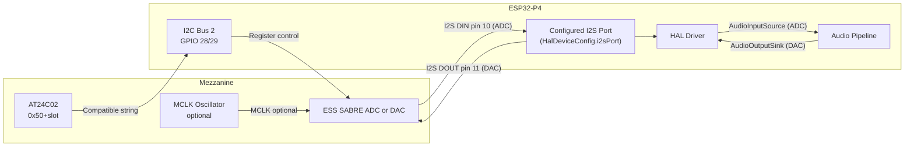

The ALX Nova Controller 2 supports standardized mezzanine expansion modules that sit on top of the carrier board via a defined mechanical and electrical interface. Each module connects through a single keyed connector that carries I2C control, I2S audio clocks and data, and regulated power. At boot the HAL's tier-2 discovery mechanism probes each populated slot for an EEPROM carrying the module's compatible string, allowing plug-and-play device registration with no manual configuration required.

Community-built modules can apply for "Works with ALX" certification. Certified commercial modules are permitted to display the dedicated "Certified" badge and may be sold through the ALX store. See the project website for certification requirements.

## Connector Pinout

The connector is a 14-pin keyed header. Pins 1–9 carry shared bus signals present on every slot; pins 10–14 are per-slot and routed to unique GPIOs on the carrier board.

### Shared bus signals

These signals are common to all expansion slots. Modules must not drive them as outputs except where the direction is explicitly listed as bidir.

| Pin | Signal | Direction | Notes |
|-----|--------|-----------|-------|
| 1 | 5V | Power | Source from carrier onboard LDO; fused per-slot at 500 mA |
| 2 | 3.3V | Power | Digital I/O reference; isolate analog supply with ferrite bead on the mezzanine |
| 3 | GND | Power | Digital ground — first of two ground pins |
| 4 | GND | Power | Additional ground return; wire both pins to reduce impedance |
| 5 | I2C\_SDA | Bidir | I2C Bus 2, GPIO 28 on carrier; 4.7 kΩ pull-up on carrier side |
| 6 | I2C\_SCL | Bidir | I2C Bus 2, GPIO 29 on carrier; 4.7 kΩ pull-up on carrier side |
| 7 | I2S\_BCK | Bidir | Shared bit clock; driven by whichever device is the I2S master |
| 8 | I2S\_WS | Bidir | Shared word select / LRCLK; driven by the I2S master |
| 9 | I2S\_MCLK | Bidir | Master clock; footprint on the mezzanine for either a local oscillator or a jumper to this carrier pin |

### Per-slot signals

Each connector position on the carrier board routes the following signals to distinct GPIOs. The GPIO numbers for each physical slot are documented in the carrier board hardware reference.

| Pin | Signal | Direction | Notes |
|-----|--------|-----------|-------|
| 10 | DIN | Input | I2S audio data from mezzanine ADC to ESP32 RX |
| 11 | DOUT | Output | I2S audio data from ESP32 TX to mezzanine DAC |
| 12 | CHIP\_EN | Output | Device enable, active high; de-asserted during HAL deinit |
| 13 | INT\_N | Input | Optional open-drain interrupt or status output from the module |
| 14 | RESERVED | — | Reserved for future use; leave unconnected on mezzanine |

:::info INT\_N is optional
The HAL does not poll or wait on INT\_N during normal operation. It is intended for future event-driven health monitoring. Modules that do not implement an interrupt may leave pin 13 unconnected on both ends.
:::

## Architecture Decisions

### Shared clock bus

All expansion modules share a single set of BCK, WS, and MCLK clock lines. This means all active expansion devices must operate at the same sample rate at any given time — there is no clock domain crossing or asynchronous sample rate conversion between slots. The audio pipeline enforces a single active sample rate across all registered sources and sinks.

Which device acts as I2S master is configured per-device through `HalDeviceConfig.isI2sClockMaster`. In the typical configuration the carrier's ESP32-P4 drives BCK, WS, and MCLK on whichever I2S peripheral is assigned to the expansion connector (configured via `HalDeviceConfig.i2sPort`), and all mezzanine devices operate as I2S slaves consuming those clocks. A mezzanine with a high-precision fixed oscillator may instead act as master — in that case the assigned I2S peripheral must be configured in slave receive mode and `isI2sClockMaster` set to `false` for that device's HAL entry.

### I2S peripheral assignment

I2S port assignment is fully configurable per device through `HalDeviceConfig.i2sPort` (values 0–2, or 255 for auto/default). The carrier board routes the expansion connector's BCK, WS, MCLK, DIN, and DOUT lines to GPIOs that can be mapped to any of the three ESP32-P4 I2S peripherals.

The onboard peripherals use dedicated ports by convention:

| Peripheral | Conventional use |
|------------|-----------------|
| I2S0 | Onboard ADC1 (PCM1808, I2S master RX — BCK, WS, MCLK output) |
| I2S1 | Onboard ADC2 (PCM1808, data-only follower; clocks shared from I2S0) |
| I2S2 | Conventional default for expansion mezzanine devices (configurable) |

Expansion mezzanine drivers default to I2S2 when no explicit `HalDeviceConfig` override is set (`i2sPort == 255`). Any port can be assigned — for example, a carrier board with two independent expansion connectors on separate clock trees could assign one connector to I2S2 and another to I2S0 (when the onboard ADCs are not populated).

### TDM mode

The configured I2S port supports TDM (Time Division Multiplexed) framing for multi-channel mezzanines. A TDM-capable module can deliver up to 16 audio channels over the single DIN line by interleaving slots within each LRCLK frame. Configure the TDM slot mask through `HalDeviceConfig` and ensure the mezzanine's TDM frame width matches the carrier configuration. Standard stereo modules use I2S mode with no TDM framing.

## EEPROM Auto-Discovery

Mezzanine modules that carry an AT24C02 EEPROM (or compatible 2 kbit device) are recognized automatically at boot without any manual configuration. The discovery flow is:

1. HAL tier-1 scans I2C Bus 2 (GPIO 28/29) for responding addresses.
2. For each slot offset address in the range 0x50–0x57, tier-2 probes for the EEPROM and reads the v3 layout.
3. The compatible string extracted from the EEPROM (offset 0x5E, null-terminated, 32 bytes) is looked up in the HAL driver registry.
4. If a matching factory is found, the device is registered, probed, and initialized in priority order.
5. If no match is found the module is logged as UNKNOWN and appears in the web UI device list for manual identification.

| Slot | EEPROM Address |
|------|----------------|
| 0 | 0x50 |
| 1 | 0x51 |
| 2 | 0x52 |
| 3–7 | 0x53–0x57 |

The EEPROM content follows the HAL v3 format:

| Offset | Size | Contents |
|--------|------|----------|
| 0x00–0x5D | 94 bytes | v1/v2 legacy fields (device ID, name, I2C address) |
| 0x5E | 32 bytes | Compatible string, null-terminated, e.g. `"ess,es9822pro"` |
| 0x7E | 2 bytes | CRC-16/CCITT over bytes 0x00–0x7D |
| 0x80–0xFF | 128 bytes | Reserved for driver-specific data |

Modules without an EEPROM can still be used by manually adding the device through the REST API (`POST /api/hal/devices`) or the web UI. The HAL will not attempt auto-discovery for slots where no EEPROM ACKs.

:::tip Programming the EEPROM
A Python flashing script and a set of pre-built binary images for supported modules are available in `tools/eeprom/`. Write the image with any I2C-capable programmer (e.g. CH341A or a Raspberry Pi) before populating the mezzanine on the carrier. The CRC must be valid or the HAL falls back to legacy numeric device ID matching.
:::

## Signal Flow Diagram

The carrier drives BCK and WS to the mezzanine in the default clock-master configuration. When the mezzanine provides its own MCLK oscillator, pin 9 is left floating on the carrier side and the module drives the device directly. The HAL driver sets `_descriptor.bus` accordingly and the HAL discovery layer resolves the I2S pin map from `HalDeviceConfig` at init time.

## Supported Expansion Devices

### ADC Modules

The following expansion ADC modules have registered HAL drivers and EEPROM images:

| Device | Compatible | Channels | Output Mode | Volume Control | PGA Gain Range | HPF | I2C Address |
|--------|-----------|----------|-------------|----------------|----------------|-----|-------------|
| ES9822PRO | `ess,es9822pro` | 2 | I2S | 16-bit per-ch | 0–18 dB (6 dB steps) | Yes | 0x40 |
| ES9826 | `ess,es9826` | 2 | I2S | 16-bit per-ch | 0–30 dB (3 dB steps) | Flag only | 0x40 |
| ES9823PRO | `ess,es9823pro` | 2 | I2S | 16-bit per-ch | 0–42 dB (6 dB steps) | Flag only | 0x40 |
| ES9823MPRO | `ess,es9823mpro` | 2 | I2S | 16-bit per-ch | 0–42 dB (6 dB steps) | Flag only | 0x40 |
| ES9821 | `ess,es9821` | 2 | I2S | 16-bit per-ch | None | Flag only | 0x40 |
| ES9820 | `ess,es9820` | 2 | I2S | 16-bit per-ch | 0–18 dB (6 dB steps) | Yes | 0x40 |
| ES9843PRO | `ess,es9843pro` | 4 | TDM | 8-bit per-ch | 0–42 dB (6 dB steps) | Yes | 0x40 |
| ES9842PRO | `ess,es9842pro` | 4 | TDM | 16-bit per-ch | 0–18 dB (6 dB steps) | Yes | 0x40 |
| ES9841 | `ess,es9841` | 4 | TDM | 8-bit per-ch | 0–42 dB (6 dB steps) | Yes | 0x40 |
| ES9840 | `ess,es9840` | 4 | TDM | 16-bit per-ch | 0–18 dB (6 dB steps) | Yes | 0x40 |

All nine ADC devices are registered in `hal_builtin_devices.cpp` and have preset entries in the device database (`GET /api/hal/db/presets`). Only one expansion ADC module is physically installed at a time on the mezzanine connector — the correct driver is selected automatically from the compatible string stored in the module's AT24C02 EEPROM.

**I2S output mode (2-channel ADC devices):** ES9822PRO, ES9826, ES9823PRO, ES9823MPRO, ES9821, and ES9820 output standard stereo I2S. The pipeline bridge registers each as a single `AudioInputSource` and assigns one input lane.

**TDM output mode (4-channel ADC devices):** ES9843PRO, ES9842PRO, ES9841, and ES9840 output all 4 channels time-multiplexed on the DIN line in TDM mode: \[SLOT0=CH1\]\[SLOT1=CH2\]\[SLOT2=CH3\]\[SLOT3=CH4\] per frame. The `HalTdmDeinterleaver` embedded in each TDM driver splits the stream into two stereo pairs. The pipeline bridge calls `getInputSourceCount()` (returns 2 when initialized) and registers each stereo pair as a separate `AudioInputSource` at consecutive input lanes. A 4-channel TDM device therefore occupies two input lanes in the routing matrix.

**ES9823PRO / ES9823MPRO variants:** Both package variants share the `HalEs9823pro` driver class. `ess,es9823mpro` is registered as a second compatible string pointing to the same factory. The driver reads chip ID register 0xE1 at `init()` time to distinguish between the two (0x8D = PRO, 0x8C = MPRO) and sets an internal `_isMonolithic` flag.

**HPF "Flag only" note:** On ES9826, ES9823PRO/MPRO, and ES9821, `adcSetHpfEnabled()` stores the HPF state for web UI display but does not write a dedicated hardware register — these devices do not expose a separate HPF control bit in their register maps.

### DAC Modules

The following expansion DAC modules have registered HAL drivers and EEPROM images. DAC modules use the DOUT pin (pin 11 of the connector) for I2S audio data received from the ESP32-P4. DAC I2C addresses are in the 0x48–0x4E range (separate from the ADC 0x40–0x46 range), allowing a DAC and an ADC mezzanine to coexist on the same I2C Bus 2 if the hardware supports dual population.

#### 2-Channel DAC Modules (Pattern C)

| Device | Compatible | Channels | Interface | Volume Control | Key Feature | I2C Address |
|--------|-----------|----------|-----------|----------------|-------------|-------------|
| ES9038Q2M | `ess,es9038q2m` | 2 | I2S | 128-step (0.5 dB/step) | Hyperstream II, 128 dB DNR, DSD512 | 0x48 |
| ES9039Q2M | `ess,es9039q2m` | 2 | I2S | 128-step (0.5 dB/step) | Hyperstream IV, 130 dB DNR, DSD1024 | 0x48 |
| ES9069Q | `ess,es9069q` | 2 | I2S | 128-step (0.5 dB/step) | Integrated MQA hardware renderer, DSD1024 | 0x48 |
| ES9033Q | `ess,es9033q` | 2 | I2S | 128-step (0.5 dB/step) | Integrated 2 Vrms line drivers (no external op-amp) | 0x48 |
| ES9020 | `ess,es9020-dac` | 2 | I2S | 128-step (0.5 dB/step) | Integrated APLL for BCK-based clock recovery, 122 dB DNR | 0x48 |

All five 2-channel DAC devices receive standard stereo I2S from the ESP32-P4 on the mezzanine DOUT line (pin 11). The pipeline bridge registers each as a single `AudioOutputSink` and assigns one output slot. Volume is controlled via an 8-bit attenuation register: 0x00 = 0 dB, 0xFF = full mute, with 0.5 dB per step.

#### 8-Channel DAC Modules (Pattern D)

| Device | Compatible | Channels | Interface | Volume Control | Key Feature | I2C Address |
|--------|-----------|----------|-----------|----------------|-------------|-------------|
| ES9038PRO | `ess,es9038pro` | 8 | TDM (8-slot) | 8-bit per-ch (0.5 dB/step) | Hyperstream II, 132 dB DNR, DSD512 | 0x48 |
| ES9028PRO | `ess,es9028pro` | 8 | TDM (8-slot) | 8-bit per-ch (0.5 dB/step) | Hyperstream II, 124 dB DNR, register-compatible with ES9038PRO | 0x48 |
| ES9039PRO | `ess,es9039pro` | 8 | TDM (8-slot) | 8-bit per-ch (0.5 dB/step) | Hyperstream IV, 132 dB DNR, DSD1024 | 0x48 |
| ES9039MPRO | `ess,es9039mpro` | 8 | TDM (8-slot) | 8-bit per-ch (0.5 dB/step) | ES9039PRO MPRO variant (industrial temp range), auto-detected | 0x48 |
| ES9027PRO | `ess,es9027pro` | 8 | TDM (8-slot) | 8-bit per-ch (0.5 dB/step) | Hyperstream IV, 124 dB DNR, DSD1024, ES9039PRO register-compatible | 0x48 |
| ES9081 | `ess,es9081` | 8 | TDM (8-slot) | 8-bit per-ch (0.5 dB/step) | Hyperstream IV, 120 dB DNR, 40-pin QFN, cost-optimised | 0x48 |
| ES9082 | `ess,es9082` | 8 | TDM (8-slot) | 8-bit per-ch (0.5 dB/step) | Hyperstream IV, 120 dB DNR, 48-pin QFN, optional ASP2 DSP | 0x48 |
| ES9017 | `ess,es9017` | 8 | TDM (8-slot) | 8-bit per-ch (0.5 dB/step) | Hyperstream IV, 120 dB DNR, pin-compatible with ES9027PRO | 0x48 |

8-channel DAC devices receive all 8 channels time-multiplexed on the DOUT line in 8-slot TDM mode: \[SLOT0=CH1\]\[SLOT1=CH2\]...\[SLOT7=CH8\] per frame, 32 bits per slot. The `HalTdmInterleaver` embedded in each driver combines four stereo pipeline output sinks into the single TDM stream. The pipeline bridge calls `getSinkCount()` (returns 4 when initialized) and `buildSinkAt(idx, ...)` to register each stereo pair as a separate `AudioOutputSink` at consecutive output slots. An 8-channel TDM DAC therefore occupies four output slots in the routing matrix.

**ES9039PRO / ES9039MPRO variants:** Both package variants share the `HalEs9039pro` driver class. `ess,es9039mpro` is registered as a second compatible string pointing to the same factory. The driver reads chip ID register 0xE1 at `init()` time (0x39 = PRO, 0x3A = MPRO) and updates the device name accordingly.

#### 2-Channel Cirrus Logic DAC Modules (Pattern C)

| Device | Compatible | Channels | Interface | Volume Control | Key Feature | I2C Address |
|--------|-----------|----------|-----------|----------------|-------------|-------------|
| CS43198 | `cirrus,cs43198` | 2 | I2S | 128-step (0.5 dB/step) | MasterHIFI, 130 dBA DNR, 7 filter presets, DSD256, 384 kHz/32-bit | 0x48 |
| CS43131 | `cirrus,cs43131` | 2 | I2S | 128-step (0.5 dB/step) | MasterHIFI, 127 dB DNR, integrated headphone amp, DSD256 | 0x48 |
| CS4398 | `cirrus,cs4398` | 2 | I2S | 128-step (0.5 dB/step) | Classic DAC, 120 dB DNR, 8-bit registers, max 192 kHz/24-bit, DSD64 | 0x4C |
| CS4399 | `cirrus,cs4399` | 2 | I2S | 128-step (0.5 dB/step) | MasterHIFI, 130 dBA DNR, 5 filter presets including NOS bypass mode | 0x48 |
| CS43130 | `cirrus,cs43130` | 2 | I2S | 128-step (0.5 dB/step) | MasterHIFI, 130 dB DNR, headphone amp + NOS filter, DSD128 | 0x48 |

All five Cirrus Logic DAC devices follow the same Pattern C integration as the ESS 2-channel DACs. Each registers a single `AudioOutputSink` and uses `buildSink()` from the shared `HalCirrusDacBase` base class. Volume is controlled via an 8-bit attenuation register with 0.5 dB per step.

**Headphone amplifier support:** CS43131 and CS43130 include an integrated headphone amplifier, exposed via `setHeadphoneAmpEnabled(bool)` / `isHeadphoneAmpEnabled()`. Both report `HAL_CAP_HP_AMP`.

**NOS mode:** CS4399 and CS43130 support non-oversampling (NOS) bypass mode via `setNosMode(bool)` / `isNosMode()`, which bypasses the internal digital interpolation filter for a more analog-like sound character.

**Register addressing:** CS43198 and CS4398 use 8-bit register addressing. CS43131, CS43130, and CS4399 use 16-bit paged register addressing. Per-device register definitions are in `src/drivers/cs4*_regs.h` and `src/drivers/cs43*_regs.h`. Shared constants are in `src/drivers/cirrus_dac_common.h`.

**CS4398 I2C address:** The CS4398 uses I2C address 0x4C (different from the 0x48 default used by all other Cirrus Logic DACs), allowing it to coexist with other Cirrus DACs on the same I2C bus.

:::info Adding your own module
If you are developing a new mezzanine module, follow the [Driver Guide](./driver-guide.md) to create the HAL driver class, register the factory, and write the unit tests. For ADCs: use `"ess,es9822pro"` as a reference for 2-channel I2S ADC devices, or `"ess,es9843pro"` for 4-channel TDM ADC devices using `HalTdmDeinterleaver`. For DACs: use `"ess,es9038q2m"` (ESS) or `"cirrus,cs43198"` (Cirrus Logic) as a reference for 2-channel I2S DAC devices (Pattern C), or `"ess,es9038pro"` for 8-channel TDM DAC devices using `HalTdmInterleaver` (Pattern D).
:::

## Design Guidelines for Mezzanine Makers

The following guidelines apply to all modules seeking "Works with ALX" certification.

### MCLK supply

Provide a footprint for both a local fixed-frequency crystal oscillator and a zero-ohm jumper to the carrier's MCLK line (pin 9). Use a solder-bridge or 0402 zero-ohm resistor to select between the two at assembly time. This allows the same PCB to operate in both clock-master (standalone oscillator) and clock-slave (carrier MCLK) configurations.

Common MCLK frequencies for ESS SABRE ADCs:

| Sample Rate | Required MCLK |
|-------------|--------------|
| 44.1 kHz | 22.5792 MHz |
| 48 kHz | 24.576 MHz |
| 96 kHz | 24.576 MHz |
| 192 kHz | 24.576 MHz |

### Power supply

ESS SABRE ADCs require a clean analog supply (AVCC) separate from the digital 3.3V rail. Derive AVCC from the 5V pin (pin 1) through a low-noise LDO set to 4.5V. Do not power AVCC from the 3.3V pin — the 3.3V rail on the carrier may carry switching noise from the ESP32 core regulators.

Isolate the module's 3.3V analog circuits from the digital 3.3V supply using a ferrite bead (100 Ω at 100 MHz, rated at least 500 mA) in series with a pi filter. Keep AGND and DGND joined at a single point on the mezzanine (star topology), with the star point as close as possible to the ADC's ground pad.

### Decoupling

Place decoupling capacitors as close as possible to each analog supply pin on the ADC package:

| Position | Capacitors |
|----------|-----------|
| Per AVCC pin | 10 µF (MLCC X5R) + 100 nF (C0G/NP0) + 10 nF (C0G/NP0) |
| Per DVCC pin | 10 µF (MLCC X5R) + 100 nF (C0G/NP0) |
| MCLK oscillator VCC | 10 µF + 100 nF + 10 nF |

Use C0G/NP0 dielectric for the small-value capacitors on analog supplies. X5R is acceptable for bulk capacitance. Avoid Y5V or Z5U dielectrics on any supply pin.

### PCB layout

- Route I2S signal traces (BCK, WS, DIN) as matched-length pairs. Maximum skew between BCK and DIN should be less than 200 ps (approximately 30 mm length difference on standard FR4).
- Keep I2S traces away from the MCLK oscillator and its associated power traces.
- Place the EEPROM (if fitted) on the I2C Bus 2 side of the connector with short traces to SDA and SCL. The carrier provides 4.7 kΩ pull-ups; do not add additional pull-ups on the mezzanine.
- Expose the module's compatible string silk-screen label on the top layer for easy identification.

### Mechanical

The connector on the carrier is a 2.54 mm pitch, 14-pin, single-row, right-angle or vertical male header. The mezzanine mates with a matching female socket. Provide at minimum two M3 mounting hole positions aligned with the carrier board standoff pattern to prevent mechanical stress on the connector pins.

:::warning Keying
Pin 1 is the 5V power supply. Reversing the connector will apply 5V to the I2C and I2S signal lines, permanently damaging the ESP32-P4 GPIO inputs and the ADC. The connector must be mechanically keyed (polarized housing or pin-1 marker silk screen) to prevent incorrect insertion. All officially certified modules use a keyed Molex PicoBlade or equivalent connector housing.
:::
