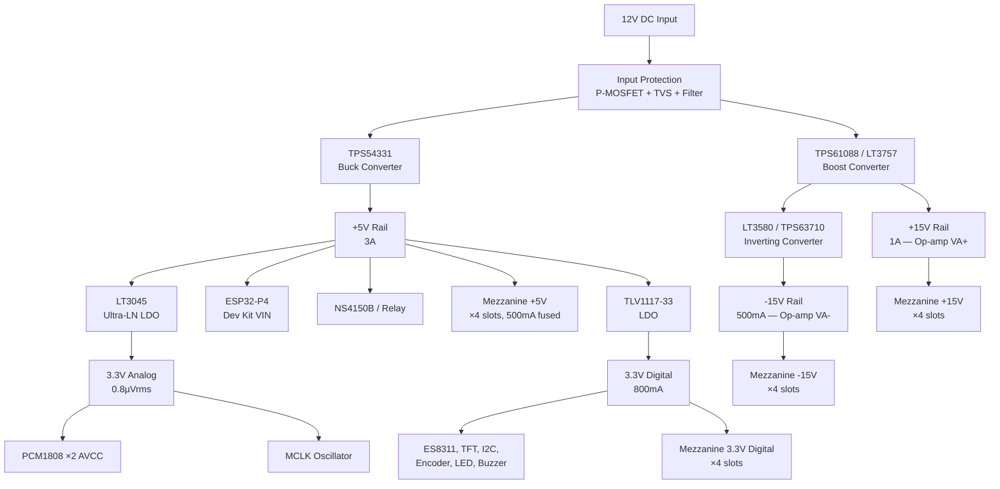
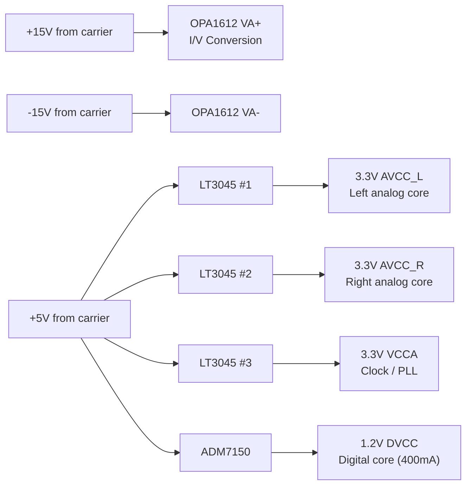
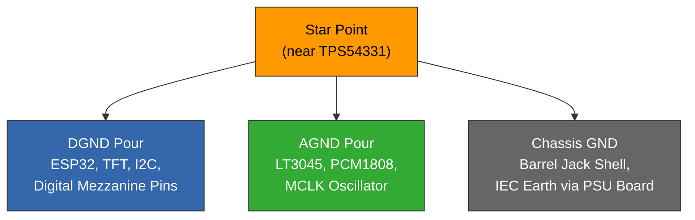

The ALX Nova Controller 2 carrier board uses a multi-rail power architecture designed for audio-grade performance. The carrier accepts 12V DC input and generates all internal rails, including bipolar +/-15V for DAC mezzanine op-amp output stages.

## Design Philosophy

The power supply architecture is based on research across flagship DAC products (dCS, Holo Audio May, Denafrips Terminator, Gustard R26, Topping D90SE) and ESS SABRE evaluation board reference designs. Key principles:

- **SELV classification** — no mains voltage on the carrier board, simplifying CE/UL certification
- **Two-stage noise rejection** — switching converter followed by ultra-low-noise LDO for analog rails
- **Separate AGND/DGND** — joined at a single star point near the main regulator
- **Bipolar supply** for op-amp I/V conversion stages — +/-15V matches ESS eval board standard
- **Per-slot fusing** — resettable polyfuse on each mezzanine 5V rail

## Input Power

| Parameter | Specification |
|-----------|--------------|
| Input voltage | 12V DC (10–14V tolerance) |
| Connector | 5.5 x 2.1 mm barrel jack (external) + 2-pin Molex header (internal PSU board) |
| Maximum draw | 4.5A at 12V (full 4-slot load) |
| Recommended PSU | 12V / 5A (60W) |
| Form factor | Half-rack chassis (218 mm wide) |

The carrier board supports two DC input paths with automatic OR selection:

1. **External barrel jack** — for bench-top use or external linear/SMPS supplies
2. **Internal 2-pin Molex** — for an optional internal linear PSU board mounted inside the chassis

:::info Optional Internal PSU Board
An internal linear PSU module (toroidal transformer, IEC C14 inlet) is available as a separate product. The carrier board design is the same regardless of which input is used — both paths see 12V DC.
:::

## Voltage Rails

### Rail Specifications

| Rail | Regulator | Output | Max Current | Noise | Purpose |
|------|-----------|--------|-------------|-------|---------|
| +15V | TPS61088 or LT3757 (boost) | +15.0V | 1A | — | Mezzanine op-amp VA+ |
| -15V | LT3580 or TPS63710 (inverting) | -15.0V | 500mA | — | Mezzanine op-amp VA- |
| +5V | TPS54331 (sync buck) | +5.0V | 3A | — | ESP32, mezzanine LDOs, amp, relay |
| 3.3V Analog | LT3045 (ultra-LN LDO) | +3.3V | 500mA | 0.8 µVrms | PCM1808 AVCC, MCLK oscillator |
| 3.3V Digital | TLV1117-33 (LDO) | +3.3V | 800mA | ~30 µVrms | ES8311, TFT, I2C, digital I/O |

### Why +/-15V?

The ESS SABRE evaluation boards and most flagship DAC products (Gustard R26, Topping D90SE, dCS) use +/-15V for the op-amp I/V conversion stage. The OPA1612 (industry-standard I/V op-amp) operates at +/-2.25V to +/-18V but delivers best THD+N performance at +/-15V where output voltage swing and loop gain are maximised.

| Op-Amp Supply | Used By |
|---------------|---------|
| +/-15V | ESS eval boards, Gustard R26, DIY builds (reference) |
| +/-12V | Topping D90SE (from SMPS) |
| +/-11V | SMSL D400EX, Topping D90LE |

## Power Budget

Worst-case scenario with 4 fully populated mezzanine slots (2× ES9038PRO 8ch DAC + 2× ES9843PRO 4ch ADC).

| Subsystem | Rail | Current |
|-----------|------|---------|
| ESP32-P4 dev kit (WiFi TX burst) | +5V | 600 mA |
| Onboard peripherals (ES8311, PCM1808 ×2, TFT, buzzer, LED) | +5V → 3.3V | 150 mA |
| NS4150B class-D amp (moderate speaker load) | +5V | 500 mA |
| Relay coil | +5V | 80 mA |
| Mezzanine slots ×4 (DAC chip LDOs) | +5V | 1,200 mA |
| **+5V total** | | **2,530 mA** |
| Mezzanine slots ×4 (op-amp positive) | +15V | 800 mA |
| **+15V total** | | **800 mA** |
| Mezzanine slots ×4 (op-amp negative) | -15V | 800 mA |
| **-15V total** | | **800 mA** |
| **Total from 12V input (~80% efficiency)** | | **~4.5A** |

## DAC Mezzanine Internal Power

Each DAC mezzanine module generates its own precision low-noise rails from the carrier-supplied +5V, +15V, and -15V:

:::warning ES9038PRO digital current
The ES9038PRO draws up to 400 mA on its 1.2V DVCC rail — significantly more than other SABRE DACs. Use the ADM7150 (800 mA rating) rather than a 500 mA LDO for PRO-series mezzanines.
:::

### Recommended Mezzanine LDO Components

| Component | Type | Noise | Max Current | Use |
|-----------|------|-------|-------------|-----|
| LT3045 | Positive ultra-LN LDO | 0.8 µVrms | 500 mA (parallelable) | AVCC\_L, AVCC\_R, VCCA |
| LT3094 | Negative ultra-LN LDO | 0.8 µVrms | 500 mA | Optional local -15V filter |
| ADM7150 | Positive ultra-LN LDO | Ultra-low | 800 mA | DVCC 1.2V |
| ES9311Q | Dual positive LDO | Ultra-low | Purpose-built | AVCC\_L/R (ESS proprietary, limited availability) |

## Mezzanine Connector (16-pin)

The expansion connector has been extended from 14 to 16 pins to carry the bipolar op-amp supply rails. See the [Mezzanine Connector Standard](./mezzanine-connector) for full signal descriptions.

### Shared Bus Signals (Pins 1–11)

| Pin | Signal | Direction | Notes |
|-----|--------|-----------|-------|
| 1 | +5V | Power | From carrier buck converter, fused 500 mA per slot |
| 2 | 3.3V | Power | Digital I/O reference |
| 3 | GND | Power | Ground return #1 |
| 4 | GND | Power | Ground return #2 |
| 5 | I2C\_SDA | Bidir | I2C Bus 2, GPIO 28 |
| 6 | I2C\_SCL | Bidir | I2C Bus 2, GPIO 29 |
| 7 | I2S\_BCK | Bidir | Bit clock |
| 8 | I2S\_WS | Bidir | Word select / LRCLK |
| 9 | I2S\_MCLK | Bidir | Master clock |
| 10 | +15V | Power | Op-amp positive rail, from carrier boost converter |
| 11 | -15V | Power | Op-amp negative rail, from carrier inverting converter |

### Per-Slot Signals (Pins 12–16)

| Pin | Signal | Direction | Notes |
|-----|--------|-----------|-------|
| 12 | DIN | Input | I2S data from mezzanine ADC to ESP32 RX |
| 13 | DOUT | Output | I2S data from ESP32 TX to mezzanine DAC |
| 14 | CHIP\_EN | Output | Device enable, active high |
| 15 | INT\_N | Input | Optional interrupt / status |
| 16 | RESERVED | — | Future use |

## Ground Architecture

The carrier board uses separate AGND and DGND copper pours joined at a single star point near the main 5V buck converter output.

- AGND pour runs unbroken under the LT3045 → PCM1808 → MCLK oscillator signal path
- No digital traces or via stitching may cross the AGND pour
- Each mezzanine module maintains its own AGND/DGND split with a star point at the DAC ground pad
- Chassis ground is bonded to the carrier star point via 100 nF ceramic in parallel with 10 Ω resistor

## Input Protection

| Component | Function |
|-----------|----------|
| Si2301 P-MOSFET | Reverse polarity protection (3A) |
| SMBJ15A TVS | Transient voltage clamp (15V standoff) |
| 470 µF / 25V electrolytic + 100 nF + 10 nF ceramic | Input filtering |
| MF-MSMF050 polyfuse ×4 | Per-mezzanine-slot resettable fuse (500 mA) |

## PCB Layout Guidelines

1. **4-layer stackup**: Signal / GND / Power / Signal with ENIG surface finish
2. **Buck converter (TPS54331)**: Input cap → IC → inductor → output cap loop area less than 4 cm²
3. **Boost converter (+15V)**: Short, wide SW node trace with shielded inductor
4. **LT3045 placement**: Adjacent to PCM1808 ADCs with traces shorter than 10 mm to AVCC pins
5. **Star point**: 2 × 2 mm via stitching zone connecting AGND and DGND pours, within 10 mm of TPS54331 ground
6. **+/-15V traces**: 0.75 mm (30 mil) minimum width to mezzanine slots
7. **+5V traces**: 1 mm (40 mil) minimum width to each polyfuse

## Recommended External Power Supplies

| Tier | Product | Rating | Notes |
|------|---------|--------|-------|
| Budget | Mean Well GST60A12 | 12V / 5A SMPS | Ripple cleaned by carrier two-stage regulation |
| Good | ifi iPower X | 12V / 2A | Active noise cancellation, low ripple |
| Premium | Teddy Pardo or Farad Super3 | 12V / 3A linear | Lowest noise external option |
| DIY | Toroidal 50VA + bridge + 10,000 µF | 12V / 4A | Community build, ~$25 in parts |

Even with the cheapest SMPS, the two-stage filtering on the carrier (TPS54331 buck → LT3045 LDO) provides approximately 80 dB noise rejection, placing the analog rail noise floor well below the PCM1808 ADC's own noise floor.

## Optional Internal Linear PSU Module

The "ALX Linear PSU Module" is an optional internal power supply board designed to mount inside the half-rack chassis alongside the carrier board.

| Specification | Value |
|--------------|-------|
| Input | IEC C14 inlet, 100–240 VAC, 50/60 Hz |
| Transformer | Toroidal, 50 VA minimum, dual 12 VAC secondaries |
| Rectification | Schottky bridge (MBR2045CT) per winding |
| Filter capacitors | 2× 10,000 µF / 25V Nichicon KG |
| Output | ~16V DC unregulated (carrier regulates to final voltages) |
| Connector | 2-pin Molex to carrier J2 header |
| Dimensions | ~100 × 60 mm PCB |

A premium version with a center-tapped transformer providing +/-17V raw DC can bypass the carrier's boost converter entirely, with +/-15V generated by LDOs directly from the clean DC. This is the lowest-noise configuration.
