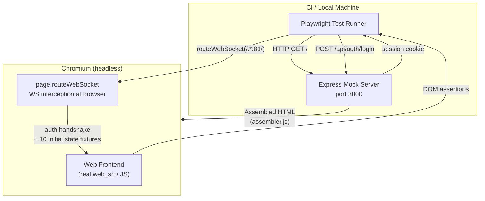

ALX Nova has three test layers that together cover firmware logic, web UI behaviour, and static code quality. All three run in the CI pipeline on every push to `main` and `develop`. The firmware build is blocked until all quality gates pass.

## Test Layers at a Glance

| Layer | Tool | Count | What It Covers |
|---|---|---|---|
| C++ unit tests | Unity (PlatformIO native) | ~3,050 tests / 110 modules | Firmware logic, HAL, DSP, audio pipeline, networking, auth |
| E2E browser tests | Playwright + Express mock | 302 tests / 50 specs | Web UI, WS state sync, REST API contracts, accessibility, visual regression |
| Static analysis | ESLint, cppcheck, find_dups, check_missing_fns | — | JS correctness, C++ warnings, duplicate/missing declarations |

## Layer 1: C++ Unit Tests

Tests run on the **native platform** (host machine, gcc/MinGW) using the [Unity](https://github.com/ThrowTheSwitch/Unity) assertion framework, compiled and executed by PlatformIO.

```bash
# Run all ~3,050 tests across all 110 modules
pio test -e native

# Run with verbose output (show individual test names and pass/fail)
pio test -e native -v

# Run a single module
pio test -e native -f test_dsp
pio test -e native -f test_hal_core
pio test -e native -f test_audio_pipeline
```

### How Native Tests Work

PlatformIO compiles and runs test modules directly on the host machine. The firmware source (`src/`) is **not** compiled into tests; each test module includes only the headers it needs and substitutes hardware dependencies with mocks.

Key build flags for test compilation:
- `-D UNIT_TEST` — gates test-only code paths in shared headers
- `-D NATIVE_TEST` — disables hardware-specific APIs (`Serial`, `millis`, I2S, FreeRTOS)
- `test_build_src = no` — prevents `src/` from being compiled as part of each test build

### Mock Headers

`test/test_mocks/` provides stubs for every Arduino and ESP-IDF dependency:

| Mock File | Simulates |
|---|---|
| `Arduino.h` | `millis()`, `micros()`, `delay()`, `analogRead()`, GPIO functions |
| `WiFi.h` | `WiFiClass` with connection state, scan results, AP mode |
| `PubSubClient.h` | MQTT client — connect, publish, subscribe, callback dispatch |
| `Preferences.h` | NVS key-value store backed by a `std::map` |
| `LittleFS.h` | In-memory file system for JSON persistence tests |
| `Wire.h` | I2C bus — configurable ACK/NACK responses for HAL driver tests |
| `i2s_std_mock.h` | ESP-IDF I2S standard driver types and return codes |
| `esp_timer.h` | `esp_timer_get_time()` backed by a controllable counter |

### Writing a New C++ Test Module

Follow the Arrange-Act-Assert pattern. Each file needs a `setUp()` that resets all state:

```cpp
#include "unity.h"
#include "../src/my_module.h"
#include "../test/test_mocks/Arduino.h"

void setUp(void) {
    // Reset module state before each test
    my_module_reset();
}

void tearDown(void) {}

void test_my_module_does_thing(void) {
    // Arrange
    my_module_configure(42);

    // Act
    int result = my_module_process();

    // Assert
    TEST_ASSERT_EQUAL_INT(42, result);
}

int main(void) {
    UNITY_BEGIN();
    RUN_TEST(test_my_module_does_thing);
    return UNITY_END();
}
```

Create the module in its own directory: `test/test_my_module/test_my_module.cpp`. PlatformIO discovers it automatically.

:::warning Every new firmware module needs a test file
New modules that ship without a `test/test_<module>/` directory will fail the mandatory coverage check in CI. The `hal-driver-scaffold` agent creates the test module automatically — use it when adding new HAL drivers.
:::

## Layer 2: Playwright E2E Tests

E2E tests verify the entire web frontend in real Chromium against a mock Express server. No real ESP32 hardware is needed. The suite covers 302 tests across 50 spec files, organised with a Page Object Model and test tagging system.

### Running Tests

```bash
cd e2e

# First-time setup
npm install
npx playwright install --with-deps chromium

# Run all 302 tests
npx playwright test

# Run a single spec
npx playwright test tests/hal-devices.spec.js

# Run with visible browser
npx playwright test --headed

# Interactive debug mode with inspector
npx playwright test --debug

# Run by tag
npm run test:smoke        # @smoke tagged tests
npm run test:hal          # @hal tagged tests
npm run test:visual       # @visual regression tests
npm run test:a11y         # @a11y accessibility tests
npm run test:ws           # @ws WebSocket command tests
npm run test:api          # @api REST API tests
npm run test:audio        # @audio pipeline/input/output tests
npm run test:settings     # @settings configuration tests
npm run test:error        # @error handling tests

# Update visual regression baselines
npm run test:update-snapshots
```

### Architecture



The Express mock server assembles the real `web_src/index.html` with CSS and JS injected, so tests run against the same frontend code that ships in firmware. The WebSocket connection that the frontend opens on port 81 is intercepted by Playwright at the browser level — no actual port 81 is opened.

### connectedPage Fixture

Most tests use the `connectedPage` fixture from `e2e/helpers/fixtures.js`, which handles authentication and WebSocket setup automatically:

```javascript
const { test, expect } = require('../helpers/fixtures');

test.describe('@smoke My Feature', () => {

  test('renders from WS state', async ({ connectedPage: page }) => {
    // The fixture has already:
    // 1. Logged in and set the session cookie
    // 2. Intercepted the WS connection on port 81
    // 3. Completed the auth handshake (authRequired -> auth -> authSuccess)
    // 4. Broadcast all initial state messages
    // 5. Waited for #wsConnectionStatus = "Connected"

    await expect(page.locator('#myElement')).toHaveText('Expected Value');
  });

  test('responds to WS update', async ({ connectedPage: page }) => {
    // Inject a new WS message mid-test
    page.wsRoute.send({ type: 'myFeatureState', value: 99 });
    await expect(page.locator('#myValue')).toHaveText('99');
  });
});
```

The fixture also populates `page.wsCapture[]` — an array that captures all non-auth WebSocket commands sent by the frontend, used for verifying that UI actions produce the correct outbound commands.

### Page Object Model (POM)

19 POM classes in `e2e/pages/` wrap DOM interactions for each tab and modal. All POMs extend `BasePage`, which provides shared helpers for tab navigation, WS interaction, request interception, toast assertions, and screenshot comparison.

| POM Class | Purpose |
|---|---|
| `BasePage` | Abstract base: `switchTab()`, `wsSend()`, `expectWsCommand()`, `interceptRequest()`, `screenshotElement()` |
| `AudioPage` | Audio tab navigation between sub-views (Inputs, Matrix, Outputs, SigGen) |
| `AudioInputsPage` | Input channel strips, ADC health indicators |
| `AudioMatrixPage` | 32x32 routing matrix grid interactions |
| `AudioOutputsPage` | Output strips, per-output DSP controls |
| `AudioSigGenPage` | Signal generator enable/waveform/frequency controls |
| `ControlPage` | Control tab: sensing mode, amplifier state, threshold |
| `DebugPage` | Debug console: log entries, module chip filtering, search |
| `DevicesPage` | HAL device cards, rescan, capacity indicators, enable/disable |
| `MqttPage` | MQTT enable toggle, broker/port/topic config fields |
| `NetworkPage` | WiFi SSID/password, scan, saved networks, static IP, Ethernet panel |
| `SettingsPage` | Theme, buzzer, display, password change, export/import, factory reset |
| `SupportPage` | Support tab content and links |
| `StatusBar` | Top status bar: amplifier, WiFi, MQTT, WS connection indicators |
| `ApConfigModal` | AP mode configuration modal |
| `CustomDeviceModal` | Custom HAL device creator modal |
| `EthConfirmModal` | Ethernet static IP confirmation dialog |
| `PasswordModal` | Password change modal with validation |
| `PeqOverlay` | Parametric EQ overlay with frequency response canvas |

**Using a POM in tests:**

```javascript
const { test, expect } = require('../helpers/fixtures');
const DevicesPage = require('../pages/DevicesPage');

test.describe('@hal Device Cards', () => {

  test('shows expansion device after scan', async ({ connectedPage: page }) => {
    const devices = new DevicesPage(page);
    await devices.switchTab('devices');

    // Send HAL state via POM helper
    devices.wsSend(halDeviceFixture);

    await expect(page.locator('.hal-device-card')).toHaveCount(8);
  });
});
```

### WS Command Verification

When a UI action should produce an outbound WebSocket command, use the capture array or assertion helpers to verify it.

**Using page.wsCapture directly (via BasePage POM):**

```javascript
const devices = new DevicesPage(page);

// Perform a UI action that sends a WS command
await page.locator('#myButton').click();

// Verify the command was sent
await devices.expectWsCommand('setVolume', { value: 80 });
```

**Using ws-assertions.js standalone helpers:**

```javascript
const { expectWsCommand, clearWsCapture } = require('../helpers/ws-assertions');

test('volume slider sends WS command', async ({ connectedPage: page }) => {
  clearWsCapture(page);  // Start fresh

  await page.locator('#volumeSlider').fill('80');
  await page.locator('#volumeSlider').dispatchEvent('change');

  await expectWsCommand(page, 'setVolume', { value: 80 });
});
```

The `expectWsCommand()` function polls `page.wsCapture[]` every 100ms until a matching message is found or the timeout expires. It performs shallow comparison on all fields in the `expectedFields` object, with deep JSON comparison for nested objects.

### REST API Testing

For UI actions that trigger HTTP requests (e.g., HAL device enable/disable, OTA check), intercept the network call and assert the request body.

**Using captureApiCall:**

```javascript
const { captureApiCall } = require('../helpers/ws-assertions');

test('rescan button calls POST /api/hal/scan', async ({ connectedPage: page }) => {
  const cap = captureApiCall(page, '/api/hal/scan', 'POST');
  await cap.ready;

  await page.locator('#halRescanBtn').click();

  await cap.expectCalled();  // Asserts the POST was made
});
```

**Using BasePage.interceptRequest:**

```javascript
const devices = new DevicesPage(page);

// Returns a promise that resolves when the matching request is captured
const reqPromise = devices.interceptRequest('/api/hal/devices', 'PUT');

await page.locator('.hal-enable-toggle').click();

const req = await reqPromise;
expect(req.postData.slot).toBe(7);
expect(req.postData.enabled).toBe(false);
```

### Visual Regression Testing

Element-level visual regression tests compare screenshots against stored baselines. Tests are tagged `@visual` and use Playwright's built-in `toHaveScreenshot()`.

```javascript
test.describe('@visual Visual Status Bar', () => {

  test('status bar with amp ON and WiFi connected', async ({ connectedPage: page }) => {
    page.wsRoute.send({
      type: 'smartSensing',
      amplifierState: true,
      signalDetected: true
    });
    await page.waitForTimeout(300);

    const statusBar = page.locator('#statusBar');
    await expect(statusBar).toHaveScreenshot('status-bar-amp-on-wifi.png', {
      maxDiffPixelRatio: 0.02,
    });
  });
});
```

**Configuration** (in `playwright.config.js`):

```javascript
expect: {
  toHaveScreenshot: {
    maxDiffPixelRatio: 0.01,   // Default 1% pixel tolerance
    animations: 'disabled',    // Freeze CSS animations for determinism
  },
},
use: {
  contextOptions: {
    reducedMotion: 'reduce',   // Also reduces animation flakiness
  },
},
```

**Updating baselines** after intentional visual changes:

```bash
npm run test:update-snapshots
```

Baseline images are stored alongside each spec in `tests/<spec-name>.spec.js-snapshots/`.

### Accessibility Testing

Accessibility tests use [axe-core](https://github.com/dequelabs/axe-core) via `@axe-core/playwright` to scan each tab for WCAG 2.0 AA violations. Tests are tagged `@a11y`.

**Using the a11y-helpers wrapper:**

```javascript
const { expectNoViolations } = require('../helpers/a11y-helpers');

test.describe('@a11y Settings Tab', () => {

  test('has no critical accessibility violations', async ({ connectedPage: page }) => {
    await page.evaluate(() => switchTab('settings'));
    await expectNoViolations(page, 'Settings');
  });
});
```

`expectNoViolations()` filters by severity: critical and serious violations fail the test; moderate violations are logged as console warnings. The scan targets `wcag2a` and `wcag2aa` tags by default.

**Using AxeBuilder directly** for more control:

```javascript
const AxeBuilder = require('@axe-core/playwright').default;

const results = await new AxeBuilder({ page })
  .withTags(['wcag2a', 'wcag2aa'])
  .disableRules(['color-contrast', 'label'])
  .analyze();

const severe = results.violations.filter(
  v => v.impact === 'critical' || v.impact === 'serious'
);
expect(severe).toHaveLength(0);
```

### Fixture Factories

13 programmatic fixture builders in `e2e/helpers/fixture-factories.js` create WS broadcast messages with deep-merge overrides for per-test customisation. Use factories when you need to vary specific fields from the defaults; use the static JSON fixtures when testing against the standard state.

| Factory Function | Builds |
|---|---|
| `buildHalDevice()` | Single HAL device entry with config overrides |
| `buildHalDeviceState()` | Full `halDeviceState` broadcast with 8 default devices |
| `buildSmartSensing()` | `smartSensing` broadcast (mode, threshold, amplifier) |
| `buildHardwareStats()` | `hardware_stats` broadcast (CPU, memory, PSRAM, tasks, DAC) |
| `buildAudioChannelMap()` | `audioChannelMap` with configurable input/output counts |
| `buildDebugLog()` | Single `debugLog` entry with level and module |
| `buildWifiStatus()` | `wifiStatus` broadcast including Ethernet fields |
| `buildMqttSettings()` | `mqttSettings` broadcast (broker, port, discovery) |
| `buildDisplayState()` | `displayState` broadcast (backlight, timeout, dim) |
| `buildBuzzerState()` | `buzzerState` broadcast (enabled, volume) |
| `buildDspState()` | `dspState` broadcast (presets, channels, stages) |
| `buildSignalGenerator()` | `signalGenerator` broadcast (waveform, frequency, amplitude) |
| `deepMerge()` | Generic deep-merge utility for one-level nesting |

**Example — testing heap pressure UI with custom stats:**

```javascript
const { buildHardwareStats } = require('../helpers/fixture-factories');

test('shows heap warning banner', async ({ connectedPage: page }) => {
  const stats = buildHardwareStats({
    memory: { heapMaxBlock: 40000 },
    heapCritical: true,
  });
  page.wsRoute.send(stats);

  await expect(page.locator('.heap-warning')).toBeVisible();
});
```

### Test Tagging Conventions

Tags are placed in `test.describe()` titles and used for filtered test runs via `--grep`:

| Tag | Meaning | npm Script |
|---|---|---|
| `@smoke` | Core happy-path tests | `npm run test:smoke` |
| `@ws` | WebSocket command send/receive | `npm run test:ws` |
| `@api` | REST API endpoint verification | `npm run test:api` |
| `@visual` | Screenshot visual regression | `npm run test:visual` |
| `@a11y` | Accessibility (axe-core) scans | `npm run test:a11y` |
| `@hal` | HAL device cards, discovery, config | `npm run test:hal` |
| `@audio` | Audio pipeline, inputs, outputs, matrix | `npm run test:audio` |
| `@settings` | Settings, display, password, debug | `npm run test:settings` |
| `@error` | Error handling, toast, reconnect | `npm run test:error` |

Multiple tags can be combined in a single describe block: `test.describe('@hal @ws HAL Device Toggle', ...)`. The `--grep` flag matches any spec whose describe title contains the tag string.

### Mock Server

The Express mock server in `e2e/mock-server/` assembles the real frontend HTML and provides REST API stubs matching the firmware endpoints.

**Key files:**

| File | Purpose |
|---|---|
| `server.js` | Express app on port 3000, mounts all route files |
| `assembler.js` | Replicates `tools/build_web_assets.js` HTML assembly from `web_src/` |
| `ws-state.js` | Deterministic mock state singleton, reset between tests |

**Route files** in `e2e/mock-server/routes/` (14 total):

| Route File | Endpoints |
|---|---|
| `auth.js` | `/api/auth/login`, `/api/auth/logout`, `/api/ws-token` |
| `hal.js` | `/api/hal/devices`, `/api/hal/scan`, `/api/hal/db/presets` |
| `wifi.js` | `/api/wifi/scan`, `/api/wifi/status`, `/api/wifi/connect` |
| `mqtt.js` | `/api/mqtt/config` |
| `settings.js` | `/api/settings`, `/api/settings/export`, `/api/settings/import` |
| `ota.js` | `/api/ota/check`, `/api/ota/update` |
| `dsp.js` | `/api/dsp/config`, `/api/dsp/presets` |
| `pipeline.js` | `/api/pipeline/matrix`, `/api/pipeline/output-dsp` |
| `sensing.js` | `/api/sensing/config` |
| `diagnostics.js` | `/api/diagnostics`, `/api/diagnostics/journal`, `/api/diag/snapshot` |
| `siggen.js` | `/api/signalgenerator` |
| `ethernet.js` | `/api/ethernet/config` |
| `i2s-ports.js` | `/api/i2s/ports` |
| `system.js` | `/api/system/info` |

**Adding a new mock route:**

1. Create a route file in `e2e/mock-server/routes/my-feature.js`:

```javascript
const express = require('express');
const router = express.Router();

router.get('/api/my-feature/status', (req, res) => {
  res.json({ enabled: true, value: 42 });
});

module.exports = router;
```

2. Register it in `server.js`:

```javascript
app.use(require('./routes/my-feature'));
```

3. Optionally add a static fixture in `e2e/fixtures/api-responses/my-feature.json` if the test reads from file.

### Fixture Files

Static JSON fixtures provide deterministic data for tests:

- `e2e/fixtures/ws-messages/` — 21 WebSocket broadcast messages (e.g., `hal-device-state.json`, `wifi-status.json`, `hardware-stats.json`)
- `e2e/fixtures/api-responses/` — 20 REST API response bodies (e.g., `hal-devices.json`, `settings.json`, `diagnostics.json`)

All fixtures use realistic data from the actual HAL device database. Timestamps are fixed at `10000` ms to avoid flaky time-dependent assertions.

### Writing a New E2E Test

Step-by-step guide for adding a test for a new web feature:

1. **Create the spec file** in `e2e/tests/my-feature.spec.js`
2. **Import the fixture** and tag the describe block:

```javascript
const { test, expect } = require('../helpers/fixtures');

test.describe('@smoke @ws My Feature', () => {
  // tests go here
});
```

3. **Use connectedPage** to get a pre-authenticated page with WS:

```javascript
test('renders initial state', async ({ connectedPage: page }) => {
  await page.evaluate(() => switchTab('myTab'));
  await expect(page.locator('#myElement')).toBeVisible();
});
```

4. **Verify WS commands** when testing UI interactions:

```javascript
const { expectWsCommand } = require('../helpers/ws-assertions');

test('toggle sends WS command', async ({ connectedPage: page }) => {
  await page.locator('#myToggle').click();
  await expectWsCommand(page, 'setMyFeature', { enabled: true });
});
```

5. **Verify REST calls** when testing API-backed actions:

```javascript
const { captureApiCall } = require('../helpers/ws-assertions');

test('save calls POST /api/my-feature', async ({ connectedPage: page }) => {
  const cap = captureApiCall(page, '/api/my-feature', 'POST');
  await cap.ready;
  await page.locator('#saveBtn').click();
  await cap.expectCalled({ value: 42 });
});
```

6. **Add WS fixtures** if the feature receives new broadcast types:
   - Add JSON to `e2e/fixtures/ws-messages/my-feature.json`
   - Add the message to `buildInitialState()` in `e2e/helpers/ws-helpers.js`
   - Add command handling to `handleCommand()` if the feature sends commands

7. **Add API fixtures** if the feature calls new REST endpoints:
   - Add JSON to `e2e/fixtures/api-responses/my-feature.json`
   - Add a route in `e2e/mock-server/routes/my-feature.js`

8. **Update selectors** in `e2e/helpers/selectors.js` if you reference element IDs that other tests may also need.

### Key Playwright Patterns

**Tab navigation**: Use `page.evaluate()` instead of clicking sidebar items. Clicking can fail when the sidebar is scrolled or clipped:

```javascript
// Correct
await page.evaluate(() => switchTab('audio'));

// Avoid — may miss due to scroll position
await page.click('[data-tab="audio"]');
```

**CSS-hidden checkboxes**: Many toggles are `<input type="checkbox">` styled with a `label.switch` overlay. Use `toBeChecked()`, not `toBeVisible()`:

```javascript
await expect(page.locator('#mqttEnabled')).toBeChecked();
```

**Multiple matching elements**: Playwright strict mode fails if a selector matches more than one element. Use `.first()` when intentional:

```javascript
await page.locator('.channel-strip').first().click();
```

## Layer 3: Static Analysis

### ESLint (JavaScript)

All JS in `web_src/js/` is concatenated into a single `<script>` block at build time, giving all files a shared scope. ESLint is configured for this shared scope with 380 declared globals:

```bash
cd e2e
npx eslint ../web_src/js/ --config ../web_src/.eslintrc.json
```

Rules enforced:
- `no-undef` — catches references to undeclared functions (common in concatenated scope)
- `no-redeclare` — catches duplicate `let`/`const` across files
- `eqeqeq` — requires `===` throughout

When you add a new top-level function or variable to any JS file, add it to the `globals` section of `web_src/.eslintrc.json`. Failing to do so will cause CI to reject the push.

### cppcheck (C++)

Static analysis runs on `src/` during CI (excluding `src/gui/` which uses third-party LVGL macros that generate false positives):

```bash
# Equivalent to CI run (scoped to warning + performance, not style)
cppcheck --enable=warning,performance -i src/gui/ src/
```

The `--suppress=badBitmaskCheck` flag is applied in CI to suppress false positives from ArduinoJson's `operator|` overload.

### Duplicate and Missing Declaration Checks

Two custom Node.js scripts check the concatenated JS for structural problems:

```bash
# Check for duplicate let/const/function declarations across JS files
node tools/find_dups.js

# Check for function calls with no matching declaration
node tools/check_missing_fns.js
```

These run in under a second and catch cross-file problems that ESLint cannot see because it lints each file in isolation.

## CI Quality Gates

Five parallel jobs gate the firmware build on every push and PR:


The firmware build runs only if all five gates are green. `release.yml` runs the same five gates again before publishing a release.

On E2E test failure, a Playwright HTML report is uploaded as a CI artifact with 14-day retention. In CI, tests run with `retries: 2`, `workers: 1` (sequential), and `video: 'retain-on-failure'` for debugging flaky tests.

## Pre-commit Hooks

Fast local checks run before every commit via `.githooks/pre-commit`:

1. `node tools/find_dups.js` — duplicate JS declarations
2. `node tools/check_missing_fns.js` — undefined function references
3. ESLint on `web_src/js/`
4. `node tools/check_mapping_coverage.js` — every `src/` file mapped in `tools/doc-mapping.json`
5. `node tools/diagram-validation.js` — `@validate-symbols` checks in architecture diagrams

Activate once per local clone:

```bash
git config core.hooksPath .githooks
```

These five checks run in under 3 seconds total and catch the most common JS mistakes and documentation drift before they reach CI.

## Mandatory Coverage Requirements

Every code change must keep all tests green. The rules by change type:

### C++ Firmware Changes (`src/`)

- Run `pio test -e native -v` before opening a PR
- New modules require a `test/test_<module>/` directory
- Changed function signatures must have updated test expectations
- Use the `firmware-test-runner` agent to verify automatically

### Web UI Changes (`web_src/`)

- Run `cd e2e && npx playwright test` after every change
- New toggle / button / dropdown — add a test that sends the correct WS command
- New WS broadcast type — add a fixture JSON in `e2e/fixtures/ws-messages/` and a test that verifies the DOM updates
- New tab or section — add navigation + element presence tests
- Changed element IDs — update `e2e/helpers/selectors.js` and affected specs
- New top-level JS declarations — add to `web_src/.eslintrc.json` globals
- Use the `test-engineer` agent to verify automatically

### WebSocket Protocol Changes

When modifying `src/websocket_handler.cpp` broadcast functions:

1. Update `e2e/fixtures/ws-messages/` with the new or changed message fixture
2. Update `e2e/helpers/ws-helpers.js` — `buildInitialState()` and `handleCommand()`
3. Update `e2e/mock-server/ws-state.js` if new state fields are added
4. Add a Playwright test verifying the frontend handles the new message type
5. Run both `firmware-test-runner` and `test-engineer` agents in parallel

### REST API Changes

When adding or modifying endpoints in `src/main.cpp` or `src/hal/hal_api.cpp`:

1. Update or add the matching route in `e2e/mock-server/routes/*.js`
2. Update `e2e/fixtures/api-responses/` with the new response fixture
3. Add a Playwright test if the UI depends on the new endpoint

## Agent Workflow

Use specialised agents to run and fix tests after changes. Launch both in parallel when changes span firmware and web:

| Change Type | Agent | Action |
|---|---|---|
| C++ firmware only | `firmware-test-runner` | Runs `pio test -e native -v`, diagnoses failures |
| Web UI only | `test-engineer` | Runs Playwright, fixes selectors, adds coverage |
| Both | Launch both in parallel | Full coverage verification |
| New HAL driver | `hal-driver-scaffold` then `firmware-test-runner` | Scaffold creates test module automatically |
| New web feature | `web-feature-scaffold` then `test-engineer` | Scaffold creates DOM, then add E2E tests |
| Bug investigation | `debugger` | Root cause analysis with test reproduction |

## What Cannot Be Tested Without Hardware

The native and E2E test layers have inherent coverage gaps. These require a real ESP32-P4 board:

- I2S DMA streaming and actual audio quality
- GPIO ISR and interrupt timing
- FreeRTOS multi-core task scheduling under real audio load
- PSRAM allocation under heap pressure
- WiFi SDIO / I2C bus conflict on GPIO 48/54
- LVGL rendering on the ST7735S TFT display
