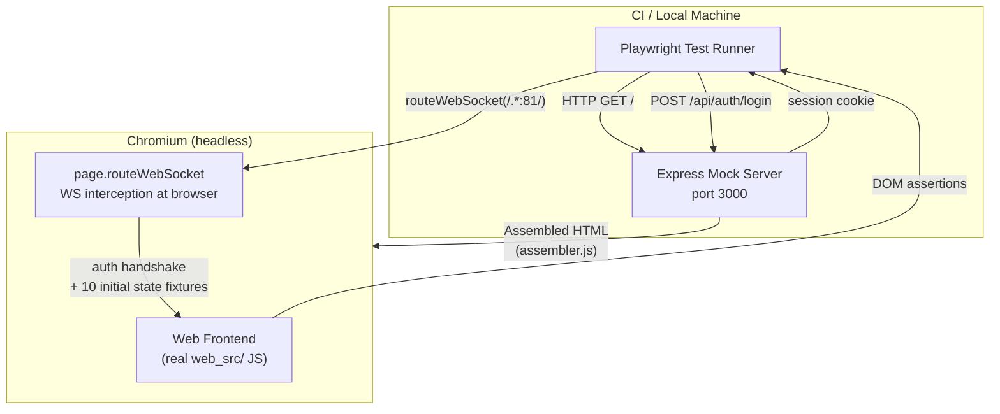
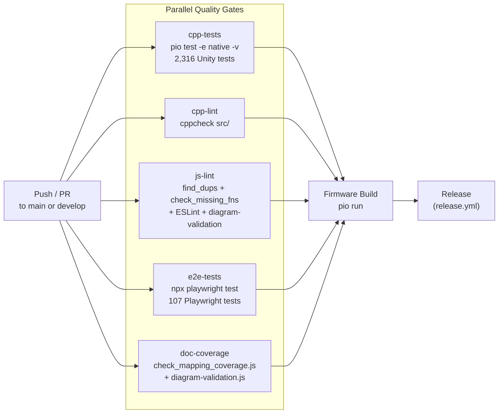

ALX Nova has three test layers that together cover firmware logic, web UI behaviour, and static code quality. All three run in the CI pipeline on every push to `main` and `develop`. The firmware build is blocked until all quality gates pass.

Full testing architecture reference: `docs-internal/testing-architecture.md`

## Test Layers at a Glance

| Layer | Tool | Count | What It Covers |
|---|---|---|---|
| C++ unit tests | Unity (PlatformIO native) | 2,316 tests / 87 modules | Firmware logic, HAL, DSP, audio pipeline, networking, auth |
| E2E browser tests | Playwright + Express mock | 107 tests / 22 specs | Web UI, WS state sync, REST API contracts, responsive layout |
| Static analysis | ESLint, cppcheck, find_dups, check_missing_fns | — | JS correctness, C++ warnings, duplicate/missing declarations |

## Layer 1: C++ Unit Tests

Tests run on the **native platform** (host machine, gcc/MinGW) using the [Unity](https://github.com/ThrowTheSwitch/Unity) assertion framework, compiled and executed by PlatformIO.

```bash
# Run all 2,316 tests across all 87 modules
pio test -e native

# Run with verbose output (show individual test names and pass/fail)
pio test -e native -v

# Run a single module
pio test -e native -f test_dsp
pio test -e native -f test_hal_core
pio test -e native -f test_audio_pipeline
```

### How Native Tests Work

PlatformIO compiles and runs test modules directly on the host machine. The firmware source (`src/`) is **not** compiled into tests; each test module includes only the headers it needs and substitutes hardware dependencies with mocks.

Key build flags for test compilation:
- `-D UNIT_TEST` — gates test-only code paths in shared headers
- `-D NATIVE_TEST` — disables hardware-specific APIs (`Serial`, `millis`, I2S, FreeRTOS)
- `test_build_src = no` — prevents `src/` from being compiled as part of each test build

### Mock Headers

`test/test_mocks/` provides stubs for every Arduino and ESP-IDF dependency:

| Mock File | Simulates |
|---|---|
| `Arduino.h` | `millis()`, `micros()`, `delay()`, `analogRead()`, GPIO functions |
| `WiFi.h` | `WiFiClass` with connection state, scan results, AP mode |
| `PubSubClient.h` | MQTT client — connect, publish, subscribe, callback dispatch |
| `Preferences.h` | NVS key-value store backed by a `std::map` |
| `LittleFS.h` | In-memory file system for JSON persistence tests |
| `Wire.h` | I2C bus — configurable ACK/NACK responses for HAL driver tests |
| `i2s_std_mock.h` | ESP-IDF I2S standard driver types and return codes |
| `esp_timer.h` | `esp_timer_get_time()` backed by a controllable counter |

### Test Module Inventory

Each module lives in its own directory under `test/` to avoid duplicate `main`, `setUp`, and `tearDown` symbols:

<details>
<summary>All 87 test modules</summary>

`test_utils`, `test_auth`, `test_wifi`, `test_mqtt`, `test_settings`, `test_ota`, `test_ota_task`, `test_button`, `test_websocket`, `test_websocket_messages`, `test_api`, `test_smart_sensing`, `test_buzzer`, `test_gui_home`, `test_gui_input`, `test_gui_navigation`, `test_pinout`, `test_i2s_audio`, `test_fft`, `test_signal_generator`, `test_audio_diagnostics`, `test_audio_health_bridge`, `test_audio_pipeline`, `test_vrms`, `test_dim_timeout`, `test_debug_mode`, `test_dsp`, `test_dsp_rew`, `test_dsp_presets`, `test_dsp_swap`, `test_crash_log`, `test_task_monitor`, `test_esp_dsp`, `test_usb_audio`, `test_hal_core`, `test_hal_bridge`, `test_hal_coord`, `test_hal_dsp_bridge`, `test_hal_discovery`, `test_hal_integration`, `test_hal_eeprom_v3`, `test_hal_pcm5102a`, `test_hal_pcm1808`, `test_hal_es8311`, `test_hal_mcp4725`, `test_hal_siggen`, `test_hal_usb_audio`, `test_hal_custom_device`, `test_hal_multi_instance`, `test_hal_state_callback`, `test_hal_retry`, `test_hal_wire_mock`, `test_hal_buzzer`, `test_hal_button`, `test_hal_encoder`, `test_hal_ns4150b`, `test_hal_es9822pro`, `test_hal_es9843pro`, `test_hal_tdm_deinterleaver`, `test_hal_es9826`, `test_hal_es9821`, `test_hal_es9823pro`, `test_hal_es9820`, `test_hal_es9842pro`, `test_hal_es9840`, `test_hal_es9841`, `test_output_dsp`, `test_dac_hal`, `test_dac_eeprom`, `test_dac_settings`, `test_diag_journal`, `test_peq`, `test_evt_any`, `test_sink_slot_api`, `test_sink_write_utils`, `test_deferred_toggle`, `test_pipeline_bounds`, `test_pipeline_output`, `test_matrix_bounds`, `test_eth_manager`, `test_es8311`, `test_heap_monitor`, `test_heap_budget`, `test_pipeline_dma_guard`, `test_psram_alloc`

</details>

### Writing a New Test Module

Follow the Arrange-Act-Assert pattern. Each file needs a `setUp()` that resets all state:

```cpp
#include "unity.h"
#include "../src/my_module.h"
#include "../test/test_mocks/Arduino.h"

void setUp(void) {
    // Reset module state before each test
    my_module_reset();
}

void tearDown(void) {}

void test_my_module_does_thing(void) {
    // Arrange
    my_module_configure(42);

    // Act
    int result = my_module_process();

    // Assert
    TEST_ASSERT_EQUAL_INT(42, result);
}

int main(void) {
    UNITY_BEGIN();
    RUN_TEST(test_my_module_does_thing);
    return UNITY_END();
}
```

Create the module in its own directory: `test/test_my_module/test_my_module.cpp`. PlatformIO discovers it automatically.

:::warning Every new firmware module needs a test file
New modules that ship without a `test/test_<module>/` directory will fail the mandatory coverage check in CI. The `hal-driver-scaffold` agent creates the test module automatically — use it when adding new HAL drivers.
:::

## Layer 2: Playwright E2E Tests

E2E tests verify the entire web frontend in real Chromium against a mock Express server. No real ESP32 hardware is needed.

```bash
cd e2e

# First-time setup
npm install
npx playwright install --with-deps chromium

# Run all 107 tests
npx playwright test

# Run a single spec
npx playwright test tests/audio-inputs.spec.js

# Run with visible browser (useful when debugging)
npx playwright test --headed

# Interactive debug mode with inspector
npx playwright test --debug
```

### Architecture



The Express server assembles the real `web_src/index.html` with CSS and JS injected, so tests run against the same frontend code that ships in firmware. The WebSocket connection that the frontend opens on port 81 is intercepted by Playwright at the browser level — no actual port 81 is opened.

### connectedPage Fixture

Most tests use the `connectedPage` fixture from `e2e/helpers/fixtures.js`, which handles authentication and WebSocket setup automatically:

```javascript
// e2e/tests/my-feature.spec.js
const { test, expect } = require('@playwright/test');
const { connectedPage } = require('../helpers/fixtures');

test.use({ fixture: connectedPage });

test('my feature renders from WS state', async ({ page }) => {
    // The fixture has already:
    // 1. Logged in and set the session cookie
    // 2. Intercepted the WS connection
    // 3. Completed the auth handshake (authRequired → auth → authSuccess)
    // 4. Sent 10 initial state broadcasts
    // 5. Waited for #wsConnectionStatus = "Connected"

    await expect(page.locator('#myElement')).toHaveText('Expected Value');
});

test('my feature responds to WS update', async ({ page, wsRoute }) => {
    // Inject a new WS message mid-test
    wsRoute.send({ type: 'myFeatureState', value: 99 });
    await expect(page.locator('#myValue')).toHaveText('99');
});
```

### Key Playwright Patterns

**Tab navigation**: Use `page.evaluate()` instead of clicking sidebar items. Clicking can fail when the sidebar is scrolled or clipped:

```javascript
// Correct
await page.evaluate(() => switchTab('audio'));

// Avoid — may miss due to scroll position
await page.click('[data-tab="audio"]');
```

**CSS-hidden checkboxes**: Many toggles are `<input type="checkbox">` styled with a `label.switch` overlay. Use `toBeChecked()`, not `toBeVisible()`:

```javascript
await expect(page.locator('#mqttEnabled')).toBeChecked();
```

**Multiple matching elements**: Playwright strict mode fails if a selector matches more than one element. Use `.first()` when intentional:

```javascript
await page.locator('.channel-strip').first().click();
```

**Binary WebSocket frames**: Audio waveform and spectrum data use binary frames. Build them in helpers when needed:

```javascript
// e2e/helpers/ws-helpers.js
const frame = buildWaveformFrame(lane, samples);
wsRoute.send(frame);  // Playwright accepts Buffer for binary frames
```

### Spec Inventory

| Spec | Tests | Coverage |
|---|---|---|
| `auth.spec.js` | 3 | Login page, correct password, invalid session |
| `navigation.spec.js` | 2 | 8 sidebar tabs, default panel (Control) |
| `control-tab.spec.js` | 2 | Sensing mode radios, amplifier status from WS |
| `audio-inputs.spec.js` | 2 | Audio sub-nav, channel strip population from `audioChannelMap` |
| `audio-matrix.spec.js` | 1 | 16x16 routing matrix grid renders |
| `audio-outputs.spec.js` | 1 | Output strips with HAL device names |
| `audio-siggen.spec.js` | 1 | Signal generator enable toggle and parameters |
| `peq-overlay.spec.js` | 1 | PEQ overlay opens with frequency response canvas |
| `hal-devices.spec.js` | 4 | Device cards render, rescan/disable, capacity indicators, HAL API calls |
| `hal-adc-controls.spec.js` | 30 | ESS SABRE ADC card controls: PGA gain, HPF, filter preset, capability badges |
| `ess-2ch-adc.spec.js` | 27 | 2-channel ESS SABRE ADC expansion devices (ES9826, ES9823PRO, ES9821, ES9820) |
| `ess-4ch-tdm.spec.js` | 19 | 4-channel TDM ESS SABRE ADC expansion devices (ES9842PRO, ES9841, ES9840) |
| `wifi.spec.js` | 1 | SSID/password form, scan, saved networks, static IP |
| `mqtt.spec.js` | 1 | Enable toggle, config fields populated from WS |
| `settings.spec.js` | 1 | Theme, buzzer, display controls populated from WS |
| `ota.spec.js` | 1 | Version display, check-for-updates API call |
| `debug-console.spec.js` | 2 | Log entries render, module chip filtering |
| `dark-mode.spec.js` | 1 | Night-mode class toggle, localStorage persistence |
| `auth-password.spec.js` | 1 | Password change modal validation and API submission |
| `responsive.spec.js` | 1 | Mobile viewport: bottom bar visible, sidebar hidden |
| `hardware-stats.spec.js` | 4 | CPU/heap/PSRAM budget table, warning indicators from WS `hardware_stats` |
| `support.spec.js` | 1 | Support tab content renders |

### Fixtures

`e2e/fixtures/ws-messages/` contains 15 hand-crafted JSON files representing deterministic WebSocket broadcasts. `e2e/fixtures/api-responses/` contains 14 REST response fixtures. All values use realistic data from the actual HAL device database — timestamps are fixed at `10000` ms to avoid flaky time-dependent assertions.

## Layer 3: Static Analysis

### ESLint (JavaScript)

All JS in `web_src/js/` is concatenated into a single `<script>` block at build time, giving all files a shared scope. ESLint is configured for this shared scope with 380 declared globals:

```bash
cd e2e
npx eslint ../web_src/js/ --config ../web_src/.eslintrc.json
```

Rules enforced:
- `no-undef` — catches references to undeclared functions (common in concatenated scope)
- `no-redeclare` — catches duplicate `let`/`const` across files
- `eqeqeq` — requires `===` throughout

When you add a new top-level function or variable to any JS file, add it to the `globals` section of `web_src/.eslintrc.json`. Failing to do so will cause CI to reject the push.

### cppcheck (C++)

Static analysis runs on `src/` during CI (excluding `src/gui/` which uses third-party LVGL macros that generate false positives):

```bash
# Equivalent to CI run (scoped to warning + performance, not style)
cppcheck --enable=warning,performance -i src/gui/ src/
```

The `--suppress=badBitmaskCheck` flag is applied in CI to suppress false positives from ArduinoJson's `operator|` overload.

### Duplicate and Missing Declaration Checks

Two custom Node.js scripts check the concatenated JS for structural problems:

```bash
# Check for duplicate let/const/function declarations across JS files
node tools/find_dups.js

# Check for function calls with no matching declaration
node tools/check_missing_fns.js
```

These run in under a second and catch cross-file problems that ESLint cannot see because it lints each file in isolation.

## CI Quality Gates

Five parallel jobs gate the firmware build on every push and PR:



The firmware build runs only if all five gates are green. `release.yml` runs the same five gates again before publishing a release.

On E2E test failure, a Playwright HTML report is uploaded as a CI artifact with 14-day retention.

## Pre-commit Hooks

Fast local checks run before every commit via `.githooks/pre-commit`:

1. `node tools/find_dups.js` — duplicate JS declarations
2. `node tools/check_missing_fns.js` — undefined function references
3. ESLint on `web_src/js/`
4. `node tools/check_mapping_coverage.js` — every `src/` file mapped in `tools/doc-mapping.json`
5. `node tools/diagram-validation.js` — `@validate-symbols` checks in architecture diagrams

Activate once per local clone:

```bash
git config core.hooksPath .githooks
```

These five checks run in under 3 seconds total and catch the most common JS mistakes and documentation drift before they reach CI.

## Mandatory Coverage Requirements

Every code change must keep all tests green. The rules by change type:

### C++ Firmware Changes (`src/`)

- Run `pio test -e native -v` before opening a PR
- New modules require a `test/test_<module>/` directory
- Changed function signatures must have updated test expectations
- Use the `firmware-test-runner` agent to verify automatically

### Web UI Changes (`web_src/`)

- Run `cd e2e && npx playwright test` after every change
- New toggle / button / dropdown → add a test that sends the correct WS command
- New WS broadcast type → add a fixture JSON in `e2e/fixtures/ws-messages/` and a test that verifies the DOM updates
- New tab or section → add navigation + element presence tests
- Changed element IDs → update `e2e/helpers/selectors.js` and affected specs
- New top-level JS declarations → add to `web_src/.eslintrc.json` globals
- Use the `test-engineer` agent to verify automatically

### WebSocket Protocol Changes

When modifying `src/websocket_handler.cpp` broadcast functions:

1. Update `e2e/fixtures/ws-messages/` with the new or changed message fixture
2. Update `e2e/helpers/ws-helpers.js` — `buildInitialState()` and `handleCommand()`
3. Update `e2e/mock-server/ws-state.js` if new state fields are added
4. Add a Playwright test verifying the frontend handles the new message type
5. Run both `firmware-test-runner` and `test-engineer` agents in parallel

### REST API Changes

When adding or modifying endpoints in `src/main.cpp` or `src/hal/hal_api.cpp`:

1. Update or add the matching route in `e2e/mock-server/routes/*.js`
2. Update `e2e/fixtures/api-responses/` with the new response fixture
3. Add a Playwright test if the UI depends on the new endpoint

## Agent Workflow

Use specialised agents to run and fix tests after changes. Launch both in parallel when changes span firmware and web:

| Change Type | Agent | Action |
|---|---|---|
| C++ firmware only | `firmware-test-runner` | Runs `pio test -e native -v`, diagnoses failures |
| Web UI only | `test-engineer` | Runs Playwright, fixes selectors, adds coverage |
| Both | Launch both in parallel | Full coverage verification |
| New HAL driver | `hal-driver-scaffold` then `firmware-test-runner` | Scaffold creates test module automatically |
| New web feature | `web-feature-scaffold` then `test-engineer` | Scaffold creates DOM, then add E2E tests |
| Bug investigation | `debugger` | Root cause analysis with test reproduction |

## What Cannot Be Tested Without Hardware

The native and E2E test layers have inherent coverage gaps. These require a real ESP32-P4 board:

- I2S DMA streaming and actual audio quality
- GPIO ISR and interrupt timing
- FreeRTOS multi-core task scheduling under real audio load
- PSRAM allocation under heap pressure
- WiFi SDIO / I2C bus conflict on GPIO 48/54
- LVGL rendering on the ST7735S TFT display
