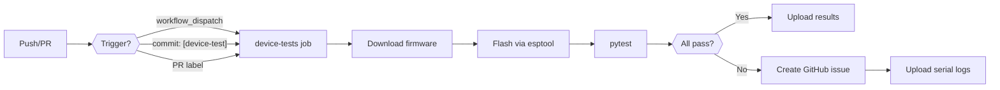
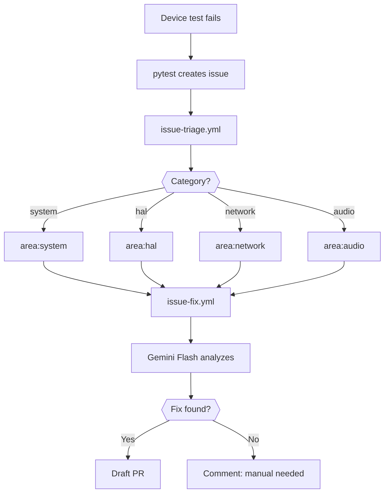

CI device testing closes the gap between software-only quality gates and real hardware behaviour. A self-hosted GitHub Actions runner keeps a Waveshare ESP32-P4-WiFi6-DEV-Kit permanently attached and runs the pytest harness against it whenever a commit needs hardware validation.

## Overview

The three software-only quality gates (C++ unit tests, Playwright E2E, static analysis) run on GitHub-hosted runners for every push and pull request. They are fast and require no hardware. The device test job is separate and opt-in: it triggers only on `workflow_dispatch`, on commits that include `[device-test]` in the message, or on pull requests labelled `device-test`.

This separation keeps the standard CI fast while still providing hardware validation when it matters — for example, before a release, after changes to I2S drivers, HAL discovery, or FreeRTOS task configuration.

## Self-Hosted Runner Setup

The runner is a Windows 11 machine with the ESP32-P4 board connected on COM8. One-time setup:

**1. Install prerequisites**

```bash
# Python 3.11+
winget install Python.Python.3.11

# PlatformIO CLI (for esptool)
pip install platformio

# Test harness dependencies
cd test/device
pip install -r requirements.txt

# GitHub CLI (for issue creation)
winget install GitHub.cli
gh auth login
```

**2. Register the runner**

Follow the GitHub Actions self-hosted runner setup for your repository at `Settings > Actions > Runners > New self-hosted runner`. Select Windows, x64. Use the generated token:

```powershell
# Run the config script provided by GitHub
./config.cmd --url https://github.com/Schmackos/ALX_Nova_Controller_2 --token <TOKEN>

# Install as a Windows service so it starts automatically
./svc.cmd install
./svc.cmd start
```

**3. Add runner labels**

In the GitHub UI, add the label `device-tester` to the runner so the workflow can target it specifically. Also add `windows` and `self-hosted` (added automatically).

**4. Set repository secrets**

In `Settings > Secrets and variables > Actions`, add:

| Secret | Value |
|---|---|
| `DEVICE_PORT` | `COM8` |
| `DEVICE_IP` | IP address the ESP32 receives on the test network |
| `DEVICE_WIFI_SSID` | SSID the device should connect to during tests |
| `DEVICE_WIFI_PASSWORD` | Password for that SSID |

**5. Verify the board is reachable**

```bash
# Check COM8 is listed
pio device list

# Flash current firmware
pio run --target upload

# Confirm serial output
pio device monitor --port COM8 --baud 115200
```

## CI Pipeline



The workflow file is `.github/workflows/device-tests.yml`. It runs only on the `device-tester` self-hosted runner and does not block the main `tests.yml` pipeline.

**Steps in detail:**

1. **Download firmware** — the workflow downloads the firmware artifact produced by the `tests.yml` build job for the same commit SHA, so it always tests the exact binary that would be released.

2. **Flash via esptool** — uses `esptool.py` (bundled with PlatformIO) to flash the firmware to COM8 at 921600 baud. Waits 5 seconds for the board to boot before proceeding.

3. **Run pytest** — executes the full device test suite. Results are written to `test-results/device-results.xml` (JUnit XML format).

4. **Upload results** — regardless of pass/fail, the JUnit XML and captured serial log are uploaded as CI artifacts with 30-day retention.

5. **Create GitHub issue** — if any tests failed, the workflow calls `gh issue create` with the failure summary, affected categories, and a link to the serial log artifact.

## Issue Flow

Failed device tests create structured GitHub issues that feed into the existing issue triage and fix automation.



Issues created by the device test workflow include:

- A `device-test-failure` label so triage can distinguish them from user-reported bugs
- The failing check category (`system`, `hal`, `network`, `audio`, `mqtt`, `i2s`, `storage`, `tasks`) as an `area:*` label applied by `issue-triage.yml`
- The full pytest failure message and the detail string from the `HealthCheckResult` struct
- A direct link to the serial log artifact

The `issue-fix.yml` workflow picks up issues labelled `device-test-failure` and passes the failure context to Gemini Flash for analysis. If a plausible fix is identified, a draft PR is opened. If not, a comment is added explaining why manual investigation is needed.

## Trigger Configuration

| Trigger | How to use | When to use |
|---|---|---|
| `workflow_dispatch` | GitHub UI — Actions tab — Run workflow | Ad-hoc validation, testing a specific branch |
| `[device-test]` in commit message | Include the string anywhere in the commit message | When a commit changes I2S, HAL, audio pipeline, or FreeRTOS tasks |
| `device-test` PR label | Add the label to a pull request in the GitHub UI | For any PR that needs hardware sign-off before merge |
| Scheduled (nightly) | Configured in `device-tests.yml` cron | Automatic regression detection on `main` |

The nightly schedule runs at 02:00 UTC against the latest commit on `main`. It tests the production firmware path end-to-end and creates issues if anything has regressed since the last passing run.

## Troubleshooting

**Board not found on COM8**

Check that the board is connected and the port is not in use by another process (e.g., `pio device monitor`). The runner service runs as a background process — make sure no interactive terminal has the port open.

```bash
# List available ports
pio device list

# Kill any hanging monitor sessions
taskkill /F /IM python.exe
```

**Flash fails with "Failed to connect"**

Hold the BOOT button on the board while the flash command starts, then release. Some boards need manual boot mode entry. If the problem persists, reduce the baud rate:

```bash
esptool.py --port COM8 --baud 460800 write_flash 0x0 firmware.bin
```

**Tests time out waiting for deferred phase**

The deferred health check phase fires 30 seconds after boot. If WiFi does not connect within that window (wrong SSID/password, AP not reachable from the test network), the deferred checks time out. Verify the `DEVICE_WIFI_SSID` and `DEVICE_WIFI_PASSWORD` secrets match the test network.

**pytest cannot reach the device IP**

The device must be on the same network as the runner. Check that the IP in `DEVICE_IP` matches what the board received (visible in serial output as `[WiFi] Connected, IP: ...`). If the device gets a different IP each time, configure a DHCP reservation based on the board's MAC address.

**Serial log shows PSRAM allocation failures**

The test network configuration (WiFi init, MQTT if enabled) consumes internal SRAM. If the device was previously tested with different firmware that left different NVS settings, factory-reset it before running the suite:

```bash
esptool.py --port COM8 erase_flash
# Then flash firmware again
```
