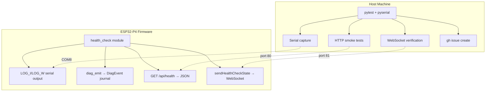
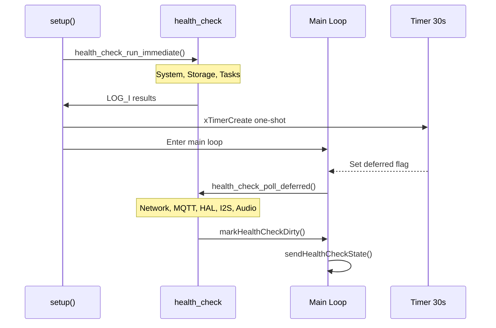
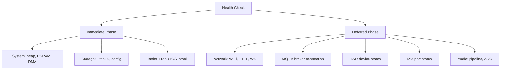
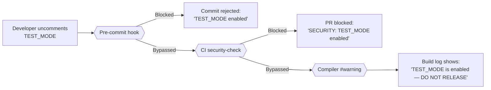

On-device testing runs against a real ESP32-P4 board connected over USB. It covers the gaps that native unit tests and Playwright E2E tests cannot reach: I2S DMA streaming, GPIO interrupts, FreeRTOS multi-core scheduling, PSRAM allocation under real heap pressure, and the WiFi SDIO / I2C bus interaction.

## Overview

The on-device test suite has two parts that work together:

| Part | What it does |
|---|---|
| `health_check` firmware module | Runs structured checks at boot and after network comes up; reports results via serial, REST, and WebSocket |
| Python pytest harness | Connects to the board over serial and HTTP, collects results, and creates GitHub issues on failure |

This is distinct from the three CI-gated test layers (Unity C++ tests, Playwright E2E, static analysis). Those run without hardware on every push. The device harness runs on a self-hosted runner with a board attached, either on demand or when a commit message includes `[device-test]`.

## Health Check Architecture



The `health_check` module (`src/health_check.h` / `src/health_check.cpp`) is the single source of truth for on-device health state. All four output channels (serial, DiagEvent journal, REST API, WebSocket broadcast) draw from the same internal result structs, so the pytest harness can verify results via whichever channel is most convenient for each check type.

## Two-Phase Boot

Health checks are split across two phases to avoid blocking the boot sequence while network interfaces initialise.



**Immediate phase** (`health_check_run_immediate()`) — called at the end of `setup()` before the main loop starts. These checks have no network dependency and complete in milliseconds:

- Internal heap and PSRAM sizing
- LittleFS mount and config file presence
- FreeRTOS task creation verification
- DMA buffer pre-allocation result

**Deferred phase** (`health_check_poll_deferred()`) — triggered by a 30-second one-shot FreeRTOS timer. Called from the main loop when the deferred flag is set. By this point WiFi has had time to connect and HAL discovery has completed:

- WiFi association and IP assignment
- HTTP server reachability (self-probe on localhost)
- WebSocket server bind
- MQTT broker reachability (if configured)
- HAL device availability counts
- I2S port status for all three ports
- Audio pipeline DMA health

## Check Categories



Each check produces a `HealthCheckResult` struct with three fields:

| Field | Type | Description |
|---|---|---|
| `category` | `const char*` | Category name (e.g., `"system"`, `"hal"`) |
| `pass` | `bool` | True if the check passed |
| `detail` | `char[64]` | Human-readable detail string, included in serial output and REST response |

Failed checks also call `diag_emit()` with the appropriate diagnostic code so failures appear in the DiagEvent journal and the web UI Health Dashboard.

## Running Tests

The pytest harness lives in `device_tests/`. Install dependencies once:

```bash
cd device_tests
pip install -r requirements.txt
```

Run the full suite against the board:

```bash
pytest tests/ --device-port COM8 --device-ip 192.168.178.229 --device-password test1234 -v
```

Run without slow tests (recommended for iterative development):

```bash
pytest tests/ --device-port COM8 --device-ip 192.168.178.229 -m "not slow" -v
```

Run a specific module:

```bash
pytest tests/test_hal_advanced.py --device-port COM8 --device-ip 192.168.178.229 -v
```

### CLI Options

| Flag | Default | Description |
|------|---------|-------------|
| `--device-port` | `COM8` | Serial port for the ESP32-P4 |
| `--device-ip` | `192.168.4.1` | Device IP address (AP mode default) |
| `--device-password` | `test1234` | Web UI password (TEST\_MODE default) |
| `--baud` | `115200` | Serial baud rate |
| `-m "not slow"` | — | Skip slow tests (HAL scan, reboot) |
| `--create-issues` | — | Auto-create GitHub issues on failure |
| `--timeout` | `120` | Per-test timeout in seconds |

## Test Modules

The device test suite contains **105 tests across 9 modules** in `device_tests/tests/`:

| Module | Tests | Category | What It Validates |
|--------|-------|----------|-------------------|
| `test_boot_health.py` | 8 | Boot | Serial errors, auth init, settings loaded, HAL discovery, heap, crash log, uptime |
| `test_health_check.py` | 12 | Health | `GET /api/health` response schema, verdict, counts, per-check fields, duration, deferred phase |
| `test_hal_devices.py` | 6 | HAL | Device list, onboard present, no errors, valid configs, DB presets, pin conflicts |
| `test_hal_advanced.py` | 31 | HAL | DB completeness, scan behavior, config updates, validation boundaries, reinit, CRUD lifecycle, custom devices, error handling |
| `test_dsp_audio.py` | 24 | Audio | DSP config/metrics/bypass/presets, signal generator, pipeline matrix, DAC, THD, diagnostics |
| `test_audio.py` | 8 | Audio | I2S ports, pipeline matrix, DAC status, PSRAM, DMA, pause state, heap budget |
| `test_network.py` | 6 | Network | Reachable, WiFi status, security headers, auth required, auth status, WS port |
| `test_mqtt.py` | 4 | MQTT | Config readable, connected if configured, HA discovery, diagnostics (3 skip when not configured) |
| `test_settings.py` | 5 | Settings | Get, export, darkMode toggle, reboot persistence (@slow), auth change validation |

### Pytest Markers

Filter tests by category using markers defined in `pytest.ini`:

```bash
pytest tests/ -m "boot" -v              # Boot health only
pytest tests/ -m "hal" -v               # All HAL tests
pytest tests/ -m "audio" -v             # DSP + audio tests
pytest tests/ -m "not slow" -v          # Skip slow tests (scan, reboot)
pytest tests/ -m "not reboot" -v        # Skip reboot tests
pytest tests/ -m "health" -v            # Health check endpoint only
```

Available markers: `boot`, `health`, `hal`, `audio`, `network`, `mqtt`, `settings`, `reboot`, `slow`.

## TEST\_MODE Build Flag

For local device test development, the firmware supports a `TEST_MODE` build flag that removes authentication friction:

| Feature | Normal Build | TEST\_MODE Build |
|---|---|---|
| Default password | Random 10-char (per device) | Fixed `test1234` |
| Login rate limiting | Progressive delays (1s → 30s) | Disabled |
| REST API rate limiting | 30 req/s per IP | Disabled |
| PBKDF2 hashing | 50k iterations (~15-20s on P4) | 50k iterations (unchanged) |

### Enabling TEST\_MODE

**Option 1 — Uncomment in platformio.ini** (cannot be committed):

```ini
; -D TEST_MODE  ; Uncomment for local testing only
```

**Option 2 — Command line** (preferred, no file changes):

```bash
PLATFORMIO_BUILD_FLAGS="-DTEST_MODE" pio run --target upload
```

### Security Safeguards

TEST\_MODE must **never** ship in production firmware. Four layers prevent this:



| Layer | File | What it does |
|---|---|---|
| **Commented by default** | `platformio.ini` | `; -D TEST_MODE` — must be explicitly uncommented |
| **Pre-commit hook** | `.githooks/pre-commit` | `grep` rejects commits with uncommented `-D TEST_MODE` |
| **CI gate** | `.github/workflows/tests.yml` | `security-check` job blocks PRs with TEST\_MODE enabled |
| **Compiler warning** | `src/auth_handler.cpp` | `#warning` in build output when TEST\_MODE is defined |

:::danger
**Never commit `platformio.ini` with TEST\_MODE uncommented.** The pre-commit hook and CI gate will reject it, but defence in depth requires awareness. If you need TEST\_MODE for a CI device-test runner, use a separate PlatformIO environment or pass the flag via environment variable.
:::

After enabling TEST\_MODE, a full flash erase is required to reset the stored password hash:

```bash
# Erase all flash (NVS + LittleFS + firmware)
PYTHONIOENCODING=utf-8 ~/.platformio/penv/Scripts/python.exe -m esptool --port COM8 erase-flash

# Reflash firmware
PYTHONIOENCODING=utf-8 pio run --target upload
```

The device will boot with password `test1234` and serial output confirms:

```
[W] [Auth] TEST MODE: using fixed password 'test1234'
[I] [Auth] Default password: test1234
```

## Adding New Checks

To add a check to the `health_check` module:

1. **Append a new entry** to the flat `checks[]` array in `src/health_check.cpp`. Each entry is a `HealthCheckItem` with three fields: `name` (check identifier string), `status` (`"pass"`, `"warn"`, `"fail"`, or `"skip"`), and `detail` (human-readable string up to 64 characters). There are no nested category structs — all checks live in a single flat array.

2. **Implement the check** in the correct phase function. Follow the existing pattern:

```cpp
// In health_check_run_immediate() for system/storage checks
// In health_check_poll_deferred() for network/HAL/audio checks
HealthCheckItem item;
item.name = "my_check";
if (some_condition) {
    item.status = "pass";
    snprintf(item.detail, sizeof(item.detail), "value=%d OK", actual);
} else {
    item.status = "fail";
    snprintf(item.detail, sizeof(item.detail), "expected %d got %d", expected, actual);
    diag_emit(DIAG_MY_CHECK_FAIL, item.detail);
}
LOG_I("[HealthCheck] my_check: %s — %s", item.status, item.detail);
_checks.push_back(item);
```

3. **Expose via REST** — the `GET /api/health` serialiser in `src/health_check_api.cpp` iterates `_checks[]` automatically. New entries appear in the `checks[]` array without further changes.

4. **Expose via WebSocket** — `sendHealthCheckState()` in `src/websocket_broadcast.cpp` serialises the same `_checks[]` array. No additional changes needed for new flat entries.

5. **Add a pytest test** in `device_tests/tests/test_health_check.py`. Access the new check by `name` from the flat `checks` list:

```python
def test_my_check_passes(health_api):
    result = health_api.get_health()
    check = next(c for c in result["checks"] if c["name"] == "my_check")
    assert check["status"] == "pass", check["detail"]
```

6. **Add a diagnostic code** in `src/diag_error_codes.h` if the check warrants a distinct code (follow the existing `DIAG_*` naming convention and numeric range for the category).

7. **Add a pytest marker** to `device_tests/pytest.ini` if the new check belongs to a new category not already covered by the existing markers (`boot`, `health`, `hal`, `audio`, `network`, `mqtt`, `settings`).
