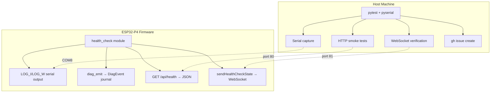
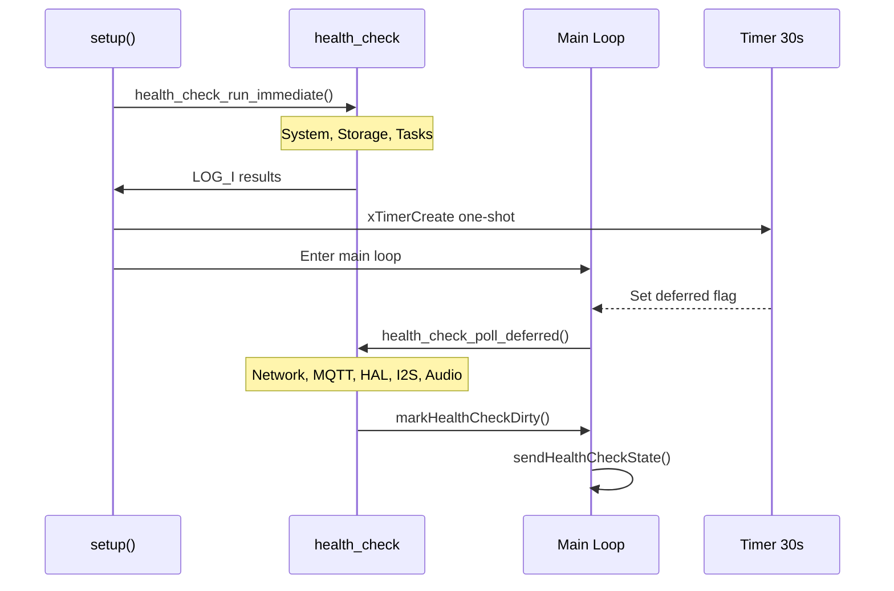
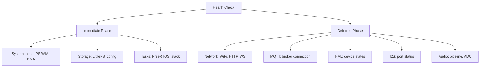
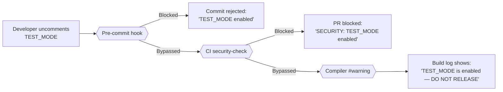

On-device testing runs against a real ESP32-P4 board connected over USB. It covers the gaps that native unit tests and Playwright E2E tests cannot reach: I2S DMA streaming, GPIO interrupts, FreeRTOS multi-core scheduling, PSRAM allocation under real heap pressure, and the WiFi SDIO / I2C bus interaction.

## Overview

The on-device test suite has two parts that work together:

| Part | What it does |
|---|---|
| `health_check` firmware module | Runs structured checks at boot and after network comes up; reports results via serial, REST, and WebSocket |
| Python pytest harness | Connects to the board over serial and HTTP, collects results, and creates GitHub issues on failure |

This is distinct from the three CI-gated test layers (Unity C++ tests, Playwright E2E, static analysis). Those run without hardware on every push. The device harness runs on a self-hosted runner with a board attached, either on demand or when a commit message includes `[device-test]`.

## Health Check Architecture



The `health_check` module (`src/health_check.h` / `src/health_check.cpp`) is the single source of truth for on-device health state. All four output channels (serial, DiagEvent journal, REST API, WebSocket broadcast) draw from the same internal result structs, so the pytest harness can verify results via whichever channel is most convenient for each check type.

## Two-Phase Boot

Health checks are split across two phases to avoid blocking the boot sequence while network interfaces initialise.



**Immediate phase** (`health_check_run_immediate()`) — called at the end of `setup()` before the main loop starts. These checks have no network dependency and complete in milliseconds:

- Internal heap and PSRAM sizing
- LittleFS mount and config file presence
- FreeRTOS task creation verification
- DMA buffer pre-allocation result

**Deferred phase** (`health_check_poll_deferred()`) — triggered by a 30-second one-shot FreeRTOS timer. Called from the main loop when the deferred flag is set. By this point WiFi has had time to connect and HAL discovery has completed:

- WiFi association and IP assignment
- HTTP server reachability (self-probe on localhost)
- WebSocket server bind
- MQTT broker reachability (if configured)
- HAL device availability counts
- I2S port status for all three ports
- Audio pipeline DMA health

## Check Categories



Each check produces a `HealthCheckResult` struct with three fields:

| Field | Type | Description |
|---|---|---|
| `category` | `const char*` | Category name (e.g., `"system"`, `"hal"`) |
| `pass` | `bool` | True if the check passed |
| `detail` | `char[64]` | Human-readable detail string, included in serial output and REST response |

Failed checks also call `diag_emit()` with the appropriate diagnostic code so failures appear in the DiagEvent journal and the web UI Health Dashboard.

## Running Tests

The pytest harness lives in `device_tests/`. Install dependencies once:

```bash
cd device_tests
pip install -r requirements.txt
```

Run the full suite against the board:

```bash
pytest tests/ --device-port COM8 --device-ip 192.168.178.229 --device-password test1234 -v
```

Run without slow tests (recommended for iterative development):

```bash
pytest tests/ --device-port COM8 --device-ip 192.168.178.229 -m "not slow" -v
```

Run a specific module:

```bash
pytest tests/test_hal_advanced.py --device-port COM8 --device-ip 192.168.178.229 -v
```

### CLI Options

| Flag | Default | Description |
|------|---------|-------------|
| `--device-port` | `COM8` | Serial port for the ESP32-P4 |
| `--device-ip` | `192.168.4.1` | Device IP address (AP mode default) |
| `--device-password` | `test1234` | Web UI password (TEST\_MODE default) |
| `--baud` | `115200` | Serial baud rate |
| `-m "not slow"` | — | Skip slow tests (HAL scan, reboot) |
| `--create-issues` | — | Auto-create GitHub issues on failure (wired via `pytest_runtest_makereport` hook; reads firmware version from `/api/settings` automatically) |
| `--timeout` | `120` | Per-test timeout in seconds |

## Test Modules

The device test suite contains **206 tests across 21 modules** in `device_tests/tests/`:

| Module | Tests | Category | What It Validates |
|--------|-------|----------|-------------------|
| `test_boot_health.py` | 8 | Boot | Serial errors, auth init, settings loaded, HAL discovery, heap, crash log, uptime |
| `test_health_check.py` | 12 | Health | `GET /api/health` response schema, verdict, counts, per-check fields, duration, deferred phase |
| `test_hal_devices.py` | 7 | HAL | Device list, onboard present, no errors, valid configs, DB presets, scan, pin conflicts |
| `test_hal_advanced.py` | 31 | HAL | DB completeness, scan behavior, config updates, validation enforcement, reinit, CRUD lifecycle, custom devices, error handling |
| `test_dsp_audio.py` | 24 | Audio | DSP config/metrics/bypass/presets, signal generator, pipeline matrix, DAC, THD, diagnostics |
| `test_dsp_extended.py` | 20 | Audio/DSP | DSP stage CRUD, crossover, baffle step, import/export (APO/miniDSP/JSON), preset CRUD, PEQ presets |
| `test_output_dsp.py` | 9 | Audio/DSP | Per-output post-matrix DSP: config, bypass, stage add/delete, crossover, validation |
| `test_audio.py` | 12 | Audio | I2S ports, pipeline matrix, DAC status, PSRAM, DMA, pause state, heap budget, smart sensing, input names roundtrip, sensing mode roundtrip |
| `test_rest_ws_sync.py` | 5 | Sync | REST→WS state propagation: DSP bypass, buzzer, HAL scan, signal gen, HAL config mute |
| `test_serial_correlation.py` | 3 | Serial | API calls produce expected serial log output: HAL scan, settings change, signal generator |
| `test_reboot_persistence.py` | 5 | Reboot | Settings survive reboot across /config.json, /hal\_config.json, NVS, /inputnames.txt |
| `test_performance.py` | 3 | Perf | Response time budgets: health, diagnostics, HAL devices (each under 500ms) |
| `test_stress.py` | 2 | Stress | Concurrent load: 25 parallel GETs, mixed endpoints, rate limit compliance |
| `test_websocket.py` | 15 | WS/Network | Auth handshake, command dispatch, binary frames, multi-client, oversized message |
| `test_wifi.py` | 9 | WiFi/Network | Status, RSSI, scan, saved networks, validation (read-only) |
| `test_ethernet.py` | 8 | Ethernet/Network | Status, hostname, link state, config validation (no IP changes) |
| `test_ota.py` | 7 | OTA | Update status, version match, releases, validation (read-only) |
| `test_dac_eeprom.py` | 6 | Audio/HAL | EEPROM read, scan, presets, parsed fields, validation (read-only) |
| `test_network.py` | 6 | Network | Reachable, WiFi status, security headers, auth required, auth status, WS port |
| `test_mqtt.py` | 4 | MQTT | Config readable, connected if configured, HA discovery, diagnostics |
| `test_settings.py` | 9 | Settings | Get, export, darkMode toggle, reboot persistence, auth validation, import roundtrip, export v2 |

### Pytest Markers

Filter tests by category using markers defined in `pytest.ini`:

```bash
pytest tests/ -m "boot" -v              # Boot health only
pytest tests/ -m "hal" -v               # All HAL tests
pytest tests/ -m "audio" -v             # DSP + audio tests
pytest tests/ -m "ws" -v                # WebSocket protocol tests
pytest tests/ -m "sync" -v              # REST-to-WS state sync tests
pytest tests/ -m "perf" -v              # Response time performance tests
pytest tests/ -m "stress" -v            # Concurrent load stress tests
pytest tests/ -m "wifi" -v              # WiFi management tests
pytest tests/ -m "ethernet" -v          # Ethernet tests
pytest tests/ -m "ota" -v               # OTA tests (read-only)
pytest tests/ -m "dsp" -v               # DSP pipeline tests
pytest tests/ -m "not slow" -v          # Skip slow tests (scan, reboot, OTA)
pytest tests/ -m "not reboot" -v        # Skip reboot tests
pytest tests/ -m "health" -v            # Health check endpoint only
```

Available markers: `boot`, `health`, `hal`, `audio`, `network`, `mqtt`, `settings`, `reboot`, `slow`, `ws`, `wifi`, `ethernet`, `ota`, `dsp`, `sync`, `perf`, `stress`.

## HAL Testing in Depth

`test_hal_advanced.py` (31 tests across 8 classes) covers the full HAL REST API surface beyond the basic device-list checks in `test_hal_devices.py`. All write operations restore original state after each test.

### Device Database

`TestHalDeviceDatabase` verifies that the in-memory device database is populated and correctly structured:

- The `GET /api/hal/db` response contains at least 10 builtin entries.
- Each entry has at minimum a `compatible` or `name` field.
- `GET /api/hal/scan/unmatched` returns a valid JSON object (exposes I2C addresses that responded on the bus but had no matching EEPROM or driver).

### Scan Behavior

`TestHalScanBehavior` (all `@slow`) verifies the async scan lifecycle:

- `POST /api/hal/scan` returns 202 (async started), 200 (sync result), or 409 (scan already running). The test waits 5 seconds for the async scan to finish before proceeding.
- Two back-to-back scan requests — the second should receive 409 if the first is still running, documenting the `_halScanInProgress` conflict guard.
- The 202/200 response body includes a `partialScan` boolean that is `true` when Bus 0 (GPIO 48/54) was skipped due to the WiFi SDIO conflict.

### Config Update Roundtrips

`TestHalConfigUpdates` makes write calls against live devices and restores state:

- **Mute roundtrip** — finds the first device with `HAL_CAP_MUTE` (capability bit 2), toggles `cfgMute`, verifies HTTP 200, then restores.
- **Volume roundtrip** — finds the first device with `HAL_CAP_HW_VOLUME` (capability bit 0), sets `cfgVolume` to 50, verifies HTTP 200, then restores.
- **Auto-discovery toggle** — reads `GET /api/hal/settings`, toggles `halAutoDiscovery`, verifies HTTP 200 from `PUT /api/hal/settings`, then restores.

Tests skip with a descriptive message when no suitable device is found.

### Config Validation

`TestHalConfigValidation` documents the current boundary-checking behaviour of `PUT /api/hal/devices`. Several validation gaps exist in the firmware at the time of writing — these tests are written to **pass in both the current and fixed states**, so they act as live documentation rather than blocking tests:

| Test | Current behaviour | Fixed behaviour |
|---|---|---|
| GPIO pin > 54 | HTTP 200 accepted | HTTP 400/422 |
| I2S port > 2 | HTTP 200 accepted | HTTP 400/422 |
| I2C bus > 2 | HTTP 200 accepted | HTTP 400/422 |
| Non-existent slot (31) | HTTP 400 or 404 | HTTP 400 or 404 |
| Missing `slot` field | HTTP 400 or 422 | HTTP 400 or 422 |

When the firmware is updated to call `hal_validate_config()` in the PUT handler, the first three tests will automatically pass with the new 422 response without needing test changes.

### Device Reinit

`TestHalReinit` exercises `POST /api/hal/devices/reinit`:

- Reinitialising an AVAILABLE device (state 3) should return 200 and leave the device non-ERROR after a 1-second settle.
- Slot 31 (always empty) must return 400 or 404.
- A body with no `slot` field must return 400 or 422.

### CRUD Lifecycle

`TestHalDeviceLifecycle` probes the error paths of the add/remove lifecycle without actually registering new devices:

- Registering an unknown compatible string (`"nonexistent,fake-device-xyz"`) must return 404 or 422.
- Deleting an empty slot (30) must return 400 or 404.
- DELETE with no request body must return 400 or 422.
- POST without a `compatible` field must return 400 or 422.

### Custom Device Schemas

`TestHalCustomDevices` tests the `GET/POST/DELETE /api/hal/devices/custom` endpoints used by the web UI custom device creator:

- Listing custom schemas (`GET`) returns HTTP 200 with a JSON object.
- A minimal Tier 1 schema (I2S passthrough, no I2C) can be uploaded and then deleted. The test skips if the firmware rejects the schema format, allowing for schema evolution without test breakage.
- A compatible string containing `../` must be rejected with 400, 403, or 422 — this verifies the `sanitize_filename()` path traversal guard.
- A schema missing the `compatible` field must return 400 or 422.
- Deleting a non-existent schema name must return 400 or 404.

### Error Handling

`TestHalErrorHandling` validates the structural integrity of the device list:

- Sending a raw non-JSON body to `PUT /api/hal/devices` must return 400 or 422.
- All `state` values in the device list must be valid enum integers (0–7).
- All `slot` values must be within the 0–31 range.
- No two devices may share the same slot number.
- Devices in ERROR state (state 5) must have a non-empty `lastError` field.

## DSP and Audio Testing

`test_dsp_audio.py` (24 tests across 6 classes) covers the DSP engine, signal generator, pipeline matrix, DAC, THD measurement, and audio diagnostics. All write tests restore original state.

### DSP Configuration

`TestDspConfig` exercises the DSP REST API:

- `GET /api/dsp` returns a valid config object containing `dspEnabled` or `enabled`.
- `GET /api/dsp/metrics` returns processing metrics — `cpuLoad` and/or `processTimeUs`.
- Bypass toggle roundtrip via `POST /api/dsp/bypass` — sets `bypass: true` then `bypass: false`, both returning 200.
- `GET /api/dsp/channel?ch=0` returns a channel config dict.
- Channel bypass roundtrip via `POST /api/dsp/channel/bypass?ch=0` — same on/off pattern.
- `GET /api/dsp/presets` returns a response with `slots` array or a list.
- `GET /api/dsp/peq/presets` returns a response with a `presets` array.
- `GET /api/dsp/export/json` returns the full DSP config as a JSON object.

### Signal Generator

`TestSignalGenerator` verifies the signal generator control surface:

- `GET /api/signalgenerator` returns state with `enabled`, `waveform`, and `frequency` fields.
- The reported waveform must be one of `sine`, `square`, `white_noise`, or `sweep`.
- The reported frequency must be in the range 1–22000 Hz.
- Enable/disable roundtrip — enables with `sine` at 1000 Hz / -20 dB, reads back `enabled: true`, then restores original enabled state.
- The reported amplitude must be in the range -96 to 0 dB.

### Pipeline Matrix

`TestPipelineMatrix` checks the 32×32 routing matrix:

- `GET /api/pipeline/matrix` response contains `matrix` and `size` fields, with `size == 32`.
- The matrix array is square — every row has the same number of columns as there are rows.
- Cell set and restore via `POST /api/pipeline/matrix/cell` — sets cell \[0\]\[0\] to -6 dB and restores the original value.
- `GET /api/pipeline/sinks` returns a list (may be empty if no DAC is enabled).

### DAC Endpoints

`TestDacEndpoints` validates the DAC API:

- `GET /api/dac` returns 200 with a `success` field.
- Reported volume (if present) must be 0–100.
- `GET /api/dac/drivers` returns 200 with a `drivers` key or `success` field.

### THD Measurement

`TestThdMeasurement` checks that the THD+N measurement endpoint is reachable without triggering a measurement:

- `GET /api/thd` returns 200 with a `measuring` boolean field.

### Audio Diagnostics

`TestAudioDiagnostics` validates the diagnostic subsystem from an audio perspective:

- `GET /api/diag/snapshot` returns a JSON object with more than 5 keys.
- `GET /api/diagnostics/journal` returns 200 with an `entries` or `journal` list.
- On a healthy device, no audio error diagnostics (error codes `0x2001`–`0x200E` at Error or Critical severity) should be present in the journal.

## WebSocket Protocol Testing

`test_websocket.py` (15 tests across 4 classes) is the only test module that exercises the firmware's WebSocket server (port 81). It uses the `DeviceWebSocket` utility class from `device_tests/utils/ws_client.py` — a synchronous client built on the `websocket-client` library.

### Auth Handshake

`TestWebSocketAuth` verifies the token-based authentication flow:

- Connecting to port 81 must produce an `authRequired` JSON message as the first frame.
- Sending a valid WS token (obtained from `GET /api/ws-token`) must produce `authSuccess`.
- An invalid token produces `authFailed` and the server disconnects.
- Connecting but never authenticating results in a server-side timeout (~5s) and disconnect.
- After successful auth, the firmware sends initial state broadcasts — at least 3 of the 17 state types (WiFi, HAL, DSP, DAC, etc.) must arrive within 3 seconds.

### Command Dispatch

`TestWebSocketCommands` verifies that JSON commands produce expected responses:

- `getHardwareStats` → `hardwareStats` response with heap info.
- `getHealthCheck` → `healthCheckState` response.
- `setDebugMode` roundtrip — enable then disable, both produce `debugState` broadcast.
- `subscribeAudio` enable/disable doesn't crash.
- A message >4096 bytes is silently rejected without crashing the connection.

### Binary Frames

`TestWebSocketBinaryFrames` subscribes to audio data and verifies binary frame format:

- Waveform frames start with byte `0x01` and are 258 bytes (`[type:1][adc:1][samples:256]`).
- Spectrum frames start with byte `0x02` and are 70 bytes (`[type:1][adc:1][freq:f32LE][bands:16×f32LE]`).
- Tests skip gracefully if no ADC data is available (no audio input connected).

### Edge Cases

- Two authenticated clients can coexist (multi-client test).
- Commands sent without authentication are ignored or cause disconnect.

## DSP Extended Testing

`test_dsp_extended.py` (20 tests across 5 classes) covers DSP operations not tested in the base `test_dsp_audio.py` module — primarily stage CRUD, crossover, import/export, and preset management.

### Stage CRUD

`TestDspStageCrud` exercises the full add/update/delete lifecycle for DSP stages:

- Add a PEQ stage to channel 0, update its parameters, delete it.
- Full add-delete roundtrip: verify stage count increments and decrements.
- Reorder stages within a channel.
- Toggle stage enable/disable.
- Invalid channel number (99) returns 400/422.

All tests use a `_cleanup_test_stages()` helper that brute-force removes all stages from the test channel, ensuring clean state even on test failure.

### Crossover

`TestDspCrossover` applies signal-processing presets and verifies responses:

- LR4 crossover at 2000 Hz on channel 0.
- Baffle step correction with 200mm diameter.

### Import/Export

`TestDspImportExport` verifies format conversion:

- Export to Equalizer APO and miniDSP text formats.
- JSON export/reimport roundtrip (export, PUT the export back).
- Stereo link toggle on channel pair.

### Preset CRUD

`TestDspPresetCrud` uses slot 7 (avoiding user presets) for save/load/rename/delete lifecycle. `TestPeqPresets` does the same for named PEQ presets.

## Output DSP Testing

`test_output_dsp.py` (9 tests across 3 classes) covers the per-output mono DSP engine applied post-matrix and pre-sink (`/api/output/dsp` endpoints).

- Read output channel config, toggle per-channel and global bypass.
- Add and delete gain stages.
- Apply output crossover.
- Validation: invalid channel, missing parameters, out-of-range stage index.

## WiFi, Ethernet, OTA, and EEPROM Testing

These modules test read-only or validation-only operations to avoid disrupting the test runner's network connection or the device's firmware.

### WiFi (`test_wifi.py`, 9 tests)

- Status fields: mode, SSID, RSSI range (-100 to 0 dBm), IP format validation.
- Scan: trigger scan, verify network fields (ssid, rssi, encryption).
- Validation: empty SSID rejected, nonexistent network removal handled safely.
- **No tests change WiFi state** — that would disconnect the runner.

### Ethernet (`test_ethernet.py`, 8 tests)

- Status: linkUp boolean, hostname field, required fields present.
- Validation: invalid hostname (leading hyphen), invalid IP format, missing static IP fields.
- Safe operations: confirm with no pending change, hostname roundtrip.
- **No tests change the IP address** — that would disconnect the runner.

### OTA (`test_ota.py`, 7 tests)

- Status: update status JSON, version match against `/api/settings`.
- Read-only: check update, releases list (requires internet, skips in AP mode).
- Validation: missing version param, nonexistent version, start update with no update available.
- **No tests trigger firmware download or flash.**

### DAC EEPROM (`test_dac_eeprom.py`, 6 tests)

- Read: EEPROM state, scan I2C bus, presets list, parsed device info.
- Validation: program with empty body, zero read errors.
- **No tests program or erase the EEPROM.**

### Settings Import (`test_settings.py`, +4 tests)

- Import the device's own export (no-op roundtrip).
- Invalid JSON and empty body rejection.
- Export v2 structure validation (exportInfo, settings sections).

## TEST\_MODE Build Flag

For local device test development, the firmware supports a `TEST_MODE` build flag that removes authentication friction:

| Feature | Normal Build | TEST\_MODE Build |
|---|---|---|
| Default password | Random 10-char (per device) | Fixed `test1234` |
| Login rate limiting | Progressive delays (1s → 30s) | Disabled |
| REST API rate limiting | 30 req/s per IP | Disabled |
| PBKDF2 hashing | 50k iterations (~15-20s on P4) | 50k iterations (unchanged) |

### Enabling TEST\_MODE

**Option 1 — Uncomment in platformio.ini** (cannot be committed):

```ini
; -D TEST_MODE  ; Uncomment for local testing only
```

**Option 2 — Command line** (preferred, no file changes):

```bash
PLATFORMIO_BUILD_FLAGS="-DTEST_MODE" pio run --target upload
```

### Security Safeguards

TEST\_MODE must **never** ship in production firmware. Four layers prevent this:



| Layer | File | What it does |
|---|---|---|
| **Commented by default** | `platformio.ini` | `; -D TEST_MODE` — must be explicitly uncommented |
| **Pre-commit hook** | `.githooks/pre-commit` | `grep` rejects commits with uncommented `-D TEST_MODE` |
| **CI gate** | `.github/workflows/tests.yml` | `security-check` job blocks PRs with TEST\_MODE enabled |
| **Compiler warning** | `src/auth_handler.cpp` | `#warning` in build output when TEST\_MODE is defined |

:::danger
**Never commit `platformio.ini` with TEST\_MODE uncommented.** The pre-commit hook and CI gate will reject it, but defence in depth requires awareness. If you need TEST\_MODE for a CI device-test runner, use a separate PlatformIO environment or pass the flag via environment variable.
:::

After enabling TEST\_MODE, a full flash erase is required to reset the stored password hash:

```bash
# Erase all flash (NVS + LittleFS + firmware)
PYTHONIOENCODING=utf-8 ~/.platformio/penv/Scripts/python.exe -m esptool --port COM8 erase-flash

# Reflash firmware
PYTHONIOENCODING=utf-8 pio run --target upload
```

The device will boot with password `test1234` and serial output confirms:

```
[W] [Auth] TEST MODE: using fixed password 'test1234'
[I] [Auth] Default password: test1234
```

## Adding New Checks

To add a check to the `health_check` module:

1. **Append a new entry** to the flat `checks[]` array in `src/health_check.cpp`. Each entry is a `HealthCheckItem` with three fields: `name` (check identifier string), `status` (`"pass"`, `"warn"`, `"fail"`, or `"skip"`), and `detail` (human-readable string up to 64 characters). There are no nested category structs — all checks live in a single flat array.

2. **Implement the check** in the correct phase function. Follow the existing pattern:

```cpp
// In health_check_run_immediate() for system/storage checks
// In health_check_poll_deferred() for network/HAL/audio checks
HealthCheckItem item;
item.name = "my_check";
if (some_condition) {
    item.status = "pass";
    snprintf(item.detail, sizeof(item.detail), "value=%d OK", actual);
} else {
    item.status = "fail";
    snprintf(item.detail, sizeof(item.detail), "expected %d got %d", expected, actual);
    diag_emit(DIAG_MY_CHECK_FAIL, item.detail);
}
LOG_I("[HealthCheck] my_check: %s — %s", item.status, item.detail);
_checks.push_back(item);
```

3. **Expose via REST** — the `GET /api/health` serialiser in `src/health_check_api.cpp` iterates `_checks[]` automatically. New entries appear in the `checks[]` array without further changes.

4. **Expose via WebSocket** — `sendHealthCheckState()` in `src/websocket_broadcast.cpp` serialises the same `_checks[]` array. No additional changes needed for new flat entries.

5. **Add a pytest test** in `device_tests/tests/test_health_check.py`. Access the new check by `name` from the flat `checks` list:

```python
def test_my_check_passes(health_api):
    result = health_api.get_health()
    check = next(c for c in result["checks"] if c["name"] == "my_check")
    assert check["status"] == "pass", check["detail"]
```

6. **Add a diagnostic code** in `src/diag_error_codes.h` if the check warrants a distinct code (follow the existing `DIAG_*` naming convention and numeric range for the category).

7. **Add a pytest marker** to `device_tests/pytest.ini` if the new check belongs to a new category not already covered by the existing markers (`boot`, `health`, `hal`, `audio`, `network`, `mqtt`, `settings`, `ws`, `wifi`, `ethernet`, `ota`, `dsp`).
