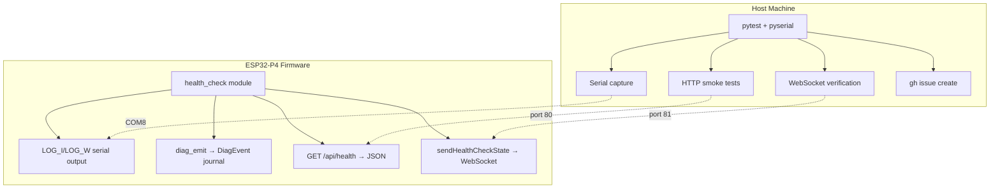
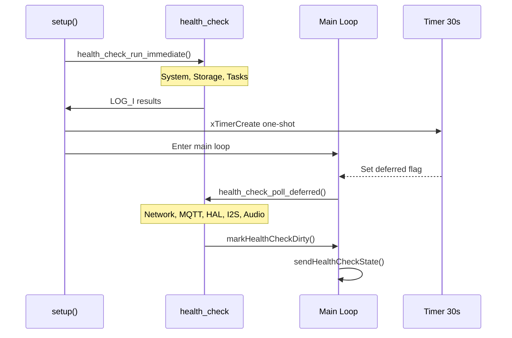
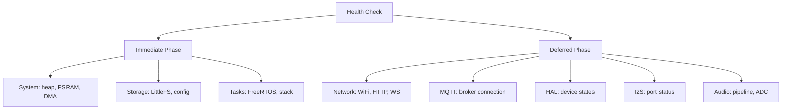

On-device testing runs against a real ESP32-P4 board connected over USB. It covers the gaps that native unit tests and Playwright E2E tests cannot reach: I2S DMA streaming, GPIO interrupts, FreeRTOS multi-core scheduling, PSRAM allocation under real heap pressure, and the WiFi SDIO / I2C bus interaction.

## Overview

The on-device test suite has two parts that work together:

| Part | What it does |
|---|---|
| `health_check` firmware module | Runs structured checks at boot and after network comes up; reports results via serial, REST, and WebSocket |
| Python pytest harness | Connects to the board over serial and HTTP, collects results, and creates GitHub issues on failure |

This is distinct from the three CI-gated test layers (Unity C++ tests, Playwright E2E, static analysis). Those run without hardware on every push. The device harness runs on a self-hosted runner with a board attached, either on demand or when a commit message includes `[device-test]`.

## Health Check Architecture



The `health_check` module (`src/health_check.h` / `src/health_check.cpp`) is the single source of truth for on-device health state. All four output channels (serial, DiagEvent journal, REST API, WebSocket broadcast) draw from the same internal result structs, so the pytest harness can verify results via whichever channel is most convenient for each check type.

## Two-Phase Boot

Health checks are split across two phases to avoid blocking the boot sequence while network interfaces initialise.



**Immediate phase** (`health_check_run_immediate()`) — called at the end of `setup()` before the main loop starts. These checks have no network dependency and complete in milliseconds:

- Internal heap and PSRAM sizing
- LittleFS mount and config file presence
- FreeRTOS task creation verification
- DMA buffer pre-allocation result

**Deferred phase** (`health_check_poll_deferred()`) — triggered by a 30-second one-shot FreeRTOS timer. Called from the main loop when the deferred flag is set. By this point WiFi has had time to connect and HAL discovery has completed:

- WiFi association and IP assignment
- HTTP server reachability (self-probe on localhost)
- WebSocket server bind
- MQTT broker reachability (if configured)
- HAL device availability counts
- I2S port status for all three ports
- Audio pipeline DMA health

## Check Categories



Each check produces a `HealthCheckResult` struct with three fields:

| Field | Type | Description |
|---|---|---|
| `category` | `const char*` | Category name (e.g., `"system"`, `"hal"`) |
| `pass` | `bool` | True if the check passed |
| `detail` | `char[64]` | Human-readable detail string, included in serial output and REST response |

Failed checks also call `diag_emit()` with the appropriate diagnostic code so failures appear in the DiagEvent journal and the web UI Health Dashboard.

## Running Tests

The pytest harness lives in `test/device/`. Install dependencies once:

```bash
cd test/device
pip install -r requirements.txt
```

Run the full suite against the board on COM8:

```bash
pytest --port COM8 --baud 115200 --device-ip 192.168.1.100
```

Run a specific category:

```bash
pytest -k "system" --port COM8 --device-ip 192.168.1.100
pytest -k "hal" --port COM8 --device-ip 192.168.1.100
pytest -k "audio" --port COM8 --device-ip 192.168.1.100
```

Run with verbose output to see serial log lines alongside test results:

```bash
pytest -v --port COM8 --device-ip 192.168.1.100 --show-serial
```

The harness waits up to 60 seconds for the board to emit the deferred-phase completion marker before timing out. If the board does not reach the deferred phase within the timeout, the entire deferred category is marked as a single timeout failure.

**Environment variables** (alternative to CLI flags):

```bash
export ALX_PORT=COM8
export ALX_BAUD=115200
export ALX_IP=192.168.1.100
pytest
```

## Adding New Checks

To add a check to the `health_check` module:

1. **Add a result field** to the appropriate result struct in `src/health_check.h` (e.g., `HealthCheckResultSystem`, `HealthCheckResultNetwork`).

2. **Implement the check** in `src/health_check.cpp` inside the correct phase function. Follow the existing pattern:

```cpp
// In health_check_run_immediate() for system/storage/task checks
result.myCheck.pass = (some_condition == expected);
snprintf(result.myCheck.detail, sizeof(result.myCheck.detail),
         "expected %d got %d", expected, actual);
if (!result.myCheck.pass) {
    diag_emit(DIAG_MY_CHECK_FAIL, result.myCheck.detail);
}
LOG_I("[HealthCheck] my_check: %s — %s",
      result.myCheck.pass ? "PASS" : "FAIL", result.myCheck.detail);
```

3. **Expose via REST** — update `src/health_check_api.cpp` to include the new field in the `GET /api/health` JSON response.

4. **Expose via WebSocket** — update `sendHealthCheckState()` in `src/websocket_broadcast.cpp` to include the new field in the `healthCheck` broadcast.

5. **Add a pytest test** in `test/device/test_health_<category>.py`:

```python
def test_my_check_passes(health_api):
    result = health_api.get_health()
    assert result["myCheck"]["pass"] is True, result["myCheck"]["detail"]
```

6. **Add a diagnostic code** in `src/diag_error_codes.h` if the check warrants a distinct code (follow the existing `DIAG_*` naming convention and numeric range for the category).
