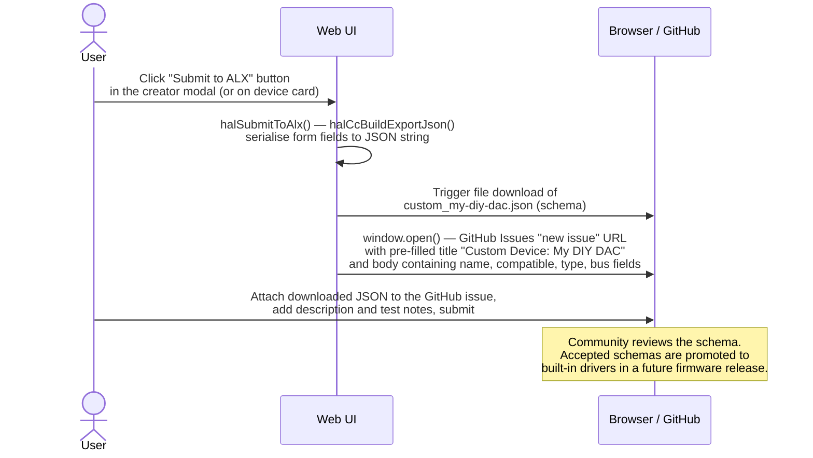

# Custom Device Creation

The Custom Device Creator lets users add support for devices that are not in the built-in driver database — any I2C DAC, ADC, or codec not covered by the ESS SABRE family, or a custom DIY board. The workflow is inspired by Zigbee2MQTT's device pairing flow: a guided modal collects the necessary information, validates it, writes a schema file to LittleFS, and immediately registers the device in the HAL manager without a firmware rebuild.

Three tiers of support cover progressively complex devices:

- **Tier 1** — I2S passthrough only, no I2C. The device receives audio data over I2S without any register initialisation (e.g., an external DAC chip wired for fixed settings).
- **Tier 2** — I2C init register sequence plus I2S passthrough. The user supplies up to 32 register/value pairs that are written over I2C during `init()` before audio starts.
- **Tier 3** — Full C++ driver via the `hal-driver-scaffold` agent. The scaffold generates a native driver class that is compiled into the firmware; this requires a rebuild and is outside the scope of this flow.

Created schemas are persisted to LittleFS at `/hal/custom/<compatible>.json` and are reloaded into the HAL registry automatically on every subsequent boot by `hal_load_custom_devices()`.

## Preconditions

- Authenticated web UI session (cookie or WS token).
- For Tier 2: target device physically connected and reachable on I2C Bus 2 (GPIO 28/29). Bus 0 (GPIO 48/54) is guarded against SDIO conflicts; Bus 1 (GPIO 7/8) is reserved for the onboard ES8311.
- A HAL scan has been run at least once so unmatched I2C addresses are available for the scan-assisted address picker. The creator still works without a prior scan — the address field can be filled manually.
- At least one free HAL slot remaining (`HAL_MAX_DEVICES=32`; 14–16 slots occupied at boot by onboard devices).

## Sequence Diagram

```mermaid
sequenceDiagram
    actor User
    participant WebUI as Web UI
    participant REST as REST API
    participant HAL as HAL Manager
    participant Disc as HAL Discovery
    participant I2C as I2C Bus 2
    participant FS as LittleFS
    participant Bridge as Pipeline Bridge
    participant Pipeline as Audio Pipeline
    participant WS as WebSocket

    User->>WebUI: Click "Create Custom Device" button<br/>on HAL Devices tab
    WebUI->>WebUI: Open creator modal (#halCustomCreateModal)
    WebUI->>REST: GET /api/hal/scan/unmatched
    REST->>Disc: hal_get_unmatched_addresses(buf, HAL_UNMATCHED_MAX)
    Disc-->>REST: HalUnmatchedAddr[] — addresses<br/>that responded but had no driver match
    REST-->>WebUI: JSON { unmatched: [{addr, bus, addrHex}, ...], count }
    WebUI->>WebUI: Populate "Detected Addresses" chip row<br/>with clickable address buttons

    rect rgb(30, 40, 60)
        Note over User,WebUI: User fills creator form
        User->>WebUI: Enter device name (e.g., "My DIY DAC")
        WebUI->>WebUI: halCcUpdateCompat() — live-preview<br/>compatible string "custom,my-diy-dac"
        User->>WebUI: Select device type (DAC / ADC / Codec / Amp)
        User->>WebUI: Select tier: I2S only (Tier 1) or I2C + I2S (Tier 2)
        User->>WebUI: Click address chip to auto-fill I2C address + bus<br/>OR type address manually
        User->>WebUI: Add I2C init register pairs via "Add Register" button<br/>(halCcAddInitReg — up to 32 pairs)
        User->>WebUI: Select I2S port, bit depth, channel count
        User->>WebUI: Click "Create"
    end

    WebUI->>WebUI: halCcValidate() — check name present,<br/>type valid, reg values in 0x00-0xFF range
    WebUI->>REST: POST /api/hal/devices/custom/create<br/>JSON body: \{name, type, bus, i2cAddr, i2cBus,<br/>i2sPort, channels, capabilities[], initSequence[]\}

    REST->>REST: Validate: name required,<br/>type in dac/adc/codec/amp,<br/>i2cAddr 0x08-0x77 (if present),<br/>initSequence.length <= 32
    REST->>REST: Slugify name → compatible string:<br/>"custom," + slug (e.g., "custom,my-diy-dac")
    REST->>REST: Build schema JsonDocument with<br/>compatible, name, type, bus, i2cAddr, i2cBus,<br/>i2sPort, channels, capabilities[], initSequence[],<br/>defaults \{sample_rate, bits_per_sample, mclk_multiple\}
    REST->>FS: LittleFS.open("/hal/custom/custom_my-diy-dac.json", "w")<br/>(comma in compatible replaced with underscore)
    FS-->>REST: Write OK

    REST->>HAL: hal_load_custom_devices()
    Note over HAL: Removes stale HAL_DISC_MANUAL devices first
    HAL->>FS: Open /hal/custom/ directory, iterate JSON files
    FS-->>HAL: custom_my-diy-dac.json content
    HAL->>HAL: deserializeJson(), extract compatible, name,<br/>type, bus, capabilities[], initSequence[]
    HAL->>HAL: new HalCustomDevice(compatible, name, caps, busType, devType)
    HAL->>HAL: setInitSequence(pairs, count) — store up to 32 reg/val pairs
    HAL->>HAL: registerDevice(dev, HAL_DISC_MANUAL) — assign slot 0-31
    HAL->>HAL: Apply HalDeviceConfig overrides<br/>(i2cAddr, i2cBus, i2sPort, sampleRate, bitDepth, mclkMultiple)
    HAL->>HAL: setI2cConfig(addr, busIndex) — patch descriptor for SDIO guard

    alt Tier 2 — I2C device
        HAL->>HAL: dev->probe() → _probeI2c()<br/>Bus 0 SDIO guard checked
        HAL->>I2C: Wire2.beginTransmission(i2cAddr)<br/>Wire2.endTransmission()
        I2C-->>HAL: ACK (success) or NACK (error)
        HAL->>HAL: dev->init() → _runInitSequence()<br/>writes each \{reg, val\} pair over I2C
        I2C-->>HAL: endTransmission() per pair — any NACK aborts sequence
    else Tier 1 — I2S only
        HAL->>HAL: dev->probe() — no I2C, returns true immediately
        HAL->>HAL: dev->init() — no init sequence,<br/>enables I2S TX via i2s_port_enable_tx() (DAC)<br/>or builds AudioInputSource (ADC)
    end

    alt init() succeeded
        HAL->>HAL: _state = HAL_STATE_AVAILABLE, _ready = true
        HAL-->>Bridge: HalStateChangeCb(slot, AVAILABLE)
        alt DAC device (HAL_CAP_DAC_PATH)
            Bridge->>Pipeline: audio_pipeline_set_sink(slot, &dev->buildSink())
            Pipeline-->>Bridge: sink slot assigned
        else ADC device (HAL_CAP_ADC_PATH)
            Bridge->>Pipeline: audio_pipeline_set_source(lane, &dev->getInputSource())
            Pipeline-->>Bridge: input lane assigned
        end
    else init() failed
        HAL->>HAL: _state = HAL_STATE_ERROR, _ready = false
        HAL->>HAL: _lastError populated with failure reason
    end

    REST->>REST: findByCompatible(compatible) — locate newly registered device
    REST-->>WebUI: HTTP 201 JSON \{status, compatible, name, slot, state, error?\}
    REST->>REST: appState.markHalDeviceDirty()
    WS-->>WebUI: broadcast halDevices JSON (new device card)
    WebUI->>WebUI: halCloseCustomCreate() — dismiss modal
    WebUI->>WebUI: loadHalDeviceList() — refresh device list,<br/>render new card with state badge
```



### Community Contribution — "Submit to ALX"

After a custom device is working, users can contribute the schema back to the community directly from the web UI.



## Step-by-Step Walkthrough

### 1. Open the Creator Modal

The user navigates to the **Devices** tab in the web UI and clicks **Create Custom Device**. The `halOpenCustomCreate()` function in `web_src/js/15-hal-devices.js` resets all form fields to defaults, sets channel count to 2, clears the init register table, and calls `halCcFetchUnmatched()`.

### 2. Fetch Unmatched I2C Addresses

`halCcFetchUnmatched()` calls `GET /api/hal/scan/unmatched`. The REST handler in `src/hal/hal_api.cpp` calls `hal_get_unmatched_addresses(buf, HAL_UNMATCHED_MAX)` from `src/hal/hal_discovery.cpp`. This returns the list of I2C addresses that responded during the most recent scan but had no matching EEPROM header or driver. Each entry is an `HalUnmatchedAddr` struct containing the raw address byte, the bus index, and a pre-formatted hex string.

The web UI renders each unmatched address as a clickable chip button. Clicking a chip calls `halCcSelectAddr(addr, bus, el)`, which auto-fills the I2C address and bus fields and switches the bus-type selector to I2C.

If no scan has been run, the chip row shows "No unmatched addresses found. Run Rescan first." The user can still proceed by typing an address manually.

### 3. Fill the Creator Form

The form collects:

| Field | Element ID | Notes |
|---|---|---|
| Device name | `halCcName` | Required. Drives the compatible string via `halCcUpdateCompat()` |
| Device type | `halCcType` | DAC / ADC / Codec / Amp |
| Bus type | `halCcBus` | I2C (Tier 2) or I2S only (Tier 1) |
| I2C address | `halCcI2cAddr` | Hex string, e.g., `0x48`. Visible when bus = I2C |
| I2C bus index | `halCcI2cBus` | 0 = EXT, 1 = ONBOARD, 2 = EXPANSION (default 2) |
| I2S port | `halCcI2sPort` | 0 / 1 / 2 |
| Channels | `halCcChannels` | Default 2 |
| Capabilities | Checkboxes | `dac_path`, `adc_path`, `volume_control`, `mute`, etc. |
| Init registers | `halCcRegBody` | Table of hex reg/val pairs added via `halCcAddInitReg()` |

The compatible string preview (`halCcCompatDisplay`) updates in real time as the name is typed. The slugification algorithm lowercases the name, replaces spaces and underscores with hyphens, and strips all other non-alphanumeric characters, then prepends `"custom,"`.

### 4. Client-Side Validation

`halCcValidate()` checks:

- Name is not empty.
- Each init register address is a valid hex byte (0x00–0xFF).
- Each init register value is a valid hex byte (0x00–0xFF).

Failures show a toast notification and return null, preventing the POST.

### 5. POST /api/hal/devices/custom/create

`halSubmitCustomCreate()` serialises the validated form data and sends a POST request with a JSON body. The REST endpoint in `src/hal/hal_api.cpp` performs server-side validation:

- `name` field must be non-empty (HTTP 400 if missing).
- `type` must be one of `dac`, `adc`, `codec`, `amp` (HTTP 400 otherwise).
- `i2cAddr`, if present, must be in the range 0x08–0x77 (HTTP 400 otherwise).
- `i2cBus` must be 0–2 (HTTP 400 otherwise).
- `initSequence` array length must not exceed 32 (HTTP 400 otherwise).

### 6. Compatible String Generation

The endpoint derives the compatible string from the device name using the same slugification rule as the client: lowercase, hyphens for spaces and underscores, non-alphanumeric characters stripped. The result is prefixed with `"custom,"`, e.g., `"custom,my-diy-dac"`. This string becomes the unique identifier used for driver registry lookups and the filename.

### 7. Schema JSON Construction

The endpoint builds a `JsonDocument` containing all form fields plus the generated compatible string. The schema structure mirrors the example in `src/hal/hal_custom_device.h`:

```json
{
  "compatible": "custom,my-diy-dac",
  "name": "My DIY DAC",
  "type": "dac",
  "bus": "i2c",
  "i2cAddr": "0x48",
  "i2cBus": 2,
  "i2sPort": 2,
  "channels": 2,
  "capabilities": ["dac_path", "volume_control", "mute"],
  "initSequence": [
    { "reg": 0, "val": 0 },
    { "reg": 1, "val": 8 }
  ],
  "defaults": { "sample_rate": 48000, "bits_per_sample": 32, "mclk_multiple": 256 }
}
```

### 8. LittleFS Persistence

The endpoint writes the serialised schema to `/hal/custom/<compatible>.json`. Commas in the compatible string are replaced with underscores in the filename (e.g., `/hal/custom/custom_my-diy-dac.json`) because LittleFS filenames must not contain commas. The directory `/hal/custom/` is created if it does not exist.

If `LittleFS.open()` fails (filesystem full or other error), the endpoint returns HTTP 500.

### 9. Reload Custom Device Registry — hal_load_custom_devices()

After writing the schema, the endpoint calls `hal_load_custom_devices()` defined in `src/hal/hal_custom_device.cpp`. This function:

1. Iterates all registered devices and removes those tagged `HAL_DISC_MANUAL` (previously loaded custom devices), calling `deinit()` and `removeDevice(i)` on each. This prevents duplicates on hot-reload.
2. Opens the `/hal/custom/` directory on LittleFS and iterates every `.json` file.
3. For each file, deserialises the JSON, extracts `compatible`, `name`, `type`, `bus`, `capabilities[]`, and `initSequence[]`.
4. Skips files with a missing or empty compatible string.
5. Skips compatible strings already registered as built-in devices (`findByCompatible()` check).
6. Constructs a `HalCustomDevice` instance via `new HalCustomDevice(compatible, name, caps, busType, devType)`. The constructor calls `hal_safe_strcpy()` for all string fields and sets `_initPriority = HAL_PRIORITY_HARDWARE`.
7. Calls `setInitSequence(pairs, count)` — copies up to `HAL_CUSTOM_MAX_INIT_REGS` (32) pairs into the internal `_initSeq[]` array; extra pairs are silently discarded.
8. Calls `mgr.registerDevice(dev, HAL_DISC_MANUAL)` — assigns the next free slot (0–31). Returns -1 if no slot is available; the device is then deleted and the next file is processed.
9. Applies `HalDeviceConfig` defaults from the schema `defaults` block (sample rate, bit depth, MCLK multiple) and patches `i2cAddr`, `i2cBus`, `i2sPort` into the runtime config.
10. Calls `dev->setI2cConfig(addr, busIndex)` to propagate the resolved I2C address and bus into the device descriptor so `probe()` sees the correct values.
11. Calls `dev->init()`.

`hal_load_custom_devices()` is also called unconditionally during boot, so schemas written in a previous session are restored without user interaction.

### 10. Probe

`HalCustomDevice::probe()` in `src/hal/hal_custom_device.cpp` branches on bus type:

- **I2S-only (Tier 1)**: returns `true` immediately — no hardware probe is possible.
- **I2C (Tier 2)**: delegates to `_probeI2c()`.

`_probeI2c()` checks `hal_wifi_sdio_active()` from `src/hal/hal_discovery.cpp`. If Bus 0 is requested while WiFi is active, probe is skipped with `setLastError("Bus 0 SDIO conflict: WiFi active")` and `false` is returned. Otherwise it resolves the I2C address from the `HalDeviceConfig` override (falling back to `_descriptor.i2cAddr`), selects the `TwoWire` instance (`Wire`, `Wire1`, or `Wire2`), and performs a zero-byte transmission. A NACK populates `_lastError` with a message including the address, bus, and error code.

### 11. Initialisation — init() and _runInitSequence()

`HalCustomDevice::init()` in `src/hal/hal_custom_device.cpp`:

1. For I2C devices, calls `_runInitSequence()`. This iterates `_initSeq[]` and writes each `\{reg, val\}` pair via `wire->beginTransmission()` / `wire->write(reg)` / `wire->write(val)` / `wire->endTransmission()`. Any NACK populates `_lastError` (e.g., `"Init seq write failed at reg 0x01 (err 2)"`) and returns `false`, causing `init()` to set `_state = HAL_STATE_ERROR` and return `hal_init_fail(DIAG_HAL_INIT_FAILED, _lastError)`.
2. For I2S DAC devices (`HAL_CAP_DAC_PATH` and `HAL_BUS_I2S`), calls `i2s_port_enable_tx(port, I2S_MODE_STD, ...)` using the port number from `HalDeviceConfig.i2sPort`. A failure here is non-fatal — the device is still registered without audio output.
3. For I2S ADC devices (`HAL_CAP_ADC_PATH` and `HAL_BUS_I2S`), populates the `AudioInputSource` struct (`_inputSource`) with the device name, HAL slot, and function pointers (`_custom_adc_read`, `_custom_adc_is_active`, `_custom_adc_get_sample_rate`).
4. On success, sets `_state = HAL_STATE_AVAILABLE` and `_ready = true`.

### 12. State Callback and Pipeline Registration

Every `_state` transition fires the `HalStateChangeCb` registered at boot by `hal_pipeline_bridge` (`src/hal/hal_pipeline_bridge.cpp`). On `AVAILABLE`:

- **DAC devices**: the bridge calls `dev->buildSink(sinkSlot, out)`. `HalCustomDevice::buildSink()` fills the `AudioOutputSink` struct with the write callback (`_custom_dac_write`), a per-slot isReady function, and stores `this` in `_custom_dac_slot_dev[sinkSlot]`. The pipeline's DMA write path calls `i2s_port_write()` on the configured I2S port.
- **ADC devices**: the bridge calls `audio_pipeline_set_source(lane, dev->getInputSource())`. `getInputSource()` returns `&_inputSource` if `_inputSourceValid` is true, null otherwise.

The hybrid transient policy applies: `UNAVAILABLE` sets `_ready = false` only (preserving the slot); `ERROR` or `REMOVED` removes the sink/source from the pipeline.

### 13. REST Response and WebSocket Broadcast

The endpoint calls `findByCompatible(compatible)` to locate the newly registered device. It serialises a response with `status`, `compatible`, `name`, `slot`, `state`, and an optional `error` field if `_lastError` is populated. HTTP 201 is returned.

`appState.markHalDeviceDirty()` signals the WebSocket subsystem (`src/websocket_broadcast.cpp`) to broadcast the updated `halDevices` JSON to all connected clients.

### 14. Web UI Update

`halSubmitCustomCreate()` receives the 201 response. On success it calls `showToast('Device created in slot N')`, `halCloseCustomCreate()` to dismiss the modal, and `loadHalDeviceList()` to refresh the device card list. The new card shows the device name, state badge, slot number, and capability icons. If the device is in `ERROR` state, an inline error banner displays `_lastError` with expandable troubleshooting tips.

## Postconditions

- Custom schema persisted to `/hal/custom/<compatible>.json` on LittleFS.
- Device registered in HAL manager under `HAL_DISC_MANUAL` with an assigned slot number (0–31).
- For successfully initialised devices: audio sink (DAC) or source (ADC) connected to the pipeline.
- `_lastError` populated on any probe or init failure — visible via REST, WebSocket `halDevices` broadcast, and the web UI error banner.
- Schema survives reboot — `hal_load_custom_devices()` is called unconditionally during boot.
- Device is configurable through the standard HAL device config form (I2C address, I2S port, volume, mute) exactly like any built-in device.

## Error Scenarios

| Trigger | Behaviour | Recovery |
|---|---|---|
| Duplicate compatible string | `hal_load_custom_devices()` skips the existing entry if already registered as a built-in; for a duplicate custom schema the old file is overwritten and the device is re-registered | Use a unique device name |
| Missing `name` field in POST body | REST returns HTTP 400 `\{"error":"name is required"\}` | Include the `name` field |
| Invalid `type` value | REST returns HTTP 400 `\{"error":"Invalid type (dac/adc/codec/amp)"\}` | Use one of the four accepted values |
| `i2cAddr` out of range | REST returns HTTP 400 `\{"error":"i2cAddr must be 0x08-0x77"\}` | Use a valid 7-bit I2C address |
| `initSequence` exceeds 32 pairs | REST returns HTTP 400 `\{"error":"initSequence exceeds 32 entries"\}` | Reduce the init sequence to 32 pairs or fewer |
| LittleFS write failure | REST returns HTTP 500 `\{"error":"Failed to write schema"\}` | Check free filesystem space; delete unused custom schemas |
| Bus 0 SDIO conflict during probe | `_probeI2c()` sets `_lastError = "Bus 0 SDIO conflict: WiFi active"`, device enters ERROR state | Use I2C Bus 2 (expansion connector GPIO 28/29) for custom expansion devices |
| I2C probe NACK (Tier 2) | Device registered but `_state = HAL_STATE_ERROR`; `_lastError` shows address, bus, and error code | Verify wiring, I2C pull-ups, and that the address matches the hardware; click Reinit after fixing |
| `_runInitSequence()` write failure | Any I2C NACK during the register sequence aborts the sequence; `_lastError` identifies the failing register; device enters ERROR state | Fix the register address or value in the schema; delete the device, edit `/hal/custom/<name>.json` on LittleFS, and re-scan |
| No free HAL slot | `registerDevice()` returns -1; device is `delete`-d; REST response contains `slot: -1` | Remove unused devices via `DELETE /api/hal/devices` to free slots |

## Related

- [Manual Device Configuration](manual-configuration) — configuring I2C address, I2S port, and other parameters after creation
- [Mezzanine ADC Card Insertion](mezzanine-adc-insert) — built-in EEPROM-based auto-discovery flow
- [HAL Device Lifecycle](../hal/device-lifecycle) — complete state machine and transition rules
- [REST API (HAL)](../api/rest-hal) — `POST /api/hal/devices/custom/create` and `GET /api/hal/scan/unmatched` reference

**Source files:**

- `src/hal/hal_custom_device.h` / `src/hal/hal_custom_device.cpp` — `HalCustomDevice`, `hal_load_custom_devices()`, `hal_save_custom_schema()`
- `src/hal/hal_api.cpp` — `POST /api/hal/devices/custom/create`, `GET /api/hal/scan/unmatched` endpoints
- `web_src/js/15-hal-devices.js` — `halOpenCustomCreate()`, `halCcFetchUnmatched()`, `halCcSelectAddr()`, `halCcAddInitReg()`, `halCcValidate()`, `halSubmitCustomCreate()`, `halSubmitToAlx()`
