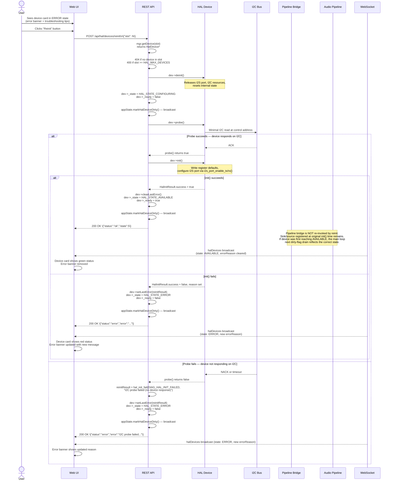

# Device Reinit / Error Recovery

When a HAL device fails to initialize — due to an I2C communication error, driver fault, or hardware problem — it enters the ERROR state. The failure reason is stored in `_lastError[48]` on the device struct and surfaced immediately: the web UI shows an inline error banner on the device card, the REST API includes an `error` field in device listings, and the WebSocket `halDevices` broadcast carries an `errorReason` field.

The user can attempt recovery without rebooting by clicking the **Reinit** button on the device card. This triggers a full `deinit()` → `probe()` → `init()` cycle inline within the REST handler. On success, the device transitions back to AVAILABLE with `_ready` set to `true` and `_lastError` cleared. On failure, `_lastError` is updated with the new reason and the device stays in ERROR.

The probe retry mechanism with increasing backoff (`HAL_PROBE_RETRY_COUNT=2`, base `HAL_PROBE_RETRY_BACKOFF_MS=50 ms`) runs during the I2C bus scan phase of initial discovery and rescan. Within the reinit endpoint itself, `probe()` is called once; if it fails, the init is skipped entirely and the error is reported immediately.

## Preconditions

- Device is present in the HAL device table — registered with a valid slot (0–31).
- Device is in ERROR or CONFIGURING state (both are valid reinit entry points).
- The web UI session is authenticated.
- For I2C devices: the physical bus connection is in place and the device is powered.

## Sequence Diagram

## Step-by-Step Walkthrough

### 1. Error state presentation

When a device enters ERROR state — either at boot, after a scan, or from a previous failed reinit — the HAL manager populates `_lastError[48]` with a human-readable reason string. The string is stored via `dev->setLastError(result)` which copies `result.reason` using `hal_safe_strcpy()` (guaranteed null-termination, no overflow).

The WebSocket broadcast (`sendHalDeviceState()` in `src/websocket_broadcast.cpp`) serialises `_lastError` into the `halDevices` JSON as `errorReason`. The web UI's `15-hal-devices.js` reads this field and renders an inline error banner below the device name, along with an expandable **troubleshooting tips** section. The REST `GET /api/hal/devices` response includes the same `error` field so the state is visible in API consumers and the debug console.

### 2. User clicks Reinit

The web UI sends `POST /api/hal/devices/reinit` with a JSON body containing the target slot: `\{"slot": N\}`. The REST handler in `src/hal/hal_api.cpp` parses this with `ArduinoJson` and validates the slot is within `HAL_MAX_DEVICES` (32). If the slot holds no device, HTTP 404 is returned immediately.

### 3. Deinit — clean up previous state

`dev->deinit()` is called unconditionally before any probe attempt. For I2S devices this disables the I2S TX or RX port via `i2s_port_disable_tx()` / `i2s_port_disable_rx()`. For I2C devices it resets any stateful register shadow values. The purpose is to avoid init code attempting to re-configure a port that was partially set up by the failed previous attempt.

Immediately after deinit, the handler directly writes `dev->_state = HAL_STATE_CONFIGURING` and `dev->_ready = false`. This is a direct field write — it does not go through `HalDeviceManager`'s internal `setState()` path and therefore does not fire `_stateChangeCb` or the pipeline bridge. `appState.markHalDeviceDirty()` is called to trigger a WebSocket broadcast showing the device as CONFIGURING while work proceeds.

### 4. Probe — I2C communication test

`dev->probe()` performs a minimal I2C transaction at the device's control address. For ESS SABRE ADC and DAC drivers (base classes `HalEssSabreAdcBase`, `HalEssSabreDacBase`) this is a single-byte register read. For other drivers (ES8311, MCP4725) probe performs a `Wire.beginTransmission()` / `Wire.endTransmission()` ACK check.

The probe call within the reinit endpoint is a **single attempt** — there is no retry loop here. The backoff retry mechanism (`HAL_PROBE_RETRY_COUNT=2`, `HAL_PROBE_RETRY_BACKOFF_MS=50 ms`) runs only during the I2C bus scan phase of `hal_discover_devices()` in `src/hal/hal_discovery.cpp`, where it specifically targets addresses that returned error codes 4 or 5 (I2C timeout vs NACK). If a reinit probe times out, the user sees an immediate error and can click Reinit again once the hardware issue is resolved.

If probe returns `false`, the handler calls `hal_init_fail(DIAG_HAL_INIT_FAILED, "I2C probe failed (no device response)")` to construct a `HalInitResult` with the diagnostic code and reason string. `init()` is skipped entirely.

### 5. Init — full device initialization

If probe succeeds, `dev->init()` runs the device-specific initialization sequence. For ESS SABRE devices this writes register defaults for volume, mute state, and filter preset over I2C, then calls `i2s_port_enable_tx()` or `i2s_port_enable_rx()` to set up the I2S port from `HalDeviceConfig` (bus, port, pins, format, bit depth, MCLK multiple). `init()` returns a `HalInitResult` struct — the `success` flag and `reason` string indicate the outcome.

### 6. State update and response

The handler writes the final state directly to the device struct:

- **Success**: `dev->clearLastError()`, `dev->_state = HAL_STATE_AVAILABLE`, `dev->_ready = true`.
- **Failure**: `dev->setLastError(reinitResult)`, `dev->_state = HAL_STATE_ERROR`, `dev->_ready = false`. A `LOG_W` line with the slot number and error reason is emitted to the debug console.

`appState.markHalDeviceDirty()` is called a second time to schedule the post-result WebSocket broadcast. The REST response is always HTTP 200 with a JSON body; the `status` field is `"ok"` or `"error"`, and on error the `error` field carries the reason string from `_lastError`.

### 7. Pipeline bridge behaviour on reinit

Because the reinit path writes `_state` directly rather than through `HalDeviceManager`'s `setState()` method, the `HalStateChangeCb` registered by `hal_pipeline_bridge` is **not invoked**. This means `hal_pipeline_on_device_available()` does not run and no new sink or source is registered in the audio pipeline.

This is correct for the common case: a device that successfully initialized once already has its sink/source registered in the pipeline. Reinit restores hardware-level communication without disturbing the pipeline slot mapping. For a device that has never successfully initialized (first-ever init failed), the sink was never registered — in this case a successful reinit will leave the device AVAILABLE but without a pipeline slot until the device state change callback path is exercised. The workaround is to trigger a full rescan via `POST /api/hal/scan`, which runs through `hal_discover_devices()` and fires the proper callback chain.

### 8. WebSocket broadcast and UI update

The main loop in `src/main.cpp` polls `appState.isHalDeviceDirty()` on every iteration (waking via `app_events_wait(5)` when the dirty flag is set). When triggered, it calls `sendHalDeviceState()` and `sendAudioChannelMap()` in `src/websocket_broadcast.cpp`, broadcasting updated `halDevices` JSON to all authenticated WebSocket clients.

The web UI's `15-hal-devices.js` receives the broadcast and re-renders the affected device card:

- **Success**: state badge turns green (AVAILABLE), error banner is removed, device controls (volume slider, mute toggle, filter selector) become active.
- **Failure**: state badge stays red (ERROR), the error banner is updated with the new `errorReason` text.

## Postconditions

**On success:**

- Device `_state` is `HAL_STATE_AVAILABLE`, `_ready` is `true`.
- `_lastError` is cleared (zero-length string).
- I2S port is active (TX or RX depending on device type).
- Web UI device card shows green status; error banner is absent.
- All connected WebSocket clients have received an updated `halDevices` broadcast.

**On failure:**

- Device `_state` is `HAL_STATE_ERROR`, `_ready` is `false`.
- `_lastError` contains the updated failure reason.
- Web UI device card shows red status with updated error banner and troubleshooting tips.
- No audio pipeline disruption — any previously registered sink/source slot remains intact.

## Error Scenarios

| Trigger | Behaviour | Recovery |
|---|---|---|
| I2C bus not responding (NACK) | `probe()` returns false immediately; ERROR state set; `"I2C probe failed (no device response)"` stored in `_lastError` | Check physical mezzanine connector seating, I2C pull-up resistors, and verify the device is powered |
| I2C bus timeout (error code 4 or 5) | `probe()` returns false; same error path as NACK | Check for bus contention, verify correct SDA/SCL pin assignment in `HalDeviceConfig`, inspect Bus 0 SDIO conflict if using GPIO 48/54 with WiFi active |
| Wrong I2C control address configured | `probe()` NACKs at the stored address; ERROR state | Edit the device's I2C address in the config form (`PUT /api/hal/devices`) then retry reinit |
| I2S port conflict | `probe()` succeeds but `init()` fails when calling `i2s_port_enable_tx/rx()` on an already-active port | Change the I2S port assignment in device config, or disable the conflicting device first |
| Bus 0 SDIO conflict | GPIO 48/54 shared with WiFi SDIO; I2C transactions cause MCU instability when WiFi is active | Disconnect WiFi, use I2C Bus 2 (GPIO 28/29) for expansion devices, or remap the device to a non-conflicting bus |
| `init()` partial failure | `probe()` succeeds, first few I2C register writes succeed, then one fails; `HalInitResult.success = false` with specific register context in `reason` | Check device datasheet for register write requirements; verify I2C pull-up strength and bus speed |
| Device never had a pipeline sink | Reinit succeeds (AVAILABLE) but no audio sink was ever registered because the first init always failed | Run `POST /api/hal/scan` after a successful reinit to trigger the full discovery callback chain and register the sink |

## Related

- [Manual Device Configuration](manual-configuration) — Edit I2C address, I2S port, or pin assignments before attempting reinit
- [Device Enable/Disable Toggle](device-toggle) — Re-enable a device after a successful reinit if it was previously disabled
- [HAL Device Lifecycle](../hal/device-lifecycle) — Full state machine covering ERROR, CONFIGURING, and AVAILABLE transitions
- [REST API (HAL)](../api/rest-hal) — `POST /api/hal/devices/reinit` endpoint reference

**Source files:**

- `src/hal/hal_api.cpp` — `POST /api/hal/devices/reinit` handler (deinit, probe, init, state write, response)
- `src/hal/hal_device_manager.cpp` — `HalDeviceManager` singleton, `_stateChangeCb` registration, device table
- `src/hal/hal_discovery.cpp` — Probe retry loop with backoff (used during scan, not reinit)
- `src/hal/hal_pipeline_bridge.cpp` — `hal_pipeline_state_change()` callback, `hal_pipeline_on_device_available()`
- `src/hal/hal_ess_sabre_adc_base.cpp` — Shared ADC `probe()` and `init()` implementation
- `src/hal/hal_ess_sabre_dac_base.cpp` — Shared DAC `probe()` and `init()` implementation
