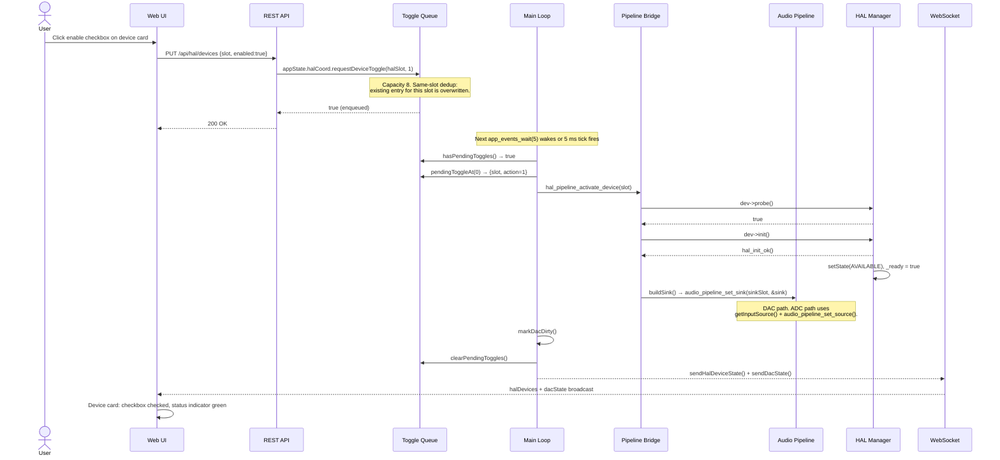
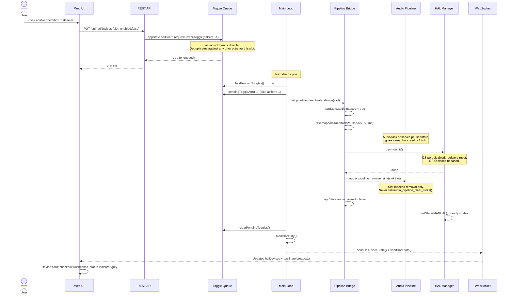
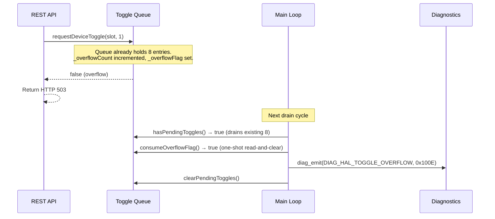

# Device Enable/Disable Toggle

Enabling or disabling a HAL device cannot happen synchronously from the REST API handler because the audio pipeline runs on Core 1 and requires careful coordination. Instead, toggle requests are enqueued in a capacity-8 deferred queue (`HalCoordState`) with same-slot deduplication. The main loop on Core 1 drains this queue each iteration, activating or deactivating devices with a proper audio-pause handshake when needed. This architecture prevents race conditions between the web server (which may run on Core 0 or Core 1) and the real-time audio task pinned to Core 1.

## Preconditions

**To disable a device:**
- Device is registered in the HAL manager.
- Device is in the `AVAILABLE` state and `_ready == true`.
- Toggle queue has capacity (fewer than 8 pending entries).

**To enable (re-enable) a device:**
- Device is registered in the HAL manager.
- Device is in `MANUAL`, `UNAVAILABLE`, or `ERROR` state.
- Toggle queue has capacity.

## Sequence Diagram

### Enable Flow

### Disable Flow

### Queue Overflow

## Step-by-Step Walkthrough

### Enable

1. **Web UI** renders a toggle checkbox in the device card. The checkbox state reflects the current value of `enabled` in the `halDevices` WebSocket message. When the user checks it, the UI calls `PUT /api/hal/devices` with `\{"slot": N, "enabled": true\}`.

2. **REST handler** (`src/hal/hal_api.cpp`) calls `appState.halCoord.requestDeviceToggle(halSlot, 1)`. If the queue already contains an entry for this slot, the stored action is overwritten with `1` (no duplicate entry is added). The handler returns `200 OK` immediately — it does not wait for the device to initialise.

3. **Toggle queue** (`src/state/hal_coord_state.h`) stores the pending action in a fixed-size array of `PendingDeviceToggle` structs. Each entry holds `halSlot` and `action` (1 or -1). Capacity is 8; insertions beyond that increment `_overflowCount` and set `_overflowFlag`.

4. **Main loop** (`src/main.cpp`, toggle-drain block near line 1116) calls `appState.halCoord.hasPendingToggles()` after each `app_events_wait(5)` wakeup. For each pending entry it calls the appropriate pipeline bridge function based on `action`:
   - `action == 1` → `dac_activate_for_hal(slot)` (or equivalent ADC path)
   - `action == -1` → `dac_deactivate_for_hal(slot)`

5. **Pipeline bridge** (`src/hal/hal_pipeline_bridge.cpp`) calls `dev->probe()` then `dev->init()`. A successful `init()` transitions the device to `AVAILABLE` and sets `_ready = true`. The bridge then:
   - For DAC devices: calls `buildSink()` and registers the result via `audio_pipeline_set_sink(sinkSlot, &sink)`.
   - For ADC devices: calls `getInputSourceAt(i)` for each source the driver exposes, then `audio_pipeline_set_source(lane, &src)`.

6. **Main loop** calls `markDacDirty()` (which also signals `EVT_DAC`) and `clearPendingToggles()`. The WebSocket subsystem broadcasts `halDevices` and `dacState` to all connected clients.

7. **Web UI** receives the broadcast and re-renders the device card with a green status indicator and the checkbox in the checked state.

### Disable

1. **Web UI** sends `PUT /api/hal/devices` with `\{"slot": N, "enabled": false\}`.

2. **REST handler** calls `appState.halCoord.requestDeviceToggle(halSlot, -1)` and returns `200 OK`.

3. **Main loop** picks up `action == -1` and calls `dac_deactivate_for_hal(slot)`.

4. **Pipeline bridge** must uninstall the I2S driver safely. It sets `appState.audio.paused = true` then calls `xSemaphoreTake(appState.audio.taskPausedAck, pdMS_TO_TICKS(50))`. The audio task running on Core 1 observes `paused == true` at the top of its DMA callback loop, calls `xSemaphoreGive(taskPausedAck)`, and yields for one tick. Once the semaphore is taken, the bridge calls `dev->deinit()` safely.

5. **After `deinit()`** completes, the bridge calls `audio_pipeline_remove_sink(sinkSlot)` to free the pipeline slot. It then clears `appState.audio.paused = false`, allowing the audio task to resume on the next tick.

6. The HAL manager transitions the device to `MANUAL` and sets `_ready = false`. The main loop broadcasts the updated state.

:::warning Slot-indexed removal only
Always use `audio_pipeline_remove_sink(sinkSlot)` targeting the specific slot. Never call `audio_pipeline_clear_sinks()` from a deactivation path — it removes every registered sink, including ones owned by other devices.
:::

:::info ADC path differences
For ADC devices, `dac_deactivate_for_hal()` calls `audio_pipeline_remove_source(lane)` instead. The I2S DMA for ADC hardware keeps running while the device is in `UNAVAILABLE` (transient); it is stopped only on `MANUAL`/`ERROR`/`REMOVED` (permanent) transitions. See [HAL Device Lifecycle — Hybrid Transient Policy](../hal/device-lifecycle#hal_pipeline_on_device_unavailable-hybrid-transient-policy) for details.
:::

## Postconditions

**After a successful enable:**
- Device state is `AVAILABLE`, `_ready == true`.
- Sink slot (DAC) or input lane (ADC) is registered in the audio pipeline.
- Audio flows through the device on the next DMA callback.
- WebSocket `halDevices` message includes the device with `state: "AVAILABLE"` and `ready: true`.

**After a successful disable:**
- Device state is `MANUAL`, `_ready == false`.
- Sink slot or input lane has been removed from the audio pipeline.
- I2S port is disabled (if the device owned one).
- GPIO claims are released.
- WebSocket `halDevices` message includes the device with `state: "MANUAL"` and `ready: false`.

## Error Scenarios

| Trigger | Behaviour | Recovery |
|---|---|---|
| Queue full (8 entries) | `requestDeviceToggle()` returns `false`; REST endpoint returns HTTP 503 | Wait for the main loop to drain the queue (up to 5 ms), then retry the request |
| Same-slot rapid toggle | Queue deduplicates: the latest `action` overwrites the pending entry for that slot | Works as designed — rapid enable → disable yields a net disable |
| Audio-pause semaphore timeout | `xSemaphoreTake` fails after 50 ms; bridge logs `LOG_W` and proceeds with `deinit()` anyway | Possible single-frame audio glitch; device is still toggled. Investigate audio task stall if repeated |
| `probe()` fails on enable | Bridge does not call `init()`; device transitions to `ERROR`; `_lastError` populated | Check I2C connection and address, then use the Reinit button in the web UI |
| `init()` fails on enable | Device transitions to `ERROR`; `_lastError` contains reason; `DIAG_HAL_INIT_FAILED` emitted | Inspect error banner on device card; check wiring; retry via `POST /api/hal/devices/reinit` |
| Toggle queue overflow | `_overflowCount` incremented (lifetime); `consumeOverflowFlag()` triggers `DIAG_HAL_TOGGLE_OVERFLOW` (0x100E) on next drain | Reduce toggle rate; investigate stuck callers that enqueue without waiting for drain |

## Key Source Locations

| Concern | File |
|---|---|
| Toggle queue data structure | `src/state/hal_coord_state.h` |
| Enqueue (REST caller) | `src/hal/hal_api.cpp` — `PUT /api/hal/devices` handler |
| Main loop drain | `src/main.cpp` — toggle-drain block (~line 1116) |
| Activate path | `src/hal/hal_pipeline_bridge.cpp` — `hal_pipeline_on_device_available()` |
| Deactivate path | `src/hal/hal_pipeline_bridge.cpp` — `hal_pipeline_on_device_removed()` |
| Audio-pause handshake | `src/state/audio_state.h` — `paused`, `taskPausedAck` |
| Overflow diagnostic | `src/diag_journal.h` — `DIAG_HAL_TOGGLE_OVERFLOW` (0x100E) |

## Related

- [Mezzanine Card Removal](mezzanine-removal) — uses the same deactivation path for physical card removal
- [Device Reinit / Error Recovery](device-reinit) — recovery flow after a failed enable
- [HAL Device Lifecycle](../hal/device-lifecycle) — full state machine and hybrid transient policy
- [REST API Reference (HAL)](../api/rest-hal) — `PUT /api/hal/devices` endpoint specification
- [WebSocket Protocol](../websocket) — `halDevices` and `dacState` message formats
