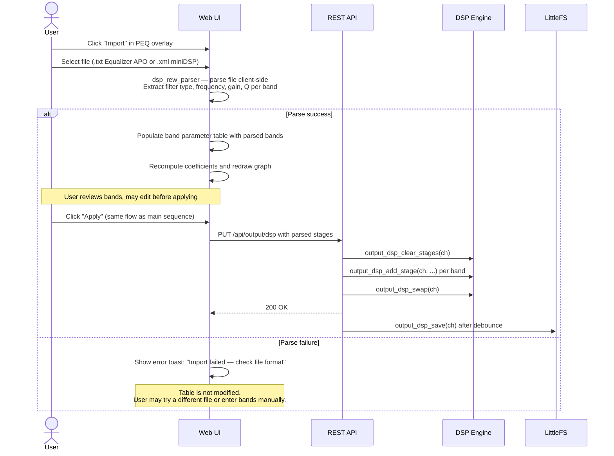

# PEQ / DSP Configuration

The DSP system provides per-input and per-output processing with biquad IIR filters (parametric EQ), FIR filters, gain, limiter, compressor, delay, polarity, and mute stages. Users interact primarily through the **PEQ overlay** — a full-screen modal with a frequency response graph and a band parameter table. Filter coefficients are computed client-side using the RBJ Audio EQ Cookbook, then sent to the firmware via REST API. The firmware uses double-buffered configuration with glitch-free atomic swap to apply changes without audio interruption.

Supported filter types: LPF, HPF, BPF, Notch, Peak/PEQ, Low Shelf, High Shelf, All-Pass, and crossover modes (LR2/LR4/LR8, Butterworth).

:::info Build guard
All DSP code is gated by the `-D DSP_ENABLED` build flag. On stripped firmware builds this flow is unavailable and the PEQ button does not appear.
:::

## Preconditions

- DSP enabled in system settings (`dspEnabled = true`)
- Audio pipeline initialized (`audio_pipeline_init()` completed at boot)
- At least one input or output channel is active
- Web UI authenticated with an active WebSocket connection

## Sequence Diagram

### Main Flow — Edit and Apply PEQ Bands

```mermaid
sequenceDiagram
    actor User
    participant WebUI as Web UI
    participant REST as REST API
    participant DSP as DSP Engine
    participant Pipeline as Audio Pipeline
    participant FS as LittleFS
    participant WS as WebSocket

    User->>WebUI: Click "PEQ" on output channel card (ch N)
    WebUI->>REST: GET /api/output/dsp?ch=N
    REST-->>WebUI: 200 OK — JSON array of DSP stages<br/>(type, frequency, gain, Q, enabled, b0/b1/b2/a1/a2)

    WebUI->>WebUI: Open PEQ overlay modal<br/>Render frequency response graph (canvas)<br/>Populate band parameter table

    rect rgb(30, 40, 60)
        Note over User,WebUI: User edits PEQ bands
        User->>WebUI: Click "Add Band"
        WebUI->>WebUI: Insert new table row with defaults<br/>(Peak/PEQ, 1000 Hz, 0 dB, Q=1.41)

        User->>WebUI: Select filter type (e.g., Peak/PEQ)
        User->>WebUI: Enter frequency, gain, Q values

        WebUI->>WebUI: dspComputeCoeffs(type, freq, gain, Q, sampleRate)<br/>Compute b0/b1/b2/a1/a2 client-side (RBJ Cookbook)
        WebUI->>WebUI: dspBiquadMagDb() — update frequency response graph
        Note over WebUI: Graph and table stay synchronised.<br/>User may drag graph points or edit table cells.

        User->>WebUI: Repeat for additional bands
    end

    User->>WebUI: Click "Apply"
    WebUI->>REST: PUT /api/output/dsp<br/>Body: {ch: N, stages: [{type, freq, gain, Q,<br/>enabled, b0, b1, b2, a1, a2}, ...]}

    REST->>DSP: output_dsp_clear_stages(ch)
    Note over DSP: Clears back buffer for channel N.<br/>Front buffer still serves the audio task.

    loop For each stage in request body
        REST->>DSP: output_dsp_add_stage(ch, stageConfig)
        Note over DSP: Stages written to back buffer.<br/>Rolls back all stages on pool exhaustion.
    end

    REST->>DSP: output_dsp_swap(ch)
    Note over DSP,Pipeline: Atomic pointer swap.<br/>Audio task reads front buffer; back buffer was written.<br/>No glitch — swap is a single pointer assignment.

    REST->>REST: Start debounced save timer (2 s)
    REST-->>WebUI: 200 OK

    Note over REST,FS: After 2 s debounce elapses
    REST->>FS: output_dsp_save(ch) → /output_dsp_chN.json
    FS-->>REST: Write confirmed

    REST->>REST: markDspConfigDirty()
    WS-->>WebUI: dspState broadcast
    WebUI->>WebUI: Toast: "PEQ applied to Output Ch N"
```

### Import Flow — Equalizer APO or miniDSP File



## Step-by-Step Walkthrough

### 1. Open the PEQ overlay

The user navigates to the **Audio** tab and clicks **PEQ** on an output channel card. The button is rendered by `web_src/js/06-peq-overlay.js`. The overlay sends `GET /api/output/dsp?ch=N` (handled in `src/dsp_api.cpp`) and receives the current stage list as a JSON array. Each element includes the filter type, frequency, gain, Q factor, enabled flag, and the pre-computed biquad coefficients `\{b0, b1, b2, a1, a2\}` already stored from the previous apply.

### 2. Render frequency response graph and band table

The overlay modal renders two elements:

- **Canvas graph** — the full frequency response from 20 Hz to 20 kHz, drawn by compositing the individual biquad magnitude curves for each enabled band plus the combined sum curve.
- **Band parameter table** — one row per stage with columns for filter type (dropdown), frequency (Hz), gain (dB), Q, and an enabled/bypass checkbox.

The graph and table are bidirectionally linked: editing a cell value immediately recomputes the corresponding biquad curve and redraws the canvas; dragging a handle on the graph updates the matching table row.

### 3. Add and configure bands

Clicking **Add Band** appends a row with default values (Peak/PEQ, 1000 Hz, 0 dB, Q=1.41). The user selects a filter type from the dropdown. Available types map to `DspStageType` enum values in `src/dsp_pipeline.h`:

| UI Label | Stage Type | Notes |
|---|---|---|
| Low Pass | `DSP_BIQUAD_LPF` | 2nd-order Butterworth |
| High Pass | `DSP_BIQUAD_HPF` | 2nd-order Butterworth |
| Band Pass | `DSP_BIQUAD_BPF` | Constant skirt gain |
| Notch | `DSP_BIQUAD_NOTCH` | |
| Peak/PEQ | `DSP_BIQUAD_PEQ` | Most common for room correction |
| Low Shelf | `DSP_BIQUAD_LOW_SHELF` | |
| High Shelf | `DSP_BIQUAD_HIGH_SHELF` | |
| All Pass | `DSP_BIQUAD_ALLPASS` | Phase alignment |

Crossover modes (LR2/LR4/LR8, Butterworth) are accessible via a dedicated crossover preset UI rather than individual band rows.

### 4. Client-side coefficient computation

Each parameter change triggers `dspComputeCoeffs(type, freq, gain, Q, sampleRate)` in `06-peq-overlay.js`. This function is a JavaScript port of the RBJ Audio EQ Cookbook formulas, matching the server-side `dsp_gen_*` functions in `src/dsp_biquad_gen.h`. Coefficients are computed in the form `[b0, b1, b2, a1, a2]` normalised by `a0`. Because computation happens client-side, the graph updates are instantaneous without any round-trip to the firmware.

The magnitude response for a single biquad at frequency `f` is evaluated by `dspBiquadMagDb(b0, b1, b2, a1, a2, f, sampleRate)`, which returns the gain in dB. The canvas renders the summed response of all enabled bands.

### 5. Apply — REST API submission

Clicking **Apply** serialises all rows into a JSON body and sends `PUT /api/output/dsp` (handled in `src/dsp_api.cpp`). The body structure is:

```json
{
  "ch": 0,
  "stages": [
    {
      "type": "DSP_BIQUAD_PEQ",
      "frequency": 1000,
      "gain": -3.0,
      "q": 1.41,
      "enabled": true,
      "b0": 0.9834,
      "b1": -1.9668,
      "b2": 0.9834,
      "a1": -1.9668,
      "a2": 0.9669
    }
  ]
}
```

The REST handler validates the stage count against the DSP stage pool capacity before applying any changes.

### 6. Double-buffer swap in the DSP engine

The REST handler applies the new configuration in three steps, all within `src/output_dsp.cpp`:

1. `output_dsp_clear_stages(ch)` — clears the back buffer for channel `ch`. The front buffer continues to serve the audio pipeline task on Core 1 without interruption.
2. `output_dsp_add_stage(ch, stageConfig)` — appends each stage to the back buffer. If the DSP stage pool is exhausted, `add_stage()` rolls back all previously added stages for this apply operation and returns an error.
3. `output_dsp_swap(ch)` — performs an atomic pointer swap between front and back buffers. The audio pipeline task reads the front buffer on its next DMA callback and immediately uses the new configuration. There is no glitch because the swap is a single pointer assignment, invisible to the running audio task.

### 7. Debounced persistence

The REST handler starts a 2-second debounce timer after returning `200 OK`. If the user makes rapid successive applies, only the final state is written to flash. After the debounce elapses, `output_dsp_save(ch)` serialises the active stage configuration to `/output_dsp_chN.json` on LittleFS (where `N` is the channel index). The file write uses standard LittleFS I/O; atomic write protection (tmp + rename) is applied only for critical files such as `/hal_config.json`.

### 8. WebSocket broadcast

After marking the DSP config dirty via `markDspConfigDirty()`, the WebSocket subsystem (`src/websocket_broadcast.cpp`) sends a `dspState` JSON broadcast to all connected clients. The web UI receives this broadcast via `02-ws-router.js` and updates any open panel that displays DSP state. The PEQ overlay shows a confirmation toast: "PEQ applied to Output Ch N".

### 9. Import from file

The **Import** button opens a file picker. The selected file is parsed entirely client-side:

- **Equalizer APO** (`.txt`) — lines beginning with `Filter` are parsed for type, frequency, gain, and Q values.
- **miniDSP** (`.xml`) — XML nodes corresponding to biquad stages are extracted.

The parser (`dsp_rew_parser` logic mirrored in `06-peq-overlay.js`) populates the band table with the imported values, recomputes coefficients, and redraws the graph. The user can review and adjust bands before clicking **Apply** to send them to the firmware through the same PUT endpoint described above.

## Postconditions

- DSP stages are active on the target output channel
- The frequency response of that output is modified according to the applied PEQ bands
- Configuration is persisted to `/output_dsp_chN.json` on LittleFS
- The double-buffer swap ensures no audio glitch during the transition
- All connected WebSocket clients have received an updated `dspState` broadcast

## Error Scenarios

| Trigger | Behaviour | Recovery |
|---|---|---|
| DSP disabled globally (`dspEnabled = false`) | PEQ button is hidden/disabled; toast warns user | Enable DSP in System Settings, then reload the Devices tab |
| Stage pool exhausted | `output_dsp_add_stage()` rolls back all stages for this apply; REST returns 400 | Reduce the number of bands to fit within the pool limit |
| Heap pressure (warning state) | `output_dsp_add_stage()` logs `LOG_W` but proceeds normally | Monitor heap via the Health Dashboard |
| Heap pressure (critical state) | DSP stages refused entirely; REST returns 507 | Free internal SRAM (disable unused features), then retry |
| PSRAM pressure (critical state) | Delay and convolution stage allocations refused | Reduce delay buffer lengths or convolution IR size |
| Invalid frequency or Q value | Client-side validation highlights the offending cell and blocks submission | Enter a frequency in range (20–20000 Hz) and a positive non-zero Q |
| Import parse failure | Parser returns an error; the band table is not modified | Verify the file is a supported Equalizer APO `.txt` or miniDSP `.xml` export |
| `output_dsp_swap()` called during audio task stall | Swap is an atomic pointer write — no deadlock possible; stall resolves independently | Investigate audio task stack overflow if stalls are frequent |

## Key Source Locations

| Concern | File |
|---|---|
| PEQ overlay modal and graph rendering | `web_src/js/06-peq-overlay.js` |
| Client-side RBJ coefficient computation | `web_src/js/06-peq-overlay.js` — `dspComputeCoeffs()` |
| REST endpoints for output DSP | `src/dsp_api.cpp` — `GET/PUT /api/output/dsp` |
| Per-output DSP engine (double-buffer, stages) | `src/output_dsp.h`, `src/output_dsp.cpp` |
| Server-side biquad coefficient generators | `src/dsp_biquad_gen.h`, `src/dsp_biquad_gen.c` |
| REW/miniDSP file parser | `src/dsp_rew_parser.h`, `src/dsp_rew_parser.cpp` |
| DSP stage types and pool definitions | `src/dsp_pipeline.h` |
| WebSocket DSP broadcast | `src/websocket_broadcast.cpp` — `sendDspState()` |

## Related

- [Audio Matrix Routing](matrix-routing) — the routing matrix that feeds per-output DSP inputs
- [DSP System](../dsp-system) — DSP architecture, stage types, and RBJ coefficient computation
- [REST API (DSP)](../api/rest-dsp) — full specification for DSP REST endpoints
- [WebSocket Protocol](../websocket) — `dspState` message format
