# First Boot Experience

When an ALX Nova Controller 2 is powered on for the first time — or after a factory reset — it goes through a specific initialization sequence: generating a unique serial number from the ESP32-P4's eFuse MAC address, loading default settings, entering WiFi AP mode (since no networks are stored), and presenting a web-based setup interface. The user connects to the device's open AP, authenticates using the generated default password displayed on the serial console and TFT, sets a permanent password, configures WiFi credentials, and the device transitions to normal STA mode. This flow establishes the device's identity and network connectivity for all subsequent operation.

## Preconditions

- Brand new device or after factory reset.
- No `/config.json` on LittleFS (default settings are loaded).
- No stored WiFi credentials in NVS.
- No stored authentication password in NVS (first-boot password generation path in `initAuth()`).

## Sequence Diagram

```mermaid
sequenceDiagram
    actor User
    participant Device as ESP32-P4
    participant FS as LittleFS
    participant WebUI as Web UI
    participant REST as REST API
    participant HAL as HAL Manager
    participant WS as WebSocket

    rect rgb(20, 30, 50)
        Note over Device,FS: Phase 1 — Hardware Init
        Device->>Device: setup() begins
        Device->>Device: esp_task_wdt_reconfigure()<br/>30 s timeout, idle_core_mask=0
        Device->>Device: DebugOut.begin(115200)
        Device->>Device: initSerialNumber()<br/>reads ESP.getEfuseMac()<br/>formats "ALX-AABBCCDDEEFF"
        Note over Device: Serial number stored in NVS "device" namespace.<br/>Survives LittleFS format. Regenerates on FW version change.
        Device->>FS: LittleFS.begin(true)
        Device->>Device: diag_journal_init()
        Device->>Device: crashlog_record(resetReason)<br/>first boot — no crash history
        Note over Device: Boot loop detection: 3 consecutive crashes<br/>→ appState.halSafeMode = true (skips HAL registration)
        Device->>Device: loadSettings()<br/>no /config.json → defaults loaded
        Device->>Device: applyDebugSerialLevel()
    end

    rect rgb(20, 40, 30)
        Note over Device,HAL: Phase 2 — HAL and Audio Init
        Device->>HAL: hal_register_builtins()<br/>registers all driver factories
        Device->>HAL: hal_db_init() + hal_load_device_configs()<br/>no /hal_config.json → no saved configs
        Device->>HAL: hal_load_custom_devices()<br/>no custom schemas → no-op
        Device->>HAL: hal_provision_defaults()<br/>writes /hal_auto_devices.json on first boot
        Device->>HAL: hal_load_auto_devices()<br/>instantiates PCM5102A, ES8311, PCM1808 x2,<br/>NS4150B, TempSensor, SigGen, peripheral devices
        Device->>Device: i2s_audio_init()<br/>configures I2S ports, creates audio_pipeline_task on Core 1
        Device->>HAL: hal_pipeline_sync()<br/>maps AVAILABLE devices to pipeline sources/sinks
        Device->>HAL: hal_audio_health_bridge_init()
    end

    rect rgb(40, 20, 30)
        Note over Device,WS: Phase 3 — Network and Web Server
        Device->>Device: initAuth()<br/>no "pwd_hash" key in NVS<br/>→ generateDefaultPassword()<br/>→ hashPasswordPbkdf2() (p2: format, 50k iterations)<br/>→ store in NVS "auth" namespace
        Note over Device: Default password printed to serial console<br/>and TFT display for initial access.
        Device->>REST: Register 40+ REST API endpoints<br/>(auth, WiFi, OTA, HAL, DSP, pipeline…)
        Device->>WS: webSocket.begin() — port 81
        Device->>REST: server.begin() — port 80
        Device->>Device: connectToStoredNetworks()<br/>no saved networks → returns false
        Device->>Device: WiFi.softAP(apSSID, apPassword)<br/>SSID = serial number e.g. "ALX-AABBCCDDEEFF"<br/>isAPMode = true
        Note over Device: AP is open (empty apPassword) for easy initial access.<br/>apSSID set to deviceSerialNumber in setup().
        Device->>Device: dnsServer — captive portal<br/>redirects all requests to device IP
        Device->>Device: mqtt_task_init()<br/>MQTT task starts (will retry when broker configured)
        Device->>Device: appState.setFSMState(STATE_IDLE)
    end

    rect rgb(40, 40, 10)
        Note over User,WS: Phase 4 — User Setup (Password)
        User->>User: Sees "ALX-AABBCCDDEEFF" WiFi network<br/>on phone or laptop
        User->>Device: Connects to open AP network
        User->>WebUI: Browser auto-opens captive portal<br/>or user navigates to http://192.168.4.1/
        WebUI->>REST: GET / → serves login page (gzip)
        User->>WebUI: Enters default password (from serial/TFT)
        WebUI->>REST: POST /api/auth/login<br/>{ "password": "XXXXX-XXXXX" }
        REST->>REST: verifyPassword() — PBKDF2-SHA256 verify
        REST-->>WebUI: 200 OK { success: true, isDefaultPassword: true }<br/>sets HttpOnly session cookie
        WebUI->>REST: GET / → serves dashboard (gzip, authenticated)
        WebUI->>REST: GET /api/ws-token → 60 s WS auth token
        WebUI->>WS: ws://192.168.4.1:81 — authenticated connection
        WS-->>WebUI: Initial state broadcasts (halDevices, wifi, dsp…)
        WebUI->>REST: GET /api/auth/status
        REST-->>WebUI: { authenticated: true, isDefaultPassword: true }
        WebUI->>WebUI: Shows password change prompt<br/>(isDefaultPassword banner)
        User->>WebUI: Enters new password (minimum 8 characters)
        WebUI->>REST: POST /api/auth/change<br/>{ "newPassword": "MyNewPassword123" }
        REST->>REST: setWebPassword()<br/>→ hashPasswordPbkdf2() (p2: format)<br/>→ authPrefs.putString("pwd_hash", hash)<br/>→ removes "default_pwd" key from NVS
        REST-->>WebUI: 200 OK { success: true, isDefaultPassword: false }
        WebUI->>WebUI: Dismisses password prompt
    end

    rect rgb(10, 30, 50)
        Note over User,WS: Phase 5 — WiFi Configuration
        User->>WebUI: Navigates to WiFi settings tab
        WebUI->>REST: GET /api/wifiscan
        REST->>REST: handleWiFiScan()<br/>WiFi.scanNetworks(true) async scan
        REST-->>WebUI: { scanning: true, networks: [] }
        WebUI->>REST: GET /api/wifiscan (poll)
        REST-->>WebUI: { scanning: false, networks: [{ssid, rssi, encryption}…] }
        WebUI->>WebUI: Renders available network list
        User->>WebUI: Selects home WiFi network,<br/>enters password, clicks Connect
        WebUI->>REST: POST /api/wificonfig<br/>{ "ssid": "HomeNetwork", "password": "…" }
        REST->>REST: handleWiFiConfig()<br/>saves credentials to NVS<br/>begins STA connection attempt
        REST-->>WebUI: 200 OK { connecting: true }
        WebUI->>REST: GET /api/wifistatus (poll every 2 s)
        REST-->>WebUI: { connecting: true, connectSuccess: false }
        Device->>Device: WiFi event: WIFI_EVENT_STA_GOT_IP<br/>IP assigned e.g. 192.168.1.100
        Device->>Device: appState.wifi.connectSuccess = true<br/>isAPMode transitions to false (STA mode)
        WebUI->>REST: GET /api/wifistatus
        REST-->>WebUI: { connectSuccess: true, ip: "192.168.1.100" }
        WS-->>WebUI: broadcast wifiState (new IP, STA mode)
        WebUI->>WebUI: Shows "Connected! New IP: 192.168.1.100"<br/>and "Go to Dashboard" button
        User->>WebUI: Clicks button<br/>browser navigates to http://192.168.1.100/
        Note over Device: Device is now accessible on the home network.<br/>AP may remain active alongside STA (WIFI_AP_STA mode)<br/>depending on autoAPEnabled setting.
    end
```

## Step-by-Step Walkthrough

### Phase 1: Hardware Init

#### 1. TWDT reconfiguration

`setup()` immediately calls `esp_task_wdt_reconfigure()` with a 30-second timeout and `idle_core_mask=0`. This overrides the IDF5 default 5-second baked-in timeout before any FreeRTOS tasks subscribe, avoiding "task not found" errors. `trigger_panic=true` causes a system restart on watchdog expiry.

Source: `src/main.cpp`, `setup()`.

#### 2. Serial number generation

`initSerialNumber()` opens the NVS namespace `"device"` and checks whether a serial number is already stored and whether it was generated for the current firmware version. On first boot neither key exists, so it reads `ESP.getEfuseMac()` (the 48-bit eFuse MAC address burned at manufacture) and formats it as `"ALX-%02X%02X%02X%02X%02X%02X"`. The result (e.g., `"ALX-AABBCCDDEEFF"`) is stored in `appState.general.deviceSerialNumber` and persisted to NVS under the keys `"serial"` and `"fw_ver"`.

The NVS `"device"` namespace is independent of LittleFS. WiFi credentials, the auth password, and the serial number all survive a LittleFS format (factory reset).

The AP SSID is assigned immediately after: `appState.wifi.apSSID = appState.general.deviceSerialNumber`.

Source: `src/main.cpp`, `initSerialNumber()`.

#### 3. LittleFS and settings load

`LittleFS.begin(true)` mounts the flash filesystem, formatting it automatically if no valid filesystem is found. `diag_journal_init()` initializes the diagnostic event ring buffer. `crashlog_record()` records the reset reason to the ring buffer in LittleFS; on first boot there is no crash history. The boot loop detector checks the last three crash log entries — three consecutive crashes set `appState.halSafeMode = true`, skipping HAL device registration to allow web UI access for diagnostics.

`loadSettings()` in `src/settings_manager.cpp` attempts to read `/config.json`. On first boot the file does not exist, so all settings remain at their defaults (audio rate, dark mode, auto-update preference, etc.).

Source: `src/main.cpp`, `src/settings_manager.cpp`, `src/crash_log.cpp`.

### Phase 2: HAL and Audio Init

#### 4. HAL framework initialization

`hal_register_builtins()` populates the driver factory registry with all built-in and expansion device drivers. `hal_db_init()` loads the in-memory device database. `hal_load_device_configs()` reads `/hal_config.json` — absent on first boot, so no per-device overrides are applied. `hal_load_custom_devices()` scans `/hal/custom/*.json` — absent on first boot.

`hal_provision_defaults()` runs only once: it writes `/hal_auto_devices.json` with the standard onboard device list (PCM5102A, ES8311, PCM1808 × 2, NS4150B, temperature sensor, signal generator, and peripheral devices). `hal_load_auto_devices()` then instantiates these devices via the factory registry, placing each in the `DETECTED` state and beginning their probe and init lifecycle.

Source: `src/hal/hal_builtin_devices.cpp`, `src/hal/hal_device_db.cpp`, `src/hal/hal_settings.cpp`, `src/main.cpp`.

#### 5. Audio pipeline

`i2s_audio_init()` configures the three I2S ports and launches `audio_pipeline_task` on Core 1 at priority 3. The DMA buffers (16 × 2 KB = 32 KB from internal SRAM) are allocated eagerly before WiFi starts. `hal_pipeline_sync()` registers pipeline sources and sinks for all devices that have reached `AVAILABLE` state.

Source: `src/i2s_audio.cpp`, `src/audio_pipeline.cpp`, `src/hal/hal_pipeline_bridge.cpp`.

### Phase 3: Network and Web Server

#### 6. Authentication initialization

`initAuth()` in `src/auth_handler.cpp` clears all active sessions and opens the NVS namespace `"auth"`. On first boot the key `"pwd_hash"` does not exist and there is no `"web_pwd"` key, so it falls through to the first-boot branch: `generateDefaultPassword()` produces an 11-character random password in the format `XXXXX-XXXXX` (using `esp_fill_random()` and an alphanumeric charset excluding ambiguous characters). The password is hashed with `hashPasswordPbkdf2()` (PBKDF2-SHA256, 50 000 iterations, `p2:` prefix format) and stored under `"pwd_hash"`. The plaintext is stored separately under `"default_pwd"` so that `isDefaultPassword()` can detect the first-boot state later. Both values are printed to the serial console via `LOG_I`.

Source: `src/auth_handler.cpp`, `initAuth()`, `generateDefaultPassword()`.

#### 7. REST API and server start

All 40+ REST endpoints are registered in `setup()` via `server.on()` calls and delegated registration helpers (`registerHalApiEndpoints()`, `registerDspApiEndpoints()`, `registerPipelineApiEndpoints()`, etc.). Captive portal handlers for `/generate_204` and `/hotspot-detect.html` redirect to `/` so Android and iOS devices auto-open the web UI when connecting to the AP.

`webSocket.begin()` starts the WebSocket server on port 81. `server.begin()` starts the HTTP server on port 80.

Source: `src/main.cpp`, `setup()`.

#### 8. AP mode entry

`connectToStoredNetworks()` in `src/wifi_manager.cpp` iterates the multi-WiFi credential store in NVS. On first boot the list is empty, so it returns `false`. The main `setup()` logs a warning and the device remains in AP mode.

`WiFi.softAP()` is called with `appState.wifi.apSSID` (the serial number) and `appState.wifi.apPassword` (empty string by default, making the AP open). `appState.wifi.isAPMode` is set to `true`. The DNS server is configured to resolve all hostnames to the device IP (192.168.4.1), implementing a captive portal. In `loop()`, `dnsServer.processNextRequest()` is called on every iteration while `isAPMode` is true.

Source: `src/wifi_manager.cpp`, `src/main.cpp`.

### Phase 4: User Setup — Password

#### 9. Connecting to the AP

The user sees a WiFi network named after the device serial number (e.g., `"ALX-AABBCCDDEEFF"`) with no password. After connecting, most operating systems detect the captive portal and auto-open a browser. Devices that do not auto-open can navigate manually to `http://192.168.4.1/`. The `server.onNotFound()` handler in AP mode redirects any unrecognised path to the root IP.

#### 10. Login with default password

The root path serves the login page (gzip-compressed). The user enters the default password shown on the serial console or TFT display. `POST /api/auth/login` calls `handleLogin()`, which calls `verifyPassword()` against the stored PBKDF2 hash. On success a UUID session cookie is issued (`HttpOnly`) and the response includes `"isDefaultPassword": true`.

Source: `src/auth_handler.cpp`, `handleLogin()`, `verifyPassword()`.

#### 11. Dashboard load and WebSocket auth

After login the browser is redirected to `/`, which serves the gzip-compressed dashboard. The JavaScript calls `GET /api/ws-token` to obtain a 60-second single-use token, then opens a WebSocket connection to port 81 with that token. Once authenticated, the WebSocket begins streaming real-time state broadcasts (`halDevices`, `wifiState`, `dspState`, etc.).

`GET /api/auth/status` returns `"isDefaultPassword": true`, which triggers the password change banner in the web UI.

Source: `src/auth_handler.cpp`, `handleAuthStatus()`, `src/websocket_auth.cpp`.

#### 12. Changing the password

The user submits a new password (minimum 8 characters). `POST /api/auth/change` calls `handlePasswordChange()`, which validates the length, calls `setWebPassword()` to hash with PBKDF2-SHA256 (50 000 iterations, `p2:` prefix), stores the result in NVS under `"pwd_hash"`, and removes the `"default_pwd"` key. From this point `isDefaultPassword()` returns `false` and the password prompt does not reappear.

Source: `src/auth_handler.cpp`, `handlePasswordChange()`, `setWebPassword()`.

### Phase 5: WiFi Configuration

#### 13. Network scan

The user navigates to the WiFi tab. `GET /api/wifiscan` calls `handleWiFiScan()`, which starts an asynchronous background scan with `WiFi.scanNetworks(true)`. While the scan runs the endpoint returns `{ "scanning": true, "networks": [] }`. The web UI polls the same endpoint until `scanning` is `false`, then renders the list of discovered networks sorted by RSSI with duplicate SSIDs de-duplicated.

Source: `src/wifi_manager.cpp`, `handleWiFiScan()`.

#### 14. Connecting to home WiFi

The user selects a network and enters the password, then clicks Connect. `POST /api/wificonfig` calls `handleWiFiConfig()`, which saves the new credentials to NVS and triggers a STA connection attempt. The endpoint returns immediately with `{ "connecting": true }`.

The web UI polls `GET /api/wifistatus` every 2 seconds. `handleWiFiStatus()` calls `buildWiFiStatusJson()`, which reads `appState.wifi.connectSuccess`, `appState.wifi.connecting`, `appState.wifi.connectError`, and the assigned IP address.

Source: `src/wifi_manager.cpp`, `handleWiFiConfig()`, `handleWiFiStatus()`, `buildWiFiStatusJson()`.

#### 15. STA connection and IP assignment

When the ESP32-P4 associates with the access point and receives a DHCP lease, the WiFi event handler fires `WIFI_EVENT_STA_GOT_IP`. `appState.wifi.connectSuccess` is set to `true` and the assigned IP is stored. A WebSocket `wifiState` broadcast is sent to all connected clients.

The next poll of `GET /api/wifistatus` returns `{ "connectSuccess": true, "ip": "192.168.1.100" }`. The web UI displays the new IP address and a "Go to Dashboard" button. Clicking it navigates the browser to the device's new STA IP. The device is now reachable on the local network.

Source: `src/wifi_manager.cpp`, WiFi event handler, `src/websocket_broadcast.cpp`.

## Postconditions

- Device has a unique serial number stored in NVS (survives LittleFS format and firmware updates).
- Authentication password set by the user, stored as a PBKDF2-SHA256 hash (`p2:` format, 50 000 iterations) in NVS.
- WiFi credentials stored in NVS (survive LittleFS format); device connected in STA mode.
- AP mode may remain active alongside STA depending on `autoAPEnabled` setting.
- All onboard HAL devices initialized and in `AVAILABLE` state.
- Audio pipeline running on Core 1 with default routing matrix.
- Web UI accessible at the DHCP-assigned IP address.
- FSM in `STATE_IDLE`, ready for mezzanine card insertion, audio configuration, and MQTT setup.

## Error Scenarios

| Trigger | Behaviour | Recovery |
|---------|-----------|----------|
| WiFi connection fails | `connectSuccess` remains `false`; device stays in AP or AP+STA mode; user can retry | Check WiFi password; try a different network |
| WiFi network out of range | Scan returns empty list or low RSSI entries | Move device closer to the router and re-scan |
| Password too short (fewer than 8 characters) | `POST /api/auth/change` returns HTTP 400 `"Password must be at least 8 characters"` | Enter a longer password |
| LittleFS format failed at boot | `LOG_E` emitted; settings not persisted across reboots | Factory reset and retry; check flash hardware |
| Boot loop detected (3+ consecutive crashes) | `halSafeMode = true`; HAL device registration skipped; audio pipeline starts with no devices | Access web UI at `http://192.168.4.1/` for diagnostics; perform factory reset if needed |
| AP captive portal does not auto-open | Some operating systems require the portal redirect to succeed | Navigate manually to `http://192.168.4.1/` |
| Serial number key missing from NVS | `initSerialNumber()` falls through to generation branch and creates a new one | No user action required; serial is regenerated from eFuse MAC |

## Related

- [Manual Device Configuration](manual-configuration) — configuring HAL device parameters after boot
- [Mezzanine ADC Card Insertion](mezzanine-adc-insert) — adding expansion ADC hardware after setup
- [HAL Device Lifecycle](../hal/device-lifecycle) — device state machine (`UNKNOWN` through `AVAILABLE`)
- [REST API Reference (Main)](../api/rest-main) — full reference for auth, WiFi, and settings endpoints
- [WebSocket Protocol](../websocket) — WebSocket message types used during setup

**Source files:**

- `src/main.cpp` — `setup()`, `initSerialNumber()`, AP mode entry, server registration
- `src/auth_handler.cpp` — `initAuth()`, `generateDefaultPassword()`, `handleLogin()`, `handlePasswordChange()`, `handleAuthStatus()`, `isDefaultPassword()`, `setWebPassword()`
- `src/wifi_manager.cpp` — `connectToStoredNetworks()`, `handleWiFiScan()`, `handleWiFiConfig()`, `handleWiFiStatus()`, `buildWiFiStatusJson()`, WiFi event handler
- `src/settings_manager.cpp` — `loadSettings()`, default config path
- `src/hal/hal_builtin_devices.cpp` — `hal_register_builtins()`
- `src/hal/hal_settings.cpp` — `hal_provision_defaults()`, `hal_load_auto_devices()`
- `src/hal/hal_pipeline_bridge.cpp` — `hal_pipeline_sync()`
- `src/websocket_broadcast.cpp` — initial state broadcasts on WebSocket connect
