# Mezzanine ADC Card Insertion

When a user physically inserts an expansion ADC mezzanine card into one of the carrier board's expansion connectors, the system discovers it through a 3-tier process: I2C bus scan on Bus 2 (GPIO 28/29), EEPROM probe at addresses 0x50–0x57, and compatible string matching to find the right driver. The device is then registered in the HAL manager, initialized, and its audio input source connected to the audio pipeline. The web UI updates in real-time via WebSocket broadcast.

Supported ADC mezzanines fall into two patterns: 2-channel I2S (ES9822PRO, ES9826, ES9823PRO/MPRO, ES9821, ES9820) and 4-channel TDM (ES9843PRO, ES9842PRO, ES9841, ES9840). Both patterns share the same discovery flow; they diverge only at the pipeline registration step where TDM devices register two stereo sources via `HalTdmDeinterleaver` instead of a single stereo source.

## Preconditions

- Device is powered on and the web UI is accessible
- At least one free HAL slot is available (14 of 32 slots are consumed at boot by onboard devices)
- I2C Bus 2 (GPIO 28/29) is always safe to scan — it has no SDIO conflict with WiFi
- The mezzanine card's EEPROM contains a valid ALXD v3 header with a known compatible string

## Sequence Diagram

```mermaid
sequenceDiagram
    actor User
    participant WebUI as Web UI
    participant REST as REST API
    participant Disc as HAL Discovery
    participant I2C as I2C Bus 2
    participant EEPROM
    participant HAL as HAL Manager
    participant Bridge as Pipeline Bridge
    participant Pipeline as Audio Pipeline
    participant WS as WebSocket

    User->>WebUI: Insert mezzanine card physically,<br/>then click Scan for Devices
    WebUI->>REST: POST /api/hal/scan
    REST->>Disc: hal_discover_devices()

    rect rgb(30, 40, 60)
        Note over Disc,EEPROM: EEPROM scan — I2C Bus 2 (GPIO 28/29)
        Disc->>I2C: hal_eeprom_scan_expansion()<br/>Wire2.beginTransmission(0x50..0x57)
        I2C->>EEPROM: Address probe
        EEPROM-->>I2C: ACK
        I2C-->>Disc: Address 0x50 responded
        Disc->>EEPROM: Read 4-byte magic header
        EEPROM-->>Disc: "ALXD"
        Disc->>EEPROM: Read 128-byte v3 data block
        EEPROM-->>Disc: compatible = "ess,es9822pro",<br/>i2cAddr = 0x40, i2sBus = 2
    end

    rect rgb(30, 50, 40)
        Note over Disc,HAL: Driver matching and device registration
        Disc->>Disc: hal_eeprom_parse_v3()<br/>extract compatible string
        Disc->>Disc: hal_registry_find("ess,es9822pro")<br/>locate factory function
        Disc->>HAL: entry->factory() — create HalEs9822Pro instance
        Disc->>HAL: registerDevice(dev, HAL_DISC_EEPROM)<br/>assigns slot 0–31
        HAL->>HAL: emit DIAG_HAL_DEVICE_DETECTED
        HAL->>HAL: dev->probe()<br/>I2C communication test
    end

    alt Auto-discovery enabled
        HAL->>HAL: dev->init()<br/>write register defaults,<br/>configure I2S RX port
        HAL->>HAL: setState(AVAILABLE)<br/>_ready = true
    else Manual mode
        HAL->>HAL: setState(CONFIGURING)<br/>_ready = false
        Note over HAL,WebUI: User must click Reinit to activate
    end

    HAL-->>Bridge: HalStateChangeCb(slot, AVAILABLE)

    rect rgb(50, 30, 40)
        Note over Bridge,Pipeline: Audio pipeline source registration
        Bridge->>Bridge: hal_pipeline_on_device_available(slot)<br/>_adcLaneForDevice(dev, sourceCount)

        alt 2-channel I2S ADC (ES9822PRO, ES9826, ES9823PRO, ES9821, ES9820)
            Bridge->>Pipeline: audio_pipeline_set_source(lane,<br/>&dev->getInputSource())
            Pipeline-->>Bridge: lane assigned
        else 4-channel TDM ADC (ES9843PRO, ES9842PRO, ES9841, ES9840)
            Bridge->>Pipeline: audio_pipeline_set_source(lane,<br/>&dev->getInputSourceAt(0))<br/>via HalTdmDeinterleaver CH1/2
            Bridge->>Pipeline: audio_pipeline_set_source(lane+1,<br/>&dev->getInputSourceAt(1))<br/>via HalTdmDeinterleaver CH3/4
            Pipeline-->>Bridge: two consecutive lanes assigned
        end

        Bridge->>Bridge: markHalDeviceDirty()
    end

    HAL->>HAL: save /hal_config.json<br/>(atomic tmp+rename)

    WS-->>WebUI: broadcast halDevices JSON<br/>(new device card, slot, state)
    WS-->>WebUI: broadcast audioChannelMap JSON<br/>(new input lane(s) visible)

    WebUI->>WebUI: Render device card<br/>state = AVAILABLE (green)
```

## Step-by-Step Walkthrough

### 1. Trigger — Web UI scan request

The user inserts the mezzanine card and navigates to the **Devices** tab in the web UI. Clicking **Scan for Devices** sends `POST /api/hal/scan` (defined in `src/hal/hal_api.cpp`). The endpoint sets `_halScanInProgress = true` to prevent double-click races and returns HTTP 409 if a scan is already running.

### 2. hal_discover_devices() entry point

The REST handler calls `hal_discover_devices()` in `src/hal/hal_discovery.cpp`. Discovery runs in three tiers: direct I2C scan, EEPROM probe, then manual config. For expansion mezzanines, the EEPROM probe tier is authoritative.

### 3. EEPROM scan on I2C Bus 2

`hal_eeprom_scan_expansion()` iterates addresses 0x50 through 0x57 using `Wire2` (GPIO 28 SDA, GPIO 29 SCL). For each address:

- `Wire2.beginTransmission(addr)` followed by `Wire2.endTransmission()` — an ACK indicates a device is present.
- The function reads 4 bytes and checks for the magic string `"ALXD"`. Addresses that NACK or return a mismatched magic are silently skipped.
- On a magic match, 128 bytes of v3 data are read from the EEPROM block.

I2C Bus 2 is always safe to use — it has no SDIO sharing conflict. Bus 0 (GPIO 48/54) is skipped when WiFi is active; Bus 1 (GPIO 7/8) is dedicated to the onboard ES8311.

### 4. EEPROM v3 parsing

`hal_eeprom_parse_v3()` decodes the 128-byte block into a `DacEepromData` structure. The key output is the `compatible` string (e.g., `"ess,es9822pro"`), the I2C control address (e.g., `0x40`), and bus/port assignments. All string fields use `hal_safe_strcpy()` to guarantee null-termination.

### 5. Driver registry lookup

`hal_registry_find(compatible)` searches the driver registry (`src/hal/hal_builtin_devices.cpp`) for a matching factory entry. The registry is populated at boot via the `HAL_REGISTER()` macro — each ADC driver registers its compatible string and a factory function that returns a `HalDevice*`.

### 6. Device instantiation

`entry->factory()` allocates a new driver instance (e.g., `HalEs9822Pro`). The constructor calls `hal_init_descriptor()` to populate `_descriptor` with the compatible string, human-readable name, capability flags (`HAL_CAP_ADC_PATH`, `HAL_CAP_PGA_CONTROL`, `HAL_CAP_HPF_CONTROL`), and I2C address.

### 7. HAL Manager registration

`registerDevice(dev, HAL_DISC_EEPROM)` in `src/hal/hal_device_manager.cpp` assigns the next free slot (0–31) and stores the device pointer in the device table. The manager emits `DIAG_HAL_DEVICE_DETECTED` to the diagnostic journal. A maximum of `HAL_MAX_DEVICES` (32) devices can be registered; registration returns `-1` on overflow.

### 8. Probe

The manager calls `dev->probe()`, which performs a minimal I2C read to confirm the device is reachable at its control address. If the I2C transaction times out (error codes 4 or 5), the probe is retried up to `HAL_PROBE_RETRY_COUNT` (2) times with increasing backoff starting at `HAL_PROBE_RETRY_BACKOFF_MS` (50 ms). A successful retry emits `DIAG_HAL_PROBE_RETRY_OK`.

### 9. Initialization (auto-discovery path)

When auto-discovery is enabled, the manager immediately calls `dev->init()`. For ESS SABRE ADC drivers (base class `HalEssSabreAdcBase` in `src/hal/hal_ess_sabre_adc_base.cpp`), `init()` applies `HalDeviceConfig` overrides (volume, gain, filter, HPF), writes the register defaults over I2C, and enables the I2S RX port via `i2s_port_enable_rx()`. On success the device transitions to `AVAILABLE` and `_ready` is set to `true`.

In manual mode the device remains in `CONFIGURING` and the user must click **Reinit** in the web UI to proceed.

### 10. State change callback

Every transition of `_state` fires the `HalStateChangeCb` registered at boot by `hal_pipeline_bridge`. The callback delivers the slot index and the new state to `src/hal/hal_pipeline_bridge.cpp`.

### 11. Pipeline source registration

`hal_pipeline_on_device_available(slot)` in the bridge determines how many audio pipeline lanes to allocate based on `HAL_CAP_ADC_PATH` capability counting.

For a **2-channel I2S ADC** (Pattern A — ES9822PRO, ES9826, ES9823PRO/MPRO, ES9821, ES9820): the bridge calls `audio_pipeline_set_source(lane, &dev->getInputSource())`. A single stereo lane is connected.

For a **4-channel TDM ADC** (Pattern B — ES9843PRO, ES9842PRO, ES9841, ES9840): the device exposes two `AudioInputSource` objects via `getInputSourceAt(0)` and `getInputSourceAt(1)`, each backed by a `HalTdmDeinterleaver` that splits the TDM frame into stereo pairs. The bridge calls `audio_pipeline_set_source()` for both, consuming two consecutive lanes. The `_halSlotAdcLaneCount[]` array tracks lane counts per slot for correct cleanup on removal.

### 12. Config persistence

The HAL manager writes the updated device registry to `/hal_config.json` using an atomic write (write to `.tmp`, then rename) via `src/hal/hal_settings.cpp`. This survives unexpected power loss without corruption.

### 13. WebSocket broadcasts

`markHalDeviceDirty()` signals the WebSocket subsystem (`src/websocket_broadcast.cpp`) to send two JSON broadcasts to all connected clients:

- `halDevices` — the full device list including the new card's slot, compatible string, state (`AVAILABLE`), capabilities, and any error reason.
- `audioChannelMap` — the updated input lane assignments showing the new source(s).

### 14. Web UI update

The web UI's `15-hal-devices.js` receives the `halDevices` broadcast and renders a new device card in the HAL Devices section. The card shows the device name, state badge (green for AVAILABLE), slot number, capability icons, and configuration controls.

## Postconditions

- The new ADC device is registered in the HAL manager with an assigned slot number (0–31)
- One or two audio pipeline input lanes are connected to the device's audio source(s)
- The device appears in the web UI HAL Devices tab with state `AVAILABLE`
- All connected WebSocket clients have received updated `halDevices` and `audioChannelMap` messages
- The device configuration is persisted to `/hal_config.json` via atomic write

## Error Scenarios

| Trigger | Behaviour | Recovery |
|---------|-----------|----------|
| No EEPROM found at any address | Every 0x50–0x57 address NACKs; scan completes with no new devices | Check mezzanine connector seating and verify card is correctly inserted |
| EEPROM magic mismatch | Address receives ACK but magic bytes do not read `"ALXD"`; address is skipped | Verify the EEPROM is programmed with a valid ALXD v3 header |
| Unknown compatible string | Device address added to unmatched list, no driver loaded | Retrieve unmatched addresses via `GET /api/hal/scan/unmatched` and use the Custom Device Creator |
| I2C timeout during probe (error 4 or 5) | Probe retried up to 2 times with 50 ms backoff; `DIAG_HAL_PROBE_RETRY_OK` emitted on success | Check I2C pull-up resistors and bus signal integrity on Bus 2 |
| No free HAL slot | `registerDevice()` returns `-1`; device is not added | Remove unused devices via `DELETE /api/hal/devices` to free slots |
| `init()` failure | Device state set to `ERROR`; `_lastError` populated with failure reason | Click **Reinit** in the web UI error banner or check the device I2C control address |
| All 32 slots occupied | `HAL_MAX_DEVICES` exceeded; registration refused | Remove at least one unused device before inserting a new mezzanine |

## Related

- [HAL Device Lifecycle](../hal/device-lifecycle) — Complete state machine diagram and transition rules
- [REST API (HAL)](../api/rest-hal) — All HAL REST endpoints including `POST /api/hal/scan` and `GET /api/hal/scan/unmatched`
- [Mezzanine Connector Standard](../hal/mezzanine-connector) — EEPROM v3 header format and connector pinout
- [Built-in Drivers](../hal/drivers) — Driver reference for all 9 ESS SABRE ADC expansion devices

**Source files:**
- `src/hal/hal_discovery.cpp` — I2C scan, EEPROM probe, and driver matching
- `src/hal/hal_pipeline_bridge.cpp` — HAL-to-pipeline source registration
- `src/hal/hal_ess_sabre_adc_base.cpp` — Shared ADC init, I2C helpers, config overrides
