When a user inserts an expansion DAC mezzanine card into a connector on the ALX Nova carrier board, the firmware discovers it through the same EEPROM auto-discovery mechanism used for ADC cards — scanning I2C Bus 2 addresses 0x50–0x57 for an ALXD v3 header. The critical difference from the ADC path is the output direction: DAC devices register **audio output sinks** in the pipeline rather than input sources, enable I2S TX on their assigned port, and participate in amplifier gating logic.

Two patterns cover all supported DACs:

- **Pattern C (2-channel)** — ES9038Q2M, ES9039Q2M, ES9069Q, ES9033Q, ES9020. Each registers one stereo sink slot over standard I2S STD.
- **Pattern D (8-channel)** — ES9038PRO, ES9028PRO, ES9039PRO/MPRO, ES9027PRO, ES9081, ES9082, ES9017. Each registers four stereo sink slots (CH1/2, CH3/4, CH5/6, CH7/8) via TDM interleaving.

## Preconditions

- Device powered on; web UI reachable on port 80.
- At least one free HAL slot available (`HAL_MAX_DEVICES=32`; 14–16 slots consumed at boot).
- At least one free sink slot in the audio pipeline (`AUDIO_OUT_MAX_SINKS=16`; Pattern D consumes four slots).
- I2C Bus 2 (GPIO 28/29) is always safe to scan regardless of WiFi state — no SDIO conflict.
- The mezzanine card carries an EEPROM at one of the addresses 0x50–0x57 with a valid ALXD v3 header containing the correct compatible string (e.g., `ess,es9038q2m`).

## Sequence Diagram

```mermaid
sequenceDiagram
    actor User
    participant WebUI as Web UI
    participant REST as REST API
    participant Disc as HAL Discovery
    participant I2C as I2C Bus 2
    participant EEPROM
    participant HAL as HAL Manager
    participant Bridge as Pipeline Bridge
    participant Pipeline as Audio Pipeline
    participant WS as WebSocket

    User->>WebUI: Inserts mezzanine card, clicks "Scan for Devices"
    WebUI->>REST: POST /api/hal/scan
    REST->>Disc: hal_discovery_scan()

    rect rgb(30, 40, 60)
        Note over Disc,EEPROM: EEPROM Discovery (I2C Bus 2, addresses 0x50–0x57)
        Disc->>I2C: i2c_scan(bus=2, range=0x50–0x57)
        I2C-->>Disc: ACK from address 0x52 (example)
        Disc->>EEPROM: hal_eeprom_probe(bus=2, addr=0x52)
        EEPROM-->>Disc: ALXD v3 header: compatible="ess,es9038q2m"
        Disc->>HAL: hal_device_manager_register(compatible, i2cBus=2, i2cAddr=0x48, i2sPort=2)
        HAL-->>Disc: halSlot=14 assigned
        HAL->>HAL: setState(DETECTED)
        Disc->>HAL: hal_device_manager_match_driver("ess,es9038q2m")
        HAL-->>Disc: driver factory matched via hal_builtin_devices
        HAL->>HAL: setState(CONFIGURING)
    end

    HAL->>HAL: dev->probe()
    HAL->>HAL: dev->init()

    Note over HAL: init() — DAC-specific I2S TX setup
    HAL->>HAL: i2s_port_enable_tx(i2sPort=2, cfg)\n[STD mode for 2ch / TDM mode for 8ch]
    HAL->>HAL: _writeReg() — volume, mute, filter defaults
    HAL->>HAL: setState(AVAILABLE), _ready=true

    HAL-->>Bridge: HalStateChangeCb(slot=14, AVAILABLE)
    Bridge->>Bridge: hal_pipeline_on_device_available(slot=14)
    Bridge->>Bridge: _sinkSlotForDevice(dev, sinkCount)

    alt 2-channel DAC (Pattern C) — sinkCount=1
        Bridge->>Bridge: dev->buildSink() → AudioOutputSink\n[HalEssSabreDacBase::buildSink()]
        Bridge->>Pipeline: audio_pipeline_set_sink(sinkSlot=4, &sink)
        Pipeline-->>Bridge: true
    else 8-channel DAC (Pattern D) — sinkCount=4
        loop i = 0 to 3 (CH1/2, CH3/4, CH5/6, CH7/8)
            Bridge->>Bridge: dev->buildSinkAt(i) → AudioOutputSink\n[via HalTdmInterleaver instance]
            Bridge->>Pipeline: audio_pipeline_set_sink(sinkSlot=4+i, &sink)
            Pipeline-->>Bridge: true
        end
    end

    Bridge->>Bridge: _updateAmpGating()\ncheck: any HAL_CAP_DAC_PATH device is AVAILABLE?
    Bridge->>HAL: findByCompatible("generic,relay-amp") / NS4150B GPIO
    HAL-->>Bridge: relay/amp device found
    Bridge->>HAL: relay->setEnabled(true)
    Note over Bridge,HAL: Amplifier output enabled — first available DAC triggers gating

    Bridge->>HAL: markHalDeviceDirty()
    HAL-->>WS: broadcastHalDevices()
    WS-->>WebUI: \{"type":"halDevices",...\}
    WebUI->>WebUI: Render device card with volume/mute/filter controls
    REST-->>WebUI: 200 OK \{"found":1,"devices":[...]\}
```

## Step-by-Step Walkthrough

### 1. User initiates scan

The user physically inserts the mezzanine card, then clicks **Scan for Devices** in the web UI Devices tab. The frontend sends `POST /api/hal/scan`. The REST handler in `src/hal/hal_api.cpp` checks the `_halScanInProgress` flag (returning HTTP 409 if a scan is already running) and then calls `hal_discovery_scan()`.

### 2. I2C Bus 2 address scan

`hal_discovery_scan()` in `src/hal/hal_discovery.cpp` iterates address range 0x08–0x77 on Bus 2. Bus 2 uses GPIO 28 (SDA) and GPIO 29 (SCL) and is always safe to scan regardless of WiFi state — it has no SDIO conflict. Each responding address receives a targeted EEPROM probe with up to `HAL_PROBE_RETRY_COUNT` (2) retries on timeout errors.

### 3. EEPROM probe and compatible string match

For each ACK address in the 0x50–0x57 range, `hal_eeprom_probe()` reads the ALXD v3 header from `src/hal/hal_eeprom.h`. The header contains the compatible string (e.g., `ess,es9038q2m`). The discovery layer records the I2C control address (DAC devices use the 0x48 range) and the I2S port from the mezzanine connector definition.

### 4. Device registration and driver match

`hal_device_manager_register()` in `src/hal/hal_device_manager.cpp` allocates a HAL slot and stores the `HalDeviceConfig` (I2C bus, address, I2S port, pin assignments). The device transitions from UNKNOWN to DETECTED. The driver factory in `src/hal/hal_builtin_devices.cpp` — registered via the `HAL_REGISTER()` macro — is looked up by compatible string. On a successful match the device moves to CONFIGURING and `init()` is called.

### 5. I2S TX initialisation

During `init()`, the DAC driver (inheriting from `HalEssSabreDacBase` in `src/hal/hal_ess_sabre_dac_base.cpp`) calls `i2s_port_enable_tx(i2sPort, cfg)` from `src/i2s_audio.cpp`. For Pattern C (2ch) devices this configures the port in **STD Philips** mode at 32-bit depth. For Pattern D (8ch) devices it uses **TDM** mode, pairing with a `HalTdmInterleaver` instance (`src/hal/hal_tdm_interleaver.cpp`) that combines four stereo write calls into a single eight-slot TDM DMA frame. Maximum two `HalTdmInterleaver` instances may be active simultaneously.

The driver then writes default I2C register values for volume (unity gain), mute disabled, and the default filter preset via `_writeReg()` / `_writeReg16()`.

### 6. State transitions to AVAILABLE

On successful `probe()` and `init()`, `hal_device_manager.cpp` calls `setState(AVAILABLE)` and sets `_ready = true`. The volatile `_ready` flag enables lock-free reads from the audio task on Core 1. If either call fails, `_lastError[48]` is populated with the reason string and the device moves to ERROR; no sink is registered.

### 7. Pipeline Bridge registers sink slot(s)

The `HalStateChangeCb` fires synchronously, invoking `hal_pipeline_on_device_available(slot)` in `src/hal/hal_pipeline_bridge.cpp`. The bridge calls `_sinkSlotForDevice()` which uses `HAL_CAP_DAC_PATH` ordinal counting to assign consecutive sink slots.

- **Pattern C (1 sink):** `dev->buildSink()` returns a single `AudioOutputSink`. The bridge calls `audio_pipeline_set_sink(sinkSlot, &sink)` in `src/audio_pipeline.cpp`. Sink writes from the pipeline reach `HalEssSabreDacBase::sinkWrite()`, which applies volume/mute ramping via `sink_apply_volume()` and `sink_apply_mute_ramp()` from `src/sink_write_utils.cpp`, converts to left-justified 32-bit integers via `sink_float_to_i2s_int32()`, then calls `i2s_port_write(i2sPort, buf, len)`.

- **Pattern D (4 sinks):** `dev->getSinkCount()` returns 4. The bridge loops `buildSinkAt(0)` through `buildSinkAt(3)`, each returning a `AudioOutputSink` backed by one interleaver channel pair. `audio_pipeline_set_sink()` is called once per pair (sink slots N, N+1, N+2, N+3). During audio output the "last writer flushes" design in `HalTdmInterleaver` means pair index 3 triggers the actual `i2s_port_write()` DMA flush for all eight channels.

### 8. Amplifier gating

After sink registration the bridge calls `_updateAmpGating()`. This iterates all HAL slots checking for any device with `HAL_CAP_DAC_PATH` in AVAILABLE state. If this is the first such device, the bridge finds the amplifier device — either via `findByCompatible("generic,relay-amp")` for `HalRelay`, or the NS4150B class-D amp on GPIO 53 — and calls `setEnabled(true)`. Smart sensing in `src/smart_sensing.cpp` may also gate the amplifier independently based on signal detection state.

### 9. WebSocket broadcast and UI update

`markHalDeviceDirty()` sets the dirty flag in `AppState`. The main loop (Core 1) detects this via `app_events_wait(5)` and calls `broadcastHalDevices()` in `src/websocket_broadcast.cpp`. The web UI receives the JSON frame, renders the new device card in the Devices tab, and activates per-slot volume slider, mute toggle, and filter preset selector controls.

### 10. Configuration persistence

`hal_device_manager.cpp` atomically writes the updated `HalDeviceConfig` array to `/hal_config.json` using a tmp-file-then-rename strategy. On next boot HAL discovery re-registers the device from persisted config rather than requiring a fresh scan.

## Postconditions

- DAC device registered in HAL at an assigned slot (state: AVAILABLE, `_ready = true`).
- I2S TX active on the assigned port — STD mode for 2-channel DACs, TDM mode for 8-channel DACs.
- Audio pipeline has 1 (Pattern C) or 4 (Pattern D) new sink slots registered and accepting float32 \[-1.0, +1.0\] frames.
- Amplifier relay enabled if this is the first AVAILABLE DAC-path device.
- Volume, mute, and filter controls visible in the web UI for the new device.
- Device config persisted atomically to `/hal_config.json`; survives reboot without a rescan.

## Error Scenarios

| Trigger | Behaviour | Recovery |
|---|---|---|
| I2S TX port init failure | `init()` returns false; device stays in ERROR; `_lastError` set; no sink registered | Check `HalDeviceConfig.i2sPort` assignment; verify no other driver holds the same port |
| TDM interleaver capacity exceeded | Max 2 `HalTdmInterleaver` instances; third 8ch DAC registration fails | Only 2 eight-channel DACs supported simultaneously; remove one |
| No free sink slots | `AUDIO_OUT_MAX_SINKS=16`; `audio_pipeline_set_sink()` returns false; device stays ERROR | Remove unused DAC devices to free sink slots |
| I2C address conflict | Two DACs respond at the same control address; second probe fails; `_lastError` set | Change the I2C address jumper on the mezzanine to use an alternate address in the 0x48 range |
| EEPROM unreadable or corrupt | Compatible string empty; device stays DETECTED; no driver matched | Reseat the card; inspect EEPROM contents via `GET /api/hal/scan/unmatched` |
| Amplifier device not found | `_updateAmpGating()` finds no relay/NS4150B; amp stays off | Verify the amplifier HAL device is registered and AVAILABLE; check GPIO 53 / relay config |
| HAL slot capacity | 32 slots total; boot consumes 14–16; runs out with many expansion cards | Remove unused manually-registered devices; `HAL_MAX_DEVICES` is a compile-time constant |

## Related

- [Mezzanine ADC Card Insertion](mezzanine-adc-insert) — sister flow for the ADC input path; full EEPROM discovery detail
- [HAL Device Lifecycle](../hal/device-lifecycle) — State machine diagram for all eight device states
- [Audio Pipeline](../audio-pipeline) — 32x32 matrix, sink slot indexing, float32 frame format
- [REST API — HAL](../api/rest-hal) — Full reference for all 13 HAL REST endpoints

**Source files:**
- `src/hal/hal_discovery.cpp` — I2C bus scan, EEPROM probe, probe retry
- `src/hal/hal_pipeline_bridge.cpp` — Sink slot registration, amp gating, multi-sink loop
- `src/hal/hal_ess_sabre_dac_base.cpp` — Shared `buildSink()`, `sinkWrite()`, I2C helpers
- `src/hal/hal_tdm_interleaver.cpp` — Ping-pong TDM frame combiner for 8ch DACs
- `src/sink_write_utils.cpp` — Volume ramp, mute ramp, float-to-I2S conversion
