# Mezzanine Card Removal

When a user removes a mezzanine device via the web UI, the system follows a careful deactivation sequence to prevent audio glitches and crashes. For DAC-path devices the removal is deferred through the toggle queue so the audio pipeline on Core 1 is safely paused before I2S driver teardown. The flow involves the audio pause semaphore handshake, slot-indexed sink and source removal (never a batch clear), and an atomic config file update.

## Preconditions

- The device is registered in `HalDeviceManager` with a valid slot index (0–31).
- The device may be in any state: `AVAILABLE`, `UNAVAILABLE`, `ERROR`, or `CONFIGURING`.
- The web UI session is authenticated (cookie or WebSocket token).

## Sequence Diagram

```mermaid
sequenceDiagram
    actor User
    participant WebUI as Web UI
    participant REST as REST API<br/>(hal_api.cpp)
    participant Queue as Toggle Queue<br/>(hal_coord_state.h)
    participant MainLoop as Main Loop<br/>(main.cpp)
    participant Bridge as Pipeline Bridge<br/>(hal_pipeline_bridge.cpp)
    participant Pipeline as Audio Pipeline<br/>(audio_pipeline.cpp)
    participant HAL as HAL Manager<br/>(hal_device_manager.cpp)
    participant FS as LittleFS
    participant WS as WebSocket<br/>(websocket_broadcast.cpp)

    User->>WebUI: Click Delete on device card
    WebUI->>WebUI: Show confirmation dialog
    User->>WebUI: Confirm deletion
    WebUI->>REST: DELETE /api/hal/devices\n\{"slot": N\}

    REST->>REST: Check HAL_CAP_DAC_PATH capability

    alt DAC-path device
        REST->>Queue: appState.halCoord.requestDeviceToggle(slot, -1)
        Queue-->>REST: true (enqueued) or false (queue full → HTTP 503)
        REST->>REST: cfg->enabled = false\nappState.markDacDirty()
    end

    REST->>HAL: dev->deinit()
    Note over REST,HAL: Device-specific cleanup —<br/>I2C shutdown, I2S disable (non-DAC path)

    REST->>HAL: mgr.removeDevice(slot)
    HAL->>HAL: _ready = false\n_state = REMOVED
    HAL->>HAL: diag_emit(DIAG_HAL_DEVICE_REMOVED)
    HAL-->>Bridge: _stateChangeCb(slot, oldState, REMOVED)
    Bridge->>Bridge: hal_pipeline_state_change(slot, ...)
    Bridge->>Bridge: hal_pipeline_on_device_removed(slot)

    alt Device has ADC path
        Bridge->>Pipeline: audio_pipeline_remove_source(lane)
        Bridge->>Bridge: adcEnabled[lane] = false
        Bridge->>Bridge: _halSlotToAdcLane[slot] = -1
    end

    Note over Bridge: DAC-path sink removal deferred<br/>to Main Loop via toggle queue

    REST->>HAL: mgr.setConfig(slot, emptyCfg)
    REST->>FS: hal_save_device_config(slot)<br/>(atomic tmp+rename)
    FS-->>REST: Write complete

    REST-->>WebUI: 200 OK \{"status":"ok"\}

    REST->>REST: appState.markHalDeviceDirty()
    MainLoop->>WS: sendHalDeviceState()
    WS-->>WebUI: halDevices broadcast (device absent)
    MainLoop->>WS: sendAudioChannelMap()
    WS-->>WebUI: audioChannelMap broadcast (updated routing)
    WebUI->>WebUI: Remove device card from DOM

    rect rgb(40, 40, 60)
        Note over MainLoop,Pipeline: Deferred DAC-path deactivation (next main loop tick)
        MainLoop->>Queue: appState.halCoord.hasPendingToggles()
        Queue-->>MainLoop: true
        MainLoop->>Queue: pendingToggleAt(i) — action = -1
        MainLoop->>Bridge: hal_pipeline_deactivate_device(slot)
        Bridge->>Bridge: as.audio.paused = true
        Bridge->>Bridge: xSemaphoreTake(taskPausedAck, 50ms)
        Note over Pipeline: Audio task sees paused flag,<br/>gives semaphore, skips DMA cycle
        Bridge->>HAL: dev->deinit() [if not already called]
        Bridge->>Pipeline: audio_pipeline_remove_sink(sinkSlot)
        Bridge->>Bridge: _halSlotToSinkSlot[slot] = -1\n_halSlotSinkCount[slot] = 0
        Bridge->>Bridge: as.audio.paused = false
        Bridge->>Bridge: _updateAmpGating()
        MainLoop->>Queue: appState.halCoord.clearPendingToggles()
        MainLoop->>WS: sendHalDeviceState() + sendAudioChannelMap()
    end
```



## Step-by-Step Walkthrough

### 1. User triggers deletion

The user clicks the Delete button on a device card in the HAL Devices panel. The web UI (`web_src/js/15-hal-devices.js`) displays a confirmation dialog before proceeding. On confirmation, it sends:

```
DELETE /api/hal/devices
Content-Type: application/json

{"slot": N}
```

### 2. REST handler validates the slot

`registerHalApiEndpoints()` in `src/hal/hal_api.cpp` handles `HTTP_DELETE` on `/api/hal/devices`. It deserialises the JSON body, validates that the slot index is within `[0, HAL_MAX_DEVICES)`, and calls `mgr.getDevice(slot)` to confirm the slot is occupied.

### 3. DAC-path deferred enqueue

If the device descriptor has the `HAL_CAP_DAC_PATH` capability bit set, the handler calls:

```cpp
appState.halCoord.requestDeviceToggle(slot, -1)
```

This enqueues a deactivation request in `HalCoordState` (`src/state/hal_coord_state.h`). The queue has a capacity of 8 with same-slot deduplication. If the queue is full, `requestDeviceToggle` returns `false`, the handler logs `LOG_W`, and the REST endpoint returns HTTP 503. The caller must retry after the main loop has had a chance to drain the queue.

The handler also marks the `HalDeviceConfig` field `enabled = false` and calls `appState.markDacDirty()` so the WebSocket broadcasts the new enabled state without waiting for the deferred deactivation.

### 4. Synchronous deinit and HAL removal

The handler calls `dev->deinit()` directly. For non-DAC devices (ADC, GPIO) this is sufficient to tear down hardware resources because no audio pipeline I2S driver conflict can arise. For DAC-path devices `deinit()` is still called here as a best-effort cleanup; the pipeline-side cleanup (I2S driver uninstall, DMA buffer release) is handled in the deferred path with the semaphore handshake.

`mgr.removeDevice(slot)` in `src/hal/hal_device_manager.cpp` then:

1. Sets `_ready = false` and `_state = HAL_STATE_REMOVED` on the device object.
2. Emits `DIAG_HAL_DEVICE_REMOVED` (code `0x1007`) to the diagnostic journal.
3. Fires `_stateChangeCb(slot, oldState, HAL_STATE_REMOVED)`.
4. Sets `_devices[slot] = nullptr` and decrements `_count`.

### 5. State change callback fires the pipeline bridge

The callback registered by `hal_pipeline_sync()` is `hal_pipeline_state_change()` in `src/hal/hal_pipeline_bridge.cpp`. For `HAL_STATE_REMOVED` it calls `hal_pipeline_on_device_removed(slot)`.

`hal_pipeline_on_device_removed()` handles both path types:

**ADC path** (synchronous, safe at any time):

- Calls `audio_pipeline_remove_source(lane)` for each consecutive ADC lane the slot owns.
- Clears `appState.audio.adcEnabled[lane] = false` for each lane.
- Resets `_halSlotToAdcLane[slot] = -1` and `_halSlotAdcLaneCount[slot] = 0`.

**DAC path** (deferred via toggle queue):

`hal_pipeline_on_device_removed()` detects a mapped sink slot in `_halSlotToSinkSlot[slot]` and delegates to `hal_pipeline_deactivate_device(slot)`. However, because the REST handler already enqueued the deactivation via `requestDeviceToggle`, the main loop will call `hal_pipeline_deactivate_device` again in the next tick. The function is idempotent: if `_halSlotToSinkSlot[slot]` is already `-1` it returns immediately with a `LOG_W`.

:::info Why call deinit in the REST handler at all?
The synchronous `dev->deinit()` call in the REST handler covers non-DAC devices completely. For DAC devices it is a belt-and-suspenders step: if the toggle queue is unexpectedly not drained, the device's I2C registers are already shut down. The pipeline-level teardown (I2S driver uninstall, DMA buffer release) still happens safely in the deferred path.
:::

### 6. Config cleared and persisted

The REST handler zeroes a `HalDeviceConfig` struct (`valid = false`) and calls `mgr.setConfig(slot, emptyCfg)` to clear the in-memory config. It then calls `hal_save_device_config(slot)` in `src/hal/hal_device_db.cpp`, which serialises the full config array to LittleFS using the atomic tmp-then-rename pattern:

1. Write JSON payload to `/hal_config.json.tmp`.
2. Rename `/hal_config.json.tmp` to `/hal_config.json`.

If power is lost between steps 1 and 2, the existing `/hal_config.json` is still intact. If `/hal_config.json` is absent at next boot but the `.tmp` file exists, `hal_settings_load()` promotes the `.tmp` file automatically.

### 7. REST response and WebSocket broadcasts

The handler returns `200 OK` with `\{"status":"ok"\}`. It then calls `appState.markHalDeviceDirty()`.

On the next `app_events_wait(5)` wake in the main loop (`src/main.cpp`), the dirty flag is consumed:

```cpp
if (appState.isHalDeviceDirty()) {
    sendHalDeviceState();
    sendAudioChannelMap();
}
```

`sendHalDeviceState()` in `src/websocket_broadcast.cpp` broadcasts the updated `halDevices` JSON array (device absent from the list). `sendAudioChannelMap()` broadcasts the updated routing matrix reflecting the freed sink slot.

### 8. Main loop drains the toggle queue (DAC-path devices)

On the next main loop iteration the deferred deactivation is processed:

```cpp
if (appState.halCoord.hasPendingToggles()) {
    uint8_t count = appState.halCoord.pendingToggleCount();
    for (uint8_t i = 0; i < count; i++) {
        PendingDeviceToggle t = appState.halCoord.pendingToggleAt(i);
        if (t.action < 0) {
            hal_pipeline_deactivate_device(t.halSlot);
            appState.markDacDirty();
        }
    }
    appState.halCoord.clearPendingToggles();
}
```

`hal_pipeline_deactivate_device(slot)` in `src/hal/hal_pipeline_bridge.cpp` executes the audio pause semaphore handshake:

```cpp
as.audio.paused = true;
xSemaphoreTake(as.audio.taskPausedAck, pdMS_TO_TICKS(50));
// ... device deinit + pipeline sink removal ...
as.audio.paused = false;
```

The audio pipeline task on Core 1 (priority 3) checks `appState.audio.paused` at the top of each DMA cycle. When it sees the flag set, it calls `xSemaphoreGive(taskPausedAck)` and skips the DMA callback. The main loop (`audio.paused` setter runs on Core 1's loop task at priority 1) then proceeds safely to call `dev->deinit()` and `audio_pipeline_remove_sink(sinkSlot)` for each of the `_halSlotSinkCount[slot]` consecutive sink slots the device owns.

The 50 ms `xSemaphoreTake` timeout ensures the main loop does not block indefinitely if the audio task has already exited. If the timeout fires, deactivation still proceeds with `LOG_W` — an audio glitch may occur but the device is still cleanly removed from the pipeline mapping tables.

After the sink slots are freed, `_updateAmpGating()` re-evaluates whether any DAC sinks remain active. If this was the last DAC-path device, all `HAL_DEV_AMP` devices (e.g. NS4150B on GPIO 53) are automatically disabled via `amp->setEnable(false)`.

### 9. Web UI removes the device card

The `halDevices` WebSocket broadcast causes `15-hal-devices.js` to re-render the device list. The card for the removed slot is absent from the updated array and is removed from the DOM. The audio channel map panel also updates to reflect the freed pipeline slot.

## Postconditions

- The device slot is freed in `HalDeviceManager` (`_devices[slot] = nullptr`, `_count` decremented).
- `_halSlotToSinkSlot[slot]` and `_halSlotToAdcLane[slot]` are both `-1`.
- The pipeline sink slot(s) are freed and available for the next device insertion.
- `/hal_config.json` no longer contains a config entry for the removed slot.
- The web UI device card is gone and the channel map reflects the updated routing.
- If the removed device was the last DAC-path device, all amplifier devices are automatically disabled.

## Error Scenarios

| Trigger | Behaviour | Recovery |
|---|---|---|
| Toggle queue full (capacity 8) | `requestDeviceToggle` returns `false`; REST returns HTTP 503 | Wait for the main loop to drain the queue (within one 5 ms tick), then retry the DELETE request |
| Audio pause timeout (50 ms) | `xSemaphoreTake` fails; deactivation proceeds with `LOG_W` | Audio glitch possible for one DMA frame; the device is still fully removed from all mapping tables |
| Config write failure | Atomic write (tmp+rename) fails; `/hal_config.json` unchanged | `/hal_config.json.tmp` left on disk; promoted to primary at next boot if the primary is absent |
| Device already removed | `mgr.getDevice(slot)` returns `nullptr` | REST returns `404 Not Found`; no state change |
| Slot index out of range | `slot >= HAL_MAX_DEVICES` | REST returns `400 Bad Request` |

## Related

- [Device Enable/Disable Toggle](device-toggle) — uses the same deferred toggle queue and `hal_pipeline_deactivate_device()` path
- [HAL Device Lifecycle](../hal/device-lifecycle) — `REMOVED` state transitions and the `HalStateChangeCb` callback chain
- [REST API (HAL)](../api/rest-hal) — `DELETE /api/hal/devices` endpoint reference
- Source files: `src/hal/hal_api.cpp`, `src/hal/hal_pipeline_bridge.cpp`, `src/hal/hal_device_manager.cpp`, `src/state/hal_coord_state.h`
