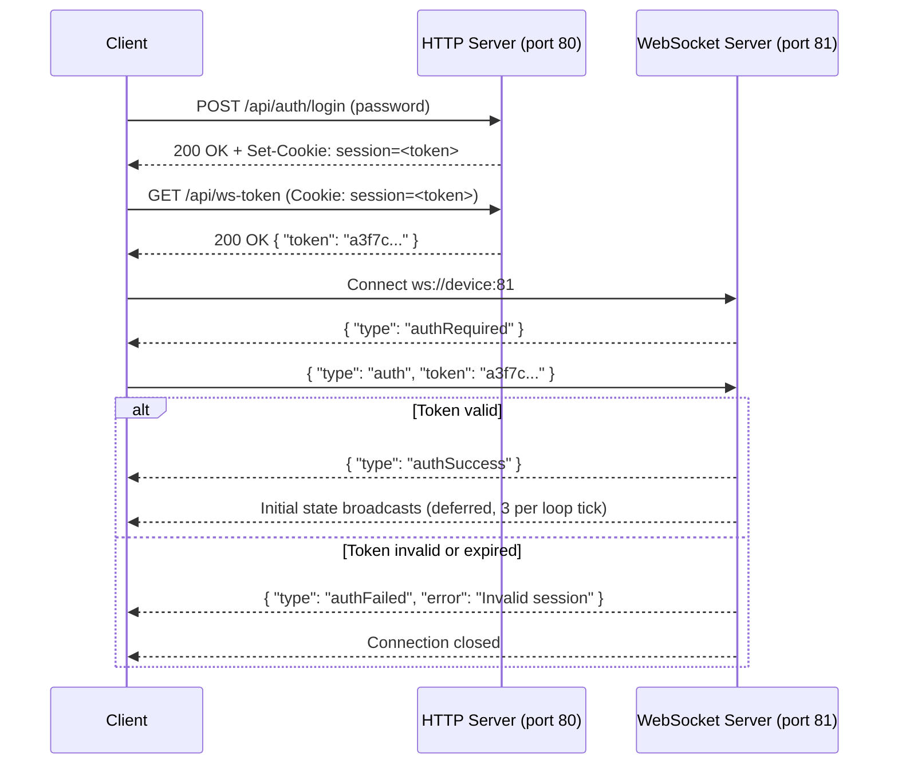

# WebSocket Protocol

The ALX Nova Controller exposes a WebSocket server on **port 81** alongside the HTTP server on port 80. The WebSocket connection is the primary real-time channel between the web dashboard and the device. It carries:

- State broadcasts (JSON text frames) — sent by the device on any state change
- Control commands (JSON text frames) — sent by the client to change settings
- Binary audio frames — waveform samples and FFT spectrum data at configurable intervals

Up to **10 simultaneous clients** are supported (`MAX_WS_CLIENTS = 10`). Each connection must authenticate independently before receiving any state data or sending commands.

---

## Authentication Flow

Every WebSocket connection must authenticate within 5 seconds of connecting or it is disconnected. The recommended authentication path uses a short-lived token fetched from `GET /api/ws-token` before opening the socket.



### Token Details

- Tokens are issued by `GET /api/ws-token` (requires a valid HTTP session cookie)
- Each token is **single-use** — consumed on first successful WS authentication
- Tokens expire after **60 seconds** if unused
- The token pool holds **16 slots**; requesting more than 16 tokens evicts the oldest
- Legacy clients may send `{ "type": "auth", "sessionId": "<cookie-value>" }` as a fallback, but this is not recommended for new clients

### Session Re-validation

Every non-auth command received from an authenticated client is re-validated against the session store. If the session has expired (e.g., the user logged out from another browser), the client receives an `authFailed` message and is disconnected.

:::warning Token is single-use
If the connection drops after the token is consumed but before `authSuccess` arrives, the token cannot be reused. Fetch a new token from `GET /api/ws-token` before reconnecting.
:::

---

## Initial State Broadcast

After authentication succeeds, the device queues a full initial state burst (`INIT_ALL`). To avoid flooding the WiFi TX buffer (which can cause cross-core audio pipeline interference), the initial state is spread across multiple main loop iterations — **3 broadcasts per 5 ms tick**.

The following state broadcasts are sent on initial connection:

| Bit | Broadcast Type | Description |
|-----|---------------|-------------|
| 0 | `wifiStatus` | WiFi connection state and IP addresses |
| 1 | `smartSensing` | Smart sensing config and FSM state |
| 2 | `displayState` | TFT backlight, screen timeout, dim settings |
| 3 | `buzzerState` | Buzzer enabled flag and volume |
| 4 | `signalGenerator` | Signal generator parameters |
| 5 | `audioGraphState` | VU meter, waveform, spectrum enable flags |
| 6 | `debugState` | Debug mode, serial level, pin map |
| 7 | `adcState` | Per-lane ADC enable flags |
| 8 | `dspState` | Full DSP configuration for all channels |
| 9 | `dacState` | DAC enable, volume, mute, filter mode |
| 10 | `usbAudioState` | USB Audio device state |
| 11 | `updateState` | OTA update availability flag |
| 13 | `halDeviceState` | Full HAL device list |
| 14 | `audioChannelMap` | Active input/output channel mapping |

---

## Commands (Client to Device)

All commands are JSON text frames. The `type` field is required and case-sensitive. Commands that modify persisted state write through to LittleFS via `saveSettingsDeferred()` (debounced).

### Display

| Type | Key Fields | Description |
|------|-----------|-------------|
| `setBacklight` | `enabled: bool` | Turn TFT backlight on or off |
| `setScreenTimeout` | `value: int` (seconds) | Set screen-off timeout. Valid: `0, 30, 60, 300, 600` |
| `setBrightness` | `value: int` (1-255) | Set backlight PWM duty cycle |
| `setDimEnabled` | `enabled: bool` | Enable or disable auto-dim |
| `setDimTimeout` | `value: int` (seconds) | Set dim trigger delay. Valid: `5, 10, 15, 30, 60` |
| `setDimBrightness` | `value: int` | Dim PWM level. Valid: `26, 64, 128, 191` |

### Audio Settings

| Type | Key Fields | Description |
|------|-----------|-------------|
| `subscribeAudio` | `enabled: bool` | Subscribe or unsubscribe from binary audio frames |
| `setAudioUpdateRate` | `value: int` (ms) | Set audio broadcast interval. Valid: `33, 50, 100` |
| `setVuMeterEnabled` | `enabled: bool` | Enable VU meter data in broadcasts |
| `setWaveformEnabled` | `enabled: bool` | Enable waveform data in binary frames |
| `setSpectrumEnabled` | `enabled: bool` | Enable FFT spectrum data in binary frames |
| `setFftWindowType` | `value: int` (0-N) | Set FFT window function |
| `setAdcEnabled` | `adc: int, enabled: bool` | Enable or disable a specific ADC input lane |
| `setInputGain` | `lane: int, db: float` | Set input lane gain in dB |
| `setInputMute` | `lane: int, muted: bool` | Mute or unmute an input lane |
| `setInputPhase` | `lane: int, inverted: bool` | Invert input lane polarity |
| `setInputNames` | `names: string[]` | Update per-lane user labels |

### DSP Control

| Type | Key Fields | Description |
|------|-----------|-------------|
| `setDspBypass` | `enabled: bool, bypass: bool` | Toggle DSP enable and global bypass |
| `addDspStage` | `ch: int, stageType: int, [freq, Q, gain, label]` | Add a DSP stage to a channel |
| `removeDspStage` | `ch: int, stage: int` | Remove a stage by index |
| `updateDspStage` | `ch: int, stage: int, [type-specific fields]` | Update stage parameters |
| `reorderDspStage` | `ch: int, from: int, to: int` | Move a stage within the chain |
| `setDspChannelBypass` | `ch: int, bypass: bool` | Bypass a single DSP channel |
| `setDspStereoLink` | `pair: int, linked: bool` | Stereo-link a channel pair (0 or 1) |
| `updatePeqBand` | `ch: int, band: int, freq, gain, Q, enabled, filterType` | Update a PEQ band |
| `setPeqBandEnabled` | `ch: int, band: int, enabled: bool` | Enable or disable one PEQ band |
| `setPeqAllEnabled` | `ch: int, enabled: bool` | Enable or disable all PEQ bands on a channel |
| `copyPeqChannel` | `from: int, to: int` | Copy PEQ configuration between channels |
| `copyChainStages` | `from: int, to: int` | Copy full chain stages between channels |
| `savePeqPreset` | `name: string, ch: int` | Save PEQ bands to a named preset file |
| `loadPeqPreset` | `name: string, ch: int` | Load a named PEQ preset to a channel |
| `deletePeqPreset` | `name: string` | Delete a PEQ preset file |
| `listPeqPresets` | _(none)_ | Request list of saved PEQ presets |
| `saveDspPreset` | `slot: int, name: string` | Save full DSP config to a slot |
| `loadDspPreset` | `slot: int` | Load a DSP preset from a slot |
| `deleteDspPreset` | `slot: int` | Delete a DSP preset slot |
| `renameDspPreset` | `slot: int, name: string` | Rename a DSP preset slot |
| `startThdMeasurement` | `freq: float, averages: int` | Begin a THD measurement |
| `stopThdMeasurement` | _(none)_ | Abort the THD measurement |
| `applyBaffleStep` | `ch: int, baffleWidthMm: float` | Add a baffle step correction shelf to a channel |

### Output Stage Control

| Type | Key Fields | Description |
|------|-----------|-------------|
| `setOutputMute` | `channel: int, muted: bool` | Mute or unmute an output channel |
| `setOutputPhase` | `channel: int, inverted: bool` | Invert output channel polarity |
| `setOutputGain` | `channel: int, db: float` | Set post-matrix output gain |
| `setOutputDelay` | `channel: int, ms: float` | Set output alignment delay in milliseconds |

### DAC / Hardware

:::warning Device-specific DAC commands deprecated
The commands `setDacEnabled`, `setDacVolume`, `setDacMute`, `setDacFilter`, `setEs8311Enabled`, `setEs8311Volume`, and `setEs8311Mute` are deprecated as of DEBT-5. They emit a `LOG_W` warning when received. HAL is the sole system managing all DAC hardware — use `PUT /api/hal/devices` with the appropriate HAL slot to enable/disable or reconfigure a DAC device. The `halDeviceState` broadcast reflects the authoritative device state.
:::

| Type | Key Fields | Description |
|------|-----------|-------------|
| `setDacEnabled` | `enabled: bool` | **Deprecated.** Enable or disable the primary DAC (deferred to main loop). Use `PUT /api/hal/devices` instead. |
| `setDacVolume` | `volume: int` (0-100) | **Deprecated.** Set primary DAC volume. Use `PUT /api/hal/devices` with `cfgVolume` instead. |
| `setDacMute` | `mute: bool` | **Deprecated.** Mute or unmute the primary DAC. Use `PUT /api/hal/devices` with `cfgMute` instead. |
| `setDacFilter` | `filterMode: int` | **Deprecated.** Set DAC digital filter mode. Retained for backward compatibility only. |
| `setEs8311Enabled` | `enabled: bool` | **Deprecated.** Enable or disable ES8311 codec (deferred to main loop). Use `PUT /api/hal/devices` instead. |
| `setEs8311Volume` | `volume: int` (0-100) | **Deprecated.** Set ES8311 output volume. Use `PUT /api/hal/devices` with `cfgVolume` instead. |
| `setEs8311Mute` | `mute: bool` | **Deprecated.** Mute or unmute the ES8311. Use `PUT /api/hal/devices` with `cfgMute` instead. |
| `setUsbAudioEnabled` | `enabled: bool` | Enable or disable USB Audio input |
| `eepromScan` | _(none)_ | Scan I2C bus for AT24C02 EEPROM |
| `eepromProgram` | `deviceId, hwRevision, deviceName, manufacturer, ...` | Write device identity to EEPROM |
| `eepromErase` | `address: int` | Erase an EEPROM at the given I2C address |

:::warning DAC enable/disable is deferred
When the deprecated `setDacEnabled` and `setEs8311Enabled` commands are still used, they set `_pendingDacToggle` / `_pendingEs8311Toggle` flags that the main loop processes in the next iteration. This prevents the WebSocket handler from blocking the SDIO interface during I2S driver reinstallation. The equivalent HAL path via `PUT /api/hal/devices` uses the same deferred mechanism internally.
:::

### Signal Generator

| Type | Key Fields | Description |
|------|-----------|-------------|
| `setSignalGen` | `enabled, waveform, frequency, amplitude, channel, outputMode, sweepSpeed` | Update any combination of signal generator parameters |

Valid ranges:
- `waveform`: 0 = sine, 1 = square, 2 = noise, 3 = sweep
- `frequency`: 1.0 – 22000.0 Hz
- `amplitude`: -96.0 – 0.0 dBFS
- `channel`: 0 = left, 1 = right, 2 = both
- `outputMode`: 0 = software injection, 1 = PWM output
- `sweepSpeed`: 1.0 – 22000.0 Hz/s

### Access Point

| Type | Key Fields | Description |
|------|-----------|-------------|
| `toggleAP` | `enabled: bool` | Enable or disable the soft Access Point |

### Debug

| Type | Key Fields | Description |
|------|-----------|-------------|
| `setDebugMode` | `enabled: bool` | Toggle debug mode (enables verbose WS log forwarding) |
| `setDebugSerialLevel` | `level: int` (0-3) | Set serial log verbosity: 0=None, 1=Error, 2=Warning, 3=Debug |
| `setDebugHwStats` | `enabled: bool` | Toggle hardware stats periodic broadcast |
| `setDebugI2sMetrics` | `enabled: bool` | Toggle I2S DMA metrics broadcast |
| `setDebugTaskMonitor` | `enabled: bool` | Toggle FreeRTOS task stack monitor |
| `getHardwareStats` | _(none)_ | Request an immediate hardware stats broadcast |

---

## Broadcasts (Device to Client)

The device broadcasts JSON text frames to all authenticated clients when state changes. Broadcasts skip JSON serialization entirely when no authenticated clients are connected (`_wsAuthCount == 0`).

### `displayState`

Sent when any display setting changes.

```json
{
  "type": "displayState",
  "backlightOn": true,
  "screenTimeout": 300,
  "backlightBrightness": 200,
  "dimEnabled": true,
  "dimTimeout": 30,
  "dimBrightness": 26
}
```

### `buzzerState`

```json
{
  "type": "buzzerState",
  "enabled": true,
  "volume": 1
}
```

Volume levels: 0 = quiet, 1 = normal, 2 = loud.

### `signalGenerator`

```json
{
  "type": "signalGenerator",
  "enabled": false,
  "waveform": 0,
  "frequency": 1000.0,
  "amplitude": -20.0,
  "channel": 2,
  "outputMode": 0,
  "sweepSpeed": 100.0
}
```

### `audioGraphState`

```json
{
  "type": "audioGraphState",
  "vuMeterEnabled": true,
  "waveformEnabled": true,
  "spectrumEnabled": false,
  "fftWindowType": 0
}
```

### `adcState`

Sent when any ADC lane enable flag changes.

```json
{
  "type": "adcState",
  "enabled": [true, true, false, false, false, false, false, false]
}
```

The array contains one entry per `AUDIO_PIPELINE_MAX_INPUTS` (8) lanes.

### `audioChannelMap`

Sent at boot and after any HAL device state change. Describes the active input sources and output sinks registered in the audio pipeline. The frontend uses this broadcast to size all audio visualization arrays dynamically (`resizeAudioArrays()`).

```json
{
  "type": "audioChannelMap",
  "inputs": [
    {
      "lane": 0,
      "name": "PCM1808 #1",
      "channels": 2,
      "matrixCh": 0,
      "deviceName": "PCM1808",
      "compatible": "ti,pcm1808",
      "manufacturer": "Texas Instruments",
      "capabilities": 4,
      "ready": true,
      "deviceType": 1
    },
    {
      "lane": 2,
      "name": "SigGen",
      "channels": 2,
      "matrixCh": 4,
      "deviceName": "SigGen",
      "manufacturer": "",
      "capabilities": 0,
      "ready": true,
      "deviceType": 1
    }
  ],
  "outputs": [
    {
      "index": 0,
      "name": "PCM5102A",
      "firstChannel": 0,
      "channels": 2,
      "muted": false,
      "compatible": "ti,pcm5102a",
      "manufacturer": "Texas Instruments",
      "capabilities": 8,
      "ready": true,
      "deviceType": 0
    }
  ],
  "matrixInputs": 16,
  "matrixOutputs": 16,
  "matrixBypass": false,
  "matrix": [
    ["1.0000", "0.0000", "...16 values per row..."],
    ["...16 rows total..."]
  ]
}
```

`inputs[]` only contains lanes that have a registered `AudioInputSource`. Empty lanes are omitted. `matrixCh` is the index of the first mono matrix channel for that stereo input lane (`lane * 2`). The `matrix` is a 16x16 array of gain values encoded as strings with 4 decimal places.

### `debugState`

Includes the static pin map on first send to avoid repeating it on every debug toggle.

```json
{
  "type": "debugState",
  "debugMode": false,
  "debugSerialLevel": 1,
  "debugHwStats": false,
  "debugI2sMetrics": false,
  "debugTaskMonitor": false,
  "pins": [
    { "g": 20, "f": "BCK", "d": "PCM1808 ADC 1&2", "c": "audio" },
    { "g": 23, "f": "DOUT", "d": "PCM1808 ADC 1", "c": "audio" }
  ]
}
```

### `diagEvent`

Emitted each time a diagnostic event is added to the journal.

```json
{
  "type": "diagEvent",
  "seq": 42,
  "boot": 5,
  "t": 12340,
  "heap": 182400,
  "c": "0x1001",
  "corr": 7,
  "sub": "AUDIO",
  "dev": "PCM1808",
  "slot": 2,
  "msg": "ADC lane 1 health check failed",
  "sev": "W",
  "retry": 1
}
```

### `factoryResetProgress` / `rebootProgress`

Sent while the user holds the physical reset button, updated every second.

```json
{
  "type": "factoryResetProgress",
  "secondsHeld": 5,
  "secondsRequired": 10,
  "resetTriggered": false,
  "progress": 50
}
```

### `dspState`

Full DSP configuration dump. Sent on auth and after any DSP change.

```json
{
  "type": "dspState",
  "dspEnabled": true,
  "dspBypass": false,
  "globalBypass": false,
  "sampleRate": 48000,
  "presetIndex": -1,
  "presets": [
    { "index": 0, "name": "Flat", "exists": true }
  ],
  "channels": [
    {
      "bypass": false,
      "stereoLink": true,
      "stageCount": 2,
      "stages": [
        {
          "enabled": true,
          "type": 0,
          "label": "PEQ 1",
          "freq": 80.0,
          "gain": -3.0,
          "Q": 0.707,
          "coeffs": [0.99, -1.98, 0.99, 1.98, -0.98]
        }
      ]
    }
  ]
}
```

### `dspMetrics`

Sent periodically when `debugI2sMetrics` is enabled.

```json
{
  "type": "dspMetrics",
  "processTimeUs": 420,
  "cpuLoad": 8.3,
  "limiterGr": [0.0, 0.0, -1.2, 0.0]
}
```

### `dacState`

:::note Reduced scope since DEBT-5
`DacState` no longer carries per-device enabled/volume/mute fields for all DAC devices. The retained fields are `filterMode`, `txUnderruns`, pending toggle state, and `eepromDiag`. For the authoritative enable/volume/mute state of each DAC device, use the `halDeviceState` broadcast (`cfgEnabled`, `cfgVolume`, `cfgMute` fields per device slot).
:::

```json
{
  "type": "dacState",
  "enabled": true,
  "volume": 75,
  "mute": false,
  "filterMode": 0,
  "ready": true,
  "modelName": "PCM5102A",
  "es8311Enabled": true,
  "es8311Volume": 80,
  "es8311Mute": false
}
```

The `enabled`, `volume`, `mute`, `modelName`, `es8311Enabled`, `es8311Volume`, and `es8311Mute` fields are broadcast for backward compatibility. Authoritative per-device state is available in `halDeviceState`.

### `halDeviceState`

Full HAL device list. Sent at boot and after any device state change.

```json
{
  "type": "halDeviceState",
  "scanning": false,
  "devices": [
    {
      "slot": 0,
      "compatible": "ti,pcm5102a",
      "name": "PCM5102A",
      "type": 0,
      "state": 3,
      "discovery": "builtin",
      "ready": true,
      "i2cAddr": 0,
      "channels": 2,
      "capabilities": 8,
      "manufacturer": "Texas Instruments",
      "busType": 1,
      "busIndex": 0,
      "pinA": 24,
      "pinB": -1,
      "busFreq": 0,
      "sampleRates": 15,
      "legacyId": 1,
      "userLabel": "",
      "cfgEnabled": true,
      "cfgI2sPort": 0,
      "cfgVolume": 80,
      "cfgMute": false,
      "cfgPinSda": -1,
      "cfgPinScl": -1
    }
  ]
}
```

HAL device states (`state` field): 0 = Unknown, 1 = Detected, 2 = Configuring, 3 = Available, 4 = Unavailable, 5 = Error, 6 = Manual, 7 = Removed.

`scanning: true` is set while a `POST /api/hal/scan` rescan is in progress. The `cfgXxx` fields are only present if a `HalDeviceConfig` record exists for that slot in `hal_config.json`. For temperature sensor devices (`type == HAL_DEV_SENSOR`), an additional `temperature` field (°C, float) is included.

### `audioLevels`

Sent on each audio analysis cycle for all subscribed clients. Contains per-lane per-channel VU, peak, RMS, and Vrms readings plus output sink VU data.

```json
{
  "type": "audioLevels",
  "audioLevel": -18.5,
  "signalDetected": true,
  "numAdcsDetected": 2,
  "adc": [
    {
      "vu1": 0.42, "vu2": 0.39,
      "peak1": 0.61, "peak2": 0.58,
      "rms1": 0.31, "rms2": 0.29,
      "vrms1": 0.45, "vrms2": 0.43,
      "dBFS": -18.5
    }
  ],
  "adcStatus": ["OK", "NO_DATA"],
  "adcNoiseFloor": [-72.3, -75.1],
  "sinks": [
    { "vuL": 0.38, "vuR": 0.36, "name": "PCM5102A", "ch": 0 }
  ]
}
```

| `adcStatus` value | Meaning |
|---|---|
| `"OK"` | Normal operation |
| `"NO_DATA"` | No samples received from the I2S driver |
| `"NOISE_ONLY"` | Samples are below the noise gate threshold |
| `"CLIPPING"` | Input is clipping |
| `"I2S_ERROR"` | I2S DMA read error |
| `"HW_FAULT"` | Persistent hardware fault |

:::note Deprecated fields
The top-level flat fields `audioRms1`, `audioRms2`, `audioVu1`, `audioVu2`, `audioPeak1`, `audioPeak2`, `audioPeak`, `audioVrms1`, `audioVrms2`, `audioVrms` are deprecated as of firmware v1.14. They carry ADC lane 0 values only and are retained solely for backward compatibility. New clients must use the `adc[]` array.
:::

### `mqttSettings`

Sent on connect and after MQTT settings change.

```json
{
  "type": "mqttSettings",
  "enabled": true,
  "broker": "192.168.1.100",
  "port": 1883,
  "username": "nova",
  "hasPassword": true,
  "baseTopic": "alx_nova",
  "haDiscovery": true,
  "connected": true
}
```

`hasPassword` is `true` if a non-empty password is stored; the password value itself is never sent over WebSocket.

### `usbAudioState`

Sent on connect and when USB Audio device state changes. Only present when firmware is built with `USB_AUDIO_ENABLED`.

```json
{
  "type": "usbAudioState",
  "enabled": true,
  "connected": true,
  "streaming": true,
  "sampleRate": 48000,
  "bitDepth": 16,
  "channels": 2,
  "volume": 100,
  "volumeLinear": 1.0,
  "mute": false,
  "overruns": 0,
  "underruns": 0,
  "vuL": 0.34,
  "vuR": 0.31,
  "negotiatedRate": 48000,
  "negotiatedDepth": 16
}
```

### `hardware_stats`

Sent periodically while `debugMode` is `true`. Only the `cpu` block is always included; the `memory`, `storage`, `wifi`, `audio`, `dac`, `dsp`, `tasks`, and `audio.i2sConfig` sections are gated by the `debugHwStats`, `debugTaskMonitor`, and `debugI2sMetrics` flags.

```json
{
  "type": "hardware_stats",
  "cpu": {
    "freqMHz": 360,
    "model": "ESP32-P4",
    "revision": 0,
    "cores": 2,
    "usageCore0": 12.4,
    "usageCore1": 38.7,
    "usageTotal": 25.6,
    "temperature": 42.1
  },
  "memory": {
    "heapTotal": 524288,
    "heapFree": 182432,
    "heapMinFree": 145600,
    "heapMaxBlock": 98304,
    "psramTotal": 8388608,
    "psramFree": 7340032
  },
  "storage": {
    "flashSize": 16777216,
    "sketchSize": 2097152,
    "sketchFree": 2097152,
    "LittleFSTotal": 1441792,
    "LittleFSUsed": 81920
  },
  "wifi": { "rssi": -58, "channel": 6, "apClients": 0, "connected": true },
  "audio": {
    "sampleRate": 48000,
    "numAdcsDetected": 2,
    "adcs": [
      {
        "status": "OK",
        "noiseFloorDbfs": -72.3,
        "i2sErrors": 0,
        "consecutiveZeros": 0,
        "totalBuffers": 92840,
        "vrms": 0.45,
        "snrDb": 68.2,
        "sfdrDb": 74.1,
        "i2sRecoveries": 0
      }
    ]
  },
  "uptime": 3620000,
  "resetReason": "Power on",
  "heapCritical": false,
  "crashHistory": []
}
```

`cpu.usageCore0` and `cpu.usageCore1` are `-1` during a calibration window (~4 s) after debug mode is first enabled. The DSP section (`dsp.swapFailures`, `dsp.swapSuccesses`, `dsp.lastSwapFailureAgo`) is included when `DSP_ENABLED`.

### `eepromProgramResult` / `eepromEraseResult`

Targeted response (sent only to the requesting client) after `eepromProgram` or `eepromErase`.

```json
{"type": "eepromProgramResult", "success": true}
{"type": "eepromEraseResult",   "success": true}
```

### `peqPresets`

Response to the `listPeqPresets` command.

```json
{
  "type": "peqPresets",
  "presets": ["flat", "bass-boost", "vocal"]
}
```

### `peqPresetSaved`

Confirmation after `savePeqPreset`.

```json
{
  "type": "peqPresetSaved",
  "name": "my-preset"
}
```

### `dspError`

Sent when a DSP operation fails due to resource exhaustion.

```json
{
  "type": "dspError",
  "message": "Resource pool full (FIR/delay slots exhausted)"
}
```

### `authRequired` / `authSuccess` / `authFailed`

Connection handshake messages — see [Authentication Flow](#authentication-flow).

---

## Binary Audio Frames

Clients that have sent `{ "type": "subscribeAudio", "enabled": true }` receive binary WebSocket frames at the configured audio update rate (33, 50, or 100 ms). Binary frames are more efficient than JSON for high-frequency numeric data.

### Waveform Frame (`WS_BIN_WAVEFORM = 0x01`)

Total size: **258 bytes**

```
Offset  Size  Type     Description
------  ----  ------   -----------
0       1     uint8    Message type: 0x01
1       1     uint8    ADC lane index (0-based)
2       256   int8[]   256 signed PCM samples, range [-127, 127]
```

The 256 samples represent one downsampled buffer period. At 48 kHz with 256-point DMA buffers, each frame covers approximately 5.33 ms of audio.

### Spectrum Frame (`WS_BIN_SPECTRUM = 0x02`)

Total size: **70 bytes**

```
Offset  Size  Type     Description
------  ----  ------   -----------
0       1     uint8    Message type: 0x02
1       1     uint8    ADC lane index (0-based)
2       4     float32  Dominant frequency in Hz (little-endian)
6       64    float32  16 FFT band magnitudes, each in dBFS (little-endian)
```

Band boundaries follow a logarithmic scale covering approximately 20 Hz to 20 kHz across 16 bands.

:::tip Bandwidth estimation
At 50 ms update rate with 2 active audio lanes:
- Waveform: 2 frames x 258 bytes = 516 bytes per update = ~10.3 KB/s
- Spectrum: 2 frames x 70 bytes = 140 bytes per update = ~2.8 KB/s
- Total binary: approximately 13 KB/s per connected subscribed client

Disable waveform or spectrum broadcasts if network bandwidth is constrained.
:::

---

## Broadcast Client Guard

Several broadcast functions skip JSON serialization entirely when no authenticated clients are connected. This is controlled by an internal counter `_wsAuthCount` incremented on `authSuccess` and decremented on disconnect.

Functions guarded by `wsAnyClientAuthenticated()`:

- `sendHardwareStats` — CPU, memory, audio diagnostics
- `sendDspState` / `sendDspMetrics`
- `sendHalDeviceState` / `sendAudioChannelMap`
- `sendDacState` / `sendUsbAudioState`
- `sendMqttSettingsState`
- `sendSmartSensingStateInternal` (in `smart_sensing.cpp`)
- `sendWiFiStatus` (in `wifi_manager.cpp`)

Functions that are intentionally not guarded — they respond to explicit user actions that imply a client is present, or they are always needed for connection setup:

- `sendDisplayState`, `sendBuzzerState`, `sendSignalGenState`
- `sendDiagEvent`
- `drainPendingInitState`

---

## Thread Safety Notes

:::warning WebSocket handler runs on the main loop (Core 1)
`webSocketEvent()` is called synchronously from `webSocket.loop()` on Core 1. Long-running operations must not be performed in the handler. DAC init/deinit, I2S driver reinstallation, and WiFi mode changes are deferred via dirty flags to the main loop outside the WS handler context.
:::

:::warning Do not call WebSocket send functions from the audio pipeline task
The audio pipeline task runs on Core 1 at priority 3. Calling `webSocket.broadcastTXT()` from inside the audio task or its callbacks will cause reentrant access to the WebSocket library's internal state. All WS broadcasts must originate from the main loop or from a task that has yielded to a lower priority than the audio task.
:::

The authenticated client counter `_wsAuthCount` is accessed only from `webSocketEvent()` on Core 1 and is therefore not protected by a mutex. If you add a new code path that accesses this counter from Core 0, you must add a FreeRTOS critical section.
