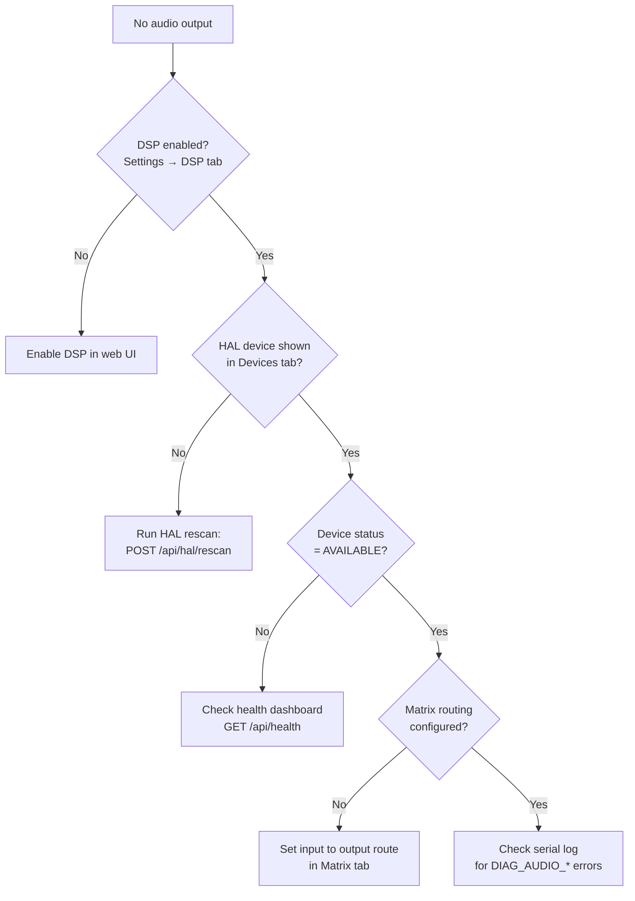
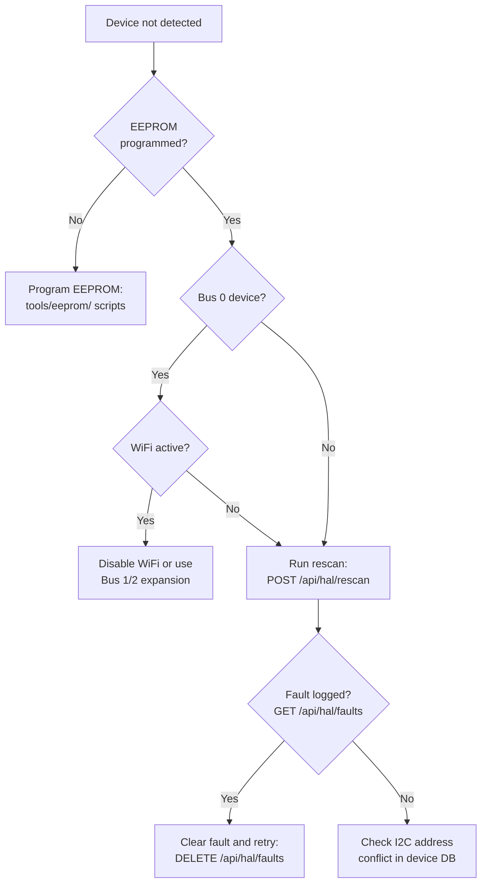

# Troubleshooting

This page collects the most common problems reported by users, grouped by category. If your issue is not listed here, check the Debug Console in the web interface (filter by **Warning** or **Error**) for clues, then open an issue on GitHub.

## Quick Diagnosis Flowcharts

Use these flowcharts to find the most likely cause before reading the detailed sections below.

### No Audio Output

### HAL Device Not Detected

---

## WiFi Issues

### The controller will not connect to my network

1. **Check the password** — WiFi passwords are case-sensitive. Re-enter the password carefully.
2. **Try the 2.4 GHz band** — If your router broadcasts separate 2.4 GHz and 5 GHz SSIDs, try the 2.4 GHz one first.
3. **Check MAC filtering** — If your router has a MAC address allowlist, add the controller's MAC address. You can find it in the web interface under **System > Hardware Stats** or on the TFT Home screen.
4. **Check signal strength** — Move the controller temporarily within a metre of the access point and retry. If it connects at close range, signal strength is the issue.
5. **Reboot the router** — Occasionally a router's DHCP table fills up or its association table gets stale. A router reboot often resolves mysterious connection failures.

### I cannot see the ALX-XXXXXXXX access point

- Make sure the AP is enabled. Double-click the physical button to toggle it on.
- The AP may have been disabled by a previous settings import. Try a long press (2 seconds) to reboot the controller — AP mode is re-enabled automatically if no home network is configured.
- The SSID broadcast can take a few seconds after power-on. Wait 15 seconds and scan again.

### I connected to the AP but the web interface does not load at http://192.168.4.1

- Confirm your phone or laptop is connected to the ALX AP and not your home network (some devices auto-switch back).
- Disable mobile data on your phone temporarily — it can interfere with routing to the 192.168.4.x address.
- Try clearing your browser cache or use a private/incognito window.

### I do not know the controller's IP address on my home network

- Check your **router's DHCP client list** — look for a hostname starting with `ALX-`.
- Look at the **TFT Home screen** — the current IP address is displayed there.
- **Double-click the button** to enable AP mode, connect via `192.168.4.1`, and check the WiFi tab for the STA IP address.

---

## Ethernet Issues

### No Ethernet Link

If the Ethernet Status card shows "No cable detected":
- Verify the cable is securely connected at both ends.
- Try a different Ethernet cable.
- Check that your switch or router port has link activity lights.
- The ESP32-P4 supports 100 Mbps Ethernet — ensure your switch port is compatible and not locked to a speed that prevents auto-negotiation.

### Ethernet Connected but No IP

If the card shows "Link Up — Awaiting DHCP":
- Verify your DHCP server is running on the network.
- Check for VLAN or MAC filtering on your switch that may be blocking the new device.
- Try configuring a static IP instead (see [Network Configuration](./wifi-configuration.md#static-ip-configuration)).
- The MAC address is always visible in the Ethernet Status card — use it to set up a DHCP reservation on your router for a consistent address.

### Static IP Not Working

- Verify the IP address is within the correct subnet for your network (e.g., `192.168.1.x` if your gateway is `192.168.1.1`).
- Confirm the gateway IP is correct and reachable on the same subnet.
- If you applied a wrong static IP and lost access, wait 60 seconds — the device automatically reverts to DHCP if you do not confirm the change.
- As a last resort, access the device via WiFi or AP mode (`192.168.4.1`) and correct the configuration from there.

### Ethernet and WiFi Both Show Connected but Traffic Is Wrong

- This is normal. Ethernet takes priority when the cable is connected. All outbound traffic (OTA, MQTT, API) routes over Ethernet.
- WiFi remains associated as a backup interface. The status bar shows **Net** when both are active.
- If you need traffic to route exclusively over one interface, disconnect the other.

---

## MQTT Issues

### MQTT shows "Disconnected" in the web UI

1. **Verify broker address and port** — A typo in the broker IP or an incorrect port is the most common cause.
2. **Check broker is running** — From another device on the same network, try connecting to the broker with an MQTT client (e.g. MQTT Explorer or mosquitto\_sub).
3. **Check firewall** — Port 1883 must be open between the controller and the broker host. Some router firmware blocks local device-to-device traffic.
4. **Check credentials** — If your broker requires a username and password, make sure they are saved correctly in the MQTT tab. Leave both fields empty only if your broker allows anonymous access.
5. **Restart the controller** — Go to **System > Reboot** in the web interface. The MQTT task reconnects automatically within 5 seconds of a successful boot.

### Home Assistant entities are not appearing

1. Make sure **Home Assistant Discovery** is toggled on in the MQTT tab and that settings are saved.
2. Confirm the HA MQTT integration is connected to the same broker as the controller. In HA: **Settings > Devices & Services > MQTT > Configure**.
3. After saving discovery settings, wait up to 30 seconds for HA to process the discovery announcement.
4. If entities still do not appear, go to the MQTT tab and click **Save MQTT Settings** again — this re-publishes the discovery payload immediately.
5. Check the HA MQTT integration's event log for `homeassistant/#` messages to confirm they are arriving.

### MQTT entities are shown as "Unavailable" in Home Assistant

- The controller publishes an `offline` Last Will and Testament (LWT) message when it disconnects. When it reconnects it publishes `online`. If HA shows Unavailable, the controller is either offline or the MQTT connection dropped.
- Check the Debug Console in the web interface for MQTT connection errors.
- Confirm the controller has network connectivity (ping it or open the web interface).

---

## Audio Issues

### No sound from the amplifier output

1. **Check sensing mode** — If the mode is set to **Always Off**, the relay is permanently open. Switch to **Always On** or **Smart Auto**.
2. **Check the routing matrix** — Open the web interface, go to **Audio > Routing Matrix**, and verify that at least one input channel has a connection to your target output. An empty matrix produces silence.
3. **Check HAL device states** — Go to **System > HAL Devices**. If your DAC or ADC shows a state other than **Available**, click **Reinitialise** to attempt recovery.
4. **Check output DSP mute** — Open the output channel's DSP overlay and confirm the **Mute** button is not active.
5. **Check amplifier relay** — The relay on GPIO 27 controls power to the connected amplifier. Use the Amplifier toggle on the Control screen or via the short-press button to toggle it and listen for a click.

### I hear noise or hum on the output

1. **Check input levels** — Open the Audio tab and look at the input channel VU meters. If a lane shows clipping (solid red), reduce the input gain in the DSP overlay.
2. **Floating ADC input** — If a PCM1808 ADC input is connected but no audio source is playing, you may see low-level noise reported as a weak signal. Set the audio threshold appropriately in the Smart Sensing settings, or mute unused input lanes in the routing matrix.
3. **Ground loop** — If hum is present, check that all audio equipment shares a common ground.

### Smart Sensing is not detecting my audio signal

1. **Check sensing mode** — Must be set to **Smart Auto**.
2. **Adjust the threshold** — The default threshold is –60 dBFS. If your source is very quiet, lower the threshold further. If it is triggering on background noise, raise it.
3. **Check ADC health** — Go to **System > HAL Devices** and confirm the PCM1808 ADC devices show as **Available**. Also check the Health Dashboard in the Debug tab for any lane showing NO\_DATA or WEAK.
4. **Check wiring** — Confirm the audio source is connected to the correct I2S ADC input.

### Audio drops or stutters

- This is almost always a CPU or memory pressure issue. Open the Debug tab and check **CPU usage** in Hardware Stats. If it is consistently above 90%, reduce the DSP processing load (fewer PEQ bands, shorter FIR filters, or lower-order crossovers).
- Check **Free Heap**. If it drops below 40 KB, incoming network packets start to be silently dropped. Reboot to recover, then reduce DSP memory usage.

---

## Performance and Memory Issues

### WiFi disconnects, web UI becomes unresponsive, or DSP effects stop applying

These symptoms often point to low memory conditions. The controller manages two memory pools: internal SRAM (shared with WiFi) and external PSRAM (used for audio processing and DSP).

**Common symptoms:**
- WiFi disconnects or ping stops responding while MQTT publishes still work
- WebSocket updates slow down or stop arriving
- Adding a DSP stage or delay line has no effect (stage refused silently)
- OTA update check does not start

**What to check:**

1. Open the web interface and go to **System > Hardware Stats**. Look for any warning or critical indicators next to heap or PSRAM values.
2. If **Free Heap** is below 40 KB, incoming WiFi packets are silently dropped. The controller may appear connected but the web UI cannot load. Reboot to recover.
3. If the **PSRAM Budget Table** shows high usage or a warning flag, try reducing active DSP stages — especially delay lines and convolution (FIR) filters, which use large PSRAM allocations.
4. The **DSP CPU Indicator** in Hardware Stats shows processing load. At 95% or above, the audio task cannot keep up with DMA and dropouts occur.

**Steps to reduce memory pressure:**

- Disable unused audio input lanes in **System > HAL Devices**.
- Remove DSP stages you are not actively using, particularly delay and FIR convolution stages.
- Reduce PEQ band counts — each active band adds CPU load.
- Check `GET /api/psram/status` for a per-subsystem allocation breakdown if you need precise figures.
- If heap is critically low, restart the controller via **System > Reboot**. Memory does not recover without a restart.

:::tip
If you consistently need more DSP resources than the device allows, export your current settings, perform a reboot, and reload — this ensures no allocation fragmentation is carrying over from extended uptime.
:::

---

## OTA Update Issues

### "Check for Updates" always shows "Up to date" even though I know there is a newer version

1. The controller compares version strings exactly. If the running firmware reports version `1.12.1` and the release tag is `v1.12.1` (with a leading `v`), the comparison may behave unexpectedly. Try triggering the check again after a reboot.
2. Confirm the controller has internet access — check **System > Hardware Stats** for an active IP address and try reaching the web interface from outside your LAN.

### The update fails partway through

- This is usually caused by a temporary network interruption. The running firmware is unaffected — click **Check for Updates** to retry.
- If retries consistently fail, try the manual upload method: download the `.bin` from the [GitHub Releases page](https://github.com/Schmackos/ALX_Nova_Controller_2/releases) and upload it via the **Manual Upload** area in the OTA panel.

### SHA256 verification error

- The downloaded binary does not match the expected checksum. This can happen if the download was corrupted in transit. Retry the update — it almost never fails twice on the same file.
- If the error persists with the same release, the release asset itself may be corrupt. Check the GitHub release page to see if a corrected asset has been published.

### The controller is in a boot loop after an update

- The ESP32-P4 dual-partition OTA scheme prevents a bad update from permanently bricking the device. On repeated boot failures it will roll back to the previous firmware partition automatically.
- If the boot loop persists, connect a USB-C cable and use the PlatformIO `pio run --target upload` command to flash known-good firmware directly.

---

## HAL Device Issues

### Device Shows Error State

A device in the **Error** state failed to initialise or exhausted its self-recovery retries. An orange banner on the device card shows the exact reason. Common causes and fixes:

**I2C NAK / address not responding**

The controller sent the device's I2C address and received no acknowledgement. This means the device is absent, powered off, or wired to the wrong bus.

1. Check that the mezzanine card is fully seated in the connector.
2. Verify the card is receiving power (check for any power indicator LEDs on the module).
3. Go to **System > HAL Devices** and confirm the I2C bus and address shown match the card's datasheet.
4. Click **Reinitialise** to retry. If the device is now responding it will return to Available.

**I2S channel create failed**

The I2S peripheral the driver requested is already in use by another device.

1. Check **System > HAL Devices** to see which devices are using each I2S port (the port number appears in the device details).
2. Go to the device's config and change it to a free I2S port (0, 1, or 2) using the **Edit Config** option.
3. Click **Reinitialise** after saving the config.

**GPIO claim conflict**

Two devices attempted to use the same GPIO pin. The second device's `init()` will have failed with a claim conflict error.

1. Read the error reason on the device card — it names the conflicting pin.
2. Edit the config for one of the devices to assign a different pin.
3. Reinitialise both devices.

**Error persists after reinitialise**

If a device stays in Error after three or more manual reinitialise attempts:

1. Check the Debug Console (filter by `HAL` module chip) for more detailed log output.
2. Check the Health Dashboard for any correlated diagnostic events.
3. Try a power cycle — remove the mezzanine card, reboot the controller, then reinsert the card and rescan.

---

### Custom Device Not Working

**Tier 1 device produces no audio**

A Tier 1 device (I2S passthrough, no I2C init) requires no software configuration but does require the hardware to be ready at power-on. If no audio comes through:

1. Verify the I2S port number in the custom schema matches where you connected the mezzanine.
2. Open the routing matrix (**Audio > Routing Matrix**) and confirm the device's output sink appears and has a connection from at least one input.
3. Check the VU meters in **Audio > Outputs** — if they show signal the device is receiving audio; if not, the routing matrix may be empty.
4. Check the mezzanine's data sheet to confirm the device does not require an I2C init sequence. If it does, you need to edit the custom schema to Tier 2 and add the init sequence.

**Tier 2 init sequence failing**

If the device card shows an error containing "NAK at reg" or "I2C write failed":

1. The register address or value in your init sequence is wrong. Compare each entry against the device's datasheet.
2. Verify the I2C address — write it in decimal (not hex) in the init sequence form. For example, if the datasheet shows address `0x48`, enter `72`.
3. Check the bus index. Expansion mezzanine cards use **Bus 2** (GPIO 28/29). If your card appears on a different bus, update the `i2sBus` field in the schema.
4. Try reducing the init sequence to the minimum required registers and adding more one at a time until the failure reappears.

**Device works but volume control has no effect**

Custom Tier 1 and Tier 2 devices do not have runtime volume control — the controller cannot send volume commands because it does not know the device's volume register format. Volume changes in the web UI apply software gain in the audio pipeline instead. If you need hardware volume control, a Tier 3 full driver is required (open a GitHub issue with your device's datasheet).

**When to request a full driver (Tier 3)**

Open a GitHub issue requesting a Tier 3 driver when:

- The device requires runtime commands (volume, mute, filter selection) from the web UI
- The init sequence is too complex for a simple register write list (e.g., conditional writes, read-modify-write cycles, firmware loading)
- The device has multiple operating modes that need to switch at runtime

Attach your Tier 2 schema (exported from the custom device creator) and a link to the device datasheet. ALX maintainers will review and prioritise.

---

### Recovering Lost Settings

**I accidentally factory reset — can I restore my settings?**

If you exported your settings before the reset (**Settings > Backup and Restore > Export Settings**), you can restore everything by importing the file after the reset. The v2.0 export format includes DSP presets, custom device schemas, HAL configs, and the routing matrix, so a full restore brings the controller back to its previous state.

After a factory reset:

1. Connect to the `ALX-XXXXXXXXXXXX` access point.
2. Browse to `http://192.168.4.1` and log in with the one-time password shown on the TFT display.
3. Go to **Settings > Backup and Restore > Import Settings** and upload your export file.
4. Review the import preview to confirm it shows all the expected sections.
5. Click **Apply**. The controller restores all sections found in the file and reboots.

**The import preview shows fewer sections than expected**

If the export file is a v1 backup (downloaded from older firmware), it only contains Settings and MQTT. Sections like DSP, HAL Devices, and the routing matrix were not included in v1 exports. You will need to reconfigure those manually.

**My routing matrix is correct but my DSP presets are gone**

DSP presets are included in v2.0 exports under the `dspChannels` section. If that section is missing from your import:

1. Check when the backup was made — v2.0 export was introduced in firmware v1.17. Backups from earlier versions will not include DSP.
2. If you have individual DSP preset files (.txt from REW or .json from a previous export), you can re-import them via the DSP overlay Import button on each channel.

**WiFi credentials survive factory reset**

WiFi credentials are stored in ESP32 NVS (non-volatile storage), which is separate from LittleFS and is not erased by a factory reset. After a reset the controller will automatically reconnect to your home network using the stored credentials — you do not need to re-enter your WiFi password.

:::tip Always keep a recent backup
Export your settings after any significant configuration change — after setting up DSP, adding custom devices, or building a routing matrix. The export file is small (typically under 20 KB) and contains everything needed for a full restore.
:::

---

## Web Interface Issues

### I cannot access the web interface

1. Confirm you and the controller are on the same network (same WiFi or same router).
2. Confirm you are using `http://` not `https://` — the controller does not serve TLS.
3. Check ports 80 and 81 are not blocked by a firewall or network policy on your computer.
4. Enable the AP (double-click the button) and try accessing `http://192.168.4.1` directly.

### Login is rejected even with the correct password

- If you have done a factory reset, the password was regenerated. The new one-time password is shown on the TFT display's boot screen. Write it down before the screen dims.
- If you have forgotten the password entirely, a factory reset is the only recovery option (see below).

### The page loads but real-time values are not updating

- The WebSocket connection (port 81) may be blocked. Check your browser console (F12) for WebSocket connection errors.
- Some corporate proxies or browser extensions intercept WebSocket connections. Try a different browser or device.
- Reload the page — the WebSocket reconnects automatically on load.

---

## Factory Reset

:::danger
A factory reset erases all settings: WiFi credentials, MQTT configuration, web password, DSP presets, and all other preferences. The controller restarts in AP mode with default settings. This cannot be undone.
:::

You can trigger a factory reset in three ways:

**Method 1 — Physical button (recommended)**
1. Hold the button on the controller for the full **10 seconds**.
2. The TFT display shows a countdown and the buzzer sounds a repeating pattern.
3. Release your finger and the reset executes.

**Method 2 — Web interface**
1. Go to **Settings > Device Actions**.
2. Click **Factory Reset**.
3. A confirmation dialog with a **3-second countdown** appears. Wait for the countdown to complete and confirm to proceed. This delay prevents accidental resets.

**Method 3 — Web interface (if you are logged in)**
1. Go to **System > Device Actions > Factory Reset**.

After a factory reset:
1. Connect to the `ALX-XXXXXXXXXXXX` access point using the default password `12345678`.
2. Browse to `http://192.168.4.1`.
3. The TFT display shows the new one-time web password — enter it to log in.
4. Reconfigure WiFi, MQTT, and your other settings.

:::tip
Before performing a factory reset, export your settings from **Settings > Backup and Restore > Export Settings**. This saves a JSON file you can re-import after the reset to restore most configuration without retyping everything.
:::
