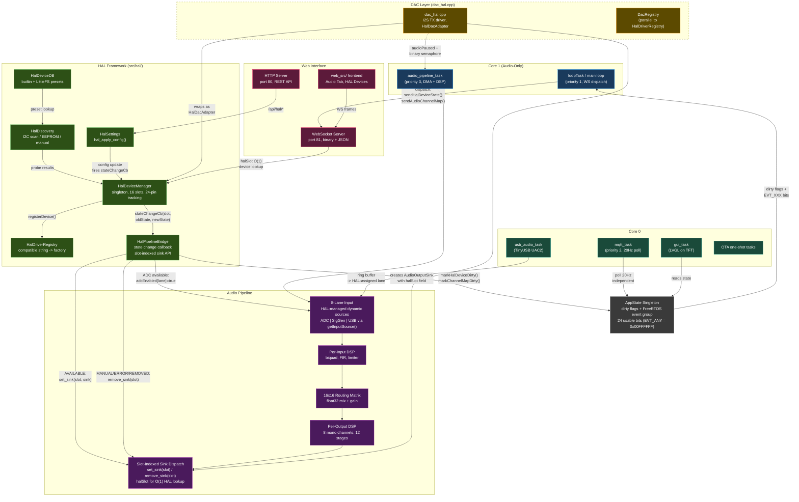
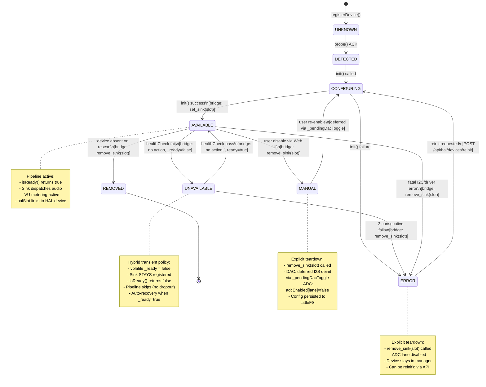
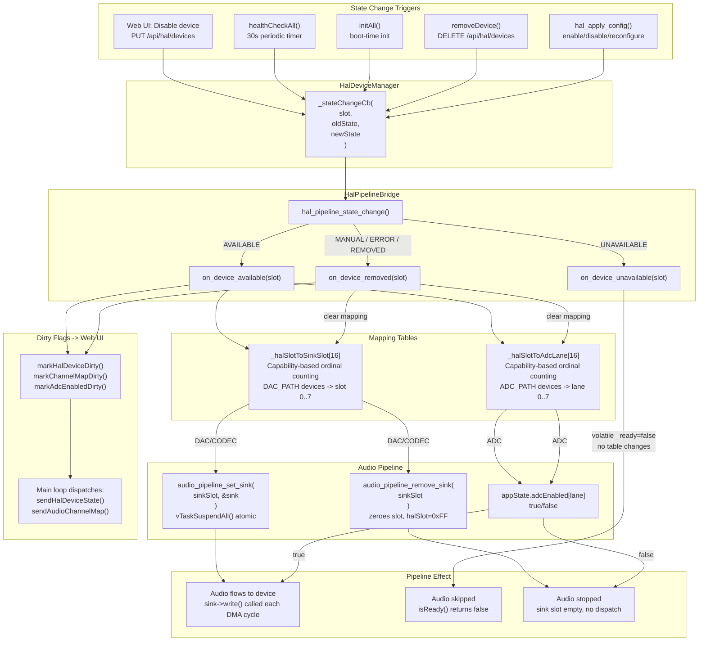
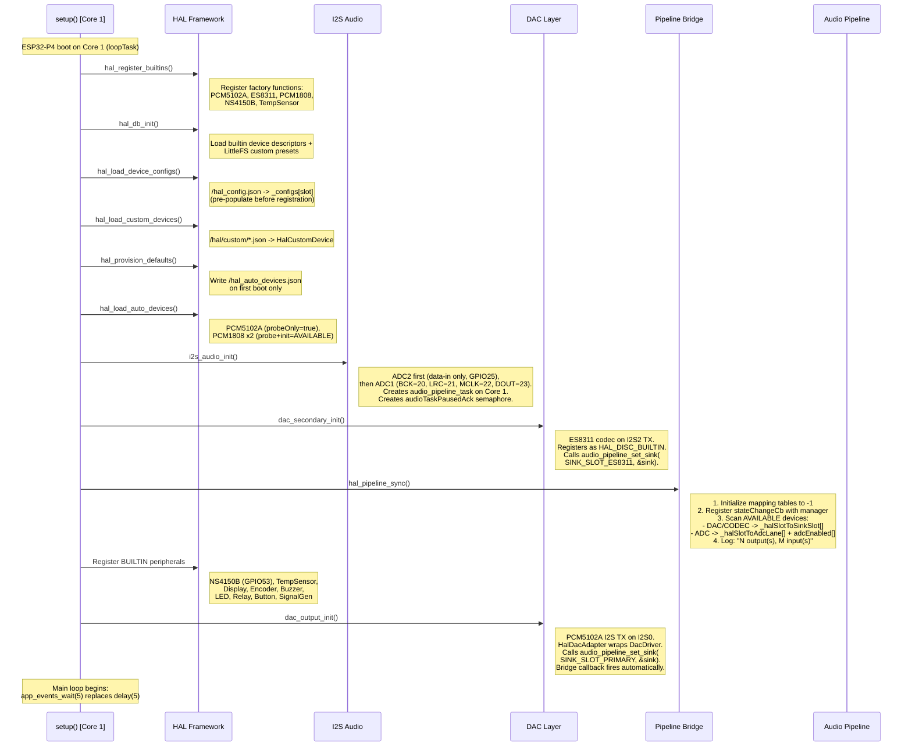
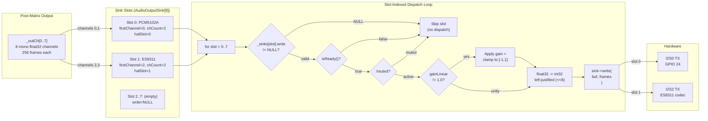
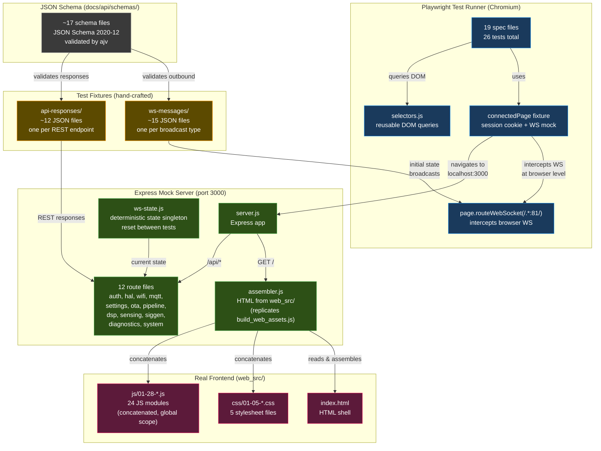
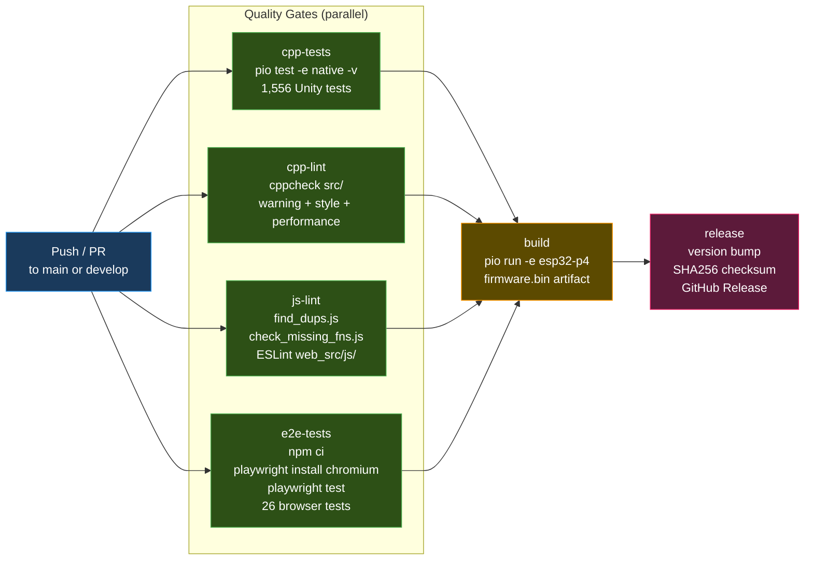
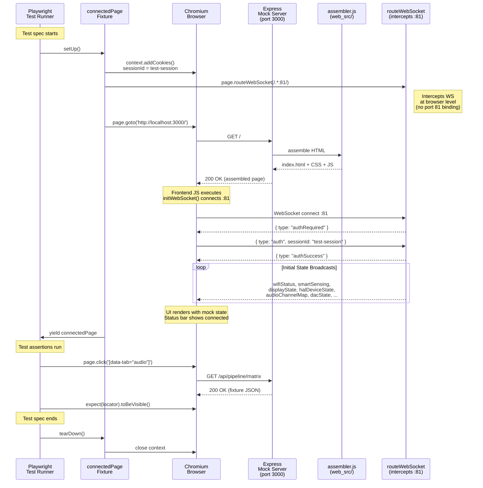

# Architecture Diagrams

Open this file in VSCode and press `Ctrl+Shift+V` to preview all diagrams.

---

## System Architecture



---

## HAL Device Lifecycle



---

## HAL-Pipeline Bridge



---

## Boot Sequence



---

## Event-Driven Architecture

```mermaid
sequenceDiagram
    participant Producer as Producer<br/>(any task/ISR)
    participant AS as AppState<br/>(dirty flags)
    participant EG as FreeRTOS<br/>Event Group<br/>(24 usable bits)
    participant Loop as Main Loop<br/>(Core 1)
    participant WS as WebSocket<br/>Server (port 81)
    participant MQTT as mqtt_task<br/>(Core 0, 20Hz)

    Note over EG: EVT_ANY = 0x00FFFFFF<br/>16 bits assigned, 8 spare<br/>Bits 24-31 reserved by FreeRTOS

    Producer->>AS: appState.markXxxDirty()
    AS->>AS: _xxxDirty = true (volatile)
    AS->>EG: app_events_signal(EVT_XXX)
    Note right of EG: xEventGroupSetBits()<br/>from any core

    Loop->>EG: app_events_wait(5ms)
    Note right of Loop: Wakes in <1us on any bit<br/>OR 5ms timeout if idle

    EG-->>Loop: returns set bits (pdTRUE clears)

    Loop->>AS: isHalDeviceDirty()?
    AS-->>Loop: true

    Loop->>WS: sendHalDeviceState()
    Loop->>WS: sendAudioChannelMap()
    Loop->>AS: clearHalDeviceDirty()

    Note over MQTT: Independent consumer:<br/>polls dirty flags at 20Hz<br/>does NOT use event group<br/>(avoids fan-out race)

    MQTT->>AS: check dirty flags
    AS-->>MQTT: publish if dirty
    MQTT->>AS: clear MQTT-specific flags
```

---

## Sink Dispatch



---

## E2E Test Infrastructure



---

## CI Quality Gates



---

## E2E Test Flow



---

## Test Coverage Map

```mermaid
graph TB
    classDef unit fill:#2d5016,stroke:#4CAF50,color:#fff
    classDef e2e fill:#1a3a5c,stroke:#2196F3,color:#fff
    classDef static fill:#5c4a00,stroke:#FF9800,color:#fff
    classDef untested fill:#5c1a1a,stroke:#F44336,color:#fff
    classDef schema fill:#3a3a3a,stroke:#9E9E9E,color:#fff

    subgraph UnitTests["C++ Unit Tests (1,556 tests)"]
        UT_HAL["HAL Framework\n14 test modules\nlifecycle, bridge, drivers"]
        UT_PIPE["Audio Pipeline\n8 test modules\nsink dispatch, DSP, metering"]
        UT_NET["Networking\n5 test modules\nWiFi, MQTT, OTA, ETH"]
        UT_CORE["Core Handlers\n13 test modules\nauth, button, buzzer, settings"]
        UT_GUI["GUI\n3 test modules\nhome, input, navigation"]
    end

    subgraph E2ETests["Playwright E2E Tests (26 tests)"]
        E2E_AUTH["Auth Flow\nlogin, session, password"]
        E2E_NAV["Navigation\n8 tabs, responsive"]
        E2E_AUDIO["Audio Tab\ninputs, matrix, outputs, siggen, PEQ"]
        E2E_HAL["HAL Devices\nlist, toggle, delete, rescan"]
        E2E_CONFIG["Configuration\nwifi, mqtt, settings, OTA"]
        E2E_DEBUG["Debug & Stats\nconsole, filtering, hardware"]
    end

    subgraph StaticAnalysis["Static Analysis"]
        SA_ESLINT["ESLint\nno-undef, no-redeclare\neqeqeq on 24 JS files"]
        SA_CPPCHECK["cppcheck\nwarning, style, performance\non src/ (excl gui/)"]
        SA_DUPS["find_dups.js\nduplicate declarations"]
        SA_FNS["check_missing_fns.js\nundefined function refs"]
    end

    subgraph Schemas["Contract Testing"]
        CT_WS["WS JSON Schemas\n~17 message types\nvalidated by ajv"]
        CT_BIN["Binary Format Docs\nwaveform (0x01)\nspectrum (0x02)"]
    end

    subgraph NotTested["Not Covered (Hardware-Only)"]
        HW_I2S["I2S DMA streaming"]
        HW_GPIO["GPIO ISR / interrupts"]
        HW_RTOS["FreeRTOS multi-core\ntask scheduling"]
        HW_PSRAM["PSRAM allocation\nunder heap pressure"]
    end

    UT_HAL -.->|"tests"| HAL_B["HAL Device Manager\nlifecycle + callbacks"]
    UT_PIPE -.->|"tests"| PIPE_B["Audio Pipeline\nsink dispatch + DSP"]
    E2E_AUTH -.->|"tests"| WEB_B["Web UI\nDOM + REST + WS"]
    E2E_HAL -.->|"tests"| API_B["REST API contracts\nrequest/response format"]
    CT_WS -.->|"validates"| WS_B["WS Message Format\nJSON field contracts"]
    SA_ESLINT -.->|"checks"| JS_B["JavaScript\nsyntax + scope"]

    class UT_HAL,UT_PIPE,UT_NET,UT_CORE,UT_GUI unit
    class E2E_AUTH,E2E_NAV,E2E_AUDIO,E2E_HAL,E2E_CONFIG,E2E_DEBUG e2e
    class SA_ESLINT,SA_CPPCHECK,SA_DUPS,SA_FNS static
    class CT_WS,CT_BIN schema
    class HW_I2S,HW_GPIO,HW_RTOS,HW_PSRAM untested
```


