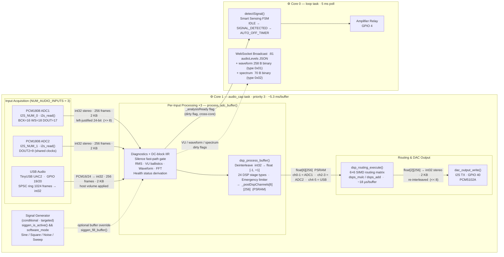

# ALX Nova Audio Pipeline

## Data Flow Summary

| Stage | Format | Size |
|-------|--------|------|
| I2S read (ADC1/2) | `int32` stereo interleaved, 24-bit left-justified | 256 frames · 2 KB |
| USB read | `int32` stereo, converted from PCM16/24 | 256 frames · 2 KB |
| DSP input | `float` deinterleaved, normalised `[-1, +1]` | per-channel `float[256]` |
| Post-DSP / routing | `float[6][256]` — 6 channels in PSRAM | 6 KB |
| DAC buffer | `int32` stereo re-interleaved | 256 frames · 2 KB |
| WebSocket waveform | `uint8[256]` + 2-byte header | 258 B binary |
| WebSocket spectrum | `uint8[16×2]` bands + 2-byte header + freq | 70 B binary |

## Key Constants (`src/config.h`)

| Constant | Value | Scope |
|----------|-------|-------|
| `NUM_AUDIO_ADCS` | 2 | I2S hardware driver, DMA, clock config **only** |
| `NUM_AUDIO_INPUTS` | 3 | Metering arrays, WS/MQTT/REST, AppState, routing |
| `DSP_MAX_CHANNELS` | 6 | L1 R1 L2 R2 USB_L USB_R |
| `I2S_DMA_BUF_LEN` | 256 | frames per DMA buffer |
| `I2S_DMA_BUF_COUNT` | 8 | DMA buffers (~42 ms total runway) |
